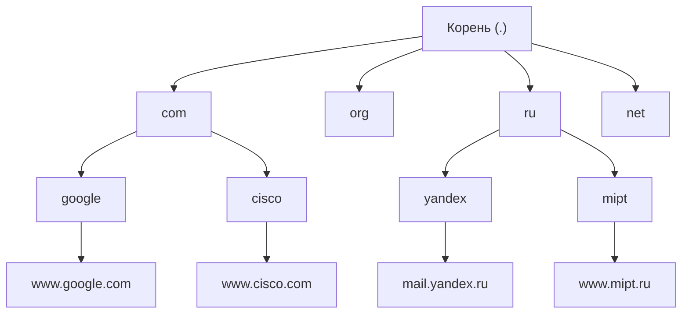
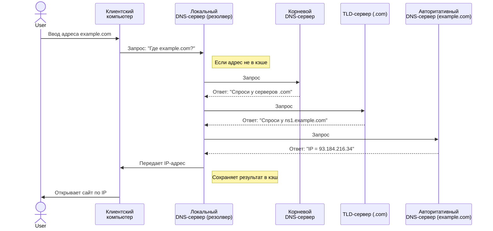
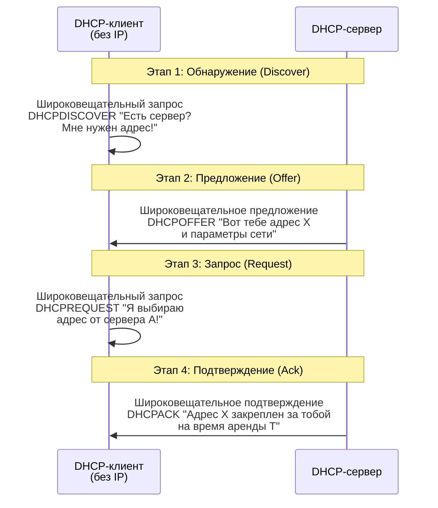

### **Лекция 9 по теме: «Назначение и принципы работы службы DNS и протокола DHCP»**

**Цель:** Изучить ключевые сетевые службы, обеспечивающие удобную адресацию и автоматическую настройку узлов в IP-сетях.

**План лекции:**
1.  Проблема: Числа vs Имена. Введение в DNS.
2.  Архитектура доменной системы имен (DNS): иерархия, принципы разрешения имен.
3.  Проблема: Ручное назначение IP-адресов. Введение в DHCP.
4.  Принципы работы протокола DHCP: процесс получения адреса (DORA).
5.  Режимы работы DHCP-сервера.

---

### **Часть 1: Служба доменных имен (DNS)**

**Проблема:** Человеку легко запомнить `yandex.ru`, но сложно — `77.88.55.242`. Компьютеру же для связи нужен именно числовой IP-адрес. DNS — это «телефонная книга» Интернета, которая преобразует удобные для человека доменные имена в понятные машинам IP-адреса.

#### **1.1. Пространство доменных имен**

DNS имеет **иерархическую древовидную структуру**. Представьте её как перевёрнутое дерево.

*   **Корень (.)** — вершина иерархии (часто опускается).
*   **Домены верхнего уровня (TLD):** `ru`, `com`, `org`, `net`, `gov`, `edu`.
*   **Домены второго уровня:** `yandex.ru`, `google.com`, `mipt.ru`.
*   **Поддомены (третьего и более уровней):** `mail.yandex.ru`, `www.mipt.ru`.

**Пример полного доменного имени (FQDN):** `server1.department.company.com.`
(Чтение справа налево: корень → com → company → department → server1)

#### **1.2. Как работает DNS? Принцип разрешения имен**

Когда вы вводите `example.com` в браузере, происходит не мгновенное обращение к какому-то одному гигантскому серверу, а **последовательный распределенный запрос**.

*   **Локальный DNS-сервер (резолвер):** Обычно предоставляется вашим провайдером или настроен вручную (например, `8.8.8.8` Google).
*   **Корневые, TLD-серверы:** Знают, куда направить запрос дальше, но не знают конечного IP.
*   **Авторитативный сервер:** Управляет зоной домена (`example.com`) и хранит окончательные записи (A, AAAA, MX и др.).
*   **Кэширование:** Ключевой принцип для ускорения. Локальный DNS-сервер сохраняет ответы на время жизни записи (TTL).

---

### **Часть 2: Протокол динамической настройки узлов (DHCP)**

**Проблема:** В сети с десятками и сотнями устройств (компьютеры, ноутбуки, смартфоны, принтеры) **ручное назначение** IP-адреса, маски, шлюза и DNS для каждого узла — это:
*   Трудоёмко и подвержено ошибкам («конфликт IP-адресов»).
*   Негибко (сложно вносить изменения).
*   Неэффективно (адреса простаивают, если устройство отключено).

**Решение:** **DHCP (Dynamic Host Configuration Protocol)** автоматизирует процесс настройки сетевого стека.

#### **2.1. Принцип работы: процесс «DORA»**

Процесс получения IP-адреса клиентом от сервера состоит из 4 основных этапов (DORA). Предположим, в сети есть **DHCP-сервер** (отдельный сервер или функция в маршрутизаторе) и **DHCP-клиент** (ваш компьютер/смартфон).

*   **Широковещательная рассылка (`255.255.255.255`):** Клиент изначально не знает адреса сервера, поэтому кричит «на всю сеть».
*   **DHCPOFFER:** Сервер резервирует адрес из своего пула и предлагает его.
*   **DHCPREQUEST:** Клиент подтверждает выбор (если серверов несколько, выбирает одно предложение).
*   **DHCPACK:** Сервер окончательно выдает адрес и **параметры**: маску подсети, шлюз по умолчанию, адреса DNS-серверов, срок аренды (lease time).
*   **DHCPRELEASE:** Клиент может досрочно освободить адрес при корректном отключении.

#### **2.2. Режимы работы DHCP-сервера**

| Режим | Принцип работы | Когда используется? |
| :--- | :--- | :--- |
| **Ручное (статическое)** | Администратор вручную сопоставляет MAC-адрес клиента с конкретным IP-адресом. Сервер лишь выполняет это предписание. | Для сетевых принтеров, серверов, МФУ, которым нужен постоянный предсказуемый адрес. |
| **Автоматическое (статическое)** | Серверу задан пул адресов. Он сам назначает свободный адрес клиенту при первом обращении и **навсегда закрепляет его за MAC-адресом**. | Устаревший метод. Практически не используется, так как не дает гибкости динамического режима. |
| **Динамическое** | Сервер выдает адрес из пула **на ограниченное время (аренда)**. По истечении срока адрес возвращается в пул. Клиент может обновить аренду. | **Самый распространенный режим.** Для пользовательских устройств (ПК, ноутбуки, смартфоны), гостевых сетей Wi-Fi. |

**Важность срока аренды:** Позволяет эффективно использовать ограниченный пул адресов. Например, в офисе на 100 сотрудников достаточно 50 адресов, если не все находятся одновременно. Адрес ноутбука уехавшего в командировку сотрудника будет передан новому устройству.

---

### **Заключение и взаимосвязь**

**DNS и DHCP — фундаментальные и взаимодополняющие службы современной сети.**

1.  **DHCP** настраивает компьютер для работы в сети: дает ему **IP-адрес** и, что критически важно, адреса **DNS-серверов**.
2.  Получив адреса DNS-серверов, компьютер может с помощью **DNS** преобразовывать красивые имена (`vk.com`) в IP-адреса для установления соединений.

**Без DHCP** — администрирование сети превращается в рутину. **Без DNS** — Интернет становится набором чисел, непригодным для массового использования.

---
### **Контрольные вопросы (для самопроверки)**
1.  Для чего нужна служба DNS и какова её основная функция?
2.  Опишите иерархическую структуру системы доменных имён. Что такое FQDN?
3.  Каковы основные этапы процесса получения IP-адреса по протоколу DHCP (DORA)?
4.  В чём ключевое отличие ручного (статического) назначения адресов через DHCP от динамического?
5.  Что такое «срок аренды» (lease time) в DHCP и какую проблему он решает?
6.  Пользователь подключает смартфон к Wi-Fi в кафе. Какой режим DHCP, скорее всего, используется? Почему?
7.  Почему первые сообщения в процессе DHCP (`DISCOVER`, `OFFER`) являются широковещательными?
8.  Какие устройства в типовой домашней или офисной сети чаще всего выполняют роль DHCP- и DNS-серверов?
9.  Как связаны между собой DHCP и DNS? Может ли компьютер использовать DNS, если он не получил настройки от DHCP?
10. Объясните, зачем DNS-серверы используют кэширование.
