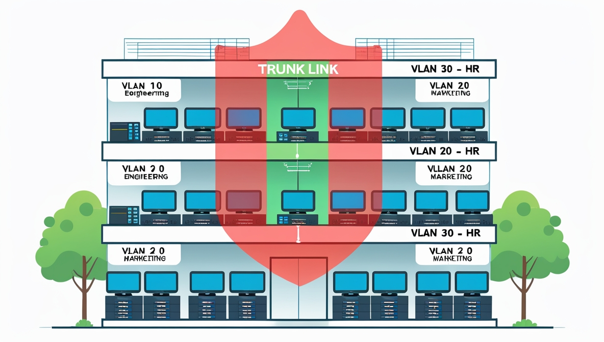

# Лекция 6. 🌐 Виртуальные локальные сети (VLAN)

## 📖 Определение

**VLAN (Virtual Local Area Network)** — это виртуальные локальные сети, созданные на единой аппаратной базе (коммутаторах, соединенных физическими каналами), но **логически изолированные** друг от друга.

## 🔄 Основные понятия

### Что такое VLAN?
- Имеет те же свойства, что и физическая LAN
- Позволяет группировать устройства логически, а не физически
- Создается на основе программного обеспечения вместо физического перемещения устройств

## 🎯 Преимущества VLAN

### ✅ Ключевые выгоды:
- 🏗️ **Структурирование сети** — помогает организовать логическую структуру
- 🔒 **Безопасность** — разграничивает доступ пользователей
- 🔗 **Объединение** — группирует устройства по функциям, а не расположению
- 📉 **Снижение трафика** — уменьшает широковещательный трафик

## 🚦 Широковещательный трафик

### Проблема:
Широковещательный трафик (ARP, DHCP и др.) в больших сетях приводит к нерациональному использованию канала.

### Решение VLAN:
Пользователи в разных VLAN не получают широковещательные кадры, предназначенные для других VLAN.

# 🏢 Практический пример использования VLAN

Рисунок - 1 Пример построения VLAN для компании

## 🔄 Логическая группировка сотрудников

**Используя технологию VLAN**, работники 🛠️ **Инженерного отдела** и 📊 **отдела Маркетинга** могут быть расположены на всех трех этажах здания, а их ПК будут входить в состав двух VLAN:

- 🟦 **VLAN1** - Инженерный отдел
- 🟩 **VLAN2** - Отдел маркетинга

## 🔒 Изоляция конфиденциальных данных

**Сотрудники отдела кадров**, которые также размещаются на всех трех этажах, будут использовать ПК, входящие в состав:

- 🟥 **VLAN3** - Отдел кадров

> **📡 Сетевой трафик**, создаваемый отделом кадров, будет доступен **только сотрудникам этого департамента**, а группы инженерного отдела и маркетинга **не смогут получить доступ к конфиденциальным данным** отдела кадров.

## 🛡️ Безопасность и VLAN

**💡 Очевидно, есть другие требования для обеспечения полной безопасности, и VLAN может быть частью общей стратегии сетевой безопасности.**

## 🔗 Принципы взаимодействия в VLAN

### ✅ В пределах одного VLAN:
**Группа устройств имеет возможность взаимодействовать между собой напрямую на канальном уровне**, хотя физически при этом они могут быть подключены к **разным сетевым коммутаторам**.

### ❌ Между разными VLAN:
**Устройства, находящиеся в разных VLAN, невидимы друг для друга на канальном уровне**, даже если они подключены к **одному коммутатору**, и связь между этими устройствами возможна **только на сетевом и более высоких уровнях**.

## ⚙️ Базовая конфигурация VLAN

**По умолчанию на каждом порту коммутатора имеется сеть** 🏷️ **VLAN1 или VLAN управления**. 

**Сеть управления не может быть удалена**, однако могут быть созданы **дополнительные сети VLAN** и этим альтернативным VLAN могут быть **дополнительно назначены порты**.

### Результат:
- 📊 Сотрудники отдела кадров изолированы в VLAN3
- 🔧 Инженеры и маркетинг не имеют доступа к конфиденциальным данным
- 🌐 Трафик ограничен в пределах своих VLAN

# ⚙️ Конфигурация VLAN: порты и методы определения

## 🏷️ Базовая настройка VLAN

**По умолчанию каждый порт коммутатора принадлежит** 🟦 **VLAN1 (VLAN управления)**. 
- 🚫 **Сеть управления нельзя удалить**
- ➕ **Можно создавать дополнительные VLAN**
- 🔄 **Порты можно переназначать** между различными VLAN

## 🔌 Типы портов коммутатора

### 1. 🖥️ Access Port (Порт доступа)
**Назначение:** подключение конечных устройств
- 💻 Компьютеры и ноутбуки
- 📞 IP-телефоны
- 📹 Видеокамеры
- 🖥️ Серверы

**Принцип работы:** 
> Любой кадр, проходящий через access-порт, автоматически помечается номером VLAN, к которому принадлежит этот порт

### 2. 🔗 Trunk Port (Магистральный порт)
**Назначение:** соединение между коммутаторами

**Особенности:**
- 📦 Передает трафик **нескольких VLAN одновременно**
- ✅ По умолчанию разрешены все VLAN
- 🔄 Требует, чтобы VLAN был **активным**

**🎯 Условия активности VLAN:**
- ✅ VLAN создан на коммутаторе
- ✅ В VLAN есть хотя бы один порт в состоянии **up/up** (подключен и работает)

## 🎯 Методы определения принадлежности к VLAN

### 1. 📍 По номеру порта ⭐⭐⭐⭐⭐
**Самый популярный метод!**
- 🎯 Конкретный порт = конкретный VLAN
- 🏗️ Простая настройка и понимание
- 💡 Идеально подходит для сетей с DHCP

### 2. 📟 По MAC-адресу ⭐
**Преимущество:**
- 🏃 Пользователь сохраняет VLAN при перемещении между портами

**Недостатки:**
- ⚠️ Требует ручного внесения MAC-адресов в коммутатор
- 🔍 Сложности при поиске неисправностей
- 🚨 Проблемы при смене MAC-адреса пользователем

### 3. 👤 По User ID ⭐
**Очень редко используется**
- 🔐 Привязка к учетной записи пользователя

### 4. 🌐 По IP-адресу ⭐⭐
**Преимущество:**
- 🏃 Автоматическое следование VLAN за пользователем

**Ограничение:**
- ⚠️ Сложности при использовании DHCP
- 🔄 VLAN привязывается к IP-адресу рабочей станции

## 💡 Рекомендации для студентов

### 🎓 Для начала изучения:
1. **Начинайте с портов доступа** 🖥️ - самый простой для понимания
2. **Освойте VLAN по номеру порта** 📍 - наиболее распространенный метод
3. **Поймите разницу между Access и Trunk** 🔌 - фундаментальное знание

### 🚀 Для практики:
- Создайте несколько VLAN на учебном коммутаторе
- Настройте access-порты для разных отделов
- Организуйте связь между коммутаторами через trunk-порты

> **💡 Запомните:** Правильная настройка VLAN - основа безопасной и эффективной сети!

## 🛡️ Безопасность

VLAN обеспечивает:
- 🔒 Логическую изоляцию групп пользователей
- 🚫 Запрет доступа между разными VLAN на канальном уровне
- 🌉 Связь между VLAN только через сетевой уровень (маршрутизацию)

## 💡 Важные замечания

- VLAN по умолчанию: **VLAN1** (управления) — нельзя удалить
- VLAN становится активным при наличии хотя бы одного порта up/up
- Технология VLAN — часть общей стратегии безопасности сети

---

*VLAN позволяет создавать гибкие, безопасные и эффективные сетевые инфраструктуры, соответствующие современным требованиям бизнеса.* 🚀
