# **Лекция 9: Использование коммутаторов 2-го и 3-го уровней для построения компьютерных сетей**

**📅 Дата:** [Текущая дата]  
**👨🏫 Преподаватель:** [Ваше имя]  

## 📋 Содержание
- [🔰 Глава 1: Введение - Основные концепции](#-глава-1-введение---основные-концепции)
- [🏗️ Глава 2: Иерархическая модель проектирования сетей](#-глава-2-иерархическая-модель-проектирования-сетей)
- [🤖 Глава 3: Коммутаторы уровня 2 (L2 Switch)](#-глава-3-коммутаторы-уровня-2-l2-switch)
- [⚡ Глава 4: Коммутаторы уровня 3 (L3 Switch)](#-глава-4-коммутаторы-уровня-3-l3-switch)
- [🌐 Глава 5: Маршрутизаторы и технология NAT](#-глава-5-маршрутизаторы-и-технология-nat)
- [⚖️ Глава 6: Сравнительный анализ устройств](#-глава-6-сравнительный-анализ-устройств)
- [🏢 Глава 7: Практический пример корпоративной сети](#-глава-7-практический-пример-корпоративной-сети)
- [📈 Глава 8: Производительность и выбор оборудования](#-глава-8-производительность-и-выбор-оборудования)
- [📘 Глава 9: Краткий конспект и шпаргалка](#-глава-9-краткий-конспект-и-шпаргалка)

---

## 🔰 Глава 1: Введение - Основные концепции

### 🎯 Ключевая идея

> **"Сетевые устройства - это как органы в теле сети: каждый выполняет свою уникальную функцию, но все вместе создают жизнеспособную систему"** 🧠

### 📖 Основные определения

**💡 Коммутатор (Switch)** - сетевое устройство, которое соединяет устройства в пределах **одной локальной сети**, используя **MAC-адреса** для определения пути передачи данных. Работает на **канальном уровне (2 уровень)** модели OSI.

**💡 Маршрутизатор (Router)** - сетевое устройство, которое соединяет **разные сети** между собой, используя **IP-адреса** для определения оптимального пути передачи данных. Работает на **сетевом уровне (3 уровень)** модели OSI.

**💡 NAT (Network Address Translation)** - технология преобразования частных IP-адресов внутренней сети в публичные IP-адреса для выхода в Интернет.

---

### 🎯 Схема 1: Основные различия сетевых устройств

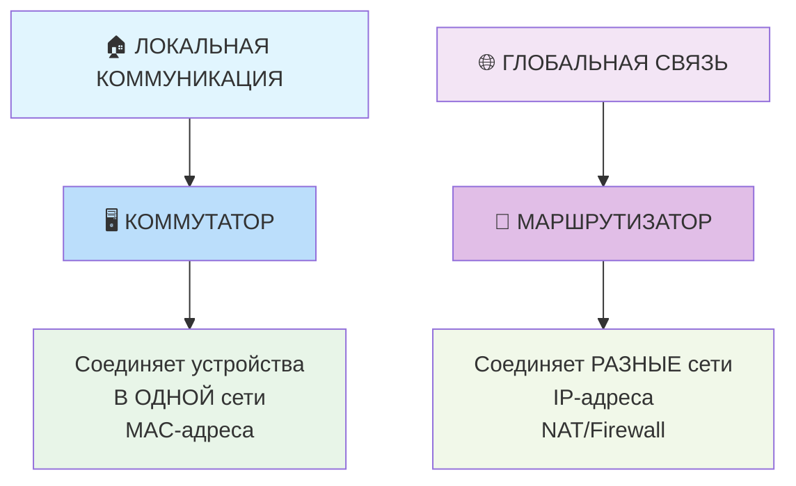

**📝 Описание схемы 1:**

Эта схема иллюстрирует **фундаментальное различие между коммутатором и маршрутизатором** в компьютерных сетях.

**Слева** показана **локальная коммуникация**, которая реализуется через **коммутатор**. Коммутатор работает на канальном уровне (L2) и соединяет устройства **внутри одной сети**, используя для этого **MAC-адреса** устройств.

**Справа** отображена **глобальная связь**, которая обеспечивается **маршрутизатором**. Маршрутизатор функционирует на сетевом уровне (L3) и предназначен для соединения **разных сетей** между собой, используя для маршрутизации **IP-адреса**.

**Ключевое отличие**: коммутатор работает с **MAC-адресами** (физические адреса устройств), а маршрутизатор - с **IP-адресами** (логические адреса сетей). Также маршрутизатор дополнительно выполняет функции **NAT и межсетевого экрана**, которые отсутствуют у коммутатора.

**Простыми словами**: коммутатор объединяет компьютеры в офисе, а маршрутизатор соединяет этот офис с Интернетом.

---

## 🏗️ Глава 2: Иерархическая модель проектирования сетей

### 🎪 Трехуровневая архитектура

Современные сети строятся по **иерархической модели**, которая включает три логических уровня. Эта модель обеспечивает масштабируемость, надежность и простоту управления.

---

#### 🎯 Схема 2: Иерархическая модель компьютерной сети

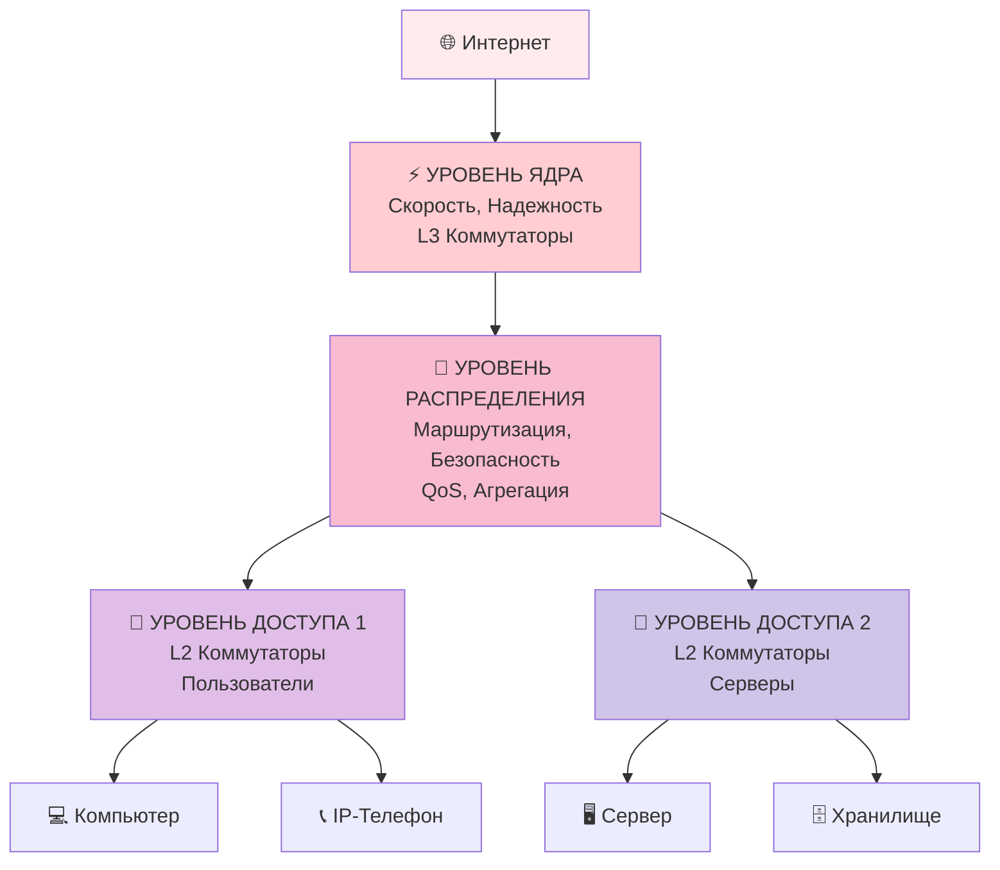

**📝 Описание схемы 2:**

Эта диаграмма иллюстрирует **трехуровневую иерархическую модель** построения современных компьютерных сетей, которая обеспечивает масштабируемость, надежность и управляемость:

**⚡ Уровень Ядра (Core Layer)** - верхний уровень иерархии, выполняющий высокоскоростную передачу данных между сегментами сети. Используются производительные L3 коммутаторы.

**🔄 Уровень Распределения (Distribution Layer)** - промежуточный уровень, выполняющий интеллектуальные функции: маршрутизацию между VLAN, обеспечение безопасности, агрегацию трафика и контроль качества обслуживания (QoS).

**🚪 Уровень Доступа (Access Layer)** - нижний уровень, обеспечивающий подключение конечных устройств: пользовательских компьютеров, IP-телефонов, серверов и систем хранения данных. Используются L2 коммутаторы.

**🎯 Ключевой вывод:** Иерархическая модель разделяет сеть на логические уровни, где каждый уровень выполняет строго определенные функции, что упрощает проектирование, масштабирование и обслуживание сети.

---

### 🔍 Детализация каждого уровня

#### ⚡ Уровень Ядра (Core Layer)
**Функции:**
- ✅ Высокоскоростная передача данных между сегментами сети
- ✅ Обеспечение максимальной надежности и отказоустойчивости
- ✅ Агрегирование трафика от уровня распределения

**Характеристики:**
- 🚀 Скорость: 10/40/100 Гбит/с
- 🛡️ Избыточность: дублирование всех компонентов
- 🎯 Устройства: высокопроизводительные L3 коммутаторы

#### 🔄 Уровень Распределения (Distribution Layer)
**Функции:**
- ✅ Маршрутизация между VLAN
- ✅ Применение политик безопасности (ACL)
- ✅ Обеспечение качества обслуживания (QoS)
- ✅ Агрегация трафика от уровня доступа

**Характеристики:**
- 🧠 "Мозг сети" - принимает интеллектуальные решения
- 🔒 Обеспечивает безопасность и контроль доступа
- ⚖️ Балансирует нагрузку между сегментами

#### 🚪 Уровень Доступа (Access Layer)
**Функции:**
- ✅ Подключение конечных устройств
- ✅ Создание VLAN для сегментации
- ✅ Реализация портовой безопасности
- ✅ Поддержка PoE для IP-устройств

**Подключаемые устройства:**
- 👨💻 Компьютеры и ноутбуки
- 📞 IP-телефоны и видеоконференции
- 📹 Камеры видеонаблюдения
- 🖨️ Сетевые принтеры и сканеры

---

## 🤖 Глава 3: Коммутаторы уровня 2 (L2 Switch)

### 🎭 Принцип работы

Коммутаторы L2 работают на **канальном уровне** модели OSI и используют **MAC-адреса** для коммутации трафика. Каждый сетевой интерфейс имеет уникальный MAC-адрес формата `00:1A:2B:3C:4D:5E`.

---

### 🎯 Схема 3: Алгоритм работы коммутатора L2

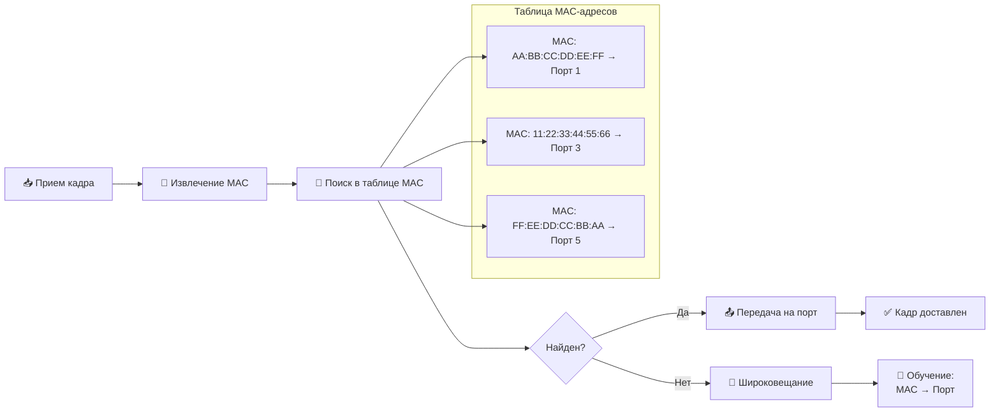

**📝 Описание схемы 3:**

Эта диаграмма показывает **последовательность операций**, которые выполняет коммутатор уровня 2 (L2) при обработке входящего сетевого кадра:

**📥 Шаг 1: Прием кадра** - коммутатор получает кадр данных через один из своих портов.

**🎯 Шаг 2: Извлечение MAC-адреса** - из заголовка кадра извлекается MAC-адрес устройства-отправителя и MAC-адрес получателя.

**🧠 Шаг 3: Поиск в таблице MAC-адресов** - коммутатор ищет MAC-адрес получателя в своей таблице коммутации, которая содержит соответствия "MAC-адрес → номер порта".

**❓ Шаг 4: Принятие решения** - коммутатор проверяет, найден ли MAC-адрес в таблице:
- **Если ДА** → переходит к **точечной передаче** на конкретный порт
- **Если НЕТ** → выполняет **широковещательную рассылку** на все порты

**📤 Шаг 5A: Точечная передача** - кадр отправляется только на тот порт, к которому подключено устройство-получатель.

**📢 Шаг 5B: Широковещание** - кадр отправляется на все порты (кроме порта-источника), когда адрес получателя неизвестен.

**📝 Шаг 6: Обучение** - при широковещании коммутатор запоминает соответствие "MAC-адрес отправителя → порт источника" для будущих коммутаций.

**✅ Шаг 7: Доставка** - успешное завершение процесса передачи кадра.

**💡 Ключевая особенность:** В правой части схемы показана **таблица MAC-адресов** коммутатора с реальными примерами соответствий, например: устройство с MAC `AA:BB:CC:DD:EE:FF` подключено к порту 1.

**🎯 Ключевой вывод:** Коммутатор L2 работает по принципу "обучение на лету" - он постоянно пополняет таблицу MAC-адресов и использует ее для интеллектуальной коммутации, отправляя кадры только нужным получателям, что значительно снижает сетевой трафик по сравнению с концентраторами (hub).

---

### 📊 Процесс коммутации L2:

1. **Learning (Обучение)** - изучение MAC-адресов источников
2. **Forwarding/Filtering (Пересылка/Фильтрация)** - принятие решения о пересылке
3. **Aging (Старение)** - удаление устаревших записей

### 🔧 Ключевые технологии L2 коммутаторов

#### 🏢 VLAN (Virtual LAN)

VLAN позволяет создавать логически изолированные сети в рамках одной физической инфраструктуры. Это как создать виртуальные офисы в одном здании.

---

#### 🎯 Схема 4: Технология VLAN - Виртуальные локальные сети

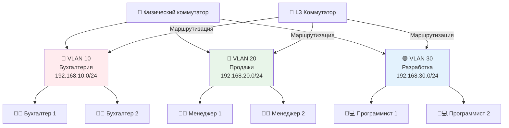

**📝 Описание схемы 4:**

Эта диаграмма иллюстрирует концепцию **VLAN (Virtual Local Area Network)** - технологии создания логически изолированных сетей в рамках одной физической сетевой инфраструктуры:

**🏢 Центральный элемент** - один физический коммутатор, который поддерживает технологию VLAN и может создавать несколько виртуальных сетей.

**🔴 VLAN 10 (Бухгалтерия)** - первая виртуальная сеть с собственной IP-подсетью (192.168.10.0/24), объединяющая сотрудников бухгалтерии. Устройства в этой VLAN могут общаться между собой, но изолированы от других VLAN.

**🔵 VLAN 20 (Продажи)** - вторая виртуальная сеть для отдела продаж с подсетью 192.168.20.0/24. Сотрудники отдела продаж образуют свою логическую группу.

**🟢 VLAN 30 (Разработка)** - третья виртуальная сеть для разработчиков с подсетью 192.168.30.0/24, обеспечивающая изоляцию IT-отдела.

**🚦 Ключевой элемент** - L3 коммутатор или маршрутизатор, который обеспечивает **маршрутизацию между VLAN**. Без этого устройства разные VLAN не смогут обмениваться данными между собой.

**🎯 Основные принципы:**
1. **Логическая изоляция** - каждая VLAN представляет собой отдельный широковещательный домен
2. **Безопасность** - трафик между VLAN контролируется через политики доступа
3. **Гибкость** - устройства можно группировать по функциям, а не по физическому расположению
4. **Эффективность** - уменьшение широковещательного трафика в сети

**💡 Техническая реализация:**
- Используется тегирование кадров по стандарту **IEEE 802.1Q**
- Порт коммутатора может быть в режиме **Access** (один VLAN) или **Trunk** (несколько VLAN)
- Для связи между VLAN требуется устройство уровня 3 (L3 коммутатор или маршрутизатор)

**🎯 Ключевой вывод:** VLAN позволяют создавать логически изолированные сети на одном физическом оборудовании, что повышает безопасность, упрощает управление и повышает производительность сети за счет уменьшения широковещательного трафика. Разные отделы компании могут работать в отдельных VLAN, а при необходимости обмениваться данными через контролируемую маршрутизацию.

---

**Преимущества VLAN:**
- ✅ **Безопасность**: Изоляция трафика между отделами
- ✅ **Гибкость**: Логическая группировка независимо от физического расположения
- ✅ **Производительность**: Уменьшение широковещательных доменов
- ✅ **Управление**: Упрощение администрирования сети

#### 🔄 STP (Spanning Tree Protocol)

STP предотвращает возникновение сетевых петель в топологии с избыточными соединениями. Алгоритм блокирует избыточные пути, оставляя только один активный.

**Состояния портов STP:**
1. **Blocking** - блокировка передачи данных
2. **Listening** - слушание BPDU
3. **Learning** - изучение MAC-адресов
4. **Forwarding** - передача данных

#### ⚡ EtherChannel

Технология агрегации каналов, которая объединяет несколько физических соединений в одно логическое с увеличенной пропускной способностью.

**Протоколы управления:**
- **LACP** (802.3ad) - стандартизированный протокол
- **PAgP** - проприетарный протокол Cisco

---

## ⚡ Глава 4: Коммутаторы уровня 3 (L3 Switch)

### 🎭 Гибридная архитектура

L3 коммутаторы сочетают в себе:
- ✅ **Высокоскоростную коммутацию L2** на аппаратном уровне
- ✅ **Функции маршрутизации L3** с производительностью коммутатора

**Принцип работы:**
- Первые пакеты потока обрабатываются процессором (медленный путь)
- Последующие пакеты коммутируются на ASIC (быстрый путь)
- Технология: **CEF (Cisco Express Forwarding)**

### 🗺️ Функции маршрутизации L3

#### Inter-VLAN Routing

L3 коммутаторы обеспечивают маршрутизацию между виртуальными сетями:

**Традиционный подход:** "router on a stick"
- Один физический интерфейс с множественными подсетями

**Современный подход:** **SVI (Switched Virtual Interface)**
- Виртуальные интерфейсы для каждого VLAN
- Пример конфигурации:
```cisco
interface Vlan10
 description Accounting
 ip address 192.168.10.1 255.255.255.0
```

#### 🛡️ Безопасность на L3 коммутаторах

1. **ACL (Access Control Lists)**
   - Standard ACL - фильтрация по source IP
   - Extended ACL - фильтрация по source/destination IP, портам, протоколам

2. **DHCP Snooping**
   - Защита от неавторизованных DHCP-серверов

3. **IP Source Guard**
   - Предотвращение IP-спуфинга

### 📊 Преимущества L3 коммутаторов:

| **Преимущество** | **Описание** | **Влияние** |
|-----------------|--------------|-------------|
| **🚀 Скорость** | Аппаратная коммутация | 10-100 раз быстрее маршрутизаторов |
| **💰 Стоимость** | Дешевле маршрутизаторов | Экономия бюджета на 30-50% |
| **⚡ Задержка** | Микросекундные величины | Идеально для VoIP и видеоконференций |
| **🔧 Интеграция** | Коммутация + маршрутизация | Упрощение инфраструктуры |

---

## 🌐 Глава 5: Маршрутизаторы и технология NAT

### 🎯 Схема 5: Алгоритм работы маршрутизатора

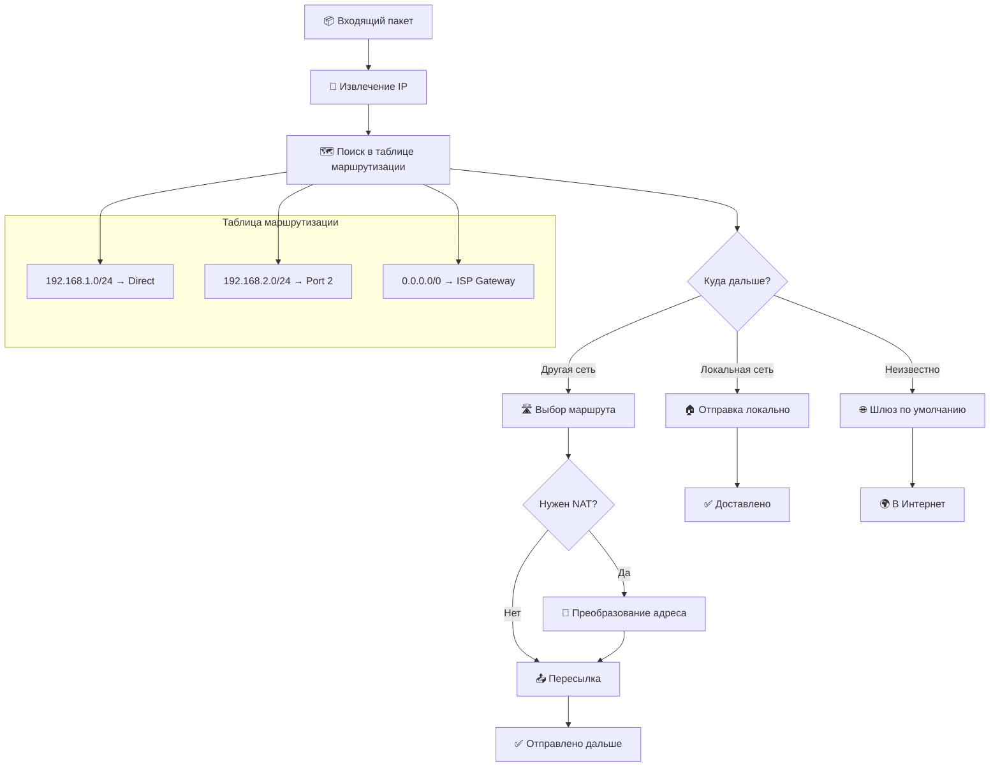

**📝 Описание схемы 5:**

Эта диаграмма показывает **последовательность принятия решений маршрутизатором** при обработке входящего сетевого пакета:

**📦 Шаг 1: Прием пакета** - маршрутизатор получает IP-пакет через один из своих интерфейсов.

**🎯 Шаг 2: Извлечение IP-адреса** - из заголовка IP-пакета извлекается адрес назначения (куда должен быть доставлен пакет).

**🗺️ Шаг 3: Поиск в таблице маршрутизации** - маршрутизатор ищет оптимальный путь для доставки пакета в своей таблице маршрутизации, которая содержит правила вида "сеть/подсеть → следующий прыжок".

**❓ Шаг 4: Принятие решения о маршруте** - маршрутизатор анализирует, куда должен быть отправлен пакет:
- **Локальная сеть** → пакет предназначен для устройства в той же сети, что и интерфейс маршрутизатора
- **Другая сеть** → пакет нужно отправить в другую сеть через соответствующий интерфейс
- **Неизвестно** → используется шлюз по умолчанию (маршрут 0.0.0.0/0)

**🏠 Шаг 5A: Локальная доставка** - если пакет предназначен для локальной сети, маршрутизатор отправляет его напрямую получателю (обычно через ARP для определения MAC-адреса).

**🛣️ Шаг 5B: Выбор маршрута** - если пакет нужно отправить в другую сеть, маршрутизатор определяет, нужна ли трансляция адресов.

**🔄 Шаг 6: Проверка необходимости NAT** - маршрутизатор проверяет, требуется ли преобразование сетевых адресов:
- **Если ДА** → выполняется NAT (преобразование частного IP в публичный)
- **Если НЕТ** → пакет пересылается без изменений

**🌐 Шаг 5C: Шлюз по умолчанию** - если маршрут не найден в таблице, пакет отправляется на шлюз по умолчанию (обычно в Интернет).

**📤 Шаг 7: Пересылка пакета** - пакет отправляется через выбранный интерфейс на следующий маршрутизатор или конечному получателю.

**💡 Ключевой элемент:** В правой части схемы показана **таблица маршрутизации** с примерами записей:
- `192.168.1.0/24 → Direct` - локальная сеть, подключенная напрямую
- `192.168.2.0/24 → Port 2` - другая сеть, доступная через порт 2
- `0.0.0.0/0 → ISP Gateway` - маршрут по умолчанию (все неизвестные адреса отправляются к провайдеру)

**🎯 Ключевой вывод:** Маршрутизатор работает как "интеллектуальный почтовый сортировочный центр" - он анализирует адрес назначения каждого пакета, консультируется с таблицей маршрутизации (картой дорог) и выбирает оптимальный путь для доставки, при необходимости выполняя преобразование адресов (NAT). Этот процесс обеспечивает связь между разными сетями и доступ в Интернет.

---

### 📡 Протоколы маршрутизации

#### Статическая маршрутизация:
- Ручное добавление маршрутов
- Подходит для небольших сетей
- Пример: `ip route 192.168.2.0 255.255.255.0 192.168.1.1`

#### Динамическая маршрутизация:
1. **OSPF** (Open Shortest Path First)
   - Протокол состояния каналов
   - Быстрая конвергенция
   - Поддержка VLSM

2. **EIGRP** (Enhanced Interior Gateway Routing Protocol)
   - Гибридный протокол Cisco
   - Быстрая конвергенция
   - Эффективное использование полосы пропускания

### 🎪 Технология NAT (Network Address Translation)

NAT решает критическую проблему нехватки IPv4 адресов, позволяя множеству устройств использовать один публичный IP-адрес.

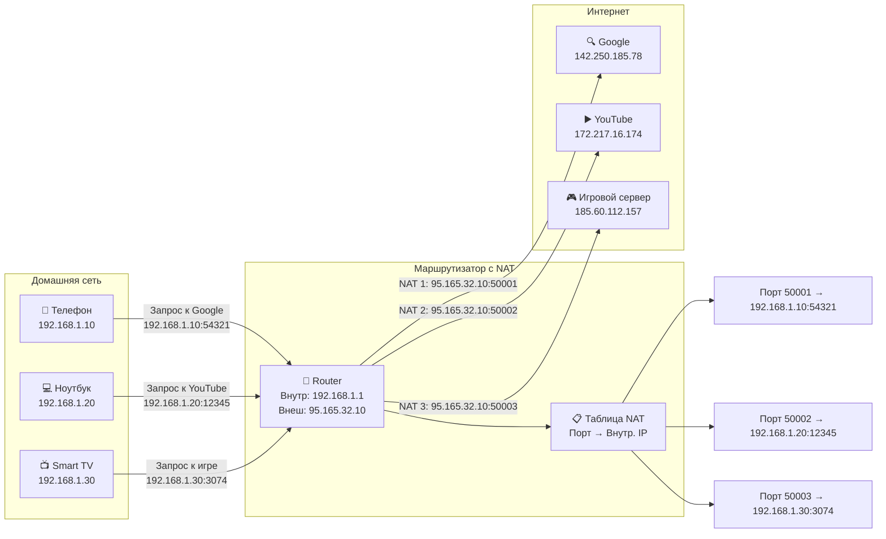

### 📋 Краткое описание схемы работы NAT:

Эта схема наглядно показывает, как работает **технология NAT (Network Address Translation)** в домашней сети. 

**Слева** - три устройства домашней сети: телефон, ноутбук и Smart TV, каждый со своим внутренним IP-адресом (192.168.1.10, .20, .30). 

**В центре** - маршрутизатор, который имеет два адреса: внутренний (192.168.1.1) для локальной сети и внешний публичный (95.165.32.10) для Интернета.

**Ключевой момент**: когда устройства отправляют запросы в Интернет, маршрутизатор "переводит" их частные адреса на свой публичный IP, но с разными портами. Телефон становится портом 50001, ноутбук - портом 50002, TV - портом 50003.

**Справа** - интернет-сервисы (Google, YouTube, игровой сервер), которые видят все запросы как идущие от одного адреса 95.165.32.10, но с разными портами.

**Таблица NAT** в маршрутизаторе запоминает соответствия: порт 50001 → телефон, порт 50002 → ноутбук и т.д. Это позволяет правильно направлять ответы от серверов обратно нужным устройствам.

**Итог**: NAT позволяет множеству устройств использовать один публичный IP-адрес, экономя адресное пространство IPv4 и обеспечивая дополнительную безопасность.

---

#### 📊 Типы NAT:

1. **Статический NAT (1:1)**
   ```
   Внутренний: 192.168.1.100 ↔ Внешний: 95.165.32.20
   ```
   - Для серверов, доступных из Интернета
   - Постоянное соответствие адресов

2. **Динамический NAT (Many:Many)**
   - Пул внешних адресов для группы внутренних
   - Используется в корпоративных сетях

3. **PAT/NAT Overload (Many:1) ⭐**
   ```
   50 устройств → 1 публичный IP + разные порты
   ```
   - Самый распространенный тип
   - Используется в домашних сетях и малом бизнесе
   - Также называется **Masquerading**

#### ✅ Преимущества NAT:
- ✅ **Экономия IP-адресов**: Один публичный IP для всей сети
- ✅ **Безопасность**: Скрытие внутренней структуры сети
- ✅ **Гибкость**: Легкая смена провайдера
- ✅ **Совместимость**: Работа с устаревшими протоколами

#### ⚠️ Ограничения NAT:
- ❌ Проблемы для P2P приложений и игр
- ❌ Сложность настройки некоторых протоколов (FTP, VoIP)
- ❌ Нагрузка на процессор маршрутизатора
- ❌ Затруднения при отладке сетевых проблем

---

## ⚖️ Глава 6: Сравнительный анализ устройств

### 📊 Полное сравнение коммутаторов и маршрутизаторов

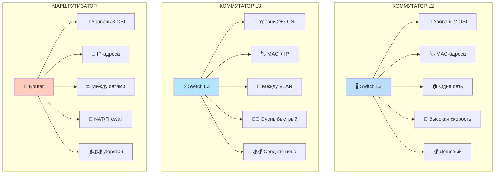

### 📋 Детальная таблица сравнения:

| **Параметр** | **L2 Коммутатор** | **L3 Коммутатор** | **Маршрутизатор** |
|-------------|-------------------|-------------------|-------------------|
| **🎯 Уровень OSI** | Уровень 2 | Уровни 2+3 | **Уровень 3** |
| **🏷️ Адресация** | MAC-адреса | MAC + IP | IP-адреса |
| **🌐 Основная задача** | Локальная связь | Маршрутизация VLAN | **Межсетевая связь** |
| **🔄 NAT** | ❌ Нет | ❌ Нет | ✅ **Есть** |
| **🛡️ Firewall** | ❌ Нет | ✅ Базовый ACL | ✅ **Расширенный** |
| **🔐 VPN** | ❌ Нет | ❌ Нет | ✅ **Есть** |
| **⚡ Скорость** | 🚀 Очень высокая | 🚀🚀 Чрезвычайно высокая | 🐢 Относительно ниже |
| **💰 Стоимость** | Низкая | Средняя | Высокая |
| **🏠 Типичное применение** | Уровень доступа | Уровень распределения | **Граница сети** |

---

### 🎯 Правило выбора устройства:

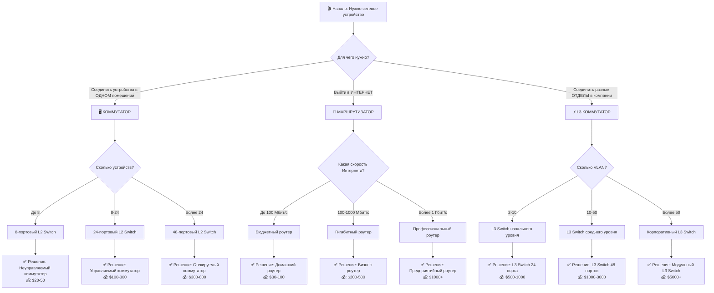

---

## 🏢 Глава 7: Практический пример корпоративной сети

### 📐 Реальный кейс: Сеть компании "ТехноИнновации"

**Техническое задание:**
- Компания: 150 сотрудников, 3 отдела
- 3-этажное офисное здание
- Интернет доступ для всех сотрудников
- Разделение сетей по отделам
- VoIP телефония и видеонаблюдение

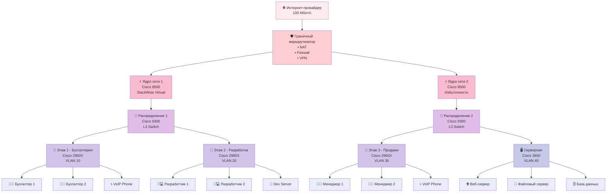

### 🏷️ Таблица VLAN и IP-адресации:

| VLAN | Имя отдела | Подсеть | Шлюз | Назначение |
|------|------------|---------|------|------------|
| 10 | Accounting | 10.0.10.0/24 | 10.0.10.1 | Бухгалтерия |
| 20 | Development | 10.0.20.0/24 | 10.0.20.1 | Разработка |
| 30 | Sales | 10.0.30.0/24 | 10.0.30.1 | Продажи |
| 40 | Servers | 10.0.40.0/24 | 10.0.40.1 | Серверы |
| 50 | Management | 10.0.50.0/24 | 10.0.50.1 | Управление |
| 60 | Voice | 10.0.60.0/24 | 10.0.60.1 | IP-телефоны |
| 99 | Guest | 10.0.99.0/24 | 10.0.99.1 | Гости |

### ⚙️ Примеры конфигурации:

#### Конфигурация L3 коммутатора (распределение):
```cisco
! Настройка SVI для VLAN
interface Vlan10
 description Accounting Department
 ip address 10.0.10.1 255.255.255.0
 ip helper-address 10.0.40.10  ! DHCP relay
!
interface Vlan20
 description Development Department
 ip address 10.0.20.1 255.255.255.0
 ip helper-address 10.0.40.10
!
! Настройка ACL для безопасности
ip access-list extended DENY_ACCT_TO_DEV
 deny ip 10.0.10.0 0.0.0.255 10.0.20.0 0.0.0.255
 permit ip any any
!
! Применение ACL
interface Vlan10
 ip access-group DENY_ACCT_TO_DEV in
```

#### Конфигурация маршрутизатора (граница):
```cisco
! Настройка интерфейсов
interface GigabitEthernet0/0
 description Uplink to ISP
 ip address 95.165.32.10 255.255.255.252
 ip nat outside
!
interface GigabitEthernet0/1
 description Downlink to Core Switch
 ip address 10.0.0.1 255.255.255.0
 ip nat inside
!
! Динамическая маршрутизация
router ospf 1
 network 10.0.0.0 0.255.255.255 area 0
!
! NAT Overload (PAT)
ip nat inside source list NAT_ACL interface Gig0/0 overload
!
! ACL для NAT
ip access-list standard NAT_ACL
 permit 10.0.0.0 0.255.255.255
```

---

## 📈 Глава 8: Производительность и выбор оборудования

### 🎯 Ключевые метрики производительности

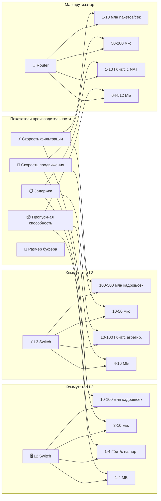

---

## 📘 Глава 9: Краткий конспект и шпаргалка

### ⚡ 1. ГЛАВНОЕ ОТЛИЧИЕ:

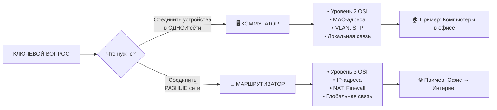

### 📋 2. ТАБЛИЦА ОСНОВНЫХ ОТЛИЧИЙ:

| **Характеристика** | **Коммутатор L2** | **Коммутатор L3** | **Маршрутизатор** |
|-------------------|-------------------|-------------------|-------------------|
| **📍 Уровень OSI** | 2 | 2+3 | 3 |
| **🎯 Задача** | Локальная связь | Маршрутизация VLAN | Межсетевая связь |
| **🏷️ Адресация** | MAC | MAC + IP | IP |
| **🔄 NAT** | ❌ Нет | ❌ Нет | ✅ Есть |
| **🌐 Интернет** | ❌ Не выходит | ❌ Не выходит | ✅ Выходит |
| **💰 Цена** | Дешево | Средне | Дорого |
| **🚀 Скорость** | Быстро | Очень быстро | Медленнее |

### 🏗️ 3. ИЕРАРХИЧЕСКАЯ МОДЕЛЬ СЕТИ:

```
┌─────────────────┐
│   ⚡ ЯДРО СЕТИ   │ ← L3 Коммутаторы
│   (Core Layer)  │   Скорость, надежность
└────────┬────────┘
         │
┌────────▼────────┐
│ 🔄 РАСПРЕДЕЛЕНИЕ │ ← L3 Коммутаторы
│ (Distribution)  │   Маршрутизация, безопасность
└────────┬────────┘
         │
┌────────▼────────┐
│   🚪 ДОСТУП     │ ← L2 Коммутаторы
│  (Access Layer) │   Пользователи, VLAN
└─────────────────┘
```

### 🔑 4. КЛЮЧЕВЫЕ ТЕХНОЛОГИИ:

#### Для коммутаторов:
- ✅ **VLAN** - виртуальные сети в одной физической
- ✅ **STP** - защита от сетевых петель
- ✅ **EtherChannel** - объединение каналов
- ✅ **Port Security** - безопасность портов

#### Для маршрутизаторов:
- ✅ **NAT** - преобразование адресов
- ✅ **Firewall** - фильтрация трафика
- ✅ **VPN** - защищенные туннели
- ✅ **QoS** - приоритезация трафика

### 🎪 5. NAT - простыми словами:

```
📱 Телефон (192.168.1.10) → YouTube
💻 Ноутбук (192.168.1.20) → Google
📺 TV (192.168.1.30) → Netflix

          ↓
     🚦 Маршрутизатор
          ↓ NAT магия!
          
📱 → 95.165.32.10:50001 → YouTube
💻 → 95.165.32.10:50002 → Google  
📺 → 95.165.32.10:50003 → Netflix

ИНТЕРНЕТ видит: ОДИН IP (95.165.32.10)
Но с РАЗНЫМИ портами!
```

### ✅ 6. ЧЕК-ЛИСТ ВЫБОРА ОБОРУДОВАНИЯ:

#### Выбираем КОММУТАТОР, если:
- [ ] Нужно соединить компьютеры в одном кабинете
- [ ] Все устройства в одной сети/IP-подсети
- [ ] Нет выхода в Интернет
- [ ] Бюджет ограничен

#### Выбираем МАРШРУТИЗАТОР, если:
- [ ] Нужен выход в Интернет
- [ ] Соединяем разные офисы/филиалы
- [ ] Требуется безопасность (Firewall)
- [ ] Нужен VPN для удаленных сотрудников

#### Выбираем L3 КОММУТАТОР, если:
- [ ] Нужна маршрутизация между VLAN
- [ ] Большая скорость внутри сети
- [ ] Компания больше 50 сотрудников
- [ ] Есть отдельные отделы с разным доступом

### 🎯 7. ПРАВИЛО 5 СЕКУНД:

```
Если нужно соединить:
• Компьютеры в одной комнате → КОММУТАТОР ✅
• Комнату с Интернетом → МАРШРУТИЗАТОР ✅
• Комнаты между собой в здании → L3 КОММУТАТОР ✅
```

### 🧠 8. ВАЖНЕЙШИЕ ТЕРМИНЫ:

**Обязательно знать:**
1. **MAC-адрес** - уникальный физический адрес устройства
2. **IP-адрес** - логический адрес в сети
3. **VLAN** - виртуальная локальная сеть
4. **NAT** - преобразование сетевых адресов
5. **STP** - протокол остовного дерева
6. **QoS** - качество обслуживания
7. **ACL** - списки контроля доступа
8. **DHCP** - автоматическая выдача IP
9. **DNS** - преобразование имен в адреса
10. **Firewall** - межсетевой экран

### 📊 9. ЦИФРЫ ДЛЯ ЗАПОМИНАНИЯ:

```
MAC-адрес: 48 бит (6 байт) → Пример: 00:1A:2B:3C:4D:5E
IPv4 адрес: 32 бита → Пример: 192.168.1.1
IPv6 адрес: 128 бит → Пример: 2001:0db8:85a3...
VLAN ID: 1-4094 (0 и 4095 зарезервированы)
Задержка L2: 3-10 микросекунд
Задержка L3: 10-50 микросекунд
Задержка Router: 50-200 микросекунд
```

### 🚀 10. ИТОГОВАЯ ФОРМУЛА УСПЕХА:

```
УСПЕШНАЯ СЕТЬ = 
  Правильный выбор оборудования × 
  Грамотная архитектура × 
  Надежная конфигурация
```

---

## 🌟 ГЛАВНЫЙ ВЫВОД ЛЕКЦИИ:

> **Коммутаторы и маршрутизаторы — не конкуренты, а партнеры!** 🤝  
> **Коммутаторы создают сети внутри, маршрутизаторы соединяют их снаружи.**  
> **Правильное использование обоих устройств — ключ к надежной и производительной сети!** 🏗️🌉

---

## 📚 ДЛЯ САМОПРОВЕРКИ:

### Вопросы для размышления:
1. Почему в офисе из 100 компьютеров используют один маршрутизатор, а не 100?
2. Зачем нужны VLAN, если можно создать отдельные физические сети?
3. Почему L3 коммутатор быстрее маршрутизатора, но дешевле?
4. Как YouTube отличает ваш телефон от ноутбука, если у них один внешний IP?
5. Почему нельзя использовать только коммутаторы для выхода в Интернет?

### Практическое задание:
Нарисуйте схему сети для:
- Школы: 3 компьютерных класса по 15 компьютеров
- Все классы должны иметь доступ в Интернет
- Администрация в отдельной защищенной сети
- Бюджет: оптимальный

**Удачи в изучении сетевых технологий! Помните: понимание основ — 50% успеха!** 🎓🚀
