**Лабораторная работа № 2.**

**IP-адресация**

**Цели работы:**

- научиться определять адрес подсети и адрес хоста по маске подсети;
- научиться определять количество и диапазон адресов возможных узлов в подсетях;
- научиться структурировать сети с использованием масок.

Для успешного решения задач администрирования необходимо хорошо разбираться в системе IP-адресации. Знание принципов использования масок и структуризации сетей поможет грамотно решать многие вопросы настройки локальной сети.

**Пример 1**

_Петя записал IP-адрес школьного сервера на листке бумаги и положил его в карман куртки. Петина мама случайно постирала куртку вместе с запиской. После стирки Петя обнаружил в кармане четыре обрывка с фрагментами IP-адреса. Эти фрагменты обозначены буквами А, Б, В и Г. Восстановите IP-адрес. В ответе укажите последовательность букв, обозначающих фрагменты, в порядке, соответствующем IP-адресу._

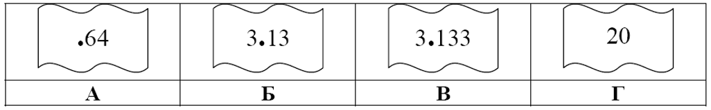

**Решение:**

1. самое главное – вспомнить, что каждое из 4-х чисел в IP-адресе должно быть в интервале от 0 до 255
2. поэтому сразу определяем, что фрагмент А – самый последний, так как в противном случае одно из чисел получается больше 255 (643 или 6420)
3. фрагмент Г (число 20) может быть только первым, поскольку варианты 3.1320 и 3.13320 дают число, большее 255
4. из фрагментов Б и В первым должен быть Б, иначе получим 3.1333.13 (1333 > 255)
5. таким образом, верный ответ – **ГБВА**.

**Пример 2**

_В терминологии сетей TCP/IP маской сети называют двоичное число, которое показывает, какая часть IP-адреса узла сети относится к адресу сети, а какая – к адресу узла в этой сети. Адрес сети получается в результате применения поразрядной конъюнкции к заданному адресу узла и его маске. По заданным IP-адресу узла сети и маске определите адрес сети:_

_IP-адрес: 10.8.248.131 Маска: 255.255.224.0_

_При записи ответа выберите из приведенных в таблице чисел 4 фрагмента четыре элемента IP-адреса и запишите в нужном порядке соответствующие им буквы без точек._

| A   | B   | C   | D   | E   | F   | G   | H   |
| --- | --- | --- | --- | --- | --- | --- | --- |
| 8   | 131 | 255 | 224 | 0   | 10  | 248 | 92  |

_Пример. Пусть искомый адрес сети 192.168.128.0 и дана таблица_

| A   | B   | C   | D   | E   | F   | G   | H   |
| --- | --- | --- | --- | --- | --- | --- | --- |
| 128 | 168 | 255 | 8   | 127 | 0   | 17  | 192 |

_В этом случае правильный ответ будет HBAF._

**Решение:**

1. нужно помнить, что каждая часть в IP-адресе (и в маске) – восьмибитное двоичное число, то есть десятичное число от 0 до 255 (поэтому каждую часть адреса и маски называют _октетом_)
2. поскольку 255 = 111111112, все части IP-адреса узла, для которых маска равна 255, входят в IP-адрес сети без изменений (они полностью относятся к адресу сети)
3. поскольку 0 = 000000002, все части IP-адреса узла, для которых маска равна 0, в IP-адресе сети заменяются нулями (они полностью относятся к адресу узла в сети)
4. таким образом, мы почти определили адрес сети, он равен 10.8.X.0, где X придется определять дополнительно
5. переведем в двоичную систему третью часть IP-адреса и маски

248 = 111110002

224 = 111000002

6. заметим, что в маске сначала идет цепочка единиц, а потом до конца – цепочка нулей; это правильно, число где цепочка единиц начинается не с левого края (не со старшего, 8-ого бита) или внутри встречаются нули, не может быть маской; поэтому есть всего несколько допустимых чисел для последней части маски (все предыдущие должны быть равны 255):

100000002 = 128

110000002 = 192

111000002 = 224

111100002 = 240

111110002 = 248

111111002 = 252

111111102 = 254

111111112 = 255

7. выполним между этими числами поразрядную конъюнкцию – логическую операцию «И»; маска 224 = 111000002 говорит о том, что первые три бита соответствующего числа в IP-адресе относятся к адресу сети, а оставшиеся 5 – к адресу узла:

248 = **111**110002

224 = **111**000002

поэтому часть адреса сети – это 224 = 111000002, а адрес узла – это 110002 = 24.

8. таким образом, полный адрес сети – 10.8.224.0
9. по таблице находим ответ: FADE (F=10, A=8, D=224, E=0)

**Пример 3**

_Маской подсети называется 32-разрядное двоичное число, которое определяет, какая часть IP-адреса компьютера относится к адресу сети, а какая часть IP-адреса определяет номер (внутренний адрес) компьютера в подсети. В маске подсети старшие биты, отведенные в IP-адресе компьютера для адреса сети, имеют значение 1;младшие биты, отведенные в IP-адресе компьютера для номера (внутреннего адреса) компьютера в подсети, имеют значение 0.Например, маска подсети может иметь вид:_

_11111111 11111111 11100000 00000000 (255.255.224.0)_

_Это значит, что 19 старших бит в IP-адресе содержит адрес сети, оставшиеся 13 младших бит содержат номер (внутренний адрес) компьютера в сети. Если маска подсети 255.255.255.240 и IP-адрес компьютера в сети 162.198.0.44, то номер компьютера в сети равен_\_____

**Решение:**

1. эта задача аналогична предыдущей с той разницей, что требуется определить не адрес сети, а номер (внутренний адрес) компьютера (узла) в этой сети
2. нужно помнить, что каждая часть в IP-адресе (и в маске) – восьмибитное двоичное число, то есть десятичное число от 0 до 255 (поэтому каждую часть адреса и маски называют _октетом_)
3. первые три числа в маске равны 255, в двоичной системе это 8 единиц, поэтому первые три числа IP-адреса компьютера целиком относятся к адресу сети
4. для последнего числа (октета) маска и соответствующая ей последняя часть IP-адреса равны

**240 = 111100002**

**44 = 001011002**

5. выше голубым цветом выделены нулевые биты маски и соответствующие им биты IP-адреса, определяющие номер компьютера в сети: 11002 = 12
6. Ответ: **12**.

**Пример 4**

_В терминологии сетей TCP/IP маской подсети называется 32-разрядное двоичное число, определяющее, какие именно разряды IP-адреса компьютера являются общими для всей подсети,— в этих разрядах маски стоит 1. Обычно маски записываются в виде четверки десятичных чисел— по тем же правилам, что и IP-адреса. Для некоторой подсети используется маска 255.255.255.224. Сколько различных адресов компьютеров теоретически допускает эта маска, если два адреса (адрес сети и широковещательный) не используют?_

**Решение:**

1. Поскольку первые три октета (октет — число маски, содержит 8 бит) равны 255, то в двоичном виде они записываются как 24 единицы, а значит, первые три октета определяют адрес сети.
2. Запишем число 224 в двоичном виде: 11100000
3. В конце этого числа стоят 5 нулей. Итого у нас есть 5 двоичных разрядов для того, чтобы записать адрес компьютера.
4. но, так как два адреса не используются, получаем 25 – 2 = 32 - 2 = **30**

Ответ: **30**.

**Пример 5**

_В терминологии сетей TCP/IP маска сети — это двоичное число, меньшее 232; в маске сначала (в старших разрядах) стоят единицы, а затем с некоторого места нули. Маска определяет, какая часть IP-адреса узла сети относится к адресу сети, а какая— к адресу самого узла в этой сети. Обычно маска записывается по тем же правилам, что и IP-адрес,— в виде четырёх байт, причём каждый байт записывается в виде десятичного числа. Адрес сети получается в результате применения поразрядной конъюнкции к заданному IP-адресу узла и маске. Например, если IP-адрес узла равен 231.32.255.131, а маска равна 255.255.240.0, то адрес сети равен 231.32.240.0._

_Для узла с IP-адресом 224.128.112.142 адрес сети равен 224.128.64.0. Чему равен третий слева байт маски? Ответ запишите в виде десятичного числа._

**Решение**

1. Рассмотрим третий слева байт в IP-адресе узла и адресе сети, представим их в двоичном виде:

11210 = 0111 00002; 6410 = 0100 00002.

1. Маской сети является такое двоичное число, которое при поразрядной конъюнкции с IP-адресом узла даст адрес сети, при этом первая часть числа состоит из единиц, а всё остальное— нули. Таким числом является 110000002=19210.

Ответ: **192**.

**Требования к отчету**

- - В отчете запишите ответы на задания самостоятельной работы. Обоснуйте каждый шаг получения результата, аналогично тому, как это сделано в примерах.

**Контрольные вопросы**

1. Может ли быть IP-адрес узла таким? Укажите неверные варианты IP-адрес. Ответ обоснуйте.
    - 192.168.255.0
    - 167.234.56.13
    - 224.0.5.3
    - 172.34.267.34
    - 230.0.0.7
    - 160.54.255.255

Маска подсети 255.255.0.0

1. Может ли маска подсети быть такой? Укажите неверные варианты. Ответ обоснуйте.
    - 255.254.128.0
    - 255.255.252.0
    - 240.0.0.0
    - 255.255.194.0
    - 255.255.128.0
    - 255.255.255.244
    - 255.255.255.255
2. Можно ли следующие подсети разделить на N подсетей. Если это возможно, то укажите варианты разбиения с максимально возможным количеством подсетей или узлов в каждой подсети. Ответ обоснуйте.
    - 165.45.67.0, маска 255.255.255.224, N=3
    - 235.162.56.0, маска 255.255.255.224, N=6
    - 234.49.32.0, маска 255.255.255.192, N=3

**Вариант 1**

**Задание 1**

**A)** Петя записал IP-адрес школьного сервера на листке бумаги и положил его в карман куртки. Петина мама случайно постирала куртку вместе с запиской. После стирки Петя обнаружил в кармане четыре обрывка с фрагментами IP-адреса. Эти фрагменты обозначены буквами А, Б, В и Г. Восстановите IP-адрес. В ответе укажите последовательность букв, обозначающих фрагменты, в порядке, соответствующем IP-адресу.

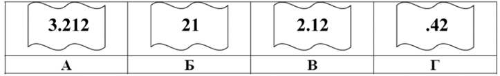

**Б)** Петя записал IP-адрес школьного сервера на листке бумаги и положил его в карман куртки. Петина мама случайно постирала куртку вместе с запиской. После стирки Петя обнаружил в кармане четыре обрывка с фрагментами IP-адреса. Эти фрагменты обозначены буквами А, Б, В и Г. Восстановите IP-адрес. В ответе укажите последовательность букв, обозначающих фрагменты, в порядке, соответствующем IP-адресу.

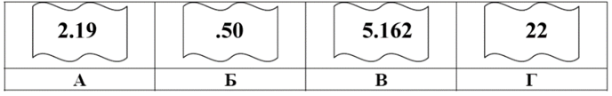

**Задание 2**

**A)** В терминологии сетей TCP/IP маской сети называют двоичное число, которое показывает, какая часть IP-адреса узла сети относится к адресу сети, а какая – к адресу узла в этой сети. Адрес сети получается в результате применения поразрядной конъюнкции к заданному адресу узла и его маске. По заданным IP-адресу узла сети и маске определите адрес сети:

IP-адрес: 12.16.196.10 Маска: 255.255.224.0

При записи ответа выберите из приведенных в таблице чисел 4 фрагмента четыре элемента IP-адреса и запишите в нужном порядке соответствующие им буквы без точек.

| A   | B   | C   | D   | E   | F   | G   | H   |
| --- | --- | --- | --- | --- | --- | --- | --- |
| 192 | 0   | 255 | 12  | 248 | 16  | 196 | 128 |

Пример. Пусть искомый адрес сети 192.168.128.0 и дана таблица

| A   | B   | C   | D   | E   | F   | G   | H   |
| --- | --- | --- | --- | --- | --- | --- | --- |
| 128 | 168 | 255 | 8   | 127 | 0   | 17  | 192 |

В этом случае правильный ответ будет HBAF.

**Б)** В терминологии сетей TCP/IP маской сети называют двоичное число, которое показывает, какая часть IP-адреса узла сети относится к адресу сети, а какая – к адресу узла в этой сети. Адрес сети получается в результате применения поразрядной конъюнкции к заданному адресу узла и его маске. По заданным IP-адресу узла сети и маске определите адрес сети:

IP-адрес: 217.19.128.131 Маска: 255.255.192.0

При записи ответа выберите из приведенных в таблице чисел 4 фрагмента четыре элемента IP-адреса и запишите в нужном порядке соответствующие им буквы без точек.

| A   | B   | C   | D   | E   | F   | G   | H   |
| --- | --- | --- | --- | --- | --- | --- | --- |
| 0   | 16  | 19  | 64  | 128 | 131 | 192 | 217 |

Пример. Пусть искомый адрес сети 192.168.128.0 и дана таблица

| A   | B   | C   | D   | E   | F   | G   | H   |
| --- | --- | --- | --- | --- | --- | --- | --- |
| 128 | 168 | 255 | 8   | 127 | 0   | 17  | 192 |

В этом случае правильный ответ будет HBAF.

**Задание 3**

**А)** Если маска подсети 255.255.255.224 и IP-адрес компьютера в сети 162.198.0.157, то номер компьютера в сети равен_\____

**Б)** Если маска подсети 255.255.255.248 и IP-адрес компьютера в сети 156.128.0.227, то номер компьютера в сети равен_\____

**Задание 4**

В терминологии сетей TCP/IP маской подсети называется 32-разрядное двоичное число, определяющее, какие именно разряды IP-адреса компьютера являются общими для всей подсети,— в этих разрядах маски стоит 1. Обычно маски записываются в виде четверки десятичных чисел— по тем же правилам, что и IP-адреса. Для некоторой подсети используется маска 255.255.255.192. Сколько различных адресов компьютеров теоретически допускает эта маска, если два адреса (адрес сети и широковещательный) не используют?

**Задание 5**

**А)** В терминологии сетей TCP/IP маска сети — это двоичное число, меньшее 232; в маске сначала (в старших разрядах) стоят единицы, а затем с некоторого места нули. Маска определяет, какая часть IP-адреса узла сети относится к адресу сети, а какая— к адресу самого узла в этой сети. Обычно маска записывается по тем же правилам, что и IP-адрес,— в виде четырёх байт, причём каждый байт записывается в виде десятичного числа. Адрес сети получается в результате применения поразрядной конъюнкции к заданному IP-адресу узла и маске. Например, если IP-адрес узла равен 231.32.255.131, а маска равна 255.255.240.0, то адрес сети равен 231.32.240.0.

Для узла с IP-адресом 224.128.114.142 адрес сети равен 224.128.64.0. Чему равен третий слева байт маски? Ответ запишите в виде десятичного числа.

**Б)** В терминологии сетей TCP/IP маска сети — это двоичное число, меньшее 232; в маске сначала (в старших разрядах) стоят единицы, а затем с некоторого места нули. Маска определяет, какая часть IP-адреса узла сети относится к адресу сети, а какая— к адресу самого узла в этой сети. Обычно маска записывается по тем же правилам, что и IP-адрес,— в виде четырёх байт, причём каждый байт записывается в виде десятичного числа. Адрес сети получается в результате применения поразрядной конъюнкции к заданному IP-адресу узла и маске. Например, если IP-адрес узла равен 231.32.255.131, а маска равна 255.255.240.0, то адрес сети равен 231.32.240.0.

Для узла с IP-адресом 224.128.114.142 адрес сети равен 224.128.96.0. Чему равен третий слева байт маски? Ответ запишите в виде десятичного числа.

**Вариант 2**

**Задание 1**

**А)** Петя записал IP-адрес школьного сервера на листке бумаги и положил его в карман куртки. Петина мама случайно постирала куртку вместе с запиской. После стирки Петя обнаружил в кармане четыре обрывка с фрагментами IP-адреса. Эти фрагменты обозначены буквами А, Б, В и Г. Восстановите IP-адрес. В ответе укажите последовательность букв, обозначающих фрагменты, в порядке, соответствующем IP-адресу.

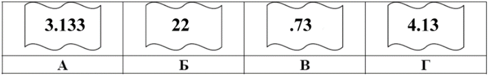

**Б)** На месте преступления были обнаружены четыре обрывка бумаги. Следствие установило, что на них записаны фрагменты одного IP-адреса. Криминалисты обозначили эти фрагменты буквами А, Б, В и Г. Восстановите IP-адрес. В ответе укажите последовательность букв, обозначающих фрагменты, в порядке, соответствующем IP-адресу.

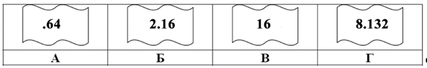

**Задание 2**

**А)** В терминологии сетей TCP/IP маской сети называют двоичное число, которое показывает, какая часть IP-адреса узла сети относится к адресу сети, а какая – к адресу узла в этой сети. Адрес сети получается в результате применения поразрядной конъюнкции к заданному адресу узла и его маске. По заданным IP-адресу узла сети и маске определите адрес сети:

IP-адрес: 145.92.137.88 Маска: 255.255.240.0

При записи ответа выберите из приведенных в таблице чисел 4 фрагмента четыре элемента IP-адреса и запишите в нужном порядке соответствующие им буквы без точек.

| A   | B   | C   | D   | E   | F   | G   | H   |
| --- | --- | --- | --- | --- | --- | --- | --- |
| 0   | 145 | 255 | 137 | 128 | 240 | 88  | 92  |

Пример. Пусть искомый адрес сети 192.168.128.0 и дана таблица

| A   | B   | C   | D   | E   | F   | G   | H   |
| --- | --- | --- | --- | --- | --- | --- | --- |
| 128 | 168 | 255 | 8   | 127 | 0   | 17  | 192 |

В этом случае правильный ответ будет HBAF.

**Б)** В терминологии сетей TCP/IP маской сети называют двоичное число, которое показывает, какая часть IP-адреса узла сети относится к адресу сети, а какая – к адресу узла в этой сети. Адрес сети получается в результате применения поразрядной конъюнкции к заданному адресу узла и его маске. По заданным IP-адресу узла сети и маске определите адрес сети:

IP-адрес: 204.230.250.29 Маска: 255.255.240.0

При записи ответа выберите из приведенных в таблице чисел 4 фрагмента четыре элемента IP-адреса и запишите в нужном порядке соответствующие им буквы без точек.

| A   | B   | C   | D   | E   | F   | G   | H   |
| --- | --- | --- | --- | --- | --- | --- | --- |
| 0   | 19  | 208 | 204 | 230 | 240 | 248 | 255 |

Пример. Пусть искомый адрес сети 192.168.128.0 и дана таблица

| A   | B   | C   | D   | E   | F   | G   | H   |
| --- | --- | --- | --- | --- | --- | --- | --- |
| 128 | 168 | 255 | 8   | 127 | 0   | 17  | 192 |

В этом случае правильный ответ будет HBAF.

**Задание 3**

**А)** Если маска подсети 255.255.255.240 и IP-адрес компьютера в сети 192.168.156.235, то номер компьютера в сети равен_\____

**Б)** Если маска подсети 255.255.255.192 и IP-адрес компьютера в сети 10.18.134.220, то номер компьютера в сети равен_\____

**Задание 4**

В терминологии сетей TCP/IP маской подсети называется 32-разрядное двоичное число, определяющее, какие именно разряды IP-адреса компьютера являются общими для всей подсети,— в этих разрядах маски стоит 1. Обычно маски записываются в виде четверки десятичных чисел— по тем же правилам, что и IP-адреса. Для некоторой подсети используется маска 255.255.255.128. Сколько различных адресов компьютеров теоретически допускает эта маска, если два адреса (адрес сети и широковещательный) не используют?

**Задание 5**

**А)** В терминологии сетей TCP/IP маской сети называется двоичное число, определяющее, какая часть IP-адреса узла сети относится к адресу сети, а какая— к адресу самого узла в этой сети. Обычно маска записывается по тем же правилам, что и IP-адрес,— в виде четырёх байтов, причём каждый байт записывается в виде десятичного числа. При этом в маске сначала (в старших разрядах) стоят единицы, а затем с некоторого разряда— нули. Адрес сети получается в результате применения поразрядной конъюнкции к заданному IP-адресу узла и маске.

Например, если IP-адрес узла равен 231.32.255.131, а маска равна 255.255.240.0, то адрес сети равен 231.32.240.0.

Для узла с IP-адресом 117.191.88.37 адрес сети равен 117.191.80.0. Чему равен третий слева байт маски? Ответ запишите в виде десятичного числа.

**Б)** В терминологии сетей TCP/IP маской сети называется 32-разрядная двоичная последовательность, определяющая, какая часть IP-адреса узла сети относится к адресу сети, а какая— к адресу самого узла в этой сети. При этом в маске сначала (в старших разрядах) стоят единицы, а затем с некоторого места нули.

Адрес сети получается в результате применения поразрядной конъюнкции к заданному IP-адресу узла и маске. Обычно маска записывается по тем же правилам, что и IP-адрес,— в виде четырёх байтов, причём каждый байт записывается в виде десятичного числа.

_Пример._ Пусть IP-адрес узла равен 231.32.255.131, а маска равна 255.255.240.0. Тогда адрес сети равен 231.32.240.0.

Для узла с IP-адресом 235.116.177.140 адрес сети равен 235.116.160.0. Чему равен третий слева байт маски? Ответ запишите в виде десятичного числа.

**Вариант 3**

**Задание 1**

**А)** Петя записал IP-адрес школьного сервера на листке бумаги и положил его в карман куртки. Петина мама случайно постирала куртку вместе с запиской. После стирки Петя обнаружил в кармане четыре обрывка с фрагментами IP-адреса. Эти фрагменты обозначены буквами А, Б, В и Г. Восстановите IP-адрес. В ответе укажите последовательность букв, обозначающих фрагменты, в порядке, соответствующем IP-адресу.

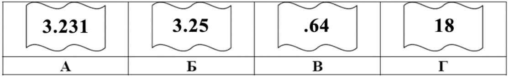

**Б)** Петя записал IP-адрес школьного сервера на листке бумаги и положил его в карман куртки. Петина мама случайно постирала куртку вместе с запиской. После стирки Петя обнаружил в кармане четыре обрывка с фрагментами IP-адреса. Эти фрагменты обозначены буквами А, Б, В и Г. Восстановите IP-адрес. В ответе укажите последовательность букв, обозначающих фрагменты, в порядке, соответствующем IP-адресу.

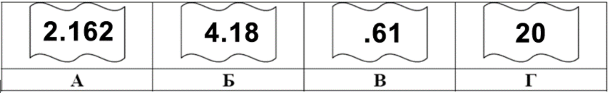

**Задание 2**

**А)** В терминологии сетей TCP/IP маской сети называют двоичное число, которое показывает, какая часть IP-адреса узла сети относится к адресу сети, а какая – к адресу узла в этой сети. Адрес сети получается в результате применения поразрядной конъюнкции к заданному адресу узла и его маске. По заданным IP-адресу узла сети и маске определите адрес сети:

IP-адрес: 217.16.246.2 Маска: 255.255.252.0

При записи ответа выберите из приведенных в таблице чисел 4 фрагмента четыре элемента IP-адреса и запишите в нужном порядке соответствующие им буквы без точек.

| A   | B   | C   | D   | E   | F   | G   | H   |
| --- | --- | --- | --- | --- | --- | --- | --- |
| 244 | 217 | 16  | 2   | 255 | 252 | 246 | 0   |

Пример. Пусть искомый адрес сети 192.168.128.0 и дана таблица

| A   | B   | C   | D   | E   | F   | G   | H   |
| --- | --- | --- | --- | --- | --- | --- | --- |
| 128 | 168 | 255 | 8   | 127 | 0   | 17  | 192 |

В этом случае правильный ответ будет HBAF.

**Б)** В терминологии сетей TCP/IP маской сети называют двоичное число, которое показывает, какая часть IP-адреса узла сети относится к адресу сети, а какая – к адресу узла в этой сети. Адрес сети получается в результате применения поразрядной конъюнкции к заданному адресу узла и его маске. По заданным IP-адресу узла сети и маске определите адрес сети:

IP-адрес: 214.120.249.18 Маска: 255.255.240.0

При записи ответа выберите из приведенных в таблице чисел 4 фрагмента четыре элемента IP-адреса и запишите в нужном порядке соответствующие им буквы без точек.

| A   | B   | C   | D   | E   | F   | G   | H   |
| --- | --- | --- | --- | --- | --- | --- | --- |
| 0   | 19  | 120 | 208 | 214 | 240 | 248 | 255 |

Пример. Пусть искомый адрес сети 192.168.128.0 и дана таблица

| A   | B   | C   | D   | E   | F   | G   | H   |
| --- | --- | --- | --- | --- | --- | --- | --- |
| 128 | 168 | 255 | 8   | 127 | 0   | 17  | 192 |

В этом случае правильный ответ будет HBAF.

**Задание 3**

**А)** Если маска подсети 255.255.255.128 и IP-адрес компьютера в сети 122.191.12.189, то номер компьютера в сети равен_\____

**Б)** Если маска подсети 255.255.252.0 и IP-адрес компьютера в сети 156.132.15.138, то номер компьютера в сети равен_\____

**Задание 4**

В терминологии сетей TCP/IP маской подсети называется 32-разрядное двоичное число, определяющее, какие именно разряды IP-адреса компьютера являются общими для всей подсети,— в этих разрядах маски стоит 1. Обычно маски записываются в виде четверки десятичных чисел— по тем же правилам, что и IP-адреса. Для некоторой подсети используется маска 255.255.254.0. Сколько различных адресов компьютеров теоретически допускает эта маска, если два адреса (адрес сети и широковещательный) не используют?

**Задание 5**

**А)** В терминологии сетей TCP/IP маской сети называется 32-разрядная двоичная последовательность, определяющая, какая часть IP-адреса узла сети относится к адресу сети, а какая— к адресу самого узла в этой сети. При этом в маске сначала (в старших разрядах) стоят единицы, а затем с некоторого места нули.

Адрес сети получается в результате применения поразрядной конъюнкции к заданному IP-адресу узла и маске. Обычно маска записывается по тем же правилам, что и IP-адрес,— в виде четырёх байтов, причём каждый байт записывается в виде десятичного числа.

_Пример_. Пусть IP-адрес узла равен 231.32.255.131, а маска равна 255.255.240.0. Тогда адрес сети равен 231.32.240.0.

Для узла с IP-адресом 227.138.127.144 адрес сети равен 227.138.64.0. Чему равен третий слева байт маски? Ответ запишите в виде десятичного числа.

**Б)** В терминологии сетей TCP/IP маской сети называется двоичное число, определяющее, какая часть IP-адреса узла сети относится к адресу сети, а какая— к адресу самого узла в этой сети. Обычно маска записывается по тем же правилам, что и IP-адрес,— в виде четырёх байтов, причём каждый байт записывается в виде десятичного числа. При этом в маске сначала (в старших разрядах) стоят единицы, а затем с некоторого разряда— нули. Адрес сети получается в результате применения поразрядной конъюнкции к заданным IP-адресу узла и маске.

Например, если IP-адрес узла равен 231.32.255.131, а маска равна 255.255.240.0, то адрес сети равен 231.32.240.0.

Для узла с IP-адресом 115.181.92.48 адрес сети равен 115.181.80.0. Чему равно значение третьего слева байта маски? Ответ запишите в виде десятичного числа.

**Вариант 4**

**Задание 1**

**А)** На месте преступления были обнаружены четыре обрывка бумаги. Следствие установило, что на них записаны фрагменты одного IP-адреса. Криминалисты обозначили эти фрагменты буквами А, Б, В и Г. Восстановите IP-адрес. В ответе укажите последовательность букв, обозначающих фрагменты, в порядке, соответствующем IP-адресу.

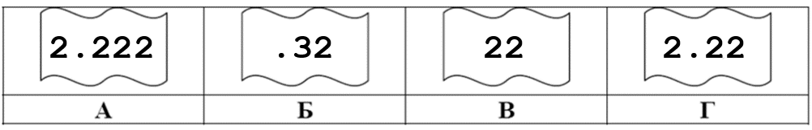

**Б)** На месте преступления были обнаружены четыре обрывка бумаги. Следствие установило, что на них записаны фрагменты одного IP-адреса. Криминалисты обозначили эти фрагменты буквами А, Б, В и Г. Восстановите IP-адрес. В ответе укажите последовательность букв, обозначающих фрагменты, в порядке, соответствующем IP-адресу. Если будет несколько вариантов решения, запишите их все через запятую.

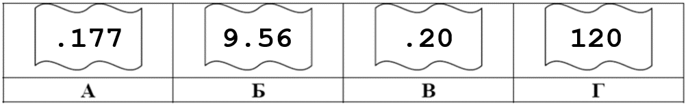

**Задание 2**

**А)** В терминологии сетей TCP/IP маской сети называют двоичное число, которое показывает, какая часть IP-адреса узла сети относится к адресу сети, а какая – к адресу узла в этой сети. Адрес сети получается в результате применения поразрядной конъюнкции к заданному адресу узла и его маске. По заданным IP-адресу узла сети и маске определите адрес сети:

IP-адрес: 146.212.200.55 Маска: 255.255.240.0

При записи ответа выберите из приведенных в таблице чисел 4 фрагмента четыре элемента IP-адреса и запишите в нужном порядке соответствующие им буквы без точек.

| A   | B   | C   | D   | E   | F   | G   | H   |
| --- | --- | --- | --- | --- | --- | --- | --- |
| 0   | 212 | 146 | 240 | 200 | 192 | 55  | 255 |

Пример. Пусть искомый адрес сети 192.168.128.0 и дана таблица

| A   | B   | C   | D   | E   | F   | G   | H   |
| --- | --- | --- | --- | --- | --- | --- | --- |
| 128 | 168 | 255 | 8   | 127 | 0   | 17  | 192 |

В этом случае правильный ответ будет HBAF.

**Б)** В терминологии сетей TCP/IP маской сети называют двоичное число, которое показывает, какая часть IP-адреса узла сети относится к адресу сети, а какая – к адресу узла в этой сети. Адрес сети получается в результате применения поразрядной конъюнкции к заданному адресу узла и его маске. По заданным IP-адресу узла сети и маске определите адрес сети:

IP-адрес: 224.24.254.134 Маска: 255.255.224.0

При записи ответа выберите из приведенных в таблице чисел 4 фрагмента четыре элемента IP-адреса и запишите в нужном порядке соответствующие им буквы без точек.

| A   | B   | C   | D   | E   | F   | G   | H   |
| --- | --- | --- | --- | --- | --- | --- | --- |
| 255 | 254 | 244 | 224 | 134 | 24  | 8   | 0   |

Пример. Пусть искомый адрес сети 192.168.128.0 и дана таблица

| A   | B   | C   | D   | E   | F   | G   | H   |
| --- | --- | --- | --- | --- | --- | --- | --- |
| 128 | 168 | 255 | 8   | 127 | 0   | 17  | 192 |

В этом случае правильный ответ будет HBAF.

**Задание 3**

**А)** Если маска подсети 255.255.248.0 и IP-адрес компьютера в сети 112.154.133.208, то номер компьютера в сети равен_\____

**Б)** Если маска подсети 255.255.240.0 и IP-адрес компьютера в сети 132.126.150.18, то номер компьютера в сети равен_\____

**Задание 4**

В терминологии сетей TCP/IP маской сети называется двоичное число, определяющее, какая часть IP-адреса узла сети относится к адресу сети, а какая— к адресу самого узла в этой сети. При этом в маске сначала (в старших разрядах) стоят единицы, а затем с некоторого места— нули. Обычно маска записывается по тем же правилам, что и IP-адрес,— в виде четырёх байтов, причём каждый байт записывается в виде десятичного числа. Адрес сети получается в результате применения поразрядной конъюнкции к заданному IP-адресу узла и маске.

Например, если IP-адрес узла равен 231.32.255.131, а маска равна 255.255.240.0, то адрес сети равен 231.32.240.0.

Для узла с IP-адресом 98.162.71.94 адрес сети равен 98.162.71.64. Чему равно наименьшее количество возможных адресов в этой сети?

&nbsp;

_Примечание. Адрес сети и широковещательный адрес необходимо учитывать при подсчёте._

**Задание 5**

**А)** В терминологии сетей TCP/IP маской сети называется двоичное число, определяющее, какая часть IP-адреса узла сети относится к адресу сети, а какая— к адресу самого узла в этой сети. Обычно маска записывается по тем же правилам, что и IP-адрес,— в виде четырёх байтов, причём каждый байт записывается в виде десятичного числа. При этом в маске сначала (в старших разрядах) стоят единицы, а затем с некоторого разряда— нули. Адрес сети получается в результате применения поразрядной конъюнкции к заданному IP-адресу узла и маске.

Например, если IP-адрес узла равен 231.32.255.131, а маска равна 255.255.240.0, то адрес сети равен 231.32.240.0. Для узла с IP-адресом 147.192.92.64 адрес сети равен 147.192.80.0. Чему равно значение третьего слева байта маски? Ответ запишите в виде десятичного числа.

**Б)** В терминологии сетей TCP/IP маской сети называется двоичное число, определяющее, какая часть IP-адреса узла сети относится к адресу сети, а какая— к адресу самого узла в этой сети. При этом в маске сначала (в старших разрядах) стоят единицы, а затем с некоторого места— нули.

Обычно маска записывается по тем же правилам, что и IP-адрес,— в виде четырёх байтов, причём каждый байт записывается в виде десятичного числа. Адрес сети получается в результате применения поразрядной конъюнкции к заданному IP-адресу узла и маске.

Например, если IP-адрес узла равен 231.32.255.131, а маска равна 255.255.240.0, то адрес сети равен 231.32.240.0.

Для узла с IP-адресом 93.138.96.47 адрес сети равен 93.138.64.0. Чему равен третий слева байт маски? Ответ запишите в виде десятичного числа.

**Вариант 5**

**Задание 1**

**А)** На месте преступления были обнаружены четыре обрывка бумаги. Следствие установило, что на них записаны фрагменты одного IP-адреса. Криминалисты обозначили эти фрагменты буквами А, Б, В и Г. Восстановите IP-адрес. В ответе укажите последовательность букв, обозначающих фрагменты, в порядке, соответствующем IP-адресу. Если будет несколько вариантов решения, запишите их все через запятую.

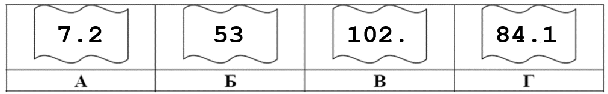

**Б)** На месте преступления были обнаружены четыре обрывка бумаги. Следствие установило, что на них записаны фрагменты одного IP-адреса. Криминалисты обозначили эти фрагменты буквами А, Б, В и Г. Восстановите IP-адрес. В ответе укажите последовательность букв, обозначающих фрагменты, в порядке, соответствующем IP-адресу. Если будет несколько вариантов решения, запишите их все через запятую.

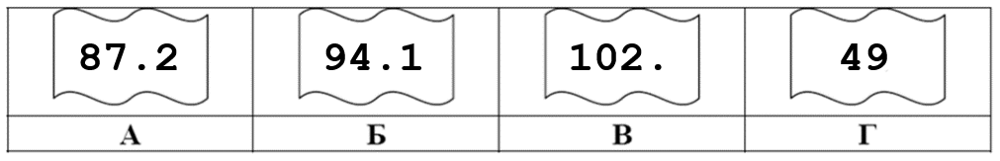

**Задание 2**

**А)** В терминологии сетей TCP/IP маской сети называют двоичное число, которое показывает, какая часть IP-адреса узла сети относится к адресу сети, а какая – к адресу узла в этой сети. Адрес сети получается в результате применения поразрядной конъюнкции к заданному адресу узла и его маске. По заданным IP-адресу узла сети и маске определите адрес сети:

IP-адрес: 148.8.238.3 Маска: 255.255.248.0

При записи ответа выберите из приведенных в таблице чисел 4 фрагмента четыре элемента IP-адреса и запишите в нужном порядке соответствующие им буквы без точек.

| A   | B   | C   | D   | E   | F   | G   | H   |
| --- | --- | --- | --- | --- | --- | --- | --- |
| 232 | 255 | 248 | 0   | 8   | 3   | 238 | 148 |

Пример. Пусть искомый адрес сети 192.168.128.0 и дана таблица

| A   | B   | C   | D   | E   | F   | G   | H   |
| --- | --- | --- | --- | --- | --- | --- | --- |
| 128 | 168 | 255 | 8   | 127 | 0   | 17  | 192 |

В этом случае правильный ответ будет HBAF.

**Б)** В терминологии сетей TCP/IP маской сети называют двоичное число, которое показывает, какая часть IP-адреса узла сети относится к адресу сети, а какая – к адресу узла в этой сети. Адрес сети получается в результате применения поразрядной конъюнкции к заданному адресу узла и его маске. По заданным IP-адресу узла сети и маске определите адрес сети:

IP-адрес: 240.37.249.134 Маска: 255.255.240.0

При записи ответа выберите из приведенных в таблице чисел 4 фрагмента четыре элемента IP-адреса и запишите в нужном порядке соответствующие им буквы без точек.

| A   | B   | C   | D   | E   | F   | G   | H   |
| --- | --- | --- | --- | --- | --- | --- | --- |
| 255 | 249 | 240 | 224 | 37  | 32  | 8   | 0   |

Пример. Пусть искомый адрес сети 192.168.128.0 и дана таблица

| A   | B   | C   | D   | E   | F   | G   | H   |
| --- | --- | --- | --- | --- | --- | --- | --- |
| 128 | 168 | 255 | 8   | 127 | 0   | 17  | 192 |

В этом случае правильный ответ будет HBAF.

**Задание 3**

**А)** Если маска подсети 255.255.224.0 и IP-адрес компьютера в сети 206.158.124.67, то номер компьютера в сети равен_\____

**Б)** Если маска подсети 255.255.252.0 и IP-адрес компьютера в сети 126.185.90.162, то номер компьютера в сети равен_\____

**Задание 4**

В терминологии сетей TCP/IP маской подсети называется 32-разрядное двоичное число, определяющее, какие именно разряды IP-адреса компьютера являются общими для всей подсети,— в этих разрядах маски стоит 1. Обычно маски записываются в виде четверки десятичных чисел— по тем же правилам, что и IP-адреса. Для некоторой подсети используется маска 255.255.248.0. Сколько различных адресов компьютеров допускает эта маска?

_Примечание._ На практике для адресации компьютеров не используются два адреса: адрес сети и широковещательный адрес.

**Задание 5**

**А)** В терминологии сетей TCP/IP маской сети называется двоичное число, определяющее, какая часть IP-адреса узла сети относится к адресу сети, а какая— к адресу самого узла в этой сети. При этом в маске сначала (в старших разрядах) стоят единицы, а затем с некоторого места— нули. Обычно маска записывается по тем же правилам, что и IP-адрес,— в виде четырёх байтов, причём каждый байт записывается в виде десятичного числа. Адрес сети получается в результате применения поразрядной конъюнкции к заданному IP-адресу узла и маске.

Например, если IP-адрес узла равен 231.32.255.131, а маска равна 255.255.240.0, то адрес сети равен 231.32.240.0.

Для узла с IP-адресом 93.138.88.47 адрес сети равен 93.138.80.0. Чему равен третий слева байт маски? Ответ запишите в виде десятичного числа.

**Б)** В терминологии сетей TCP/IP маской сети называется двоичное число, определяющее, какая часть IP-адреса узла сети относится к адресу сети, а какая— к адресу самого узла в этой сети. Обычно маска записывается по тем же правилам, что и IP-адрес,— в виде четырёх байтов, причём каждый байт записывается в виде десятичного числа. При этом в маске сначала (в старших разрядах) стоят единицы, а затем с некоторого разряда— нули. Адрес сети получается в результате применения поразрядной конъюнкции к заданным IP-адресу узла и маске. Например, если IP-адрес узла равен 231.32.255.131, а маска равна 255.255.240.0, то адрес сети равен 231.32.240.0.

Для узла с IP-адресом 153.82.140.123 адрес сети равен 153.82.136.0. Определите третий слева октет маски подсети. Ответ запишите в виде десятичного числа.

**Вариант 6**

**Задание 1**

**А)** На месте преступления были обнаружены четыре обрывка бумаги. Следствие установило, что на них записаны фрагменты одного IP-адреса. Криминалисты обозначили эти фрагменты буквами А, Б, В и Г. Восстановите IP-адрес. В ответе укажите последовательность букв, обозначающих фрагменты, в порядке, соответствующем IP-адресу. Если будет несколько вариантов решения, запишите их все через запятую.

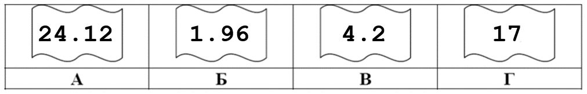

**Б)** На месте преступления были обнаружены четыре обрывка бумаги. Следствие установило, что на них записаны фрагменты одного IP-адреса. Криминалисты обозначили эти фрагменты буквами А, Б, В и Г. Восстановите IP-адрес. В ответе укажите последовательность букв, обозначающих фрагменты, в порядке, соответствующем IP-адресу. Если будет несколько вариантов решения, запишите их все через запятую.

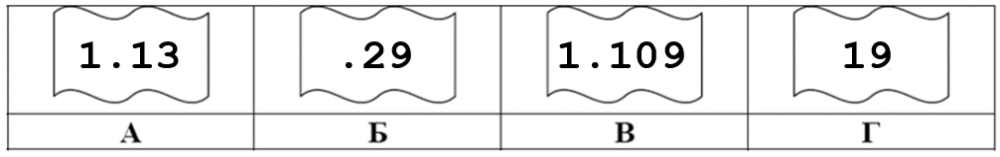

**Задание 2**

**А)** В терминологии сетей TCP/IP маской сети называют двоичное число, которое показывает, какая часть IP-адреса узла сети относится к адресу сети, а какая – к адресу узла в этой сети. Адрес сети получается в результате применения поразрядной конъюнкции к заданному адресу узла и его маске. По заданным IP-адресу узла сети и маске определите адрес сети:

IP-адрес: 217.9.142.131 Маска: 255.255.192.0

При записи ответа выберите из приведенных в таблице чисел 4 фрагмента четыре элемента IP-адреса и запишите в нужном порядке соответствующие им буквы без точек.

| A   | B   | C   | D   | E   | F   | G   | H   |
| --- | --- | --- | --- | --- | --- | --- | --- |
| 0   | 9   | 16  | 64  | 128 | 142 | 192 | 217 |

Пример. Пусть искомый адрес сети 192.168.128.0 и дана таблица

| A   | B   | C   | D   | E   | F   | G   | H   |
| --- | --- | --- | --- | --- | --- | --- | --- |
| 128 | 168 | 255 | 8   | 127 | 0   | 17  | 192 |

В этом случае правильный ответ будет HBAF.

**Б)** В терминологии сетей TCP/IP маской сети называют двоичное число, которое показывает, какая часть IP-адреса узла сети относится к адресу сети, а какая – к адресу узла в этой сети. Адрес сети получается в результате применения поразрядной конъюнкции к заданному адресу узла и его маске. По заданным IP-адресу узла сети и маске определите адрес сети:

IP-адрес: 124.23.251.133 Маска: 255.255.240.0

При записи ответа выберите из приведенных в таблице чисел 4 фрагмента четыре элемента IP-адреса и запишите в нужном порядке соответствующие им буквы без точек.

| A   | B   | C   | D   | E   | F   | G   | H   |
| --- | --- | --- | --- | --- | --- | --- | --- |
| 255 | 240 | 252 | 124 | 133 | 23  | 8   | 0   |

Пример. Пусть искомый адрес сети 192.168.128.0 и дана таблица

| A   | B   | C   | D   | E   | F   | G   | H   |
| --- | --- | --- | --- | --- | --- | --- | --- |
| 128 | 168 | 255 | 8   | 127 | 0   | 17  | 192 |

В этом случае правильный ответ будет HBAF.

**Задание 3**

**А)** Если маска подсети 255.255.255.224 и IP-адрес компьютера в сети 162.198.0.157, то порядковый номер компьютера в сети равен \___\__.

**Б)** Если маска подсети 255.255.255.192 и IP-адрес компьютера в сети 10.18.134.220, то номер компьютера в сети равен \___\__.

**Задание 4**

В терминологии сетей TCP/IP маской подсети называется 32-разрядное двоичное число, определяющее, какие именно разряды IP-адреса компьютера являются общими для всей подсети – в этих разрядах маски стоит 1. Обычно маски записываются в виде четверки десятичных чисел - по тем же правилам, что и IP-адреса. Для некоторой подсети используется маска 255.255.128.0. Сколько различных адресов компьютеров теоретически допускает эта маска, если два адреса (адрес сети и широковещательный) не используют?

**Задание 5**

**А)** В терминологии сетей TCP/IP маской сети называется двоичное число, определяющее, какая часть IP-адреса узла сети относится к адресу сети, а какая— к адресу самого узла в этой сети. Обычно маска записывается по тем же правилам, что и IP-адрес— в виде четырёх байтов, причём каждый байт записывается в виде десятичного числа. При этом в маске сначала (в старших разрядах) стоят единицы, а затем с некоторого разряда— нули. Адрес сети получается в результате применения поразрядной конъюнкции к заданному IP-адресу узла и маске.

Например, если IP-адрес узла равен 231.32.255.131, а маска равна 255.255.240.0, то адрес сети равен 231.32.240.0.

Для узла с IP-адресом 111.81.88.27 адрес сети равен 111.81.80.0. Чему равен третий слева байт маски? Ответ запишите в виде десятичного числа.

**Б)** В терминологии сетей TCP/IP маской сети называется двоичное число, определяющее, какая часть IP-адреса узла сети относится к адресу сети, а какая— к адресу самого узла в этой сети. При этом в маске сначала (в старших разрядах) стоят единицы, а затем с некоторого места— нули. Обычно маска записывается по тем же правилам, что и IP-адрес,— в виде четырёх байтов, причём каждый байт записывается в виде десятичного числа. Адрес сети получается в результате применения поразрядной конъюнкции к заданному IP-адресу узла и маске.

Например, если IP-адрес узла равен 231.32.255.131, а маска равна 255.255.240.0, то адрес сети равен 231.32.240.0.

Узлы с IP-адресами 140.37.235.224 и 140.37.235.192 находятся в одной сети. Определите последний байт маски сети. Количество возможных единиц в маске этой сети должно быть наибольшим.
