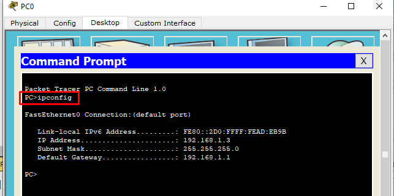
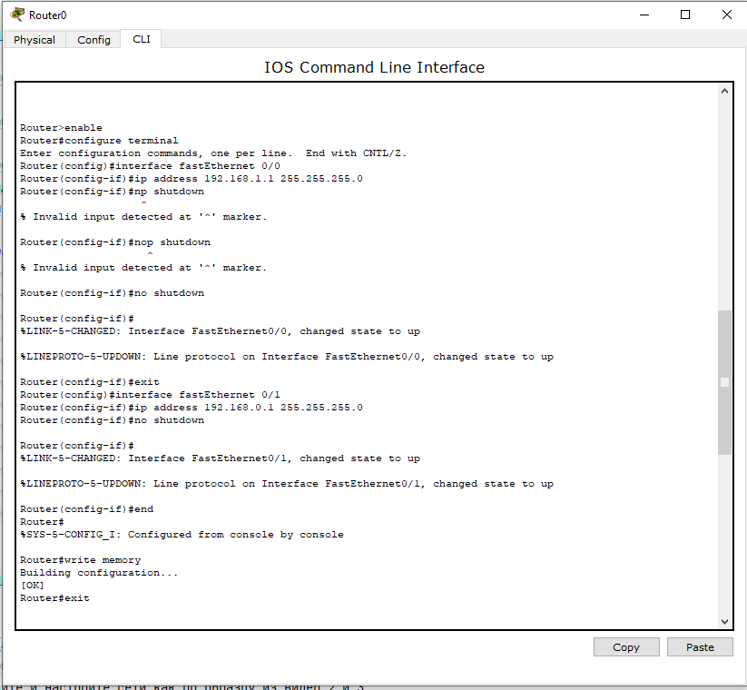

# Лабораторная работа № 4.

## Тема: Построение простейшей компьютерной сети с использованием маршрутизатора и коммутатора

### Цели работы:

*  Построить простейшую компьютерную сеть с использованием маршрутизатора и коммутатора с помощью сетевого симулятора Cisco Packet Tracer.

Для успешного решения задач администрирования необходимо хорошо разбираться в системе IP-адресации. Знание принципов использования масок и структуризации сетей поможет грамотно решать многие вопросы настройки локальной сети.

---

## Содержание

1. [Цели работы](#цели-работы)
2. [Требования к сдаче работы](#требования-к-сдаче-работы)
3. [Краткая теория](#краткая-теория)
4. [Ход работы](#ход-работы)
5. [Задания](#задания)
6. [Контрольные вопросы](#контрольные-вопросы)

## Требования к сдаче работы

1. Индивидуальный отчёт по лабораторной работе оформляется используя
**текстовые редакторы Word(или подобные ему)
в текстовый файл формата doc или docx.** [ШАБЛОН ДЛЯ ОТЧЕТА ПО ЛР4](LAB4%2FLR4_Report.docx)
2. В индивидуальном отчёте должны быть указаны цель, задание, представлены необходимые снимки экрана и пояснения к ним.
3. Следует проанализировать полученные данные и дать ответы на контрольные вопросы.
4. Перепишите в тетрадь [краткую теорию](#краткая-теория) из этой работы.

***Критерии оценивания***

* **Оценка 5**
  * Переписать краткую информацию из материалов этой работы. 
  * Сделать [пример](#пример-построения-простейшей-компьютерной-сети-с-использованием-маршрутизатора-и-коммутатора-) и 
  сохранить его под именем `Ivanov_Ivan_235_ex1.pkt`.
  * Выполнить [задание по созданию сети](#задания-) сохранить его под именем `Ivanov_Ivan_235_task.pkt`.
  * Оформить индивидуальный отчет [ШАБЛОН ДЛЯ ОТЧЕТА ПО ЛР4](LAB4%2FLR4_Report.docx), ответить на все контрольные вопросы.
  * загрузить все в гугл форму:[235 группа](https://forms.gle/hPfu26GecnLqjqjQ6) или [237 группа](https://forms.gle/hPfu26GecnLqjqjQ6)

* Оценка 4
  * Переписать краткую информацию из материалов этой работы. 
  * Сделать [пример](#пример-построения-простейшей-компьютерной-сети-с-использованием-маршрутизатора-и-коммутатора-) и 
  сохранить его под именем `Ivanov_Ivan_235_ex1.pkt`.
  * Выполнить [задание по созданию сети](#задания-) сохранить его под именем `Ivanov_Ivan_235_task.pkt`.
  * Оформить индивидуальный отчет [ШАБЛОН ДЛЯ ОТЧЕТА ПО ЛР4](LAB4%2FLR4_Report.docx) без ответов на контрольные вопросы.
  * загрузить все в гугл форму:[235 группа](https://forms.gle/hPfu26GecnLqjqjQ6) или [237 группа](https://forms.gle/hPfu26GecnLqjqjQ6)

* Оценка 5
  * Переписать краткую информацию из материалов этой работы. 
  * Сделать [пример](#пример-построения-простейшей-компьютерной-сети-с-использованием-маршрутизатора-и-коммутатора-) и 
  сохранить его под именем `Ivanov_Ivan_235_ex1.pkt`.
  * Оформить индивидуальный отчет [ШАБЛОН ДЛЯ ОТЧЕТА ПО ЛР4](LAB4%2FLR4_Report.docx) без задания и ответов на контрольные вопросы.
  * загрузить все в гугл форму:[235 группа](https://forms.gle/hPfu26GecnLqjqjQ6) или [237 группа](https://forms.gle/hPfu26GecnLqjqjQ6)

## Краткая теория

Ниже перечислены основные служебные команды, использующиеся в данном учебно-методическом пособии:
* `ipconfig` – команда, выводящая основную сетевую информацию ПК, сервера (IP-адрес, маску подсети, шлюз по умолчанию);
* `ping A.B.C.D` – команда, посылающая эхо-запрос на IP-адрес A.B.C.D, ис-пользуется для тестирования сетевой связности устройств;
* `enable` – команда, предоставляющая доступ к привилегированному режиму в оборудовании Cisco;
* `configure terminal` – команда, предоставляющая режим глобальной конфигу-рации в оборудовании Cisco;
* `no shutdown` – команда, переводящая порт в активное состояние (на комму-таторах все порты изначально активны), в оборудовании Cisco;
* `exit` – команда, возвращающая в предыдущий раздел конфигурирования в оборудовании Cisco;
* `write memory` – команда, записывающая все изменения в постоянную память устройства в оборудовании Cisco;
* `show running-config` – команда, позволяющая просмотреть прошивку обору-дования, основные настройки портов и различных технологий в оборудова-нии Cisco.


## Ход работы
### Пример построения простейшей компьютерной сети с использованием маршрутизатора и коммутатора 

1. Соберите сетевую топологию согласно рисунку 1. 

> Топология содержит 2 ПК, **маршрутизатор (Cisco 1841)** и коммутатор (Cisco 2960). 
Для этого выберите из необходимых вкладок сетевое оборудование, зажмите его значок и перенесите в рабочую область согласно рисунку 1.


**Рисунок 1 - Подготовка сетевой топологии**

2. Выберите тип соединения, нажмите на PC0, затем на нужный интерфейс (FastEthernet0),
нажмите на коммутаторе и из выпадающего списка выберите требуемый порт (например, FastEthernet 0/1) 
как на рисунке 2. Повторите для других устройств. Соедините их согласно [таблице 1](#таблица-1-сетевые-адреса-устройств).


**Рисунок 2 - Соединение сетевых устройств и выбор нужного интерфейса**

3. В результате необходимо собрать топологию согласно рисунку 3. **Сделайте снимок экрана**. 
Обратите внимание на цвет интерфейсов. 
    - Вопрос 1. **Почему цвета некоторых интерфейсов красные, в каком они состоянии?**
    


**Рисунок 3 - Топология сети**

4. Назначьте всем устройствам сетевые адреса согласно [таблице 1](#таблица-1-сетевые-адреса-устройств).

### **Таблица №1 Сетевые адреса устройств**

| Сетевой элемент | Интерфейс       | IP-адрес    | Маска подсети   | Шлюз по умолчанию |
|-----------------|-----------------|-------------| --- |-------------------| 
| Cisco 1841      | FastEthernet0/0 | 192.168.1.1 | 255.255.255.0   | -                 |
| Cisco 1841      | FastEthernet0/1 | 192.168.0.1 | 255.255.255.0   | -                 |
| PC0             | FastEthernet0 | 192.168.1.3 | 255.255.255.0   | 192.168.1.1       |
| PC1             | FastEthernet0 | 192.168.0.3 | 255.255.255.0   | 192.168.0.1       |

5. Для назначения сетевых адресов компьютерам, нажмите левой кнопкой мыши 
на устройстве и перейдите в закладку Desktop (рис. 4), а затем нажмите на IP Configurations.


**Рисунок 4 - Закладка Desktop PC0**

6. Введите IP-адрес, маску подсети и шлюз по умолчанию, как показано на рисунке 5 для PC0.


**Рисунок 5 - Конфигурация PC0**

7. Необходимо удостовериться в правильности введенных настроек. 
Для этого один раз нажмите левой кнопкой мыши на устройстве и перейдите в закладку Desktop, а затем нажмите на
Command Prompt (рисунок 5). Введите команду:

```cmd
C:\>ipconfig
```

Результаты показаны на рисунке 6. Повторите для PC1 (рис. 7).



**Рисунок 6 - Проверка конфигурации компьютера PC0**


**Рисунок 7. Проверка конфигурации PC1**

8. Проверьте сетевую связность между компьютерами, для этого введите на PC0 команду (рисунок 8):

```cmd
C:\>ping 192.168.0.3
```


**Рисунок 8 - Отправка эхо-запроса с PC0 на PC1**

9. **Сделайте снимок экрана**. 
   * Вопрос 2. Почему эхо-запросы с помощью команды ping не прошли?

10. Настройте маршрутизатор(Router0), для этого один раз нажмите на устройство и перейдите во вкладку CLI,


11. на задаваемый вопрос введите no, затем вводите следующие команды (для завершения команды нажмите клавишу Tab):

```cmd
Router>enable
Router#
Router#configure terminal
Router(config)#interface fastEthernet 0/0
Router(config-if)#ip address 192.168.1.1 255.255.255.0
Router(config-if)#no shutdown
Router(config-if)#exit
Router(config)#interface fastEthernet 0/1
Router(config-if)#ip address 192.168.0.1 255.255.255.0
Router(config-if)#no shutdown
Router(config-if)#end
Router#write memory
```



Пример выполнения команд

12. Убедитесь в правильности сделанных настроек и подведите курсор к марш-рутизатору (рис. 9).


**Рисунок 9 - Настройки интерфейсов маршрутизатора**

> **На рисунке видно, что изменился цвет состояния интерфейсов. Почему это произошло?**

13. Проверьте сетевую связность между компьютерами, для этого введите на PC0 команду (рисунок 10):

```cmd
C:\>ping 192.168.0.3
```


**Рисунок 10 - Отправка эхо-запроса с PC0 на PC1**

**Сделайте снимок экрана**.
**Успешно ли выполнен эхо-запрос с помощью команды ping? Почему?**

13. Выведите в CLI маршрутизатора сведения об интерфейсах (рисунок 11).
Для этого введите команду:

```
Router#show ip interface brief
```

**Рисунок 11 - Краткая информация о состоянии интерфейсов маршрутизатора**


>ARP (Address Resolution Protocol — протокол определения адреса) —протокол в компьютерных сетях,
предназначенный для определения MAC-адреса по известному IP-адресу.

14. Проанализируйте работу протокола ARP на маршрутизаторе (рисунок 12):

```
Router#show arp
```


**Рисунок 12 - Таблица информации по работе ARP**

15. Выведите в CLI коммутатора сведения об интерфейсах (рисунок 13):

```
Switch>enable
Switch#show ip interface brief
```


Рисунок 13 - Краткая информация о состоянии интерфейсов коммутатора

**В чем отличие краткой информации об интерфейсах коммутатора и маршрутизатора?**

16. Сохраните файл конфигурации сети дав ему имя `Ivanov_Ivan_XXX_ex1.pkt`, где `XXX` - номер вашей группы.

## Задания 

1. Создайте новый файл.
2. Соберите сетевую топопологию согласно рисунку ниже

Топология содержит 6 ПК, маршрутизатор (Cisco 1841) и два коммутатора (Cisco 2960). Для этого 
выберите из необходимых вкладок сетевое оборудование. **cделайте снимок экрана** и добавьте его в ваш индивидуальный отчет.  


2. Назначьте всем устройствам сетевые адреса согласно [таблице 2](#таблица-2-сетевые-адреса-устройств). 
Вместо `X` - укажите ваш порядковый номер в списке группы(например, если ваш порядковый номер в группе - `17`, то IP-адреса будут такими
`192.168.X.1 -> 192.168.17.1` и `192.168.2X.3 -> 192.168.217.3` соответственно)

### **Таблица №2 Сетевые адреса устройств**

| Сетевой элемент | Интерфейс       | IP-адрес     | Маска подсети   | Шлюз по умолчанию |
|-----------------|-----------------|--------------| --- |-------------------| 
| Cisco 1841      | FastEthernet0/0 | 192.168.**X**.1  | 255.255.255.0   | -                 |
| Cisco 1841      | FastEthernet0/1 | 192.168.2**X**.1 | 255.255.255.0   | -                 |
| PC0             | FastEthernet0 | 192.168.**X**.3  | 255.255.255.0   | 192.168.**X**.1       |
| PC1             | FastEthernet0 | 192.168.2**X**.3 | 255.255.255.0   | 192.168.2**X**.1      |
| PC2             | FastEthernet0 | 192.168.**X**.2  | 255.255.255.0   | 192.168.**X**.1       |
| PC3             | FastEthernet0 | 192.168.**X**.4  | 255.255.255.0   | 192.168.**X**.1       |
| PC4             | FastEthernet0 | 192.168.2**X**.2 | 255.255.255.0   | 192.168.2**X**.1      |
| PC5             | FastEthernet0 | 192.168.2**X**.4 | 255.255.255.0   | 192.168.2**X**.1      |

3. Проверьте сетевую связность между компьютерами PC0 и PC5, **сделайте снимок экрана** и добавьте его в ваш индивидуальный отчет.  
4. Выведите в CLI маршрутизатора(Router0) сведения об интерфейсах, **cделайте снимок экрана** и добавьте его в ваш индивидуальный отчет.
5. Выведите в CLI коммутатора(Switch0) сведения об интерфейсах, **cделайте снимок экрана** и добавьте его в ваш индивидуальный отчет.
6. Выведите в CLI коммутатора(Switch1) сведения об интерфейсах, **cделайте снимок экрана** и добавьте его в ваш индивидуальный отчет. 7
7. Сохраните файл конфигурации сети дав ему имя `Ivanov_Ivan_XXX_task.pkt`, где `XXX` - номер вашей группы.


### Контрольные вопросы
1. Из какого количества бит состоит IP-адрес?
2. Какое максимальное значение любого из октетов IP-адреса?
3. Какой комбинации в двоичной форме соответствует IP-адрес 192.165.3.8?
4. Сколько адресов узлов может быть использовано в сети класса С?
5. Напишите маску подсети класса В.
6. Вычислите адрес сети класса А по известному IP-адресу 120.7.3.6?
7. Какие две части адреса сетевого уровня используют маршрутизаторы для передачи данных через сеть?
8. Назовите функцию команды ipconfig?
9. Укажите функцию команды enable?
10. Какая команда переводит порт в активное состояние?
11. Какая команда предоставляет режим глобальной конфигурации в обору-довании Cisco?
12. Какая команда возвращает в предыдущий раздел конфигурирования в оборудовании Cisco?