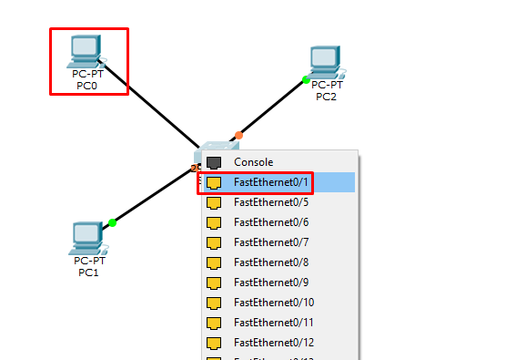

# Лабораторная работа № 5.

## Тема: Изучение технологии виртуальных локальных сетей VLAN. Часть 1

### Цели работы:

*  Изучить и практически освоить процесс настройки технологии виртуальных локальных сетей VLAN (Virtual Local Area Network) с использованием сетевого симулятора Cisco Packet Tracer.
*  Научиться настраивать порты коммутатора в режимы access.

---

## Содержание

1. [Цели работы](#цели-работы)
2. [Требования к сдаче работы](#требования-к-сдаче-работы)
3. [Краткая теория](#краткая-теория)
4. [Ход работы](#ход-работы)
5. [Задания](#задания)
6. [Контрольные вопросы](#контрольные-вопросы)

## Требования к сдаче работы

1. Индивидуальный отчёт по лабораторной работе оформляется используя
**текстовые редакторы Word(или подобные ему)
в текстовый файл формата doc или docx.** [ШАБЛОН ДЛЯ ОТЧЕТА ПО ЛР5](LAB5%2FLR5_Report.docx)
2. В индивидуальном отчёте должны быть указаны цель, задание, представлены необходимые снимки экрана и пояснения к ним.
3. Следует проанализировать полученные данные и дать ответы на контрольные вопросы.
4. Перепишите в тетрадь [краткую теорию](#краткая-теория) из этой работы.

***Критерии оценивания***

* **Оценка 5**
  * Переписать краткую информацию из материалов этой работы. 
  * Сделать [пример](#пример-разбиения-локальной-сети-на-два-сегмента-) и 
  сохранить его под именем `LAB5_Ivanov_Ivan_XXX_ex1.pkt`, где `XXX` - номер вашей группы.
  * Выполнить [задание по созданию сети](#задания-) сохранить его под именем `LAB5_Ivanov_Ivan_XXX_task.pkt`, где `XXX` - номер вашей группы.
  * Оформить индивидуальный отчет [ШАБЛОН ДЛЯ ОТЧЕТА ПО ЛР5](LAB5%2FLR5_Report.docx), ответить на все контрольные вопросы.
  * загрузить все в гугл форму:[235 группа](https://forms.gle/hPfu26GecnLqjqjQ6) или [237 группа](https://forms.gle/hPfu26GecnLqjqjQ6)

* Оценка 4
  * Переписать краткую информацию из материалов этой работы. 
  * Сделать [пример](#пример-разбиения-локальной-сети-на-два-сегмента-) и 
  сохранить его под именем `LAB5_Ivanov_Ivan_XXX_ex1.pkt`, где `XXX` - номер вашей группы.
  * Выполнить [задание по созданию сети](#задания-) сохранить его под именем `LAB5_Ivanov_Ivan_XXX_task.pkt`, где `XXX` - номер вашей группы.
  * Оформить индивидуальный отчет [ШАБЛОН ДЛЯ ОТЧЕТА ПО ЛР5](LAB5%2FLR5_Report.docx) без ответов на контрольные вопросы.
  * загрузить все в гугл форму:[235 группа](https://forms.gle/hPfu26GecnLqjqjQ6) или [237 группа](https://forms.gle/hPfu26GecnLqjqjQ6)

* Оценка 5
  * Переписать краткую информацию из материалов этой работы. 
  * Сделать [пример](#пример-разбиения-локальной-сети-на-два-сегмента-) и 
  сохранить его под именем `LAB5_Ivanov_Ivan_XXX_ex1.pkt`, где `XXX` - номер вашей группы.
  * Оформить индивидуальный отчет [ШАБЛОН ДЛЯ ОТЧЕТА ПО ЛР5](LAB5%2FLR5_Report.docx) без задания и ответов на контрольные вопросы.
  * загрузить все в гугл форму:[235 группа](https://forms.gle/hPfu26GecnLqjqjQ6) или [237 группа](https://forms.gle/hPfu26GecnLqjqjQ6)

## Краткая теория

Виртуальными локальными сетями **VLAN** (_Virtual Local Area Network_) называются локальные сети, 
созданные на единой аппаратной базе (т. е. на коммутаторах, соединенных между собой физическими каналами),
но логически изолированные друг от друга.

VLAN имеет те же свойства, что и физическая локальная сеть, но позволяет конечным членам группироваться вместе,
даже если они не находятся в одной физической сети. Такая организация может быть сделана на основе программного обеспечения
вместо физического перемещения устройств.

VLAN дает возможность значительно оптимизировать работу локальной сети за счет разгрузки отдельных ее сегментов от "лишнего" трафика
и решить некоторые вопросы безопасности в сети, разграничив доступ пользо-вателей. 
Сети VLAN имеют следующие преимущества:
* помогает структурировать сеть;
* используется для обеспечения безопасности;
* используют для объединения;
* уменьшает количество широковещательного трафика.

Широковещательный трафик используется для ряда протоколов (ARP, DHCP и т.д.). В случае большой сети широковещательный трафик может
привести к нерациональному использованию канала. При организации VLAN, пользователи, находящиеся в разных сегментах, не будут получать
широковещательные кадры, которые предназначены пользователям других VLAN.

С помощью технологии VLAN можно создавать рабочие группы, основываясь на функциональности, а не на физическом расположении сегментов.
Она позволяет администратору логически создавать, группировать и перегруппировывать сетевые сегменты без изменения физической инфраструкту-
ры и отсоединения пользователей и серверов. VLAN обеспечивает дополнительные преимущества для безопасности. 
Пользователи одной рабочей группы не могут получить доступ к данным другой группы, потому что каждая VLAN – это закрытая и логически определенная группа.

Представьте компанию, в которой отдел кадров, работающий с конфиденциальной информацией, расположен на трех этажах здания.
Инженерный департамент и отдел Маркетинга также размещаются на трех этажах (рис. 1). Каждый этаж в здании обеспечен сетью `Ethernet` средствами этажных коммутаторов: 

по одному коммутатору на этаж.


Рисунок - 1 Пример построения VLAN для компании

Используя технологию VLAN, работники Инженерного отдела и отдела Маркетинга могут быть расположены на всех трех этажах здания,
а их ПК будут входить в состав двух VLAN (VLAN1, VLAN2). Сотрудники отдела кадров, которые также размещаются на всех трех этажах,
будут использовать ПК, входящие в состав VLAN3. Сетевой трафик, создаваемый отделом кадров, будет доступен только сотрудникам этого департамента, 
а группы инженерного отдела и маркетинга не смогут получить доступ к конфиденциальным данным отдела кадров.
Очевидно, есть другие требования для обеспечения полной безопасности, и VLAN может быть частью общей стратегии сетевой безопасности.
Таким образом, в VLAN группа устройств, имеют возможность взаимодействовать между собой напрямую на канальном уровне,
хотя физически при этом они могут быть подключены к разным сетевым коммутаторам.
И наоборот, устройства, находящиеся в разных VLAN, невидимы друг для друга на канальном уровне, 
даже если они подключены к одному коммутатору, и связь между этими устройствами возможна только на сетевом и более высоких уровнях.

По умолчанию на каждом порту коммутатора имеется сеть VLAN1 или VLAN управления. 
Сеть управления не может быть удалена, однако могут быть созданы дополнительные сети VLAN и этим альтернативным VLAN могут быть дополнительно назначены порты.
У коммутатора может быть два типа портов:
* **access port** используется для подключения оконечных устройств (компьютеры, ноутбуки, IP-телефоны, видеокамеры, сервера и т.д.).
Любой кадр, который проходит через access-порт, помечается номером, принадлежащим этому VLAN.
* Второй тип портов это **trunk port**. Он необходим для соединения между собой коммутаторов.

**Trunk port** — порт, передающий трафик одного или нескольких VLAN. 
По умолчанию в транке разрешены все VLAN. Для того чтобы через соответствующий VLAN в транке передавались данные,
как минимум, необходимо чтобы VLAN был активным. Активным VLAN становится тогда, когда он создан на коммутаторе
и в нём есть хотя бы один порт в состоянии up/up.

Сети VLAN могут быть определены по:
* номеру порта (наиболее частое использование);
* MAC адресу (редко применяется);
* идентификатору пользователя User ID (очень редко применяется);
* сетевому IP-адресу (редко в связи с ростом использования DHCP).

VLAN, базирующаяся на номере порта, позволяет определить конкретный порт в VLAN. 
Это наиболее простой и часто используемый метод опре-деления VLAN. 
VLAN, построенная на портах, применяется в тех случаях, когда рабочие станции используют протокол динамической настройки TCP/IP (DHCP).

Технология VLAN, базирующаяся на MAC адресах, позволяет пользо-вателям находиться в той же VLAN, даже если они перемещаются с одного места на другое.
Этот метод требует, чтобы администратор определил MAC-адрес каждой рабочей станции и затем внес эту информацию в коммутатор. 
Данный метод может вызвать большие трудности при поиске неисправностей, если пользователь изменил MAC-адрес.

Виртуальные сети, базирующиеся на сетевых IP-адресах, позволяют пользователям находиться в той же VLAN,
при перемещении их с одного места на другое. Этот метод перемещает VLAN, связывая ее с сетевым IP-адресом рабочей станции для каждого коммутатора, 
к которому пользователь подключен.

## Ход работы
### Пример разбиения локальной сети на два сегмента 

1. Открываем Cisco Packet Tracer. Находим коммутатор 2960. Добавляем его в рабочую область.
Затем добавляем четыре персональных компьютера PC0-PC3. 
В результате получаем следующую топологию сети (рис. 1).


Рисунок 1 - Топология сети

2. Далее приступаем к соединению между устройствами. 
Так как здесь соединяются устройства разных уровней модели OSI,
то используем прямой кабель. При этом выбираем на коммутаторе необходимые порты FastEthernet. 
На рисунке 2 показано подключение PC0 к порту FastEthernet 0/1
коммутатора 2960. Аналогично подключаем остальные PC. Коммутатор PC3 подключается к порту FastEthernet 0/4.




Рисунок 2 – Подключение компьютера PC1 к коммутатору 2960


Рисунок 3 - Соединение между элементами сети

3. **Сделайте снимок экрана 1 - Топология сети**

4. Далее разобьем нашу сеть на 2 сегмента. Пусть компьютеры PC0 и PC2 принадлежат к одному сегменту, а PC1 и PC3 к другому.
Выбираем сверху фигуру Прямоугольник (Draw rectangle) и нужный цвет фигуры (рис.4), далее делим сеть
нам 2 сегмента разного цвета (рис. 5).


Рисунок 4 - Деление сети на сегменты с помощью значка Draw rectangle


Рисунок 5 - Сеть с двумя сегментами

5. **Сделайте снимок экрана 2 - деление сети на два сегмента**

6. Для того, чтобы проверить номера интерфейсов FastEthernet для коммутатора,
необходимо до создания VLAN проверить номера всех интерфейсов коммутатора,
 которые подключены к компьютерам. Для этого, необходимо подвести курсор
к зеленым кружочкам на линиях, соединяющих компьютеры с коммутаторами. 
Номера интерфейсов высветятся рядом с зелеными кружочками (рис. 6).


Рисунок 6 - Проверка номеров интерфейсов FastEthernet

7. Теперь нам нужно отделить данные одного сегмента от другого. 
Входим в настройки коммутатора и открываем консоль (CLI) (рис. 7).


Рисунок 7- Консоль коммутатора

8. Набираем команду 
```Switch>enable```
и входим в привилегированный режим. 
9. Далее вводим команду
```
Switch#configure terminal
```
10. Создайте новый VLAN, назовем его VLAN 2, дайте ему название teachers и назначьте портам коммутатора, к которым подключены компьютеры, режим передачи трафика и VLAN 2:

```
Switch(config)#vlan 2
Switch(config-vlan)#name teachers
Switch(config-vlan)#exit
```


11. Настройка портов коммутатора :

```
Switch(config)#interface FastEthernet 0/1
Switch(config-if)#switchport mode access
Switch(config-if)#switchport access vlan 2
Switch(config-if)# exit

Switch(config)#interface FastEthernet 0/2
Switch(config-if)#switchport mode access
Switch(config-if)#switchport access vlan 2
Switch(config-if)# end
```


На этом настройка портов закончена. 

12. Проверьте правильность настроек с помощью команды :

```
Switch#show vlan
```
Она выводит основную информацию о VLAN, (рисунок 8).


Рисунок 8 - Основная информация по VLAN

Здесь показана вся информация по VLAN.
Видно, что первый VLAN, который существует на всех коммутаторах CISCO по умолчанию (default) 
выставлен на всех портах кроме портов FastEthernet 0/1 и FastEthernet 0/2, которые мы определили в VLAN 2.

13. Для вывода краткой информации по созданным VLAN введите команду (рисунок 9):
```
Switch# show vlan brief
```


Рисунок 9 - Краткая информация по VLAN 2

14. Проделаем аналогичные действия для второго сегмента. Назовем его **students**. Пусть это будет VLAN 3.
15. Далее набираем команды:

```
Switch#configure terminal
Switch(config)#vlan 3
Switch(config-vlan)#name students
Switch(config-vlan)#exit
```


16. Настройка интерфейсов:
```
Switch(config)#interface FastEthernet 0/3
Switch(config-if)#switchport mode access
Switch(config-if)#switchport access vlan 3
Switch(config-if)#exit
Switch(config)#interface FastEthernet 0/4
Switch(config-if)#switchport mode access
Switch(config-if)#switchport access vlan 3
Switch(config-if)#end
```


17. Для вывода краткой информации по созданным VLAN введите команду (рисунок 10):

```
Switch# show vlan brief
```


Рисунок 10 - Краткая информация по VLAN 3

18. Перейдем к настройке компьютеров и зададим им IP-адреса (Табл. 1).
В IP- адресах компьютеров третья цифра IP-адреса соответствует номеру VLAN. 
Для этого выйдем в настройки PC0 и во вкладке Desktop выбираем IP-Сonfiguration (рис. 11).

 **Таблица №1 Сетевые адреса компьютеров**

| Сетевой элемент | Интерфейс      | IP-адрес    | Маска подсети | VLAN |
|-----------------|----------------|-------------|---------------|------| 
| PC0             | FastEthernet0 | 192.168.2.1 | 255.255.255.0 | 2    |
| PC1             | FastEthernet0 | 192.168.3.1 | 255.255.255.0 | 3    |
| PC2             | FastEthernet0 | 192.168.2.2 | 255.255.255.0 | 2    |
| PC3             | FastEthernet0 | 192.168.3.2 | 255.255.255.0 | 3    |


Рисунок 11- Настройка компьютера PC0

19. В соответствии с таблицей 1 настраиваем и остальные компьютеры сети.
Проверим связность компьютеров в первом сегменте (рис. 12).


Рисунок 12 - Проверка связности компьютеров в одном сегменте

20.  **Сделайте снимок экрана 3 - Проверка связности компьютеров в одном сегменте**

Попробуем проверить связь компьютеров в разных сегментах. Пакеты между ними не пересылаются (рис. 13).
Т.е. связность между компьютерами разных сегментов отсутствует.


Рисунок 13 - Проверка связности компьютеров в разных сегментах

21.  **Сделайте снимок экрана 4 - Проверка связности компьютеров в разных сегментах**

Произведем аналогичную проверку у компьютеров из второго сегмента. 
Таким образом, мы убедились, что между сегментами teachers и students
связность отсутствует. Т.е. мы сделали 2 независимые VLAN.
Рекомендуется сохранить данную конфигурацию (дав ему имя `LAB5_Ivanov_Ivan_XXX_ex1.pkt`, где `XXX` - номер вашей группы), так как эта работа станет основой для 
выполнения лабораторной работы «Изучение технологии виртуальных локальных сетей VLAN». Часть 2.

## Задания 

1. Создайте новый файл.
2. Соберите сетевую топопологию согласно рисунку ниже


Топология содержит 8 ПК и один коммутатор (Cisco 2960). Для этого 
выберите из необходимых вкладок сетевое оборудование. **cделайте снимок экрана** 
и добавьте его в ваш индивидуальный отчет.  

3. Далее разбейте вашу сеть на 4 сегмента согласно [таблице 2](#таблица-2-сетевые-адреса-устройств).
Выделите каждый сегмент свои цветом. Назначьте всем устройствам сетевые адреса. 
Вместо `X` - укажите ваш порядковый номер в списке группы(например, если ваш порядковый 
номер в группе - `17`, то IP-адреса будут такими
`192.168.2.1X -> 192.168.2.117` и `vlan 2X -> vlan 217` соответственно)

### **Таблица №2 Сетевые адреса устройств**

| Сетевой элемент | Интерфейс      | IP-адрес     | Маска подсети | VLAN        | VLAN name   |
|-----------------|----------------|--------------|---------------|-------------|-------------|
| PC0             | FastEthernet0 | 192.168.2.1**X** | 255.255.255.0 | vlan 2**X** | managers    |
| PC1             | FastEthernet0 | 192.168.2.2**X** | 255.255.255.0 | vlan 2**X** | managers    |
| PC2             | FastEthernet0 | 192.168.3.1**X** | 255.255.255.0 | vlan 4**X** | admins      |
| PC3             | FastEthernet0 | 192.168.3.2**X** | 255.255.255.0 | vlan 4**X** | admins      |
| PC4             | FastEthernet0 | 192.168.4.1**X** | 255.255.255.0 | vlan 6**X** | services    |
| PC5             | FastEthernet0 | 192.168.4.2**X** | 255.255.255.0 | vlan 6**X** | services    |
| PC6             | FastEthernet0 | 192.168.5.1**X** | 255.255.255.0 | vlan 8**X** | programmers |
| PC7             | FastEthernet0 | 192.168.5.2**X** | 255.255.255.0 | vlan 8**X** | programmers |

4. Проверьте сетевую связность между компьютерами PC0 и PC1, **сделайте снимок экрана** и добавьте его в ваш индивидуальный отчет.
5. Проверьте сетевую связность между компьютерами PC2 и PC3, **сделайте снимок экрана** и добавьте его в ваш индивидуальный отчет.
6. Проверьте сетевую связность между компьютерами PC4 и PC5, **сделайте снимок экрана** и добавьте его в ваш индивидуальный отчет.
7. Проверьте сетевую связность между компьютерами PC6 и PC7, **сделайте снимок экрана** и добавьте его в ваш индивидуальный отчет.
8. Проверьте сетевую связность между компьютерами PC0 и PC2, **сделайте снимок экрана** и добавьте его в ваш индивидуальный отчет.
9. Проверьте сетевую связность между компьютерами PC3 и PC5, **сделайте снимок экрана** и добавьте его в ваш индивидуальный отчет.
10. Выведите краткую информации по созданным VLAN, используя команду `Switch# show vlan brief`(как на рисунке 10.) **сделайте снимок экрана** и добавьте его в ваш индивидуальный отчет.
11. Сохраните файл конфигурации сети дав ему имя `Ivanov_Ivan_XXX_task.pkt`, где `XXX` - номер вашей группы.

### Контрольные вопросы
1. Опишите последовательность создания VLAN?
2. Как проверить связность компьютеров в разных VLAN?
3. Для чего используется команда Switch# show vlan brief?
4. Как проверить правильность настройки компьютеров?
5. Для чего применяется команда Switch(config-if)#switchport mode access?
6. Что обозначает аббревиатура TTL на рисунке 12?
7. Почему для соединения ПК и коммутатора используется прямой кабель?
8. Какого класса IP- адреса используются в данной работе?
9. Продемонстрируйте продвижение пакета внутри одного VLAN в данной работе.
10. Что выполняет команда switchport access vlan 3?