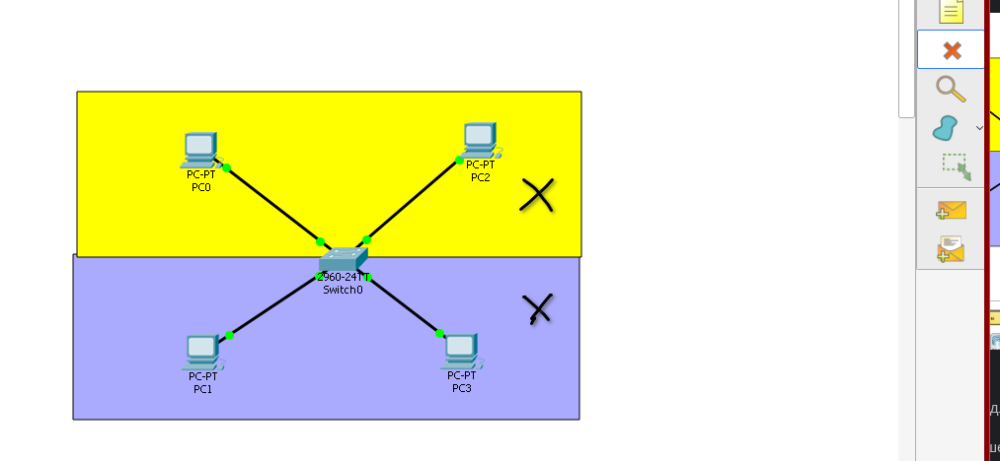
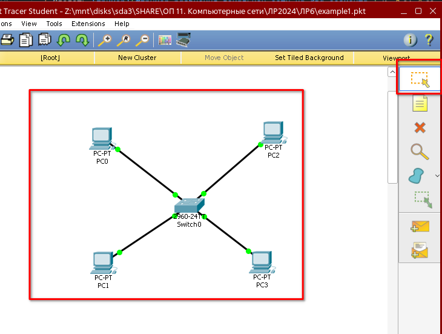
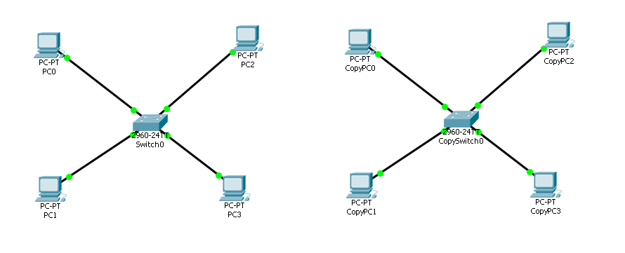
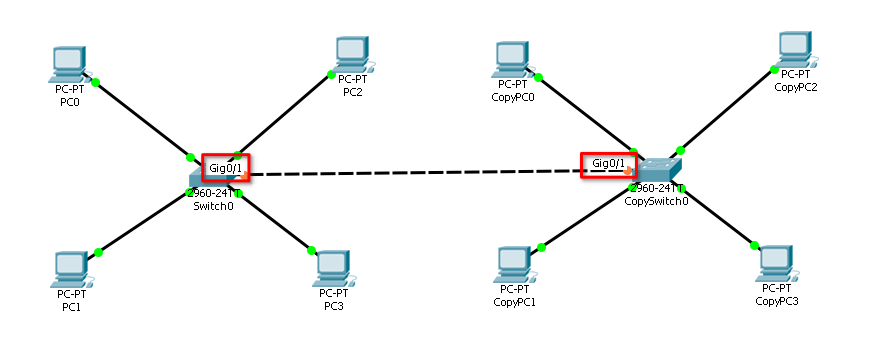
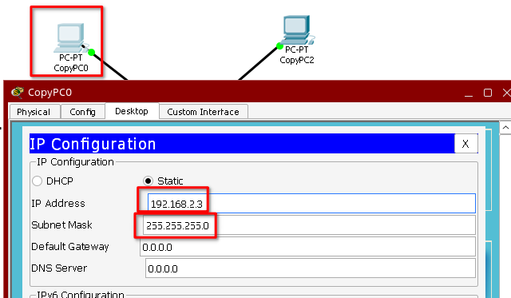
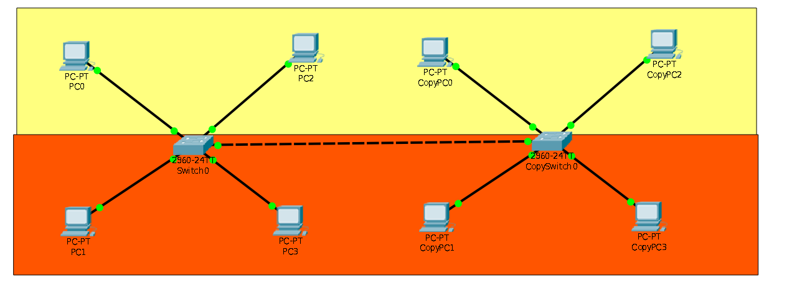
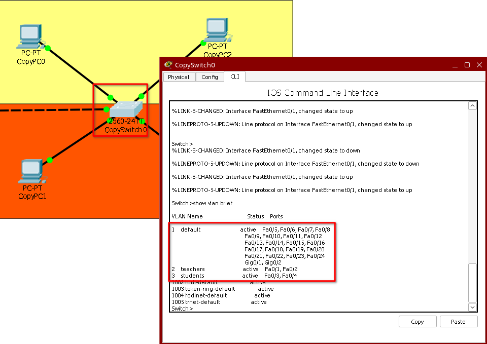
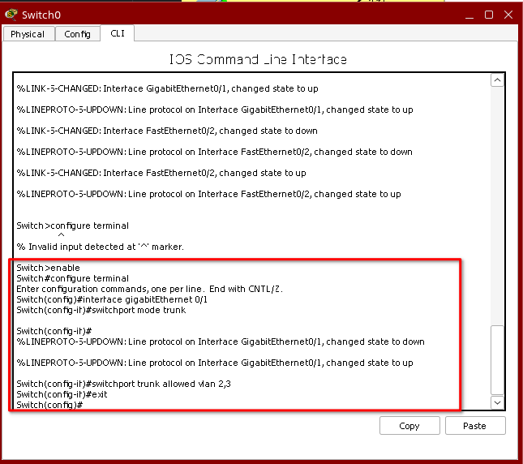
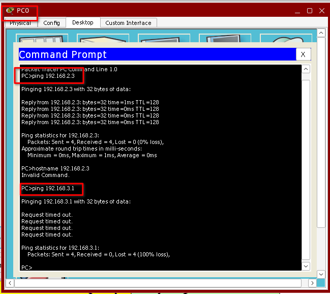
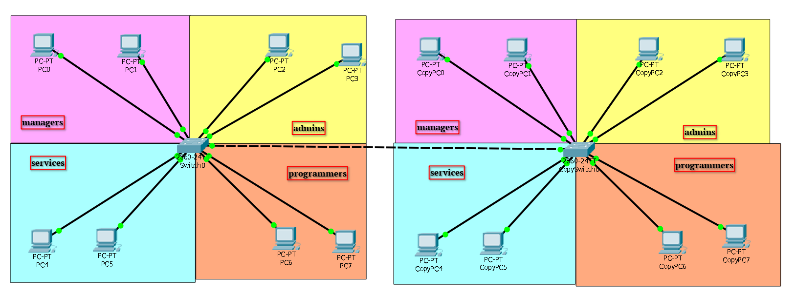

# Лабораторная работа № 6.

## Тема: Изучение технологии виртуальных локальных сетей VLAN. Часть 2

### Цели работы:

* Изучить и практически освоить процесс настройки технологии виртуальных локальных сетей VLAN (Virtual Local Area Network) с использованием сетевого симулятора Cisco Packet Tracer. 
* Научиться настраивать порты коммутатора в режиме trunk.

---

## Содержание

1. [Цели работы](#цели-работы)
2. [Требования к сдаче работы](#требования-к-сдаче-работы)
3. [Краткая теория](#краткая-теория)
4. [Ход работы](#ход-работы)
5. [Задания](#задания)
6. [Контрольные вопросы](#контрольные-вопросы)

## Требования к сдаче работы

1. Индивидуальный отчёт по лабораторной работе оформляется используя
**текстовые редакторы Word(или подобные ему)
в текстовый файл формата doc или docx.** [ШАБЛОН ДЛЯ ОТЧЕТА ПО ЛР6](LAB6%2FLR6_Report.docx)
2. В индивидуальном отчёте должны быть указаны цель, задание, представлены необходимые снимки экрана и пояснения к ним.
3. Следует проанализировать полученные данные и дать ответы на контрольные вопросы.

***Критерии оценивания***

* **Оценка 5**
  * Сделать [пример](#пример-разбиения-локальной-сети-на-два-сегмента-) и 
  сохранить его под именем `LAB6_Ivanov_Ivan_XXX_ex1.pkt`, где `XXX` - номер вашей группы.
  * Выполнить [задание по созданию сети](#задания-) сохранить его под именем `LAB6_Ivanov_Ivan_XXX_task.pkt`, где `XXX` - номер вашей группы.
  * Оформить индивидуальный отчет [ШАБЛОН ДЛЯ ОТЧЕТА ПО ЛР6](LAB6%2FLR6_Report.docx), ответить на все контрольные вопросы.
  * загрузить все в гугл форму:[245 группа](https://forms.gle/fxeo7HMLLEpJoHG39) или [247 группа](https://forms.gle/YdiHBN8pkGVAzr839)

* Оценка 4
  * Сделать [пример](#пример-разбиения-локальной-сети-на-два-сегмента-) и 
  сохранить его под именем `LAB6_Ivanov_Ivan_XXX_ex1.pkt`, где `XXX` - номер вашей группы.
  * Выполнить [задание по созданию сети](#задания-) сохранить его под именем `LAB6_Ivanov_Ivan_XXX_task.pkt`, где `XXX` - номер вашей группы.
  * Оформить индивидуальный отчет [ШАБЛОН ДЛЯ ОТЧЕТА ПО ЛР6](LAB6%2FLR6_Report.docx) без ответов на контрольные вопросы.
  * загрузить все в гугл форму:[245 группа](https://forms.gle/fxeo7HMLLEpJoHG39) или [247 группа](https://forms.gle/YdiHBN8pkGVAzr839)

* Оценка 3
  * Сделать [пример](#пример-разбиения-локальной-сети-на-два-сегмента-) и 
  сохранить его под именем `LAB6_Ivanov_Ivan_XXX_ex1.pkt`, где `XXX` - номер вашей группы.
  * Оформить индивидуальный отчет [ШАБЛОН ДЛЯ ОТЧЕТА ПО ЛР6](LAB6%2FLR6_Report.docx) без задания и ответов на контрольные вопросы.
  * загрузить все в гугл форму:[245 группа](https://forms.gle/fxeo7HMLLEpJoHG39) или [247 группа](https://forms.gle/YdiHBN8pkGVAzr839)

## Ход работы
### Пример разбиения локальной сети на два сегмента 

1. В данной работе мы будем использовать схему сети из предыдущей лабораторной работы(LAB6_Ivanov_Ivan_XXX_ex1.pkt). Необходимо удалить сегменты. Сделаем это с помощью
значка delete в левом верхнем углу (рис. 1).



Рисунок 1 – Значок для удаления элементов сети

С помощью появившегося крестика удаляем 2 сегмента. Для этого необходимо щелкнуть крестиком на сегменте. 


2. Далее щелкаем на значок Select и выделяем всю область сети (рис. 2). 



Рисунок 2 - Значок для выделения элементов сети


4. После этого нажимаем Ctrl+C и потом Ctrl+V, для того, чтобы сделать точно такую же копию нашей сети (рис. 3).



Рисунок 3 - Вторая сеть, полученная после операции копирования


5. Теперь необходимо соединить два коммутатора 2960. 
Так как они относятся к одному уровню модели OSI, то соединять их нужно перекрестным
кабелем. Пусть они будут соединены портами GigabitEthernet0/1. Для соединения коммутаторов лучше брать самые высокопроизводительные порты (рис. 4).



Рисунок 4 - Соединение двух коммутаторов с помощью высокопроизводительных портов GE

6. Поскольку мы сделали точную копию наших компьютеров PC0-PC3, то необходимо 
изменить IP-адресацию на вновь созданных компьютерах в соответствии с таблицей 1. 

 **Таблица №1 IP-адресация для компьютеров сети**

| Сетевой элемент   | Интерфейс      | IP-адрес    | Маска подсети | VLAN |
|-------------------|----------------|-------------|---------------|------| 
| PC0               | FastEthernet0 | 192.168.2.1 | 255.255.255.0 | 2    |
| PC1               | FastEthernet0 | 192.168.3.1 | 255.255.255.0 | 3    |
| PC2               | FastEthernet0 | 192.168.2.2 | 255.255.255.0 | 2    |
| PC3               | FastEthernet0 | 192.168.3.2 | 255.255.255.0 | 3    |
| CopyPC0           | FastEthernet0 | 192.168.2.3 | 255.255.255.0 | 2    |
| CopyPC1           | FastEthernet0 | 192.168.3.3 | 255.255.255.0 | 3    |
| CopyPC2           | FastEthernet0 | 192.168.2.4 | 255.255.255.0 | 2    |
| CopyPC3           | FastEthernet0 | 192.168.3.4 | 255.255.255.0 | 3    |

Пример изменения IP-адреса для компьютера CopyPC0 показан на рисунке 5.



Рисунок 5 - Изменение IP- адреса для компьютера PC0(1)

7. Далее делим сеть нам 2 сегмента разного цвета(аналогично как было в ЛР5) (рис. 6).



Рисунок 6 - Схема компьютерной сети, состоящая их двух фрагментов

8. **Сделайте снимок экрана 1 - деление сети на два сегмента**

9. Для того, чтобы проверить настройки второго коммутатора, зайдем в CLI и введем команду `Switch>show vlan brief`.


Рисунок 7 - Проверка портов второго коммутатора

Таким образом, access – порты у нас уже настроены.

10. **Сделайте снимок экрана 2 - Проверка портов второго коммутатора**

11. Для организации взаимодействия компьютеров, подключенных к разным коммутаторам, 
но находящихся в одном VLAN необходимо настроить **trunk-порты**, которые позволяет разбить физическое соединение на несколько 
сегментов. Далее переходим в режим конфигурирования для Switch0, для этого необходимо открыть вкладку CLI и ввести следующие команды:

```
Switch>enable
Switch#configure terminal
Switch(config)#interface gigabitEthernet 0/1
Switch(config-if)#switchport mode trunk
Switch(config-if)#switchport trunk allowed vlan 2,3 
Switch(config-if)#exit
```
**switchport trunk allowed vlan 2,3** - эта команда разрешает проходить через этот порт трафику VLAN 2 и 3



12. **Сделайте снимок экрана 3 - Настройка trunk porta на Switch0**

13. Такие же настройки сделайте на коммутаторе CopySwitch0.

14. **Сделайте снимок экрана 4 - Настройка trunk porta на CopySwitch0**

15. Далее необходимо проверить связность между компьютерами. На рисунке 8 показана проверка связности 
между компьютером PC0 и CopyPC0, а также между PC0 и PC1. 
Проверьте самостоятельно связность между другими компьютерами и объясните результаты.



Рисунок 8 - Проверка связности между PC0(192.168.2.1/24) и CopyPC0(192.168.2.3/24) и между PC0(192.168.2.1/24) и PC1(192.168.3.1/24)

16. **Сделайте снимок экрана 5 - Проверка связности между PC0(192.168.2.1/24) и CopyPC0(192.168.2.3/24) и между PC0(192.168.2.1/24) и PC1(192.168.3.1/24)**

Сохраните данную конфигурацию (дав ему имя `LAB6_Ivanov_Ivan_XXX_ex1.pkt`, где `XXX` - номер вашей группы).

## Задания 

1. Откройте файл конфигурации сети `LAB5_Ivanov_Ivan_XXX_task.pkt`, который вы создавали для задания в ЛР5.
2. Соберите сетевую топопологию согласно рисунку ниже



Топология содержит 16 ПК и два коммутатора (Cisco 2960). Для этого 
выберите из необходимых вкладок сетевое оборудование. 
**cделайте снимок экрана** 
и добавьте его в ваш индивидуальный отчет.  

3. Далее разбейте вашу сеть на 4 сегмента согласно [таблице 2](#таблица-2-сетевые-адреса-устройств).
Выделите каждый сегмент свои цветом. Назначьте всем устройствам сетевые адреса. 
Вместо `X` - укажите ваш порядковый номер в списке группы(например, если ваш порядковый 
номер в группе - `17`, то IP-адреса будут такими
`192.168.2.1X -> 192.168.2.117` и `vlan 2X -> vlan 217` соответственно)

### **Таблица №2 Сетевые адреса устройств**

| Сетевой элемент | Интерфейс      | IP-адрес             | Маска подсети  | VLAN         | VLAN name   |
|------------|----------------|----------------------|----------------|--------------|-------------|
| PC0        | FastEthernet0 | 192.168.2.1**X**     | 255.255.255.0  | vlan 2**X**  | managers    |
| PC1        | FastEthernet0 | 192.168.2.2**X**     | 255.255.255.0  | vlan 2**X**  | managers    |
| PC2        | FastEthernet0 | 192.168.3.1**X**     | 255.255.255.0  | vlan 4**X**  | admins      |
| PC3        | FastEthernet0 | 192.168.3.2**X**     | 255.255.255.0  | vlan 4**X**  | admins      |
| PC4        | FastEthernet0 | 192.168.4.1**X**     | 255.255.255.0  | vlan 6**X**  | services    |
| PC5        | FastEthernet0 | 192.168.4.2**X**     | 255.255.255.0  | vlan 6**X**  | services    |
| PC6        | FastEthernet0 | 192.168.5.1**X**     | 255.255.255.0  | vlan 8**X**  | programmers |
| PC7        | FastEthernet0 | 192.168.5.2**X**     | 255.255.255.0  | vlan 8**X**  | programmers |
| CopyPC0    | FastEthernet0 | 192.168.2.1**X**+1   | 255.255.255.0  | vlan 2**X**  | managers    |
| CopyPC1    | FastEthernet0 | 192.168.2.2**X**+1   | 255.255.255.0  | vlan 2**X**  | managers    |
| CopyPC2    | FastEthernet0 | 192.168.3.1**X**+1   | 255.255.255.0  | vlan 4**X**  | admins      |
| CopyPC3    | FastEthernet0 | 192.168.3.2**X**+1   | 255.255.255.0  | vlan 4**X**  | admins      |
| CopyPC4    | FastEthernet0 | 192.168.4.1**X**+1   | 255.255.255.0  | vlan 6**X**  | services    |
| CopyPC5    | FastEthernet0 | 192.168.4.2**X**+1   | 255.255.255.0  | vlan 6**X**  | services    |
| CopyPC6    | FastEthernet0 | 192.168.5.1**X**+1   | 255.255.255.0  | vlan 8**X**  | programmers |
| CopyPC7    | FastEthernet0 | 192.168.5.2**X**+1   | 255.255.255.0  | vlan 8**X**  | programmers |

4. Настройте на коммутаторах  trunk port для передачи траффика VLAN 2**X**, 4**X**, 6**X** и 8**X**.
5. Проверьте сетевую связность между компьютерами PC0 и CopyPC0, **сделайте снимок экрана** и добавьте его в ваш индивидуальный отчет.
6. Проверьте сетевую связность между компьютерами PC2 и CopyPC2, **сделайте снимок экрана** и добавьте его в ваш индивидуальный отчет.
7. Проверьте сетевую связность между компьютерами PC4 и CopyPC4, **сделайте снимок экрана** и добавьте его в ваш индивидуальный отчет.
8. Проверьте сетевую связность между компьютерами PC6 и CopyPC6, **сделайте снимок экрана** и добавьте его в ваш индивидуальный отчет.
9. Проверьте сетевую связность между компьютерами PC3 и CopyPC4, **сделайте снимок экрана** и добавьте его в ваш индивидуальный отчет.
10. Проверьте сетевую связность между компьютерами PC0 и CopyPC7, **сделайте снимок экрана** и добавьте его в ваш индивидуальный отчет.
11. Выведите краткую информации по созданным VLAN для Switch0, используя команду `Switch# show vlan brief`(как на рисунке 7.) **сделайте снимок экрана** и добавьте его в ваш индивидуальный отчет.
12. Выведите краткую информации по созданным VLAN для CopySwitch0, используя команду `Switch# show vlan brief`(как на рисунке 7.) **сделайте снимок экрана** и добавьте его в ваш индивидуальный отчет.
13. Сохраните файл конфигурации сети дав ему имя `LAB6_Ivanov_Ivan_XXX_task.pkt`, где `XXX` - номер вашей группы.

### Контрольные вопросы
1. Для чего применяется команда Switch(config-if)#switchport trunk allowed
vlan 2,3 в данной лабораторной работе?
2. Как проверить связность компьютеров в одной VLAN?
3. Опишите последовательность настройки access портов?
4. Как настроить trunk- порты между коммутаторами?
5. Могут ли абоненты VLAN 3 получать широковещательный трафик, предназначенный для абонентов VLAN 2?
6. Опишите функцию trunk-порта?
7. Какого класса IP-адреса используются в данной работе?
8. Как можно определить номера интерфейсов на коммутаторе?
9. В какой подсети находится компьютер с адресом 192.168.3.2?
10. Что означает команда Switch(config)#?
