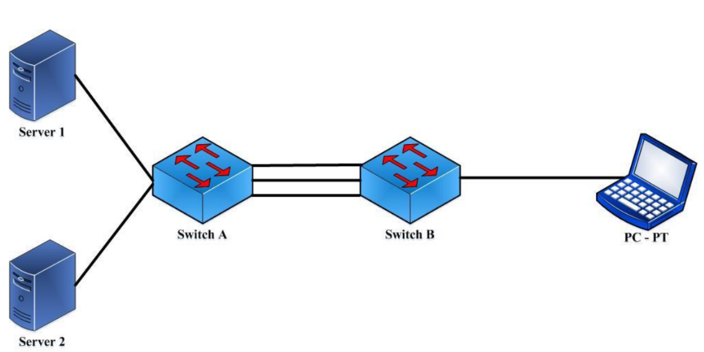

# Лабораторная работа № 7.

## Тема: Статическое агрегирование каналов

### Цели работы:

* Изучить принципы статического агрегирования каналов.

---

## Содержание

1. [Цели работы](#цели-работы)
2. [Требования к сдаче работы](#требования-к-сдаче-работы)
3. [Краткая теория](#краткая-теория)
4. [Ход работы](#ход-работы)
5. [Задания](#задания)
6. [Контрольные вопросы](#контрольные-вопросы)

## Требования к сдаче работы

1. Индивидуальный отчёт по лабораторной работе оформляется используя
**текстовые редакторы Word(или подобные ему)
в текстовый файл формата doc или docx.** [ШАБЛОН ДЛЯ ОТЧЕТА ПО ЛР5](LAB5%2FLR5_Report.docx)
2. В индивидуальном отчёте должны быть указаны цель, задание, представлены необходимые снимки экрана и пояснения к ним.
3. Следует проанализировать полученные данные и дать ответы на контрольные вопросы.
4. Перепишите в тетрадь [краткую теорию](#краткая-теория) из этой работы.

***Критерии оценивания***

* **Оценка 5**
  * Переписать краткую информацию из материалов этой работы. 
  * Сделать [пример](#пример-разбиения-локальной-сети-на-два-сегмента-) и 
  сохранить его под именем `LAB7_Ivanov_Ivan_XXX_ex1.pkt`, где `XXX` - номер вашей группы.
  * Выполнить [задание по созданию сети](#задания-) с[LR7_Report.docx](LAB7/LR7_Report.docx)охранить его под именем `LAB5_Ivanov_Ivan_XXX_task.pkt`, где `XXX` - номер вашей группы.
  * Оформить индивидуальный отчет [ШАБЛОН ДЛЯ ОТЧЕТА ПО ЛР7](LAB7/LR7_Report.docx), ответить на все контрольные вопросы.
  * загрузить все в гугл форму:[235 группа](https://forms.gle/7kDrQZQDtmqeUd8f7) или [237 группа](https://forms.gle/p9TGus6QCYzoMcsS8)

* Оценка 4
  * Переписать краткую информацию из материалов этой работы. 
  * Сделать [пример](#пример-разбиения-локальной-сети-на-два-сегмента-) и 
  сохранить его под именем `LAB7_Ivanov_Ivan_XXX_ex1.pkt`, где `XXX` - номер вашей группы.
  * Выполнить [задание по созданию сети](#задания-) сохранить его под именем `LAB5_Ivanov_Ivan_XXX_task.pkt`, где `XXX` - номер вашей группы.
  * Оформить индивидуальный отчет [ШАБЛОН ДЛЯ ОТЧЕТА ПО ЛР7](LAB7/LR7_Report.docx) без ответов на контрольные вопросы.
  * загрузить все в гугл форму:[235 группа](https://forms.gle/7kDrQZQDtmqeUd8f7) или [237 группа](https://forms.gle/p9TGus6QCYzoMcsS8)

* Оценка 3
  * Переписать краткую информацию из материалов этой работы. 
  * Сделать [пример](#пример-разбиения-локальной-сети-на-два-сегмента-) и 
  сохранить его под именем `LAB7_Ivanov_Ivan_XXX_ex1.pkt`, где `XXX` - номер вашей группы.
  * Оформить индивидуальный отчет [ШАБЛОН ДЛЯ ОТЧЕТА ПО ЛР7](LAB7/LR7_Report.docx) без задания и ответов на контрольные вопросы.
  * загрузить все в гугл форму:[235 группа](https://forms.gle/7kDrQZQDtmqeUd8f7) или [237 группа](https://forms.gle/p9TGus6QCYzoMcsS8)

## Краткая теория

Часто для повышения пропускной способности и коммутатора удобно объединить несколько каналов. Это позволит также обеспечить
резервирование в случае выхода из строя одного из каналов. Такая группа каналов рассматривается как единый интерфейс, а нагрузка
равномерно распределяется между ними. Технология, которая позволяет это сделать называется Link 
Aggregation (объединение звеньев) (рис. 1). При этом для равномерного 
распределения трафика требуется, чтобы физические характеристики звеньев были
одинаковы. На рисунке 1 три физических соединения между коммутаторами
объединяются в одно логическое. Все соединения агрегированного канала
являются активными и передают информацию.

Важным моментом при реализации объединения портов в агрегированный канал является распределение трафика по ним. Если пакеты одного 
сеанса будут передаваться по разным портам агрегированного канала, 
то может возникнуть проблема на более высоком уровне модели OSI. 
Например, если два или более смежных кадров одного сеанса станут передаваться через 
разные порты агрегированного канала, то из-за неодинаковой длины очередей в
их буферах может возникнуть ситуация, когда из-за неравномерной задержки
передачи кадра более поздний кадр обгонит предыдущий.

Рисунок 1 - Агрегирование каналов в коммутаторах

Поэтому в большинстве реализаций механизмов агрегирования используются 
методы статического, а не динамического распределения кадров по портам, 
т.е. закрепление за определенным портом агрегированного канала
потока кадров определенного сеанса между двумя узлами. В этом случае все
кадры будут проходить через одну и ту же очередь и их последовательность
не изменится.

Объединение каналов следует рассматривать как вариант настройки
сети, используемый преимущественно для соединений «коммутатор – 
коммутатор» или «коммутатор – сервер», требующих более высокой скорости
передачи, чем может обеспечить одиночная линия связи. Также эту функцию
можно применять для повышения надежности важных каналов связи. В 
случае повреждения линии связи объединенный канал быстро перенастраивает-
ся (не более чем за 1 сек.), а риск дублирования и изменения порядка кадров
незначителен.

Обычно коммутаторы поддерживают два типа агрегирования каналов
связи:
* статическое;
* динамическое.

При статическом агрегировании каналов (установлено по умолчанию),
все настройки на коммутаторах выполняются вручную, и они не допускают
динамических изменений в агрегированной группе. Его преимуществом
является отсутствие дополнительных задержек при поднятии агрегированного
канала и изменении его настроек. Недостаток – отсутствие согласования
настроек с удаленной стороной.

Для организации динамического агрегирования каналов между комму-
таторами и другими сетевыми устройствами используется протокол управления
агрегированным каналом – Link Aggregation Control Protocol (LACP).
Протокол LACP определяет метод управления объединением нескольких 
физических портов в одну логическую группу и предоставляет сетевым 
устройствам возможность автосогласования каналов (их добавления или удаления)
путем отправки управляющих кадров протокола LACP непосредственно 
подключенным устройствам с поддержкой LACP. 
Пакеты LACP отправляются устройством через все порты, на которых активизирован протокол. 
Порты, на которых активизирован протокол LACP, могут быть настроены для работы в
одном из двух режимов: **активном** (_active_) или **пассивном** (_passive_). 
Это стандартный протокол, он поддерживается такими коммутаторами, как Cisco,
D-Link, HP и др. Т.е. данный протокол можно настроить не только между
коммутаторами Cisco, но и Cisco - D-Link, Cisco – HP и т.д.

При работе в активном режиме порты выполняют обработку и рассылку
управляющих кадров протокола LACP. При работе в пассивном режиме
порты выполняют только обработку управляющих кадров LACP. Для того
чтобы динамический канал обладал функцией автосогласования, 
рекомендуется порты, которые входят в агрегированную группу, с одной стороны 
канала настраивать как активные, а с другой канала – как пассивные.

Следует отметить, что у портов, объединяемых в агрегированный 
канал, нижеперечисленные характеристики должны обладать одинаковыми
настройками:
* тип среды передачи;
* скорость;
* режим работы;
* метод управления потоком (Flow Control) .

Преимущества протокола LACP – согласование настроек с удаленной
стороной, что позволяет избежать ошибок в сети. Недостатки - 
дополнительная задержка при поднятии агрегированного канала или изменении его
настроек.

В следующей лабораторной работе рассмотрим пример статического
агрегирования коммутаторов.

