# Лабораторная работа № 7.

## Тема: Статическое агрегирование каналов

### Цели работы:

* Изучить принципы статического агрегирования каналов.

---

## Содержание

1. [Цели работы](#цели-работы)
2. [Требования к сдаче работы](#требования-к-сдаче-работы)
3. [Краткая теория](#краткая-теория)
4. [Ход работы](#ход-работы)
5. [Задания](#задания)
6. [Контрольные вопросы](#контрольные-вопросы)

## Требования к сдаче работы

1. Индивидуальный отчёт по лабораторной работе оформляется используя
   **текстовые редакторы Word(или подобные ему)
   в текстовый файл формата doc или docx.** [ШАБЛОН ДЛЯ ОТЧЕТА ПО ЛР7](LAB7/LR7_Report.docx)
2. В индивидуальном отчёте должны быть указаны цель, задание, представлены необходимые снимки экрана и пояснения к ним.
3. Следует проанализировать полученные данные и дать ответы на контрольные вопросы.
4. Перепишите в тетрадь [краткую теорию](#краткая-теория) из этой работы.

***Критерии оценивания***

* **Оценка 5**
    * Переписать [краткую информацию](#краткая-теория) из материалов этой работы.
    * Сделать [пример](#пример-статического-агрегирования-каналов) и
      сохранить его под именем `LAB7_Ivanov_Ivan_XXX_ex1.pkt`, где `XXX` - номер вашей группы.
    * Выполнить [задание по созданию сети](#задания-) сохранить его под именем
      `LAB7_Ivanov_Ivan_XXX_task.pkt`, где `XXX` - номер вашей группы.
    * Оформить индивидуальный отчет [ШАБЛОН ДЛЯ ОТЧЕТА ПО ЛР7](LAB7/LR7_Report.docx), ответить на все контрольные
      вопросы.
    * загрузить все в гугл форму:[235 группа](https://forms.gle/7KQzusvW1r5g45TL8)
      или [237 группа](https://forms.gle/nRQ8ZM9VpM5mJxxA9)

* Оценка 4
    * Переписать [краткую информацию](#краткая-теория) из материалов этой работы.
    * Сделать [пример](#пример-статического-агрегирования-каналов) и
      сохранить его под именем `LAB7_Ivanov_Ivan_XXX_ex1.pkt`, где `XXX` - номер вашей группы.
    * Выполнить [задание по созданию сети](#задания-) сохранить его под именем `LAB7_Ivanov_Ivan_XXX_task.pkt`, где
      `XXX` - номер вашей группы.
    * Оформить индивидуальный отчет [ШАБЛОН ДЛЯ ОТЧЕТА ПО ЛР7](LAB7/LR7_Report.docx) без ответов на контрольные вопросы.
    * загрузить все в гугл форму:[235 группа](https://forms.gle/7KQzusvW1r5g45TL8)
      или [237 группа](https://forms.gle/nRQ8ZM9VpM5mJxxA9)

* Оценка 3
    * Переписать [краткую информацию](#краткая-теория) из материалов этой работы.
    * Сделать [пример](#пример-статического-агрегирования-каналов) и
      сохранить его под именем `LAB7_Ivanov_Ivan_XXX_ex1.pkt`, где `XXX` - номер вашей группы.
    * Оформить индивидуальный отчет [ШАБЛОН ДЛЯ ОТЧЕТА ПО ЛР7](LAB7/LR7_Report.docx) без задания и ответов на
      контрольные вопросы.
    * загрузить все в гугл форму:[235 группа](https://forms.gle/7KQzusvW1r5g45TL8)
      или [237 группа](https://forms.gle/nRQ8ZM9VpM5mJxxA9)

## Краткая теория

Часто для повышения пропускной способности и коммутатора удобно объединить несколько каналов. Это позволит также
обеспечить
резервирование в случае выхода из строя одного из каналов. Такая группа каналов рассматривается как единый интерфейс, а
нагрузка
равномерно распределяется между ними. Технология, которая позволяет это сделать называется Link
Aggregation (объединение звеньев) (рис. 1). При этом для равномерного
распределения трафика требуется, чтобы физические характеристики звеньев были
одинаковы. На рисунке 1 три физических соединения между коммутаторами
объединяются в одно логическое. Все соединения агрегированного канала
являются активными и передают информацию.

Важным моментом при реализации объединения портов в агрегированный канал является распределение трафика по ним. Если
пакеты одного
сеанса будут передаваться по разным портам агрегированного канала,
то может возникнуть проблема на более высоком уровне модели OSI.
Например, если два или более смежных кадров одного сеанса станут передаваться через
разные порты агрегированного канала, то из-за неодинаковой длины очередей в
их буферах может возникнуть ситуация, когда из-за неравномерной задержки
передачи кадра более поздний кадр обгонит предыдущий.

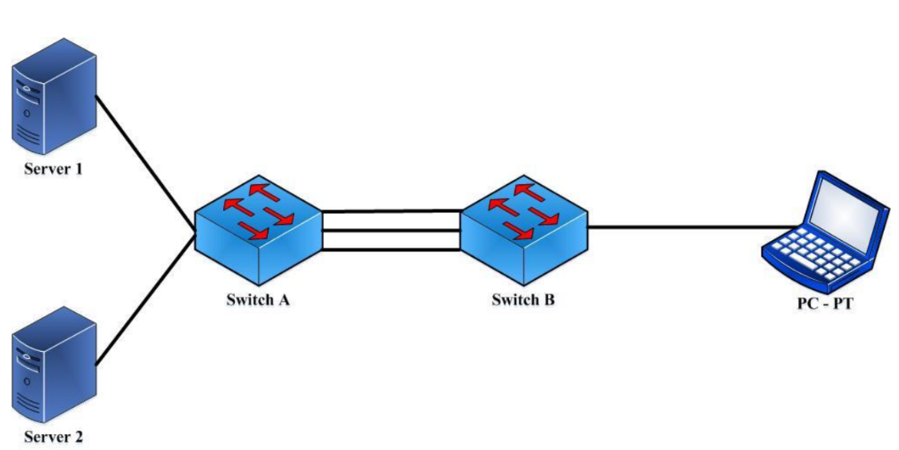

Рисунок 1 - Агрегирование каналов в коммутаторах

Поэтому в большинстве реализаций механизмов агрегирования используются
методы статического, а не динамического распределения кадров по портам,
т.е. закрепление за определенным портом агрегированного канала
потока кадров определенного сеанса между двумя узлами. В этом случае все
кадры будут проходить через одну и ту же очередь и их последовательность
не изменится.

Объединение каналов следует рассматривать как вариант настройки
сети, используемый преимущественно для соединений «коммутатор –
коммутатор» или «коммутатор – сервер», требующих более высокой скорости
передачи, чем может обеспечить одиночная линия связи. Также эту функцию
можно применять для повышения надежности важных каналов связи. В
случае повреждения линии связи объединенный канал быстро перенастраивает-
ся (не более чем за 1 сек.), а риск дублирования и изменения порядка кадров
незначителен.

Обычно коммутаторы поддерживают два типа агрегирования каналов
связи:

* статическое;
* динамическое.

При статическом агрегировании каналов (установлено по умолчанию),
все настройки на коммутаторах выполняются вручную, и они не допускают
динамических изменений в агрегированной группе. Его преимуществом
является отсутствие дополнительных задержек при поднятии агрегированного
канала и изменении его настроек. Недостаток – отсутствие согласования
настроек с удаленной стороной.

Для организации динамического агрегирования каналов между комму-
таторами и другими сетевыми устройствами используется протокол управления
агрегированным каналом – Link Aggregation Control Protocol (LACP).
Протокол LACP определяет метод управления объединением нескольких
физических портов в одну логическую группу и предоставляет сетевым
устройствам возможность автосогласования каналов (их добавления или удаления)
путем отправки управляющих кадров протокола LACP непосредственно
подключенным устройствам с поддержкой LACP.
Пакеты LACP отправляются устройством через все порты, на которых активизирован протокол.
Порты, на которых активизирован протокол LACP, могут быть настроены для работы в
одном из двух режимов: **активном** (_active_) или **пассивном** (_passive_).
Это стандартный протокол, он поддерживается такими коммутаторами, как Cisco,
D-Link, HP и др. Т.е. данный протокол можно настроить не только между
коммутаторами Cisco, но и Cisco - D-Link, Cisco – HP и т.д.

При работе в активном режиме порты выполняют обработку и рассылку
управляющих кадров протокола LACP. При работе в пассивном режиме
порты выполняют только обработку управляющих кадров LACP. Для того
чтобы динамический канал обладал функцией автосогласования,
рекомендуется порты, которые входят в агрегированную группу, с одной стороны
канала настраивать как активные, а с другой канала – как пассивные.

Следует отметить, что у портов, объединяемых в агрегированный
канал, нижеперечисленные характеристики должны обладать одинаковыми
настройками:

* тип среды передачи;
* скорость;
* режим работы;
* метод управления потоком (Flow Control) .

Преимущества протокола LACP – согласование настроек с удаленной
стороной, что позволяет избежать ошибок в сети. Недостатки -
дополнительная задержка при поднятии агрегированного канала или изменении его
настроек.

В следующей лабораторной работе рассмотрим пример статического
агрегирования коммутаторов.

## Ход работы

### Пример статического агрегирования каналов

1. 1.Открываем Cisco Packet Tracer.
2. Добавляем 2 коммутатора 2960 и два компьютера PC0 и PC1. Затем соединяем их с помощью кабеля.
   При этом компьютеры присоединяем к портам FastEthernet 0/3 каждого коммутатора (рис. 1).
   Для агрегирования каналов будем использовать порты FastEthernet 0/1 и FastEthernet 0/2 коммутаторов.

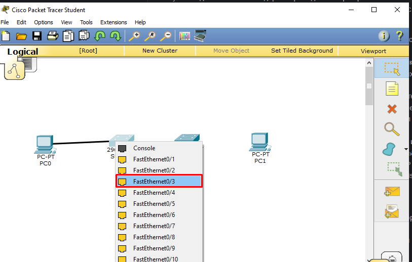

Рисунок 1 – Подключение компьютеров к портам FastEthernet 0/3

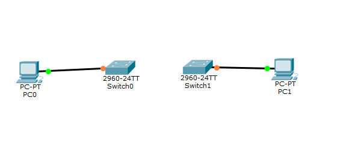

Рисунок 2 - Макет сети из 2 коммутаторов 2960 и двух компьютеров PC0 и PC1.


3. **Сделайте снимок экрана 1 - Макет сети из 2 коммутаторов 2960 и двух компьютеров PC0 и PC1.**

4. Перед объединением двух коммутаторов настроим порты FastEthernet 0/1 и FastEthernet 0/2.
   Для этого переходим во вкладку CLI, заходим в привилегированный режим – **Switch #**.
   Затем входим в режим глобального конфигурирования – **Switch(config) #**
   с помощью сокращенной команды **conf t**. Поскольку интерфейсы будут
   иметь одинаковые настройки, то мы можем их настроить с помощью одной команды **interface range fa0/1-2.**

Таким образом, настройка коммутаторов во вкладке CLI должны выглядеть следующим образом:

```
Switch >
Switch >en
Switch #
Switch #conf t
Switch(config)#
Switch(config)#interface range fa0/1-2
Switch(config-if-range)#channel-group 1 mode ? 
// (знак ? показывает все доступные режимы, мы выбираем режим on)
Switch(config-if-range)#channel-group 1 mode on
// Как видно на рисунке 3, создался логический интерфейс Port-channel 1, который объединяет 2 физических интерфейса.
Switch(config-if-range)#end – заканчиваем настройку
Switch# wr mem – сохраним результаты.

```

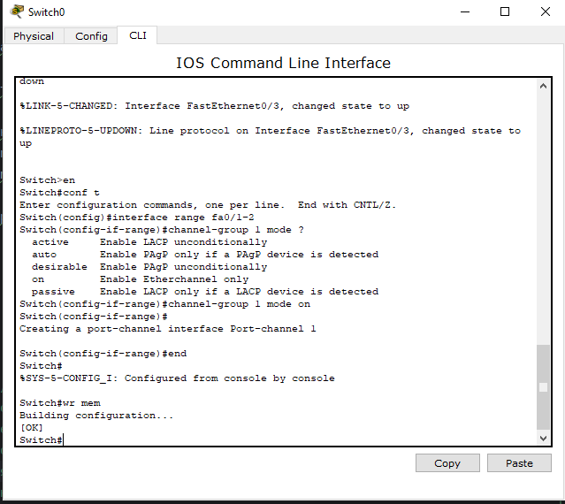

Рисунок 3 - Настройка интерфейсов для Switch 0

Команда  `interface range`  применяется для групповой настройки сетевых интерфейсов.
Настраиваемые интерфейсы запичываются после команды `interface range` двумя способами:
* `interface range fa0/1-4` - для настройки будут выбраны интерфесы FastEthernet0/1, FastEthernet0/2, FastEthernet0/3 и FastEthernet0/4.
* `interface range fa0/1, fa0/3, fa0/4` - перечислив интерфейсы через запятую. Будут выбраны интерфейсы FastEthernet0/1, FastEthernet0/3 и FastEthernet0/4.

5. **Сделайте снимок экрана 2 - Настройка интерфейсов для Switch 0**

6. Произведем аналогичные настройки для второго коммутатора (рис. 4).

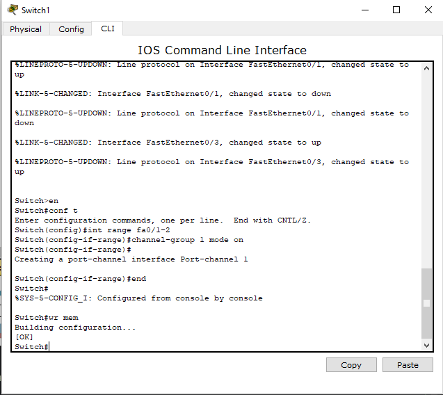

Рисунок 4 – Настройка интерфейсов для Switch 1

7. **Сделайте снимок экрана 3 - Настройка интерфейсов для Switch 1**

8. Соединим два коммутатора с помощью интерфейсов FastEthernet 0/1 и FastEthernet 0/2
   и пропишем IP-адреса для каждого компьютера (рис. 5).

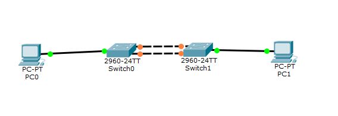

Рисунок 5 - Соединение коммутаторов с помощью интерфейсов FastEthernet 0/1 и FastEthernet 0/2

9. **Сделайте снимок экрана 4 - Соединение коммутаторов с помощью интерфейсов FastEthernet 0/1 и FastEthernet 0/2**

Для компьютеров PC0 и PC1 задаем следующие IP-адреса (табл. 1).
Таблица 1. IP- адреса для PC0 и PC1

| Сетевой элемент | IP-адрес    | Маска         |
|-----------------|-------------|---------------|
| PC0             | 192.168.1.1 | 255.255.255.0 |
| PC1             | 192.168.1.2 | 255.255.255.0 |

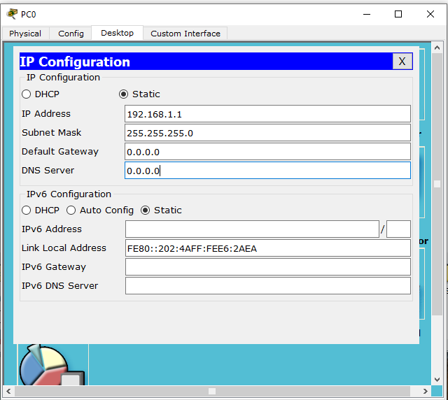
Рисунок 6 – Назначение IP- адреса для PC0

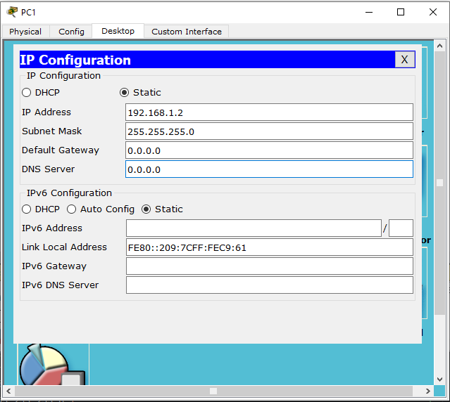

Рисунок 7 – Назначение IP- адреса для PC1

Проверим соединение между коммутаторами с помощью команды ping (рис. 8).
Проверка показала, что команда ping прошла успешно. Таким образом, мы получили 
агрегированный канал между двумя коммутаторами, Но пропускная способность этого канала не 100 Мбит/с,
а в 2 раза больше.

10. **Сделайте снимок экрана 5 - Проверка соединения между коммутаторами**

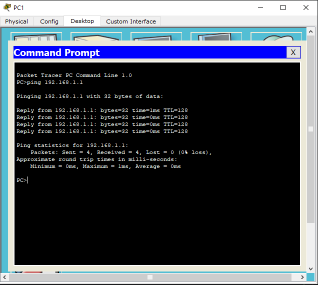

Рисунок 8 - Проверка соединения между коммутаторами

11. Для проверки отказоустойчивости агрегированного звена выведем
из строя один из интерфейсов(рис. 9). Пусть это будет FastEthernet 0/2 на Switch 1.

```
Switch >
Switch >en
Switch #
Switch #conf t
Switch(config)#
Switch(config)#interface fa0/2
Switch(config-if)#shutdown
```

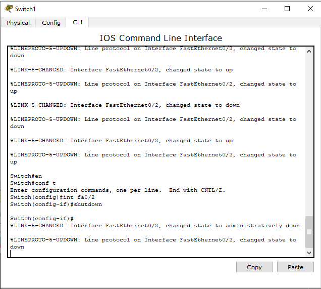

Рисунок 9 - отключения интерфейса FastEthernet 0/2 на Switch 1.

12. После этого видно, что второй интерфейс находится в нерабочем состоянии.
Проверим связность между коммутаторами с помощью команды ping. 
Команда выполнена успешно, так как второй интерфейс находится в рабочем состоянии (рис. 10).

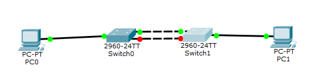

Рисунок 10 - Макет сети после отключения интерфейса FastEthernet 0/2 на Switch 1.

13. **Сделайте снимок экрана 6 - Макет сети после отключения интерфейса FastEthernet 0/2 на Switch 1.**

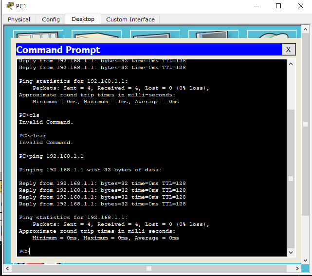

Рисунок 11 - Проверка соединения между коммутаторами после вывода из работы интерфейса FastEthernet 0/2.

14. **Сделайте снимок экрана 7 - Проверка соединения между коммутаторами после вывода из работы интерфейса FastEthernet 0/2**

Сохраните данную конфигурацию (дав ему имя `LAB7_Ivanov_Ivan_XXX_ex1.pkt`, где `XXX` - номер вашей группы).


## Задания 

1. Создайте новый файл.
 
2. Соберите сетевую топопологию согласно рисунку ниже

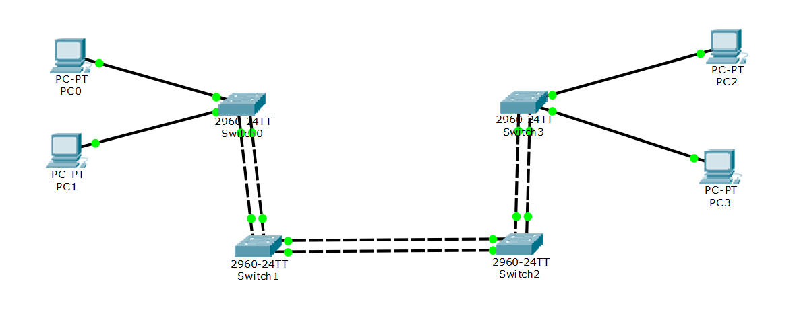

Топология содержит 4 ПК и четырех коммутатора (Cisco 2960). Для этого 
выберите из необходимых вкладок сетевое оборудование. **cделайте снимок экрана 1 ** 
и добавьте его в ваш индивидуальный отчет.  

3. Выполните статическую агрегацию каналов следующим образом:
* Соедините коммутаторы Swicth0 и Switch1 через интерфейсы FastEthernet0/1 и FastEthernet0/2 в channel-group 1
* Соедините коммутаторы Swicth2 и Switch3 через интерфейсы FastEthernet0/1 и FastEthernet0/2 в channel-group 1
* Соедините коммутаторы Swicth1 и Switch2 через интерфейсы FastEthernet0/3 и FastEthernet0/4 в channel-group 2

**4. Сделайте снимок экрана 2 - Команды настройки интерфейсов коммутатора Switch 0.
5. Сделайте снимок экрана 3 - Команды настройки интерфейсов коммутатора Switch 1.
6. Сделайте снимок экрана 4 - Команды настройки интерфейсов коммутатора Switch 2.
7. Сделайте снимок экрана 5 - Команды настройки интерфейсов коммутатора Switch 3.**

8. Настройте ПК в соответствии с таблицей
### **Таблица №2 Сетевые адреса устройств**

| Сетевой элемент | Интерфейс      | IP-адрес           | Маска подсети |
|-----------------|----------------|--------------------|---------------|
| PC0             | FastEthernet0 | 192.168.2.1**X**   | 255.255.255.0 | 
| PC1             | FastEthernet0 | 192.168.2.1**X**+1 | 255.255.255.0 | 
| PC2             | FastEthernet0 | 192.168.2.1**X**+2 | 255.255.255.0 | 
| PC3             | FastEthernet0 | 192.168.2.1**X**+3 | 255.255.255.0 | 

9. Проверьте сетевую связность между компьютерами PC0 и PC3, **сделайте снимок экрана 6** и добавьте его в ваш индивидуальный отчет.
10. Выполните проверку отказоустойчивости агрегированного звена channel-group 1 между коммутаторами Swicth0 и Switch1,
выведя из строя интерфейс FastEthernet0/2 на коммутаторе Switch0. Сделайте два снимка экрана.
   * Сделайте снимок экрана 7 - Макет сети после отключения интерфейса FastEhternet0/2 на Swicth0. 
   * Сделайте снимок экрана 8 - Проверка сетевой связности между компьютерами PC0 и PC3 после отключения интерфейса FastEhternet0/2 на Swicth0.
11. Выполните проверку отказоустойчивости агрегированного звена channel-group 1 между коммутаторами Swicth2 и Switch3,
выведя из строя интерфейс FastEthernet0/2 на коммутаторе Switch23 Сделайте два снимка экрана.
   * Сделайте снимок экрана 9 - Макет сети после отключения интерфейса FastEhternet0/2 на Swicth3. 
   * Сделайте снимок экрана 10 - Проверка сетевой связности между компьютерами PC1 и PC2 после отключения интерфейса FastEhternet0/2 на Swicth3.
12. Выполните проверку отказоустойчивости агрегированного звена channel-group 2 между коммутаторами Swicth1 и Switch2,
выведя из строя интерфейс FastEthernet0/4 на коммутаторе Switch2. Сделайте два снимка экрана.
   * Сделайте снимок экрана 11 - Макет сети после отключения интерфейса FastEhternet0/4 на Swicth2. 
   * Сделайте снимок экрана 12 - Проверка сетевой связности между компьютерами PC1 и PC2 после отключения интерфейса FastEhternet0/4 на Swicth2.

13. Сохраните файл конфигурации сети дав ему имя `LAB7_Ivanov_Ivan_XXX_task.pkt`, где `XXX` - номер вашей группы.

### Контрольные вопросы
1. Как может осуществляться передача пакетов одной сессии, если они будут передаваться по разным портам агрегированного канала? Приведите примеры.
2. Что произойдет, если в агрегированном канале, один выйдет из строя?
3. Чем отличается статическое агрегирование каналов связи от динамического агрегирования?
4. Что нужно сделать для проверки отказоустойчивости агрегированного звена?
5. Какой вид агрегирования каналов установлен в коммутаторе по умолчанию?
6. Опишите функции логического интерфейса Port-channel 1?
7. Для каких целей применяется агрегация каналов?
8. Как распределяется трафик по каналам при объединении портов?
9. Какие характеристики должны быть у портов, агрегированных в канал?
10. Почему в большинстве реализаций механизмов агрегирования используются методы статического, а не динамического распределения кадров по портам?
11. Как называется технология, которая позволяет обеспечить резервирование в случае выхода из строя одного из каналов?
12. Что представляет собой технология агрегирования каналов?

