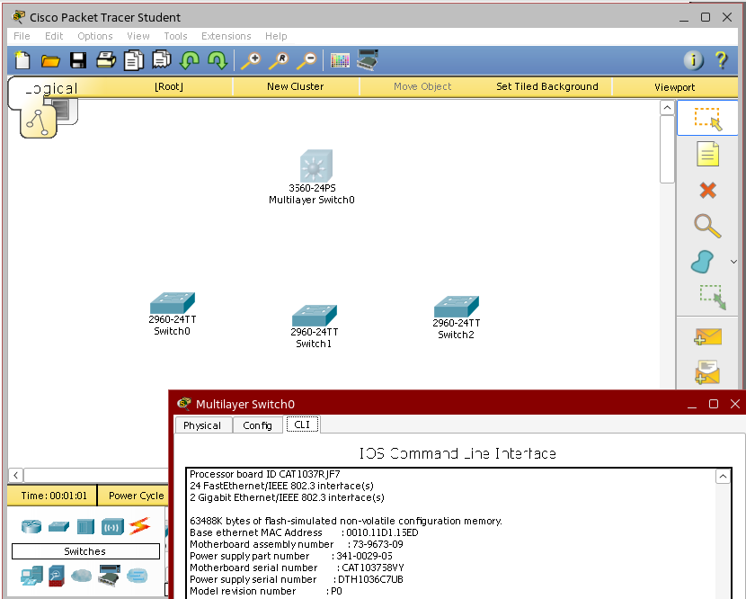
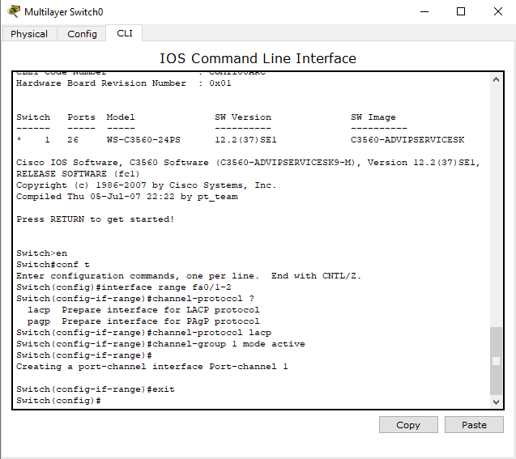
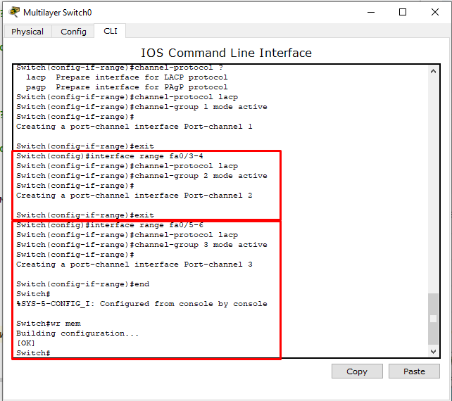
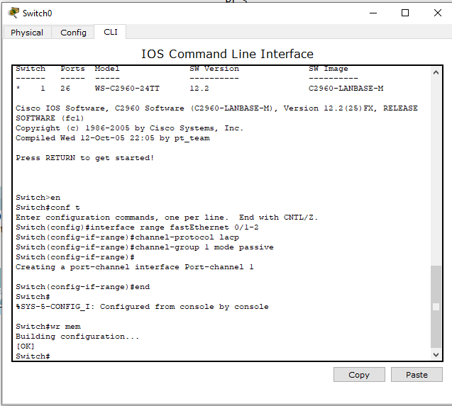
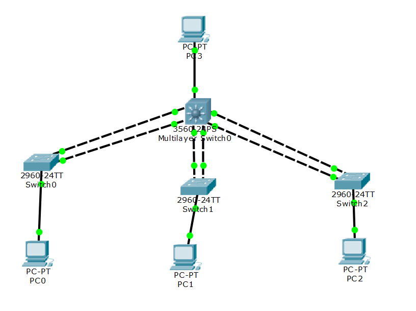
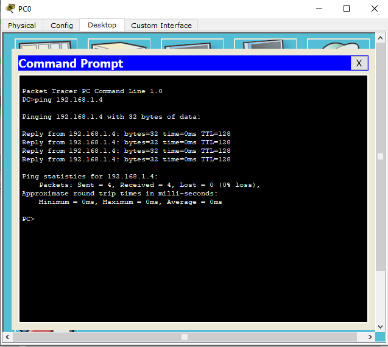
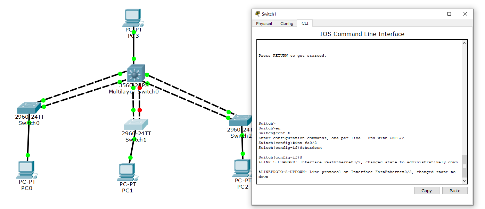
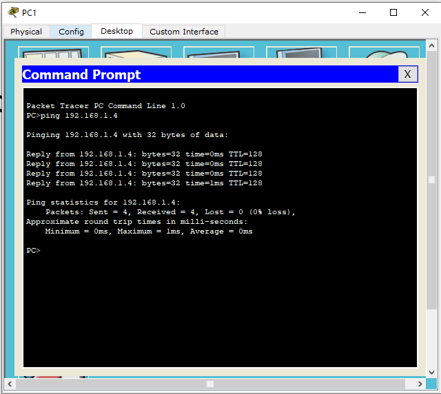
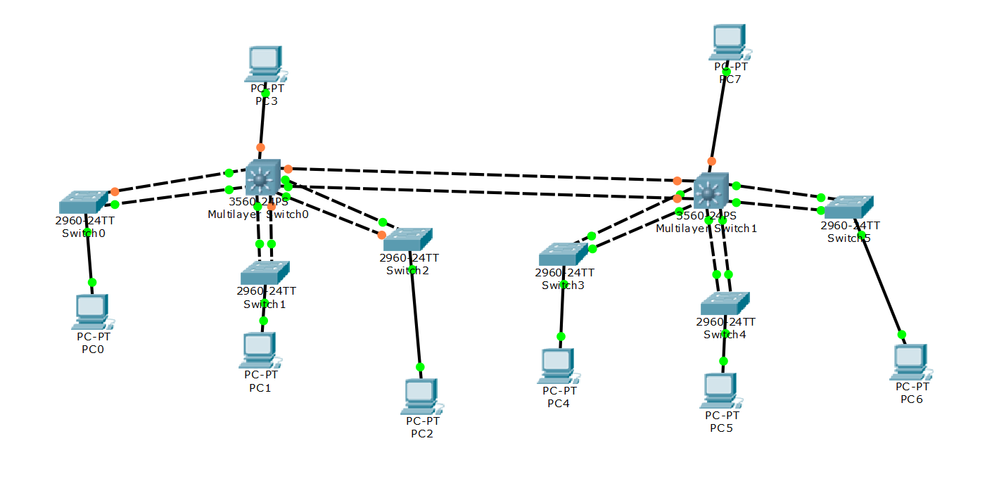

# Лабораторная работа № 8.

## Тема: Динамическое агрегирование каналов

### Цели работы:

* Рассмотреть сеть, построенную по топологии «Звезда», когда коммутаторы 2-го уровня подключаются к коммутатору 3-го уровня. Изучить динамическое агрегирование каналов.

---

## Содержание

1. [Цели работы](#цели-работы)
2. [Требования к сдаче работы](#требования-к-сдаче-работы)
4. [Ход работы](#ход-работы)
5. [Задания](#задания)
6. [Контрольные вопросы](#контрольные-вопросы)

## Требования к сдаче работы

1. Индивидуальный отчёт по лабораторной работе оформляется используя
   **текстовые редакторы Word(или подобные ему)
   в текстовый файл формата doc или docx.** [ШАБЛОН ДЛЯ ОТЧЕТА ПО ЛР8](LAB8/LR8_Report.docx)
2. В индивидуальном отчёте должны быть указаны цель, задание, представлены необходимые снимки экрана и пояснения к ним.
3. Следует проанализировать полученные данные и дать ответы на контрольные вопросы.

***Критерии оценивания***

* **Оценка 5**
    * Сделать [пример](#пример-статического-агрегирования-каналов) и
      сохранить его под именем `LAB8_Ivanov_Ivan_XXX_ex1.pkt`, где `XXX` - номер вашей группы.
    * Выполнить [задание по созданию сети](#задания-) сохранить его под именем
      `LAB8_Ivanov_Ivan_XXX_task.pkt`, где `XXX` - номер вашей группы.
    * Оформить индивидуальный отчет [ШАБЛОН ДЛЯ ОТЧЕТА ПО ЛР8](LAB8/LR8_Report.docx), ответить на все контрольные
      вопросы.
    * загрузить все в гугл форму:[235 группа](https://forms.gle/7KQzusvW1r5g45TL8)
      или [237 группа](https://forms.gle/nRQ8ZM9VpM5mJxxA9)

* Оценка 4
    * Сделать [пример](#пример-статического-агрегирования-каналов) и
      сохранить его под именем `LAB8_Ivanov_Ivan_XXX_ex1.pkt`, где `XXX` - номер вашей группы.
    * Выполнить [задание по созданию сети](#задания-) сохранить его под именем `LAB8_Ivanov_Ivan_XXX_task.pkt`, где
      `XXX` - номер вашей группы.
    * Оформить индивидуальный отчет [ШАБЛОН ДЛЯ ОТЧЕТА ПО ЛР8](LAB8/LR8_Report.docx) без ответов на контрольные вопросы.
    * загрузить все в гугл форму:[235 группа](https://forms.gle/7KQzusvW1r5g45TL8)
      или [237 группа](https://forms.gle/nRQ8ZM9VpM5mJxxA9)

* Оценка 3
    * Сделать [пример](#пример-статического-агрегирования-каналов) и
      сохранить его под именем `LAB8_Ivanov_Ivan_XXX_ex1.pkt`, где `XXX` - номер вашей группы.
    * Оформить индивидуальный отчет [ШАБЛОН ДЛЯ ОТЧЕТА ПО ЛР8](LAB8/LR8_Report.docx) без задания и ответов на
      контрольные вопросы.
    * загрузить все в гугл форму:[235 группа](https://forms.gle/7KQzusvW1r5g45TL8)
      или [237 группа](https://forms.gle/nRQ8ZM9VpM5mJxxA9)

## Ход работы

### Пример статического агрегирования каналов

1. Открываем Cisco Packet Tracer.
2. Добавляем 3 коммутатора 2960, один коммутатор 3-го уровня - 3560 и четыре компьютера.
   Для соединения каждого коммутатора 2960 с коммутатором 3560 перейдем в настройки коммутатора 3-го уровня (рис. 1).



Рисунок 1 – Коммутаторы 2 и 3 уровня

3. Настроим порты `FastEthernet` на коммутаторе `3560`. Для этого переходим
   во вкладку CLI, заходим в привилегированный режим – `Switch #`.
   Затем выходим в режим глобального конфигурирования – `Switch(config) #` с
   помощью сокращенной команды `conf t`. Поскольку интерфейсы будут иметь одинаковые настройки,
   то мы можем их настроить с помощью одной команды `interface range fa0/1-2`.

Таким образом, настройка коммутаторов во вкладке CLI должны выглядеть следующим образом:

```
Switch >
Switch >en
Switch #
Switch #conf t
Switch(config)#
Switch(config)#interface range fa0/1-2
Switch(config-if-range)#channel-protocol ? (знак ? показывает все доступные протоколы, мы выбираем протокол LACP)
Switch(config-if-range)#channel- protocol lacp
Далее присваиваем ему channel-group 1
Switch(config-if-range)#channel-group 1 mode active
Switch(config-if-range)#exit
```

Как видно на рисунке 2, создался логический интерфейс `channel-group 1`,
который объединяет 2 физических интерфейса `FastEthernet 0/1-2`.



Рисунок 2 - Настройка интерфейсов fa0/1-2 на коммутаторе 3560


4. Далее аналогичным образом настраиваем интерфейсы `FastEthernet 0/3-4`
   и `FastEthernet 0/5-6` и создаем `channel-group 2` и `channel-group 3`

```
Switch(config)#interface range fa0/3-4
Switch(config-if-range)#channel-protocol ?
Switch(config-if-range)#channel- protocol lacp
Switch(config-if-range)#channel-group 2 mode active
Switch(config-if-range)#exit

Switch(config)#interface range fa0/5-6
Switch(config-if-range)#channel-protocol ?
Switch(config-if-range)#channel- protocol lacp
Switch(config-if-range)#channel-group 3 mode active
```

5. Далее заканчиваем настройки и сохраняем их.

```
Switch(config-if-range)#end
Switch# wr mem

```

Результаты настройки интерфейсов fa0/3-4 и fa0/5-6 показаны на рисунке 3.



Рисунок 3 - Настройка интерфейсов fa0/3-4 и fa0/5-6 на коммутаторе 3560

**Сделайте снимок экрана 1 - Настройка интерфейсов для `Multilayer Switch0`**

4. Теперь произведем настройки для коммутаторов `2960`. Настройку
   проводим для портов `fastEthernet 0/1-2`, при настройке `channel-group` выбираем режим `passive`,
   так как рекомендуется использовать параметр `active` только
   с одной стороны. Но поскольку мы его уже использовали на центральном
   коммутаторе, то здесь настраиваем passive (рис. 4).

```
Switch >en
Switch #
Switch #conf t
Switch(config)#
Switch(config)#interface range fastEthernet 0/1-2
Switch(config-if-range)#channel- protocol lacp
Switch(config-if-range)#channel-group 1 mode passive
Switch(config-if-range)#end
Switch# wr mem
```



Рисунок 4 - Настройка интерфейсов fa0/1-2 на коммутаторе 2960 Switch0

**Сделайте снимок экрана 2 - Настройка интерфейсов для `Switch0`**

5. Аналогичные действия производим на остальных двух коммутаторах. Обратите внимание, что второй коммутатор 2960 Switch1 будет
агрегироваться с `channel-group 2` коммутатора `3560`, а третий коммутатор 2960 Switch2 будет
агрегироваться с `channel-group 3` коммутатора `3560`. т.е команды перевода каналов в пассивный режим будут выглядеть так

* для коммутатора 2960 Switch1
```
Switch(config-if-range)#channel-group 2 mode passive
```
* для коммутатора 2960 Switch2
```
Switch(config-if-range)#channel-group 3 mode passive
```

**Сделайте снимок экрана 3 - Настройка интерфейсов для `Switch1`**

**Сделайте снимок экрана 4 - Настройка интерфейсов для `Switch2`**

5. Далее соединим коммутаторы. Поскольку это устройства разного уровня,
   то соединяем их прямым кабелем. Соединения производим в соответствии
   с теми настройками, которые мы прописали на каждом коммутаторе (табл. 1) и пропишем IP-адреса 
для каждого компьютера (табл. 2).

Таблица 1. Настройка интерфейсов на коммутаторах

| Коммутатор | Интерфейсы на коммутаторах 2960   | Интерфейсы на коммутаторе 3560    |
|------------|-----------------------------------|-----------------------------------|
| Switch 0   | FastEthernet 0/1 FastEthernet 0/2 | FastEthernet 0/1 FastEthernet 0/2 |
| Switch 1   | FastEthernet 0/1 FastEthernet 0/2 | FastEthernet 0/3 FastEthernet 0/4 |
| Switch 2   | FastEthernet 0/1 FastEthernet 0/2 | FastEthernet 0/5 FastEthernet 0/6 |

Таблица 2. Настройка IP-адресов компьютеров

| Сетевой элемент | IP-адрес    | Маска         |
|-----------------|-------------|---------------|
| PC0             | 192.168.1.1 | 255.255.255.0 |
| PC1             | 192.168.1.2 | 255.255.255.0 |
| PC2             | 192.168.1.3 | 255.255.255.0 |
| PC3             | 192.168.1.4 | 255.255.255.0 |

6. Если все правильно настроить, то все интерфейсы загорятся зеленым цветом, 
что показывает, что сеть функционирует.



**Сделайте снимок экрана 5 - Макет функционирующей сети с настроенными коммутаторами и компьютерами**

7. Проверим соединение между коммутаторами с помощью команды `ping` (рис. 5). Например, пропингуем PC3 с PC0.



Рисунок 5 - Проверка соединения между PC3 с PC0.

Проверка показала, что команда `ping` прошла успешно. Таким образом, мы получили 
агрегированный канал между двумя коммутаторами, Но пропускная способность этого канала не `100 Мбит/с`,
а в 2 раза больше.

**Сделайте снимок экрана 6 - Проверка соединения между компьютерами PC3 с PC0**

8. Для проверки отказоустойчивости агрегированного звена выведем
из строя один из интерфейсов(рис. 6). Пусть это будет `FastEthernet 0/2` на `Switch1`.

```
Switch >
Switch >en
Switch #
Switch #conf t
Switch(config)#
Switch(config)#interface fa0/2
Switch(config-if)#shutdown
```

9. После этого видно, что второй интерфейс находится в нерабочем состоянии.
Проверим связность между коммутаторами с помощью команды ping. 
Команда выполнена успешно, так как второй интерфейс находится в рабочем состоянии (рис. 6).



Рисунок 6 - Макет сети после отключения интерфейса `FastEthernet 0/2` на `Switch1`.

**Сделайте снимок экрана 7 - Макет сети после отключения интерфейса `FastEthernet 0/2` на `Switch1`.**



Рисунок 8 - Проверка соединения между компьютерами PC1 с PC3 после вывода из работы интерфейса `FastEthernet 0/2`.

10. **Сделайте снимок экрана 8 - Проверка соединения между коммутаторами после вывода из работы интерфейса `FastEthernet 0/2`**

Сохраните данную конфигурацию (дав ему имя `LAB8_Ivanov_Ivan_XXX_ex1.pkt`, где `XXX` - номер вашей группы).


## Задания

1. Создайте новый файл.

2. Соберите сетевую топопологию согласно рисунку ниже



Топология содержит 8 ПК и 6 коммутатора (Cisco 2960) и 2 коммутатора (Cisco 3560). Для этого
выберите из необходимых вкладок сетевое оборудование. **cделайте снимок экрана 1 **
и добавьте его в ваш индивидуальный отчет.

3. Выполните динамическую агрегацию каналов следующим образом:

* Соедините коммутаторы `Swicth0` и `MultiLayerSwitch0` через интерфейсы `FastEthernet0/1` и `FastEthernet0/2` в `channel-group 1`
* Соедините коммутаторы `Swicth1` и `MultiLayerSwitch0` через интерфейсы `FastEthernet0/3` и `FastEthernet0/4` в `channel-group 2`
* Соедините коммутаторы `Swicth2` и `MultiLayerSwitch0` через интерфейсы `FastEthernet0/5` и `FastEthernet0/6` в `channel-group 3`

* Соедините коммутаторы `Swicth3` и `MultiLayerSwitch1` через интерфейсы `FastEthernet0/1` и `FastEthernet0/2` в `channel-group 1`
* Соедините коммутаторы `Swicth4` и `MultiLayerSwitch1` через интерфейсы `FastEthernet0/3` и `FastEthernet0/4` в `channel-group 2`
* Соедините коммутаторы `Swicth5` и `MultiLayerSwitch1` через интерфейсы `FastEthernet0/5` и `FastEthernet0/6` в `channel-group 3`

* Соедините коммутаторы `MultiLayerSwitch0` и `MultiLayerSwitch1` через интерфейсы `FastEthernet0/7` и `FastEthernet0/8` в `channel-group 4`

4. Сделайте снимок экрана 2 - Команды настройки интерфейсов коммутатора `Switch0`.
5. Сделайте снимок экрана 3 - Команды настройки интерфейсов коммутатора `Switch1`.
6. Сделайте снимок экрана 4 - Команды настройки интерфейсов коммутатора `Switch2`.
7. Сделайте снимок экрана 5 - Команды настройки интерфейсов коммутатора `Switch3`.
8. Сделайте снимок экрана 6 - Команды настройки интерфейсов коммутатора `Switch4`.
9. Сделайте снимок экрана 7 - Команды настройки интерфейсов коммутатора `Switch5`.
10. Сделайте снимок экрана 8 - Команды настройки интерфейсов коммутатора `MultiLayerSwitch0`.
11. Сделайте снимок экрана 9 - Команды настройки интерфейсов коммутатора `MultiLayerSwitch1`.

12. Настройте ПК в соответствии с таблицей

### **Таблица №2 Сетевые адреса устройств**

| Сетевой элемент | Интерфейс     | IP-адрес           | Маска подсети |
|-----------------|---------------|--------------------|---------------|
| PC0             | FastEthernet0 | 192.168.2.1**X**   | 255.255.255.0 | 
| PC1             | FastEthernet0 | 192.168.2.1**X**+1 | 255.255.255.0 | 
| PC2             | FastEthernet0 | 192.168.2.1**X**+2 | 255.255.255.0 | 
| PC3             | FastEthernet0 | 192.168.2.1**X**+3 | 255.255.255.0 | 
| PC4             | FastEthernet0 | 192.168.2.1**X**+4 | 255.255.255.0 | 
| PC5             | FastEthernet0 | 192.168.2.1**X**+5 | 255.255.255.0 | 
| PC6             | FastEthernet0 | 192.168.2.1**X**+6 | 255.255.255.0 | 
| PC7             | FastEthernet0 | 192.168.2.1**X**+7 | 255.255.255.0 | 

13. Проверьте сетевую связность между компьютерами `PC0` и `PC7`, **сделайте снимок экрана 10** и добавьте его в ваш
   индивидуальный отчет.
14. Выполните проверку отказоустойчивости агрегированного звена `channel-group 4 `между коммутаторами `MultiLayerSwitch1`
    и `MultiLayerSwitch0`,
    выведя из строя интерфейс `FastEthernet0/7` на коммутаторе `MultiLayerSwitch0`. Сделайте два снимка экрана.

* Сделайте снимок экрана 11 - Макет сети после отключения интерфейса `FastEhternet0/7` на MultiLayerSwitch0.
* Сделайте снимок экрана 12 - Проверка сетевой связности между компьютерами `PC0` и `PC7` после отключения
  интерфейса `FastEhternet0/7` на `MultiLayerSwitch0`.


15. Сохраните файл конфигурации сети дав ему имя `LAB8_Ivanov_Ivan_XXX_task.pkt`, где `XXX` - номер вашей группы.

### Контрольные вопросы

1. В чем отличие работы портов коммутатора в пассивном и активных режимах?
2. Какие характеристики портов, объединённых в агрегированные каналы, должны быть одинаковые?
3. Какой режим работы нужно в данной лабораторной работе нужно выбрать для коммутатора Cisco 2960 и почему?
4. Как можно проверить отказоустойчивость интерфейса FastEthernet 0/1 на коммутаторе 2-го уровня?
5. Какие режимы работы возможны при настройке канала-группы?
6. Зачем портам присваивается активный или пассивный режимы?
7. Опишите преимущества протокола LACP.
8. Коммутаторы, каких уровней модели OSI используются в данной работе? В чем их отличие?
9. Какими командами выводятся из строя, и вводится в строй интерфейсы коммутатора?
10. На каких участках сети применяется технология агрегирования каналов и почему?
11. С помощью, какой команды можно посмотреть группы портов коммутатора?


