# Лабораторная работа № 9. 🔧

## Тема: Использование коммутаторов третьего уровня для построения компьютерных сетей 🖧

### Цели работы: 🎯

* Изучить принципы работы коммутатора третьего уровня.

---

## Содержание 📑

1. [Цели работы](#цели-работы)
2. [Требования к сдаче работы](#требования-к-сдаче-работы)
3. [Краткая теория](#краткая-теория)
4. [Ход работы](#ход-работы)
5. [Задания](#задания)
6. [Контрольные вопросы](#контрольные-вопросы)

---

## Требования к сдаче работы 📋

1. Индивидуальный отчёт по лабораторной работе оформляется, используя **текстовые редакторы Word (или подобные ему), в
   текстовый файл формата .doc или .docx.** 📄 [ШАБЛОН ДЛЯ ОТЧЕТА ПО ЛР9](LAB9/LR9_Report.docx)
2. В индивидуальном отчёте должны быть указаны цель, задание, представлены необходимые снимки экрана и пояснения к ним.
3. Следует проанализировать полученные данные и дать ответы на контрольные вопросы.

### **Критерии оценивания** 📊

#### **🟢 Оценка 5 (Отлично)**

1. Выполнить **[пример построения сети](#пример-построения-сети-на-основе-коммутатора-3-го-уровня)** и сохранить файл
   как `LAB9_Фамилия_Имя_ГРУППА_ex1.pkt` (например, `LAB9_Ivanov_Ivan_245_ex1.pkt`).
2. Выполнить **[задание по созданию сети](#задания)** и сохранить файл как `LAB9_Фамилия_Имя_ГРУППА_task.pkt`.
3. Оформить полный отчёт по [шаблону](LAB9/LR9_Report.docx) **с ответами на все контрольные вопросы.**
4. Загрузить все файлы в соответствующую форму: [245 группа](https://forms.gle/ms3hxTPaJWsbxdLF7)
   или [247 группа](https://forms.gle/ZEPqnyi7L4rAKHXp8). ✅

#### **🟡 Оценка 4 (Хорошо)**

1. Выполнить **[пример построения сети](#пример-построения-сети-на-основе-коммутатора-3-го-уровня)** и сохранить файл
   как `LAB9_Фамилия_Имя_ГРУППА_ex1.pkt` (например, `LAB9_Ivanov_Ivan_245_ex1.pkt`).
2. Выполнить **[задание по созданию сети](#задания)** и сохранить файл как `LAB9_Фамилия_Имя_ГРУППА_task.pkt`.
3. Оформить отчёт по [шаблону](LAB9/LR9_Report.docx) **без ответов на контрольные вопросы.**
4. Загрузить все файлы в соответствующую форму: [245 группа](https://forms.gle/ms3hxTPaJWsbxdLF7)
   или [247 группа](https://forms.gle/ZEPqnyi7L4rAKHXp8). ✅

#### **🔴 Оценка 3 (Удовлетворительно)**

1. Выполнить только **[пример построения сети](#пример-построения-сети-на-основе-коммутатора-3-го-уровня)** и сохранить
   файл как `LAB9_Фамилия_Имя_ГРУППА_ex1.pkt`.
2. Оформить отчёт по [шаблону](LAB9/LR9_Report.docx) **без выполнения задания и ответов на контрольные вопросы.**
3. Загрузить все файлы в соответствующую форму: [245 группа](https://forms.gle/ms3hxTPaJWsbxdLF7)
   или [247 группа](https://forms.gle/ZEPqnyi7L4rAKHXp8). ✅

---

## Ход работы 🛠️

### Пример построения сети на основе коммутатора 3-го уровня 📚

**Цель примера:** Настроить маршрутизацию между несколькими VLAN на одном коммутаторе уровня 3.

1. **Откройте Cisco Packet Tracer.**
2. **Создайте сеть**, изображенную на рисунке 1. Мы хотим разбить эту сеть на 3 сегмента (VLAN), чтобы компьютеры в
   разных VLAN могли связываться между собой через маршрутизацию на коммутаторе.

   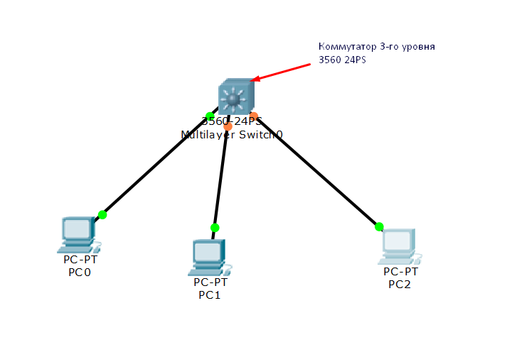

   *Рисунок 1 – Сеть для изучения коммутаторов 3-го уровня*

   > **🔹 Сделайте снимок экрана 1 - Исходная топология сети.**

3. **Настройка VLAN на коммутаторе 3560.**
    * Перейдите в настройки коммутатора **3560**, откройте **CLI** (рис. 2).
    * Создадим три VLAN (2, 3, 4):

      ```cisco
      Switch>en
      Switch#conf t
      Switch(config)#vlan 2
      Switch(config-vlan)#name VLAN2
      Switch(config-vlan)#exit
      Switch(config)#vlan 3
      Switch(config-vlan)#name VLAN3
      Switch(config-vlan)#exit
      Switch(config)#vlan 4
      Switch(config-vlan)#name VLAN4
      Switch(config-vlan)#exit
      Switch(config)#end
      ```
    * Сохраните конфигурацию: `Switch#copy running-config startup-config`.

   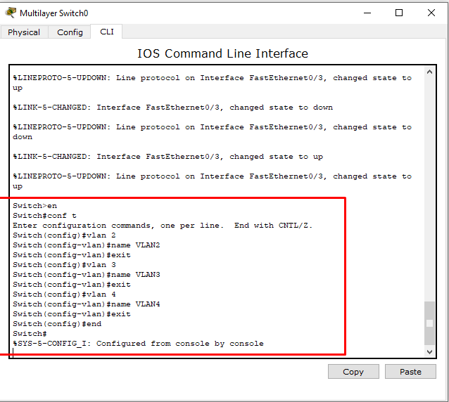

   *Рисунок 2 - Настройка коммутатора 3560*

4. **Назначение портов коммутатора созданным VLAN.**
    * Определите, к какому порту подключен каждый компьютер (рис. 3).

      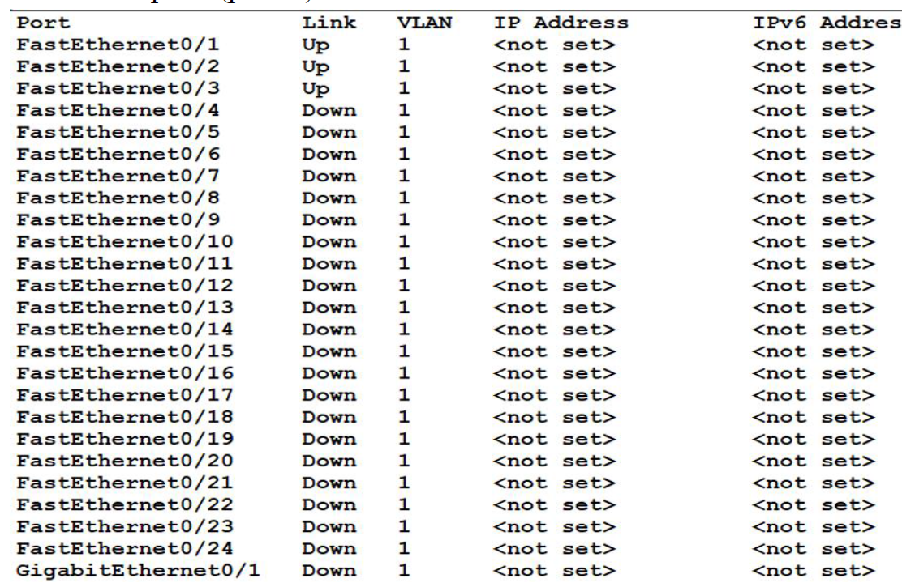

      *Рисунок 3 - Состояние портов коммутатора*

    * Настройте порты `fa0/1`, `fa0/2`, `fa0/3` в режиме доступа (access) и назначьте их соответствующим VLAN (рис. 4):

      ```cisco
      Switch>en
      Switch#conf t
      Switch(config)#interface fa0/1
      Switch(config-if)#switchport mode access
      Switch(config-if)#switchport access vlan 2
      Switch(config-if)#exit
      Switch(config)#interface fa0/2
      Switch(config-if)#switchport mode access
      Switch(config-if)#switchport access vlan 3
      Switch(config-if)#exit
      Switch(config)#interface fa0/3
      Switch(config-if)#switchport mode access
      Switch(config-if)#switchport access vlan 4
      Switch(config-if)#exit
      Switch(config)#end
      ```

   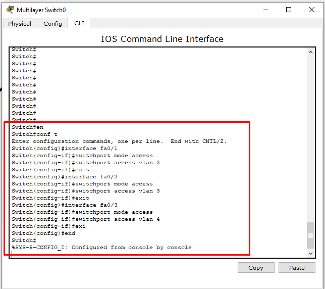

   *Рисунок 4 - Конфигурация на коммутаторе*

5. **Проверка конфигурации портов.**
    * Выполните команду `Switch# show run` и найдите разделы с настройками интерфейсов. Убедитесь, что порты `fa0/1`,
      `fa0/2`, `fa0/3` настроены правильно (рис. 5).

   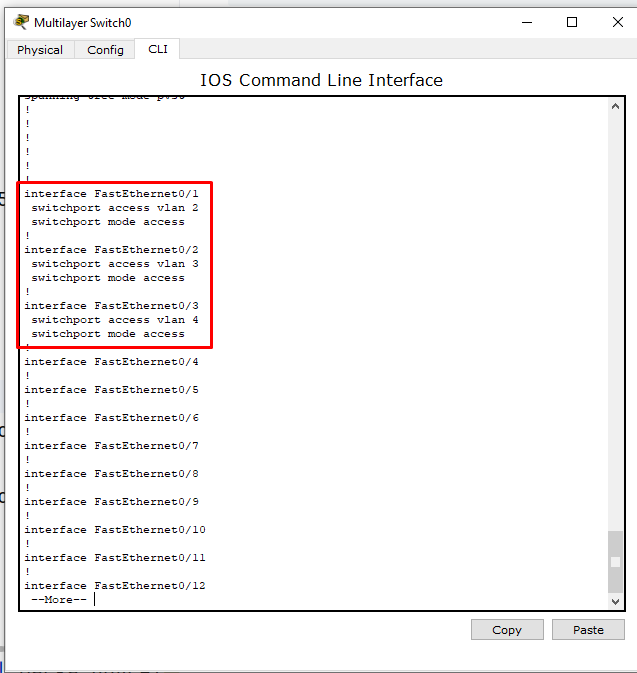

   *Рисунок 5 - Состояние портов коммутатора после настройки*

   > **🔹 Сделайте снимок экрана 2 - Результат проверки конфигурации портов (команда `show run`).**

6. **Настройка IP-адресов на виртуальных интерфейсах (SVI) VLAN.**
    * Так как коммутатор работает на 3-м уровне, необходимо назначить IP-адреса интерфейсам VLAN, которые будут
      выступать шлюзами по умолчанию для своих сетей (рис. 6).

      ```cisco
      Switch>en
      Switch#conf t
      Switch(config)#int vlan 2
      Switch(config-if)#ip address 192.168.2.1 255.255.255.0
      Switch(config-if)#no shutdown
      Switch(config-if)#exit
      Switch(config)#int vlan 3
      Switch(config-if)#ip address 192.168.3.1 255.255.255.0
      Switch(config-if)#no shutdown
      Switch(config-if)#exit
      Switch(config)#int vlan 4
      Switch(config-if)#ip address 192.168.4.1 255.255.255.0
      Switch(config-if)#no shutdown
      Switch(config-if)#exit
      Switch(config)#end
      ```

   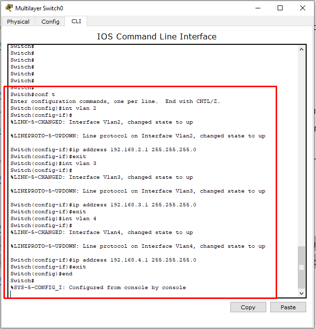

   *Рисунок 6 - Присвоение IP-адресов виртуальным интерфейсам*

7. **Проверка настройки интерфейсов VLAN.**
    * Снова выполните `Switch# show run` и найдите разделы `interface Vlan2`, `interface Vlan3` и `interface Vlan4` (
      рис. 7).

   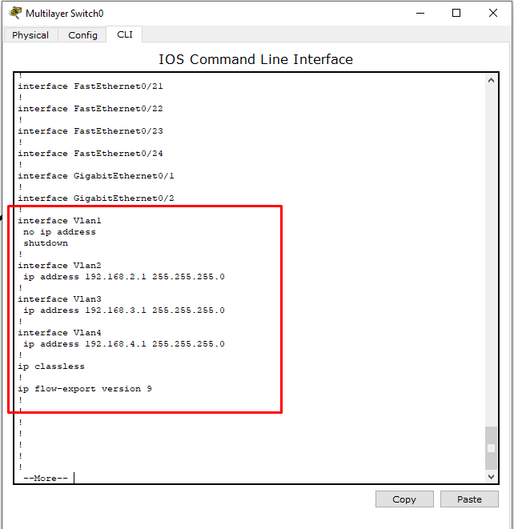

   *Рисунок 7 - Проверка настройки интерфейсов*

   > **🔹 Сделайте снимок экрана 3 - Проверка настроенных IP-адресов на интерфейсах VLAN.**

8. **Настройка IP-адресов и шлюзов на компьютерах.**
    * Задайте параметры согласно Таблице 1.

      **Таблица №1. IP-адресация для компьютеров сети**

      | Сетевой элемент | Интерфейс | IP-адрес | Маска подсети | Шлюз по умолчанию |
              |----------------|-----------|----------|---------------|-------------------|
      | PC0            | FastEthernet0 | 192.168.2.2 | 255.255.255.0 | 192.168.2.1 |
      | PC1            | FastEthernet0 | 192.168.3.2 | 255.255.255.0 | 192.168.3.1 |
      | PC2            | FastEthernet0 | 192.168.4.2 | 255.255.255.0 | 192.168.4.1 |

    * Пример настройки для PC0 показан на рисунке 8.

      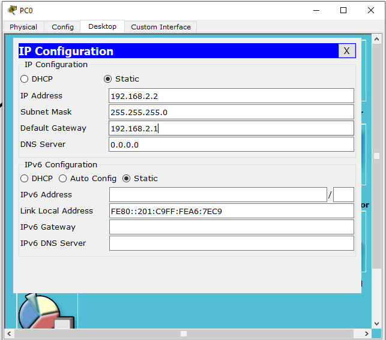

      *Рисунок 8 - Изменение IP-адреса для компьютера PC0*

9. **Проверка связи между компьютерами и их шлюзом (коммутатором).**
    * На PC0 выполните команду `ping 192.168.2.1`. Успешный результат показан на рисунке 9.

      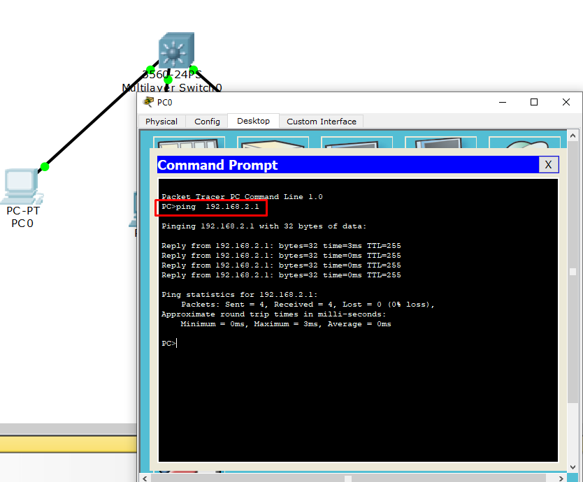

      *Рисунок 9 - Проверка связи между PC0 и коммутатором*

   > **🔹 Сделайте снимок экрана 4 - Проверка связи PC0 со своим шлюзом (192.168.2.1).**
   > **🔹 Сделайте снимок экрана 5 - Проверка связи PC1 со своим шлюзом (192.168.3.1).**
   > **🔹 Сделайте снимок экрана 6 - Проверка связи PC2 со своим шлюзом (192.168.4.1).**

10. **Проверка связи между компьютерами из разных VLAN (ДО включения маршрутизации).**
    * С PC0 выполните `ping 192.168.3.2` (PC1) или `ping 192.168.4.2` (PC2). **Пинг должен НЕ проходить**, так как
      маршрутизация между VLAN ещё не активирована (рис. 10).

      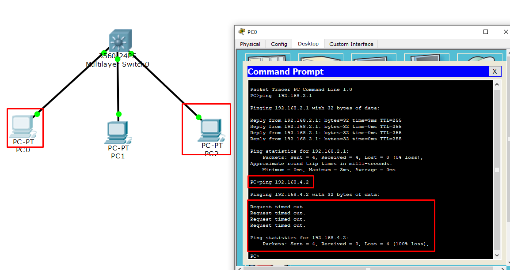

      *Рисунок 10 - Проверка связи между PC0 и PC1 до настройки маршрутизации*

    > **🔹 Сделайте снимок экрана 7 - Неудачная попытка ping между разными VLAN (например, с PC0 на PC1).**

11. **Включение маршрутизации на коммутаторе уровня 3.**
    * Это ключевой шаг! Войдите в глобальную конфигурацию коммутатора и выполните команду (рис. 11):

      ```cisco
      Switch>en
      Switch#conf t
      Switch(config)#ip routing
      Switch(config)#end
      ```
      *Не забудьте сохранить изменения: `Switch#copy running-config startup-config`.*

    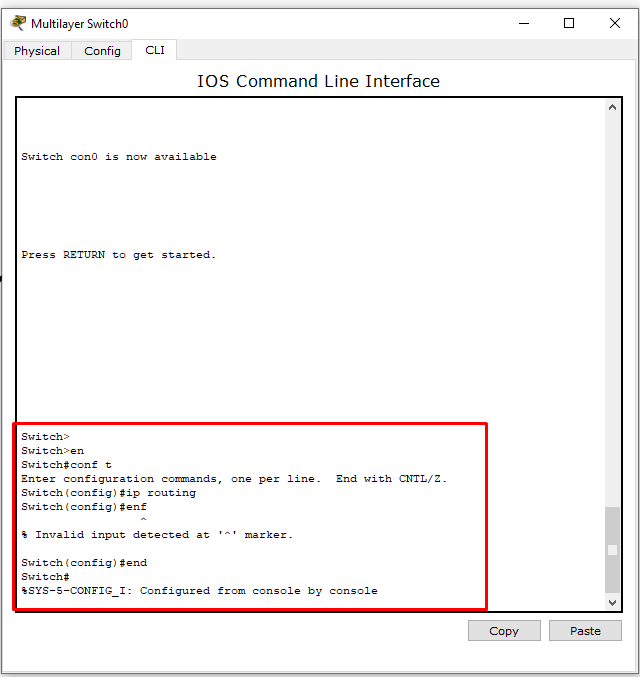

    *Рисунок 11 - Включение маршрутизации на коммутаторе*

12. **Проверка связи между компьютерами из разных VLAN (ПОСЛЕ включения маршрутизации).**
    * Повторите ping с PC0 на PC1 (`192.168.3.2`) или на PC2 (`192.168.4.2`). Теперь пинг **должен быть успешным**, так
      как коммутатор выполняет маршрутизацию между своими интерфейсами VLAN (рис. 12).

      

      *Рисунок 12 - Проверка связи между PC0 и PC1 после настройки маршрутизации*

    > **🔹 Сделайте снимок экрана 8 - Успешный ping между разными VLAN после включения маршрутизации (например, с PC0 на
    PC2).**

13. **Сохраните проект.**
    * Сохраните файл под именем `LAB9_Фамилия_Имя_ГРУППА_ex1.pkt` (например, `LAB9_Ivanov_Ivan_245_ex1.pkt`). ✅

---
Понял! Сделаю краткое задание в стиле ЛР6, без готовых конфигураций, только структура и таблица адресации. Вот финальная
версия:

## Задания 📝

**Задание:** Построить сеть с двумя коммутаторами уровня 3, настроить маршрутизацию между VLAN.

1. Создайте в Cisco Packet Tracer сеть согласно схеме ниже. Используйте два коммутатора уровня 3 (например, 3560-24PS).

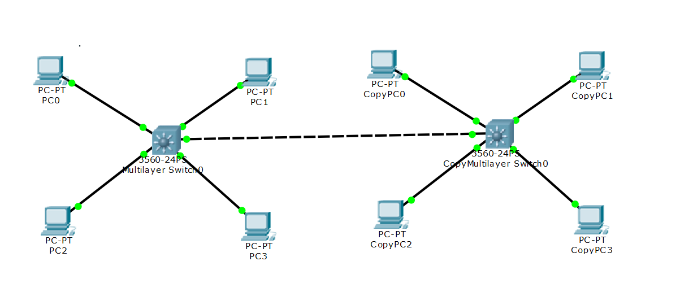

2. Настройте VLAN согласно таблице. **Вместо X подставьте последнюю цифру своего порядкового номера по журналу!**  
   Например, если ваш номер 17 → X=7, то VLAN ID будет vlan 27, vlan 47 и т.д.

### Таблица IP-адресации

| Сетевой элемент            | Интерфейс     | IP-адрес       | Маска подсети | VLAN ID | VLAN name   | Шлюз по умолчанию |
|----------------------------|---------------|----------------|---------------|---------|-------------|-------------------|
| **Multilayer Switch0**     |               |                |               |         |             |                   |
| PC0                        | FastEthernet0 | 192.168.2.1X   | 255.255.255.0 | vlan 2X | managers    | 192.168.2.1       |
| PC1                        | FastEthernet0 | 192.168.3.1X   | 255.255.255.0 | vlan 3X | admins      | 192.168.3.1       |
| PC2                        | FastEthernet0 | 192.168.4.1X   | 255.255.255.0 | vlan 4X | services    | 192.168.4.1       |
| PC3                        | FastEthernet0 | 192.168.5.1X   | 255.255.255.0 | vlan 5X | programmers | 192.168.5.1       |
| **Multilayer CopySwitch0** |               |                |               |         |             |                   |
| CopyPC0                    | FastEthernet0 | 192.168.2.1X+1 | 255.255.255.0 | vlan 2X | managers    | 192.168.2.2       |
| CopyPC1                    | FastEthernet0 | 192.168.3.1X+1 | 255.255.255.0 | vlan 3X | admins      | 192.168.3.2       |
| CopyPC2                    | FastEthernet0 | 192.168.4.1X+1 | 255.255.255.0 | vlan 4X | services    | 192.168.4.2       |
| CopyPC3                    | FastEthernet0 | 192.168.5.1X+1 | 255.255.255.0 | vlan 5X | programmers | 192.168.5.2       |

**На коммутаторах настроить:**

- Шлюзы для VLAN (SVI интерфейсы):
    - Switch0: VLAN 2X - 192.168.2.1/24, VLAN 3X - 192.168.3.1/24, VLAN 4X - 192.168.4.1/24, VLAN 5X - 192.168.5.1/24
    - CopySwitch0: VLAN 2X - 192.168.2.2/24, VLAN 3X - 192.168.3.2/24, VLAN 4X - 192.168.4.2/24, VLAN 5X -
      192.168.5.2/24
- Trunk порт между коммутаторами
- Включить маршрутизацию (`ip routing`)

**Пример для номера 17 (X=7):**

- VLAN ID: vlan 27 (managers), vlan 47 (admins)
- PC0 IP: 192.168.2.17, шлюз: 192.168.2.1
- CopyPC0 IP: 192.168.2.18, шлюз: 192.168.2.2

---

### **Требования к отчету:**

Выполните проверки и сделайте скриншоты:

1. **Снимок экрана 1.** Топология сети
2. **Снимок экрана 2.** Ping с PC0 на CopyPC0 (внутри одной VLAN)
3. **Снимок экрана 3.** Ping с PC2 на CopyPC2 (внутри одной VLAN)
4. **Снимок экрана 4.** Ping с PC0 на PC2 (между VLAN на одном коммутаторе)
5. **Снимок экрана 5.** Ping с PC0 на CopyPC2 (между VLAN на разных коммутаторах)
6. **Снимок экрана 6.** Настройка trunk-порта на Multilayer Switch0
7. **Снимок экрана 7.** Результат `show vlan brief` на Multilayer Switch0
8. **Снимок экрана 8.** Результат `show vlan brief` на Multilayer CopySwitch0
9. **Снимок экрана 9.** Результат `show ip route` на Multilayer Switch0

**Сохраните файл:** `LAB9_Фамилия_Имя_ГРУППА_task.pkt`

---

### **Контрольные вопросы:**

1. Для чего нужна команда `ip routing` на коммутаторе уровня 3?
2. Как настроить шлюз по умолчанию для компьютеров в VLAN?
3. Чем отличается access порт от trunk порта?
4. Почему компьютеры из разных VLAN могут общаться через L3-коммутатор?
5. Что показывает команда `show ip route`?

---

**Примечание:** Студенты должны самостоятельно настроить коммутаторы, используя знания из примеров и предыдущих
лабораторных работ.