# Практика по лекции 2. Структура HTML.

## Пример 1.1. Первая веб-страница
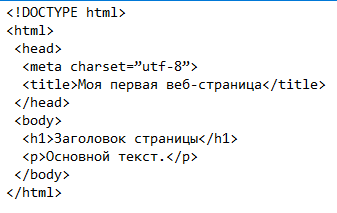

Чтобы посмотреть результат примера в действии, проделайте следующие шаги.
1. В Windows откройте программу Блокнот (Пуск > Выполнить > набрать «notepad» или Пуск > Программы > Стандартные > Блокнот).
2. Наберите код в Блокноте (рис. 1.1).

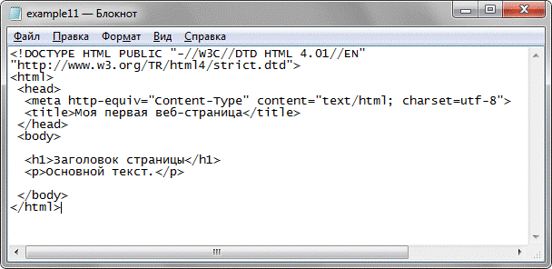 

Рис. 1.1. Вид HTML-кода в программе Блокнот

3. Сохраните готовый документ (Файл > Сохранить как...) под именем example11.html, при этом обязательно поставьте в диалоговом окне сохранения тип файла: Все файлы и кодировку UTF-8 (рис. 1.2). Обратите внимание, что расширение у файла должно быть именно html.

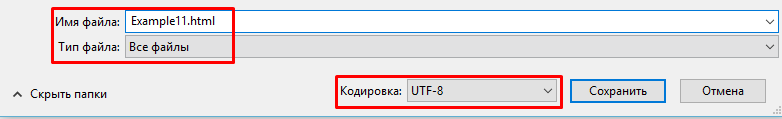

Рис. 1.2. Параметры сохранения файла в Блокноте

4. Откройте ваш документ с помощью любого браузера(например, Google Chrome)

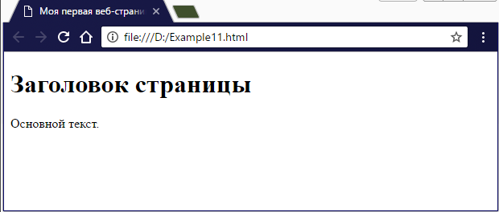

Рис. 1.3. Вид веб-страницы в окне браузера

В случае возникновения каких-либо ошибок проверьте правильность набора кода согласно примеру 1.1, расширение файла (должно быть html) и путь к документу.

## Пример 1.2.

В блокноте или Notepad++ наберите пример второй веб страницы. Сохраните под именем Example12.html

В качестве фона и картинок используйте любые изображения с компьютера.

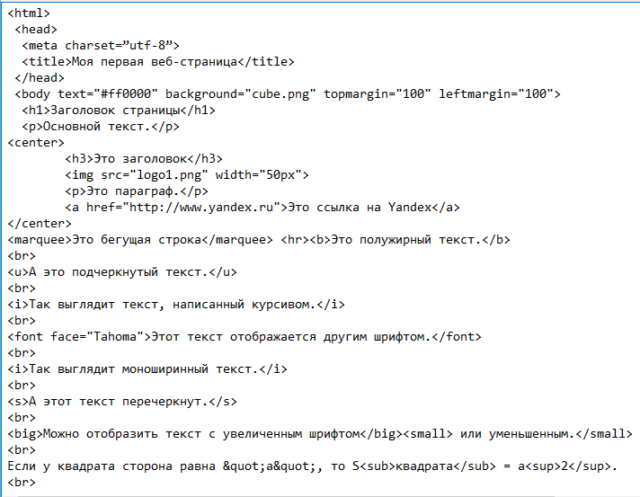

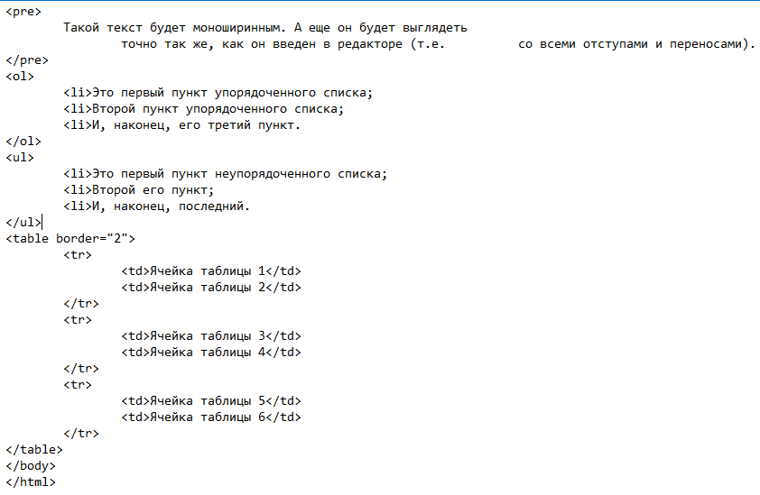

## ПРИМЕР 1.3.

Скопируйте Вашу страницу под другим именем (можно в ту же самую папку).

Откройте ее в редакторе и удалите из тега body все элементы кроме картинки.

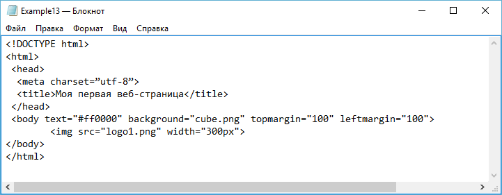 

Веб-страница 

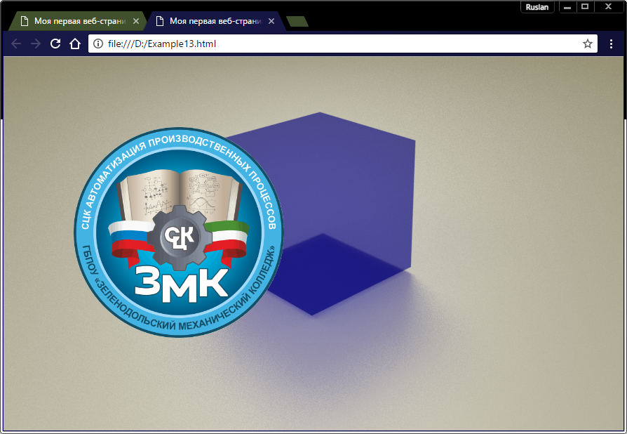 

Посмотрите что получилось. Заметьте, что картинка не прилегает к краю страницы. Это можно исправить с помощью параметров topmargin и leftmargin в теге body. Попробуйте установить эти параметры в нулевое значение.

Измените цвета страницы. Установите для нее темный фон и белые буквы.
 
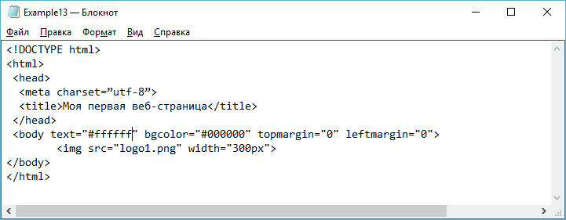

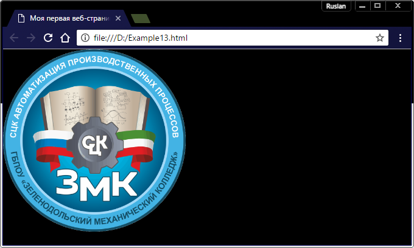

## ПРИМЕР 1.4
Полученных знаний уже достаточно для того, чтобы начать создание собственного сайта. Предлагаю сделать сайт о себе любимом. Главная страница будет содержать логотип/заголовок, меню со ссылками на другие разделы сайта и краткую информацию о себе в виде основного текста. Пока всё. По мере прохождения теории будем добавлять новые элементы.

Определите, каким будет фон Вашего сайта (желательно светлый) и задайте его.

Если Вы выбрали темный фон, то измените цвет текста по умолчанию на светлый.

Напишите основной текст в теге <body>. Это может быть приветствие, Ваша автобиография или размышления на любую тему.

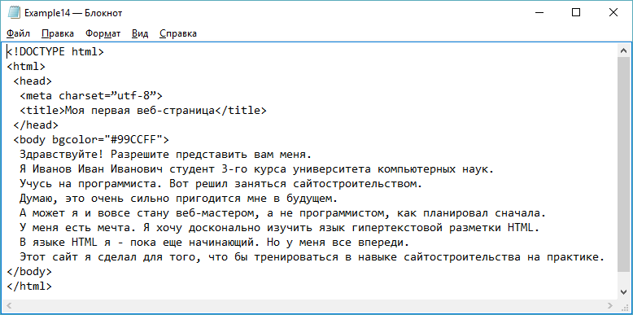 

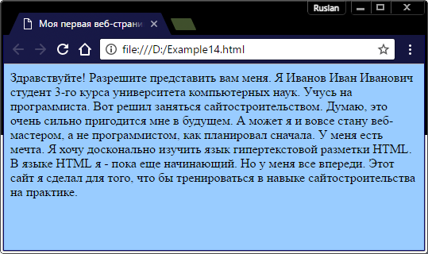 

Попробуйте в качестве фона задать изображение. Обычно файлы изображений хранятся в отдельной внутренней папке. Такая папка может называться, например, Images. Создайте такую подпапку в папке своего сайта.

Теперь добавьте в эту папку какое-нибудь изображение. Это должен быть файл с расширением gif или jpg. Файл желательно переименовать, чтобы из названия было понятно, для чего он используется.

Теперь задайте изображение для фона Вашей странички. Вы уже знаете, как это сделать.

Посмотрите на результат. Если в качестве фона Вы выбрали какую-нибудь яркую картинку, к тому же небольшого размера, то страница будет выглядеть не очень привлекательно. Для того, чтобы фон смотрелся более гармонично, найдите в Интернете какую-нибудь ненавязчивую текстуру в тон Вашему фону. Особенно хорошо подойдет бесшовная текстура. Искать такие изображения можно в Google-картинках. Цвет фона лучше оставить заданным. Это нужно для того, чтобы в случае неудачи при загрузке изображения фона в браузере он хотя бы примерно выглядел в нужном тоне.

Текстуру для фона страницы можно создать и самому. Если Вы умеете работать в каком-нибудь графическом редакторе (например, Photoshop), то сможете создать узкую полоску в виде градиента (мягкого перехода одно цвета в другой) по вертикали. Такую полосу можно сделать шириной в один пиксель. При установке в фоне страницы изображение будет повторяться и это создаст впечатление сплошного фона, заполняющего всю страницу. Поэкспериментируйте.
 
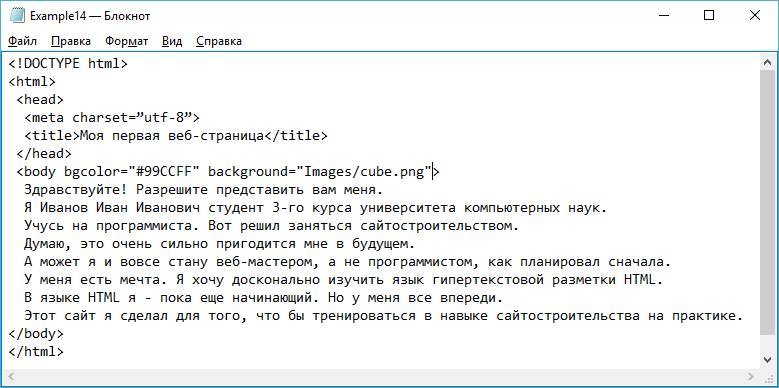
