# 🧪 Практическая работа №2: Структура HTML-документа 🌐

---

# 📌 Формат сдачи практической работы

> ⚠️ **ВНИМАНИЕ! РАБОТА СДАЕТСЯ ТОЛЬКО ЧЕРЕЗ GOOGLE ФОРМУ**

### 📅 Срок сдачи: **до 23:59 24 февраля 2026 года**

### 🔗 Ссылки для сдачи (выберите свою группу):

| Группа | Ссылка на Google Форму |
|--------|------------------------|
| **245 группа** | ➡️ [https://forms.gle/sfKgi4jTPt8K98hw5](https://forms.gle/sfKgi4jTPt8K98hw5) |
| **247 группа** | ➡️ [https://forms.gle/vcCPrbTLkgmiUAe97](https://forms.gle/vcCPrbTLkgmiUAe97) |

### 📋 Что нужно указать в форме:

1. **ФИО** — выбрать из списка
2. **Номер работы** — указать **Практическая работа №2**
3. **Ссылка на GitHub репозиторий** — вставить ссылку на ваш проект

---

## 📁 Пример 1.1. Создание первой веб-страницы

> Цель: научиться создавать простейший HTML-документ и открывать его в браузере.

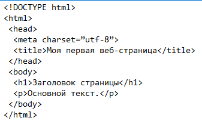

### 📋 Пошаговая инструкция:

1. **Откройте Блокнот:**
   - `Пуск` → `Выполнить` → введите `notepad`  
   *или* `Пуск` → `Программы` → `Стандартные` → `Блокнот`

2. **Наберите HTML-код:**
   
   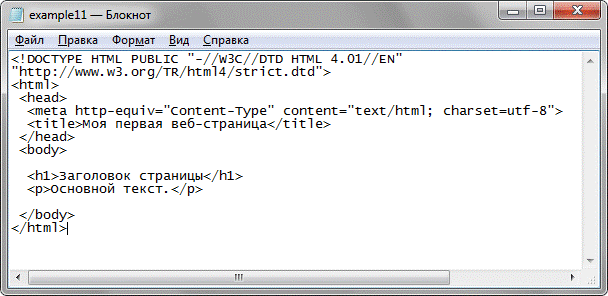  
   *Рис. 1.1. Вид HTML-кода в программе Блокнот*

3. **💾 Сохраните файл:**
   - `Файл` → `Сохранить как...`
   - Имя файла: `example11.html`
   - Тип файла: **Все файлы**
   - Кодировка: **UTF-8**
   
   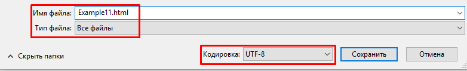  
   *Рис. 1.2. Параметры сохранения файла в Блокноте*

   ⚠️ *Важно! Расширение должно быть именно `.html`*

4. **▶️ Откройте в браузере:**
   - Дважды кликните по файлу или откройте через меню браузера

   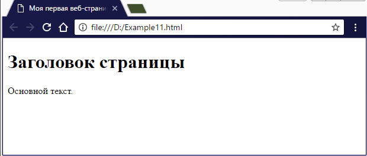  
   *Рис. 1.3. Вид веб-страницы в окне браузера*

---

## 🖼️ Пример 1.2. Страница с изображениями

> Добавляем изображения и настраиваем фон

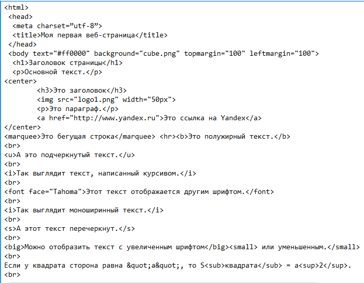

**📝 Задание:**
- Создайте вторую веб-страницу в Блокноте или Notepad++
- Сохраните как `Example12.html`
- Используйте **любые изображения** с вашего компьютера в качестве фона и контента

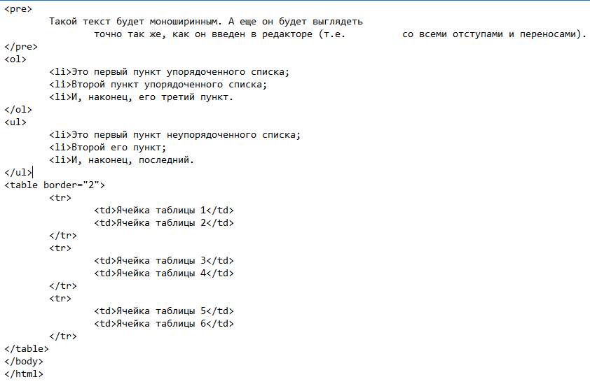

---

## 🎨 Пример 1.3. Настройка внешнего вида

> Экспериментируем с отступами и цветовой схемой

### Шаг 1️⃣: Создаем копию
- Скопируйте вашу страницу под другим именем (в ту же папку)

### Шаг 2️⃣: Очищаем содержимое
- Удалите из тега `<body>` **все элементы**, кроме картинки

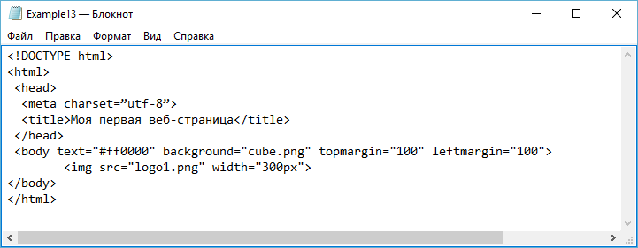  
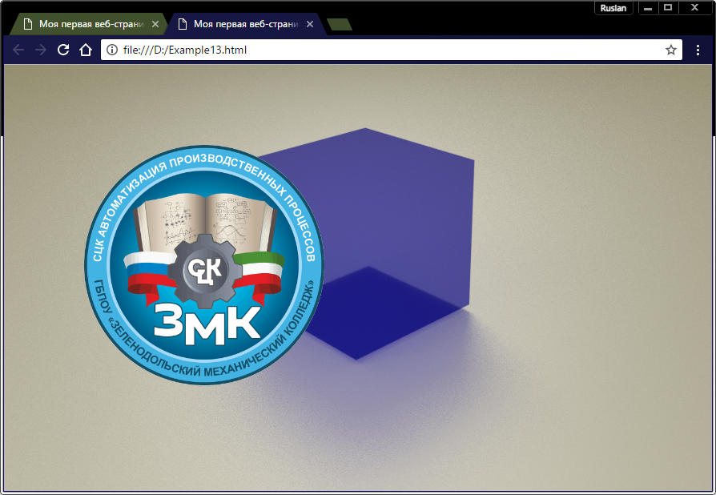

### Шаг 3️⃣: Убираем отступы
🔍 Заметили? Картинка не прилегает к краю страницы. Исправим:

```html
<body topmargin="0" leftmargin="0">
```

### Шаг 4️⃣: Меняем цветовую схему
- Установите **темный фон** и **белый текст**

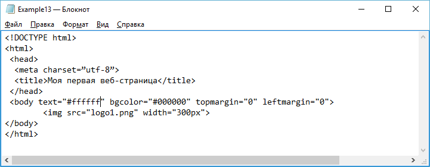  
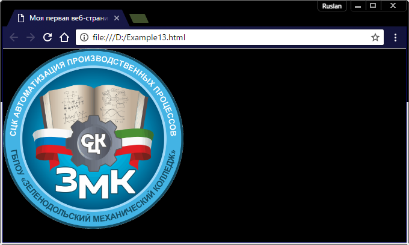

---

## ✨ САМОСТОЯТЕЛЬНОЕ ЗАДАНИЕ

### 🧑‍💻 Создаем сайт "О себе"

> Ура! Уже достаточно знаний, чтобы начать создавать **личный сайт**! 🚀

### 📌 План действий:

#### 1️⃣ **Базовая структура главной страницы:**
- Логотип/заголовок
- Меню со ссылками на другие разделы
- Основной текст (краткая информация о себе)

#### 2️⃣ **Настройка фона:**
- Выберите **светлый фон** (или темный — тогда не забудьте изменить цвет текста)

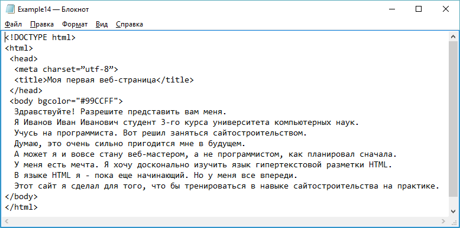  
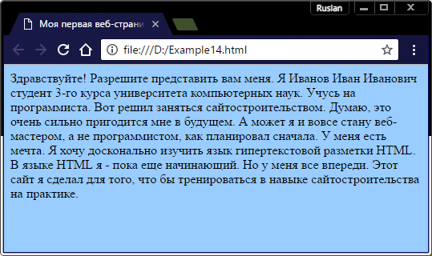

#### 3️⃣ **Добавляем контент:**
- Напишите приветствие, автобиографию или размышления в теге `<body>`

#### 4️⃣ **Работа с фоновым изображением:**

📁 **Структура папок:**
```
Мой_сайт/
├── index.html
└── Images/
    └── my_background.jpg
```

🔧 **Настройка:**
1. Создайте папку `Images` в папке сайта
2. Добавьте туда изображение (`.gif` или `.jpg`)
3. Переименуйте файл понятным именем
4. Задайте его как фон:

```html
<body background="Images/my_background.jpg" bgcolor="#F0F0F0">
```

💡 *Совет: цвет фона лучше оставить — на случай, если изображение не загрузится*

#### 5️⃣ **Поиск идеальной текстуры:**

🌐 Где искать:
- Google Картинки → запрос "бесшовная текстура фон"
- Ищите ненавязчивые, спокойные текстуры в тон вашему фону

#### 6️⃣ **Бонус: создаем градиент своими руками** 🎨

Если умеете работать в Photoshop или другом редакторе:
- Создайте узкую полоску (шириной **1 пиксель**) с вертикальным градиентом
- При установке в фон она будет повторяться, создавая эффект плавного перехода

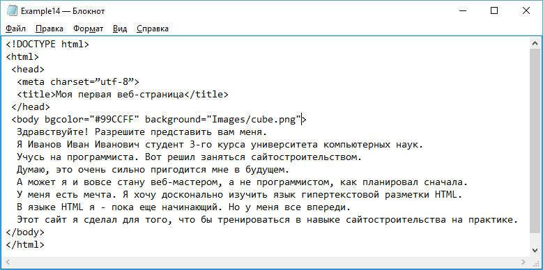

---

### 🏆 **Результат работы:**
У вас должна получиться стильная страница с продуманным фоном, приятной цветовой гаммой и интересным текстовым наполнением. По мере изучения новых тем мы будем дополнять этот сайт! 🚀

---

## ❗️ Важно! Перед отправкой проверьте:

✅ Все файлы загружены в GitHub репозиторий  
✅ Репозиторий открыт (публичный)  
✅ В форме указана **прямая ссылка** на репозиторий  
✅ Работа сдана **до 23:59 24 февраля**

📬 **Удачи в выполнении!** 💪😊
