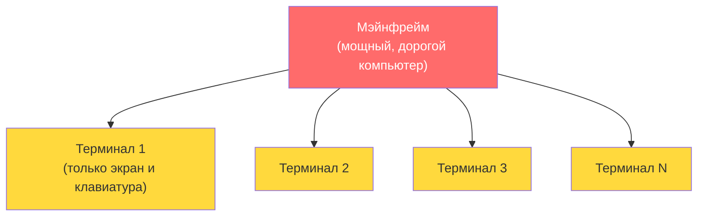
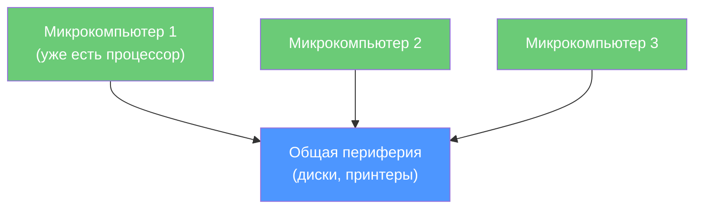
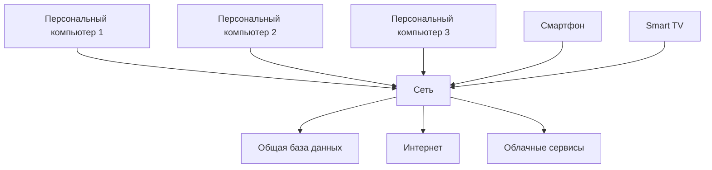
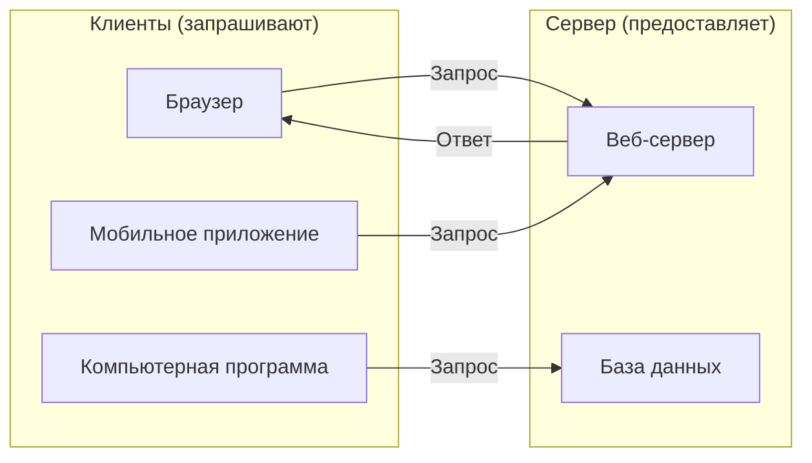
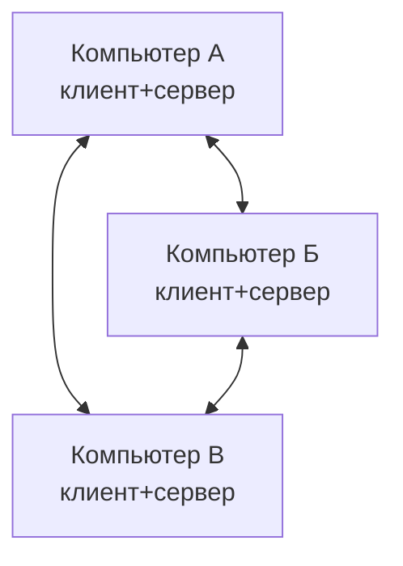
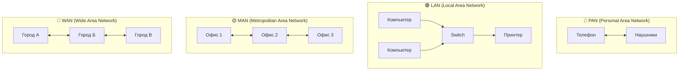
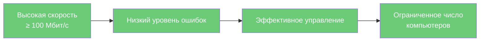
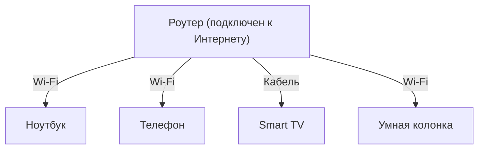

## УРОК 1. ВВЕДЕНИЕ В КОМПЬЮТЕРНЫЕ СЕТИ (ПОЛНАЯ ВЕРСИЯ)

| **Предыдущее занятие** | | **Следующее занятие** |
|:---:|:---:|:---:|
| [В начало](../README.md) | [Содержание](../README.md) | [Урок 2. Классификация сетей по топологии](../lesson_02/lecture_02.md) |

---

**Преподаватель:** Сафиулин Р.Р.  
**Дисциплина:** ОП.11 Компьютерные сети  
**Семестр:** 1

---

# 📑 Оглавление

1. [🎯 Цели урока](#-цели-урока)
2. [📖 Что такое компьютерная сеть?](#-1-что-такое-компьютерная-сеть-на-самом-деле)
3. [📖 Как сети меняли мир: история в 4 этапах](#-2-как-сети-меняли-мир-история-в-4-этапах)
4. [📖 Первая передача данных: 29 октября 1969 года](#-25-первая-передача-данных-по-сети-29-октября-1969-года)
5. [📖 Кто изобрёл Интернет и WWW?](#-3-кто-изобрёл-интернет-и-www-важные-даты)
6. [📖 Архитектура клиент-сервер](#-4-архитектура-сетей-клиент-сервер)
7. [📖 Одноранговые сети (Peer-to-Peer)](#-5-одноранговые-сети-peer-to-peer)
8. [📖 Зачем нужны сети? Плюсы и минусы](#-6-зачем-нужны-сети-плюсы-и-минусы)
9. [📖 Виды сетей по размеру](#-7-виды-сетей-от-вашей-гарнитуры-до-всего-интернета)
10. [📖 LAN vs WAN](#-8-отличительные-признаки-локальной-и-глобальной-сети)
11. [📖 Ключевые технологии курса](#-9-ключевые-технологии-которые-вы-будете-изучать-в-курсе)
12. [📖 Тренды будущего](#-10-куда-движутся-сети-тренды-которые-меняют-всё)
13. [🖥️ Практическое задание](#-практическое-задание-выполняется-на-занятии)
14. [📝 Домашнее задание](#-домашнее-задание)
15. [🔗 Ссылки для студентов](#-ссылки-для-студентов)

---

### 🎯 Цели урока

После изучения этого урока вы сможете:

1. Объяснить, что такое компьютерная сеть простыми словами
2. Рассказать, как сети изменили мир за последние 50 лет
3. Назвать основные виды сетей и привести примеры из жизни
4. Объяснить, что такое клиент-серверная архитектура и как она работает
5. Рассказать, кто изобрёл World Wide Web и как это изменило мир
6. Перечислить современные технологии, которые определяют будущее сетей
7. Понять, почему знание сетей — это базовая компетенция любого IT-специалиста

---

### 📖 1. Что такое компьютерная сеть на самом деле?

**Компьютерная сеть** — это совокупность программных и аппаратных средств для передачи информации между узлами. Узлом может быть компьютер, телефон, умная колонка, холодильник или любое другое устройство, которое вырабатывает, преобразует или потребляет информацию.

> **Простыми словами:** Сеть — это то, что соединяет всё со всем. Она невидима, как воздух, но без неё современный мир просто перестанет существовать.

#### Сети вокруг нас: быстрый тест

Поднимите руку, если сегодня вы:
- Отправили сообщение в мессенджере
- Посмотрели видео на YouTube или TikTok
- Заказали еду или такси через приложение
- Включили музыку через колонку по Wi-Fi

**Вот это всё — работа компьютерных сетей.**

---

### 📖 2. Как сети меняли мир: история в 4 этапах

Понимание истории помогает увидеть, куда мы движемся. Выделяют четыре основных этапа развития сетей.

#### 🔹 Этап 0. До появления сетей (1940-1960-е)

Первые компьютеры были автономными машинами. Для передачи данных использовались перфокарты, магнитные ленты — физические носители. Это было медленно и неудобно.

> **Важно:** Именно неудобство обмена данными привело к созданию первых компьютерных сетей.

---

#### 🔹 Этап 1. Эпоха мейнфреймов и терминалов (1960-1970-е)



В 1960-х годах компьютеры были размером с комнату и стоили миллионы долларов. К ним подключали **терминалы** — простые устройства с экраном и клавиатурой, без собственного процессора. Пользователи работали по очереди: большой компьютер решал их задачи последовательно. Это называлось **режимом разделения времени**. Идея была гениальной: один суперкомпьютер обслуживал сотни пользователей.

> **Ключевое понятие:** В этой модели весь «интеллект» был сосредоточен в одном мощном компьютере, а терминалы были просто «окнами» к нему.

---

#### 🔹 Этап 2. Микрокомпьютеры и совместная периферия (1970-1980-е)



Микропроцессоры стали доступными, и компьютеры подешевели. Но периферия (диски, принтеры) оставалась дорогой. Решение? Объединить компьютеры в сеть, чтобы они могли использовать общие ресурсы. Это называлось **режимом обратного разделения времени**: компьютеры работают сами, но делят дорогое оборудование.

> **Ключевое понятие:** Здесь уже каждый компьютер имеет свой «интеллект», но они объединяются для совместного использования дорогих устройств.

---

#### 🔹 Этап 3. Персональные компьютеры и Интернет (1980-е — наши дни)



Всё изменилось в 1980-х. Персональные компьютеры стали доступными, периферия подешевела. Возник вопрос: зачем соединять ПК, если у каждого уже всё есть? Ответ оказался неожиданным: **обмен данными**, **общие базы данных**, **совместная работа**. А затем появился Интернет, и сети перестали быть просто «проводами в офисе» — они стали глобальной нервной системой человечества.

> **Ключевая мысль:** Сети прошли путь от «дорогой компьютер для многих» к «много компьютеров для одного человека». Теперь у каждого из нас в кармане устройство, которое мощнее мэйнфреймов 1960-х годов, и оно подключено к глобальной сети.

---


### 📖 2.5. Первая передача данных по сети: 29 октября 1969 года

Этот день считается днём рождения современного Интернета.

#### Что такое ARPANET?

В 1960-х годах Министерство обороны США искало способ создать надёжную систему связи, которая продолжала бы работать даже в случае ядерной атаки. Учёные предложили **децентрализованную сеть**, где информация передавалась бы не через один центр, а по разным маршрутам.

Проект получил название **ARPANET** (от ARPA — агентство передовых исследовательских проектов США).

**Сравнение сетей:**

| Характеристика | Традиционная сеть | ARPANET |
|:---|:---|:---|
| Структура | Централизованная | Децентрализованная |
| Надёжность | Низкая (один центр) | Высокая (много узлов) |
| Отказоустойчивость | ❌ При уничтожении центра сеть мертва | ✅ Данные идут другими путями |

---

#### 🗓️ 29 октября 1969 года. 22:30

| Характеристика | Значение |
|:---|:---|
| **Дата** | 29 октября 1969 года |
| **Время** | 22:30 |
| **Откуда** | Университет Калифорнии (UCLA) |
| **Куда** | Стэнфордский исследовательский институт (SRI) |
| **Расстояние** | Около 560 км |
| **Что передавали** | Команду "LOGIN" (вход в систему) |
| **Что получили** | "LO" (система упала на третьей букве) |

---

#### Как это происходило:

```
┌─────────────────────────────────────────────────────────────────┐
│              29 октября 1969 года, 22:30                       │
├─────────────────────────────────────────────────────────────────┤
│                                                                 │
│  ┌─────────────┐    ┌─────────────┐    ┌─────────────────────┐ │
│  │   UCLA      │    │   ARPANET   │    │   SRI (Стэнфорд)    │ │
│  │   Чарли     │───→│   сеть      │───→│   компьютер         │ │
│  │   Клайн     │    │   (560 км)  │    │                     │ │
│  └─────────────┘    └─────────────┘    └─────────────────────┘ │
│                                                                 │
│  Этапы передачи:                                               │
│  1. Передана буква "L"  → ✅ Получено                          │
│  2. Передана буква "O"  → ✅ Получено                          │
│  3. Передана буква "G"  → ❌ СИСТЕМА УПАЛА!                    │
│                                                                 │
│  Результат: Первое сообщение в истории Интернета: "LO"         │
└─────────────────────────────────────────────────────────────────┘
```

**Подробности:**

1. Чарли Клайн (студент UCLA) сидел за терминалом и набирал команду **"LOGIN"** для входа в компьютер в Стэнфорде.

2. Он передал букву **"L"** — она успешно дошла.

3. Передал букву **"O"** — она тоже успешно дошла. На экране в Стэнфорде появилось "LO".

4. Затем он попытался передать букву **"G"** — и в этот момент система упала. Связь оборвалась.

> **Первое сообщение в истории Интернета было незавершённым словом "LO" вместо "LOGIN".**

Через час учёные восстановили систему и передали полное слово "LOGIN" уже без проблем.

---

#### Почему это важно?

| Что произошло | Значение |
|:---|:---|
| Первая передача данных между удалёнными компьютерами | Доказано, что компьютеры могут общаться на расстоянии |
| Децентрализованная архитектура | Сеть может работать даже при отказе отдельных узлов |
| Использование пакетной передачи | Данные разбиваются на части и передаются независимо |
| Зарождение Интернета | От ARPANET вырос современный Интернет |

---

#### Как это выглядело в цифрах:

| Характеристика | 1969 год | Сегодня |
|:---|:---|:---|
| Скорость сети | 50 Кбит/с | 1 Гбит/с (в 20 000 раз быстрее) |
| Количество узлов | 4 | Миллиарды устройств |
| Первое сообщение | 3 буквы ("LO") | Петабайты данных в секунду |

---

#### Что было дальше?

| Год | Событие |
|:---|:---|
| **1969** | Первая передача данных — "LO" (ARPANET) |
| **1971** | Появление электронной почты (Рэй Томлинсон) |
| **1973** | Начало разработки протокола TCP/IP |
| **1983** | Переход на TCP/IP — рождение современного Интернета |
| **1989** | Тим Бернерс-Ли изобретает WWW |
| **1991** | Первый веб-сайт |

---

#### Вопросы для обсуждения со студентами:

1. **"Как вы думаете, что чувствовал Чарли Клайн, когда система упала на третьей букве?"**

2. **"Представьте, что вы — учёный в 1969 году. Как бы вы объяснили своему начальнику, почему вы потратили час на передачу трёх букв?"**

3. **"Сколько времени сейчас нужно, чтобы передать 'LO'? (меньше миллисекунды)"**

---


### 📖 3. Кто изобрёл Интернет и WWW? Важные даты

Часто путают понятия «Интернет» и «Всемирная паутина» (WWW). Это разные вещи:

| Понятие | Что это | Кто создал | Когда |
|:---|:---|:---|:---|
| **Интернет** | Физическая сеть, соединяющая компьютеры по всему миру | Винт Серф и Боб Кан (разработали протокол TCP/IP) | 1973-1983 |
| **WWW** | Система гипертекстовых документов, доступных через Интернет | **Тим Бернерс-Ли** (работал в CERN) | **1989-1991** |

#### Что сделал Тим Бернерс-Ли?

В 1989 году, работая в европейской лаборатории CERN, Тим Бернерс-Ли предложил систему, которая позволяла учёным легко обмениваться документами через Интернет. Он разработал:

1. **Язык HTML** — для создания веб-страниц
2. **Протокол HTTP** — для передачи веб-страниц
3. **URL** — адреса для идентификации документов
4. **Первый веб-браузер** и первый веб-сервер

В 1991 году мир увидел первый веб-сайт. С этого момента Интернет перестал быть только инструментом для учёных и военных — он стал доступен всем.

> **Запомните:** Интернет — это дорога, а WWW — это машины, которые по ней ездят.

---

### 📖 4. Архитектура сетей: клиент-сервер

Это одна из самых важных концепций в компьютерных сетях. **Клиент-серверная архитектура** — это модель взаимодействия, в которой одна сторона (клиент) запрашивает ресурсы, а другая сторона (сервер) предоставляет их.

#### Термины:

| Термин | Что это | Пример |
|:---|:---|:---|
| **Клиент** | Устройство или программа, которая запрашивает ресурсы | Ваш браузер, мобильное приложение |
| **Сервер** | Устройство или программа, которая предоставляет ресурсы | Веб-сервер, почтовый сервер |



#### Как это работает на примере:

Вы открываете браузер и вводите адрес сайта. Что происходит?

```
1. Ваш браузер (КЛИЕНТ) отправляет запрос к веб-серверу
2. Веб-сервер (СЕРВЕР) обрабатывает запрос
3. Сервер отправляет обратно HTML-страницу
4. Ваш браузер отображает эту страницу
```

| Шаг | Кто | Что делает |
|:---:|:---|:---|
| 1 | Клиент (браузер) | Отправляет запрос: "Дай мне страницу example.com" |
| 2 | Сервер | Получает запрос, находит страницу |
| 3 | Сервер | Отправляет страницу обратно клиенту |
| 4 | Клиент (браузер) | Показывает страницу пользователю |

#### Типы серверов:

| Тип сервера | Что предоставляет | Пример |
|:---|:---|:---|
| **Файловый сервер** | Хранит и предоставляет файлы | Общая папка в офисе |
| **Веб-сервер** | Хранит веб-страницы | Apache, Nginx |
| **Почтовый сервер** | Обрабатывает электронную почту | SMTP, POP3 |
| **Сервер баз данных** | Хранит и обрабатывает данные | MySQL, PostgreSQL |

---

### 📖 5. Одноранговые сети (Peer-to-Peer)

В отличие от клиент-серверной модели, в **одноранговых сетях** все компьютеры равноправны. Каждый компьютер может одновременно быть и клиентом, и сервером.



**Примеры одноранговых сетей:**

| Пример | Как работает |
|:---|:---|
| **BitTorrent** | Каждый пользователь одновременно скачивает и раздаёт файлы |
| **Домашняя сеть** (без сервера) | Все компьютеры равноправны, могут обмениваться файлами |
| **Skype** (ранние версии) | Пользователи обменивались данными напрямую |

---

### 📖 6. Зачем нужны сети? Плюсы и минусы

#### ✅ Преимущества (что мы получили)

| Что | Пример из жизни |
|:---|:---|
| **Обмен данными** | Отправить файл коллеге за секунду |
| **Совместное использование ресурсов** | Один принтер на весь офис, общее облачное хранилище |
| **Общие базы данных** | Складской учёт в реальном времени, онлайн-банкинг |
| **Удалённый доступ** | Работа из дома, учёба онлайн |
| **Синхронизация** | Совместная работа над документами в Google Docs |
| **Новые сервисы** | Соцсети, видеозвонки, онлайн-игры, стриминг |

#### ❌ Недостатки (что мы потеряли)

| Что | Пример |
|:---|:---|
| **Финансовые затраты** | Оборудование, кабели, лицензии на ПО, оплата интернета |
| **Снижение безопасности** | Вирусы, хакеры, утечки данных, фишинг |
| **Зависимость от сети** | Если сеть упала — работа остановлена |
| **Нужны специалисты** | Системные администраторы, сетевые инженеры — дефицитная профессия |

> 💡 **Важно:** Мы платим за удобство безопасностью и зависимостью. Задача сетевого инженера — сделать сети надёжными и защищёнными.

---

### 📖 7. Виды сетей: от вашей гарнитуры до всего Интернета

Классификация сетей по размеру — это базовое знание, которое нужно каждому.

| Тип | Название | Размер | Пример |
|:---:|:---|:---:|:---|
| **PAN** | Personal Area Network | 1-10 м | Bluetooth-гарнитура, умные часы ↔ телефон |
| **LAN** | Local Area Network | Одно здание | Сеть в колледже, домашний Wi-Fi |
| **MAN** | Metropolitan Area Network | Город | Городская сеть, кампус университета |
| **WAN** | Wide Area Network | Страна/мир | Интернет, сеть банка между городами |



> **Важно:** В современном мире границы между LAN и WAN стираются. Локальная сеть компании может соединять офисы в разных городах через высокоскоростные каналы. Это называется **конвергенцией сетей**.

---

### 📖 8. Отличительные признаки локальной и глобальной сети

#### Локальная сеть (LAN)



#### Глобальная сеть (WAN)


**Важное замечание:** Глобальные сети исторически появились раньше локальных! Первая сеть передачи данных SAGE появилась в США ещё в 1947 году, а локальные сети стали массовыми только в 1980-х годах.

---

### 📖 9. Ключевые технологии, которые вы будете изучать в курсе

| Технология | Что это | Почему важно |
|:---|:---|:---|
| **Ethernet** | Стандарт для локальных сетей | Это основа 90% сетей в мире |
| **Wi-Fi (802.11)** | Беспроводная связь | Как вы сейчас сидите в интернете |
| **TCP/IP** | Протоколы передачи данных | Язык, на котором общается Интернет |
| **IP-адресация** | Как устройства находят друг друга | Без этого сети не работают |
| **Маршрутизация** | Как пакеты находят путь | Понимание, как работает Интернет |
| **VLAN** | Виртуальные сети | Как делят сеть между отделами |
| **Сетевая безопасность** | Защита данных | Почему взламывают и как защищаться |

---

### 📖 10. Куда движутся сети? Тренды, которые меняют всё

#### 🤖 Искусственный интеллект меняет сети

ИИ-агенты генерируют до 450% больше сетевого трафика, чем люди. К 2035 году четверть всего сетевого трафика будет создана ИИ-системами. Это означает, что сети должны стать гораздо быстрее и надёжнее, чем сейчас.

#### 🚀 Ethernet становится быстрее

Скорости растут экспоненциально:
- 1980-е: 10 Мбит/с
- 1990-е: 100 Мбит/с (Fast Ethernet)
- 2000-е: 1 Гбит/с (Gigabit Ethernet)
- 2010-е: 10 Гбит/с, 40 Гбит/с
- Сейчас: 400 Гбит/с, 800 Гбит/с
- В разработке: 1.6 Тбит/с

> Для сравнения: скачать фильм весом 10 ГБ при 1.6 Тбит/с займёт меньше секунды.

#### 📱 Сети становятся "умными"

Современные сети используют технологии SDN (программно-определяемые сети) и NFV (виртуализация сетевых функций). Это позволяет управлять сетью как программой, а не как набором железок.

#### 🔒 Безопасность становится главным приоритетом

С ростом количества подключённых устройств (интернет вещей) растут и угрозы. Современные сети используют технологии шифрования, аутентификации и мониторинга для защиты данных.

---

### 🖥️ Практическое задание (выполняется на занятии)

**Выполните в тетради или на компьютере:**

#### Задание 1. Анализ вашей сети

1. Нарисуйте схему своей домашней сети: какие устройства подключены, как они соединены (Wi-Fi или кабель), где находится роутер.
2. Определите, к какому типу (PAN/LAN/MAN/WAN) относится ваша домашняя сеть.
3. Подумайте, сколько устройств в вашем доме подключено к интернету.

#### Задание 2. Клиент-сервер в жизни

Приведите 3 примера использования клиент-серверной архитектуры в вашей повседневной жизни. Для каждого укажите, кто является клиентом, а кто — сервером.

| Пример | Клиент | Сервер |
|:---|:---|:---|
| 1. Просмотр YouTube | Ваш браузер/приложение | Сервер YouTube |
| 2. ... | ... | ... |
| 3. ... | ... | ... |

#### Задание 3. Обсуждение в группе

Обсудите с соседом по парте:
1. Что будет, если интернет отключат на день в вашем городе?
2. Какие сервисы перестанут работать?
3. Какие профессии связаны с поддержкой сетей?

---

### 📝 Домашнее задание

**Оформите в Microsoft Word (или Google Docs) и загрузите в Google Форму по ссылке от преподавателя.**

**Название файла:** `Фамилия_Имя_Урок01.docx`

#### Часть 1. Ответьте на вопросы (письменно)

1. Дайте определение компьютерной сети своими словами.
2. Какие три типа линий связи вы знаете? Приведите примеры.
3. Назовите 3 главных преимущества сетей в современной жизни.
4. Назовите 3 главных недостатка сетей.
5. Чем отличается локальная сеть от глобальной? Назовите минимум 2 отличия.
6. Расшифруйте аббревиатуры: LAN, WAN, MAN, PAN.
7. Почему знание сетей важно для IT-специалиста?
8. Кто изобрёл World Wide Web (WWW) и в каком году?
9. В чём разница между Интернетом и WWW?
10. Что такое клиент-серверная архитектура? Приведите пример.

#### Часть 2. Практическое задание

Приведите 3 примера сетей, с которыми вы сталкиваетесь в повседневной жизни. Для каждого укажите:

- Тип сети (PAN/LAN/MAN/WAN) — используйте таблицу из лекции
- Какие устройства подключены
- Для чего используется

**Пример:**

| Пример | Тип сети | Устройства | Для чего используется |
|:---|:---:|:---|:---|
| Bluetooth-гарнитура | PAN | Телефон + наушники | Прослушивание музыки, разговоры |
| Домашний Wi-Fi | LAN | Ноутбук, телефон, Smart TV | Выход в Интернет, обмен файлами |
| ... | ... | ... | ... |

#### Часть 3. Схема

Нарисуйте схему **своей домашней сети** (это проще, чем сеть колледжа). Укажите:

- Какие устройства подключены (компьютеры, телефоны, телевизоры, приставки, колонки)
- Как они соединены (по Wi-Fi или по кабелю)
- Где находится роутер (если есть)
- Есть ли выход в Интернет

**Как выполнить:**
- Можно нарисовать от руки и сфотографировать
- Можно нарисовать в любом редакторе (Paint, Word, онлайн-редактор)

**Пример схемы:**



#### Часть 4. Рефлексия (по желанию, для дополнительного балла)

Напишите 3-5 предложений:
- Что нового вы узнали из этого урока?
- Что было самым интересным?
- Есть ли вопросы, которые остались непонятными?

---

### 🔗 Ссылки для студентов

- **Google Форма для ДЗ:** [вставить ссылку]
- **Google Форма для теста:** [255 группа](https://forms.gle/dcsdUh8RG9kWMSpz5) [257 группа](https://forms.gle/YgLq7Z4Zi7Q69Pk36) 

---

| **Предыдущее занятие** | | **Следующее занятие** |
|:---:|:---:|:---:|
| [В начало](../README.md) | [Содержание](../README.md) | [Урок 2. Классификация сетей по топологии](../lesson_02/lecture_02.md) |

---
**Следующий урок:** Классификация сетей по топологии (Шина, Звезда, Кольцо и их применение в реальной жизни)
