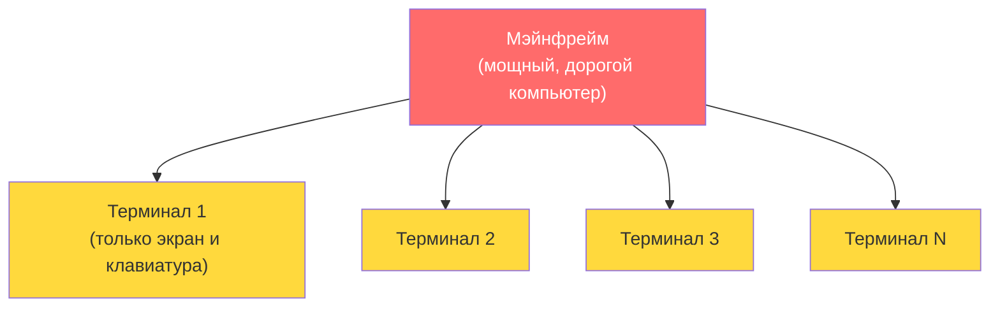
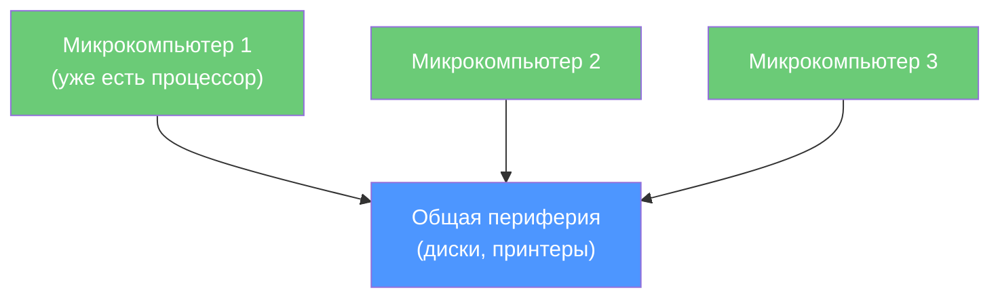
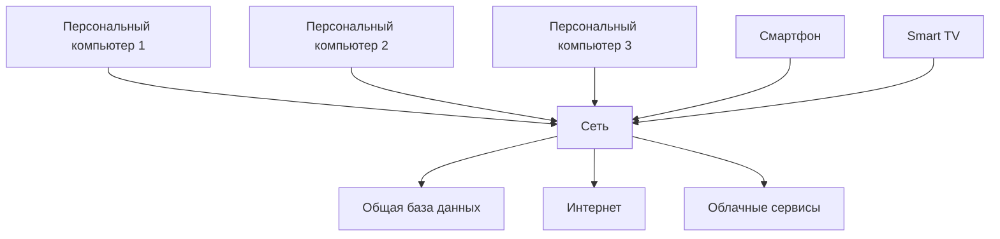
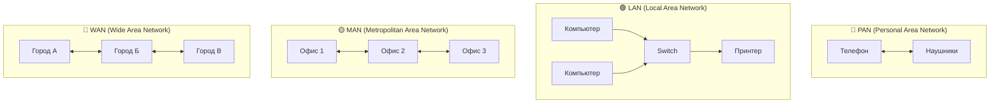

## УРОК 1. ВВЕДЕНИЕ В КОМПЬЮТЕРНЫЕ СЕТИ

| **Предыдущее занятие** | | **Следующее занятие** |
|:---:|:---:|:---:|
| [В начало](../README.md) | [Содержание](../README.md) | [Урок 2. Классификация сетей по топологии](../lesson_02/lecture_02.md) |

---

**Преподаватель:** Сафиулин Р.Р.  
**Дисциплина:** ОП.11 Компьютерные сети  
**Семестр:** 1

---

### 🎯 Цели урока

После изучения этого урока вы сможете:

1. Объяснить, что такое компьютерная сеть простыми словами
2. Рассказать, как сети изменили мир за последние 50 лет
3. Назвать основные виды сетей и привести примеры из жизни
4. Перечислить, какие современные технологии определяют будущее сетей
5. Понять, почему знание сетей — это базовая компетенция любого IT-специалиста

---

### 📖 1. Что такое компьютерная сеть на самом деле?

**Компьютерная сеть** — это совокупность программных и аппаратных средств для передачи информации между узлами. Узлом может быть компьютер, телефон, умная колонка, холодильник или любое другое устройство, которое вырабатывает, преобразует или потребляет информацию.

> **Простыми словами:** Сеть — это то, что соединяет всё со всем. Она невидима, как воздух, но без неё современный мир просто перестанет существовать.

#### Сети вокруг нас: быстрый тест

Поднимите руку, если сегодня вы:
- Отправили сообщение в мессенджере
- Посмотрели видео на YouTube или TikTok
- Заказали еду или такси через приложение
- Включили музыку через колонку по Wi-Fi

**Вот это всё — работа компьютерных сетей.**

---

### 📖 2. Как сети меняли мир: история в 3 этапах

Понимание истории помогает увидеть, куда мы движемся. Выделяют четыре основных этапа развития сетей.

#### 🔹 Этап 1. Эпоха мейнфреймов и терминалов (1960-1970-е)

В 1960-х годах компьютеры были размером с комнату и стоили миллионы долларов. К ним подключали терминалы — простые устройства с экраном и клавиатурой, без собственного процессора. Пользователи работали по очереди: большой компьютер решал их задачи последовательно. Это называлось **режимом разделения времени**. Идея была гениальной: один суперкомпьютер обслуживал сотни пользователей.

#### 🔹 Этап 2. Микрокомпьютеры и совместная периферия (1970-1980-е)

Микропроцессоры стали доступными, и компьютеры подешевели. Но периферия (диски, принтеры) оставалась дорогой. Решение? Объединить компьютеры в сеть, чтобы они могли использовать общие ресурсы. Это называлось **режимом обратного разделения времени**: компьютеры работают сами, но делят дорогое оборудование.

#### 🔹 Этап 3. Персональные компьютеры и Интернет (1980-е — наши дни)

Всё изменилось в 1980-х. Персональные компьютеры стали доступными, периферия подешевела. Возник вопрос: зачем соединять ПК, если у каждого уже всё есть? Ответ оказался неожиданным: **обмен данными**, **общие базы данных**, **совместная работа**. А затем появился Интернет, и сети перестали быть просто «проводами в офисе» — они стали глобальной нервной системой человечества.

**Ключевая мысль:** Сети прошли путь от «дорогой компьютер для многих» к «много компьютеров для одного человека». Теперь у каждого из нас в кармане устройство, которое мощнее мэйнфреймов 1960-х годов, и оно подключено к глобальной сети.

---

### 📖 3. Зачем нужны сети? Плюсы и минусы

#### ✅ Преимущества (что мы получили)

| Что | Пример из жизни |
|:---|:---|
| **Обмен данными** | Отправить файл коллеге за секунду |
| **Совместное использование ресурсов** | Один принтер на весь офис, общее облачное хранилище |
| **Общие базы данных** | Складской учёт в реальном времени, онлайн-банкинг |
| **Удалённый доступ** | Работа из дома, учёба онлайн |
| **Синхронизация** | Совместная работа над документами в Google Docs |
| **Новые сервисы** | Соцсети, видеозвонки, онлайн-игры, стриминг |

#### ❌ Недостатки (что мы потеряли)

| Что | Пример |
|:---|:---|
| **Финансовые затраты** | Оборудование, кабели, лицензии на ПО, оплата интернета |
| **Снижение безопасности** | Вирусы, хакеры, утечки данных, фишинг |
| **Зависимость от сети** | Если сеть упала — работа остановлена (и это больно) |
| **Нужны специалисты** | Системные администраторы, сетевые инженеры — дефицитная профессия |

> 💡 **Важно:** Мы платим за удобство безопасностью и зависимостью. Задача сетевого инженера — сделать сети надёжными и защищёнными.

---

### 📖 4. Виды сетей: от вашей гарнитуры до всего Интернета

Классификация сетей по размеру — это базовое знание, которое нужно каждому.

| Тип | Название | Размер | Пример |
|:---:|:---|:---:|:---|
| **PAN** | Personal Area Network | 1-10 м | Bluetooth-гарнитура, умные часы ↔ телефон |
| **LAN** | Local Area Network | Одно здание | Сеть в колледже, домашний Wi-Fi |
| **MAN** | Metropolitan Area Network | Город | Городская сеть, кампус университета |
| **WAN** | Wide Area Network | Страна/мир | Интернет, сеть банка между городами |

> **Важно:** В современном мире границы между LAN и WAN стираются. Локальная сеть компании может соединять офисы в разных городах через высокоскоростные каналы, а глобальные сети используют те же технологии, что и локальные. Это называется **конвергенцией сетей**.

---

### 📖 5. Отличительные признаки локальной и глобальной сети

#### Локальная сеть (LAN)

#### Глобальная сеть (WAN)

**Важное замечание:** Глобальные сети исторически появились раньше локальных! Первая сеть передачи данных SAGE появилась в США ещё в 1947 году, а локальные сети стали массовыми только в 1980-х годах.

---

### 📖 6. Ключевые технологии, которые вы будете изучать в курсе

Чтобы вы понимали, куда мы движемся в рамках курса:

| Технология | Что это | Почему важно |
|:---|:---|:---|
| **Ethernet** | Стандарт для локальных сетей | Это основа 90% сетей в мире |
| **Wi-Fi (802.11)** | Беспроводная связь | Как вы сейчас сидите в интернете |
| **TCP/IP** | Протоколы передачи данных | Язык, на котором общается Интернет |
| **IP-адресация** | Как устройства находят друг друга | Без этого сети не работают |
| **Маршрутизация** | Как пакеты находят путь | Понимание, как работает Интернет |
| **VLAN** | Виртуальные сети | Как делят сеть между отделами |
| **Сетевая безопасность** | Защита данных | Почему взламывают и как защищаться |

---

### 📖 7. Куда движутся сети? Тренды, которые меняют всё

Сети не стоят на месте. Вот что происходит прямо сейчас:

#### 🤖 Искусственный интеллект меняет сети

ИИ-агенты генерируют до 450% больше сетевого трафика, чем люди. К 2035 году четверть всего сетевого трафика будет создана ИИ-системами. Это означает, что сети должны стать гораздо быстрее и надёжнее, чем сейчас.

#### 🚀 Ethernet становится быстрее

Скорости растут экспоненциально:
- Раньше: 10 Мбит/с
- Сейчас: 400 Гбит/с, 800 Гбит/с
- В разработке: 1.6 Тбит/с

Для сравнения: скачать фильм весом 10 ГБ при 1.6 Тбит/с займёт меньше секунды. Это происходит благодаря новой технологии модуляции сигналов — PAM4, которая позволяет передавать в два раза больше данных на той же частоте.

#### 📱 Сети становятся "умными"

Современные сети используют технологии SDN (программно-определяемые сети) и NFV (виртуализация сетевых функций). Это позволяет управлять сетью как программой, а не как набором железок.

---

### 🖥️ Практическое задание (выполняется на занятии)

**Выполните в тетради или на компьютере:**

#### Задание 1. Анализ вашей сети

1. Нарисуйте схему своей домашней сети: какие устройства подключены, как они соединены (Wi-Fi или кабель), где находится роутер.
2. Определите, к какому типу (PAN/LAN/MAN/WAN) относится ваша домашняя сеть.
3. Подумайте, сколько устройств в вашем доме подключено к интернету.

#### Задание 2. Обсуждение в группе

Обсудите с соседом по парте:
1. Что будет, если интернет отключат на день в вашем городе?
2. Какие сервисы перестанут работать?
3. Как вы думаете, сколько времени вы сможете без интернета?

---

### 📝 Домашнее задание

**Оформите в Microsoft Word (или Google Docs) и загрузите в Google Форму по ссылке от преподавателя.**

**Название файла:** `Фамилия_Имя_Урок01.docx`

#### Часть 1. Ответьте на вопросы (письменно)

1. Дайте определение компьютерной сети своими словами.
2. Какие три типа линий связи вы знаете? Приведите примеры.
3. Назовите 3 главных преимущества сетей в современной жизни.
4. Назовите 3 главных недостатка сетей.
5. Чем отличается локальная сеть от глобальной? Назовите минимум 2 отличия.
6. Расшифруйте аббревиатуры: LAN, WAN, MAN, PAN.
7. Почему знание сетей важно для IT-специалиста?

#### Часть 2. Практическое задание

Приведите 3 примера сетей, с которыми вы сталкиваетесь в повседневной жизни. Для каждого укажите:
- Тип сети (PAN/LAN/MAN/WAN)
- Какие устройства подключены
- Для чего используется

#### Часть 3. Схема

Нарисуйте схему сети вашего колледжа или компьютерного класса (можно от руки и сфотографировать). Укажите:
- Какие устройства подключены
- Какая топология используется (звезда, шина, кольцо)
- Есть ли выход в Интернет

---

### 🔗 Ссылки для студентов

- **Google Форма для ДЗ:** [вставить ссылку]
- **Google Форма для теста:** [вставить ссылку]
- **Cisco Packet Tracer (скачать):** https://www.netacad.com/courses/packet-tracer
- **Wireshark (скачать):** https://www.wireshark.org/

---

| **Предыдущее занятие** | | **Следующее занятие** |
|:---:|:---:|:---:|
| [В начало](../README.md) | [Содержание](../README.md) | [Урок 2. Классификация сетей по топологии](../lesson_02/lecture_02.md) |

---

**Следующий урок:** Классификация сетей по топологии (Шина, Звезда, Кольцо и их применение в реальной жизни)
