# УРОК 2. КЛАССИФИКАЦИЯ СЕТЕЙ ПО ТОПОЛОГИИ

| **Предыдущее занятие** | | **Следующее занятие** |
|:---:|:---:|:---:|
| [Урок 1. Введение в компьютерные сети](../lesson_01/lecture_01.md) | [Содержание](../README.md) | [Урок 3. Сетевое оборудование и кабели](../lesson_03/lecture_03.md) |

---

**Преподаватель:** Сафиулин Р.Р.  
**Дисциплина:** ОП.11 Компьютерные сети  
**Семестр:** 1

---

# 📑 Оглавление

1. [🎯 Цели урока](#-цели-урока)
2. [📖 Что такое топология сети?](#-1-что-такое-топология-сети)
3. [📖 Базовые топологии: обзор](#-2-базовые-топологии-обзор)
4. [📖 Топология «Шина» (Bus)](#-3-топология-шина-bus)
5. [📖 Топология «Звезда» (Star)](#-4-топология-звезда-star)
6. [📖 Топология «Кольцо» (Ring)](#-5-топология-кольцо-ring)
7. [📖 Производные топологии: дерево, звезда-шина, звезда-кольцо](#-6-производные-топологии)
8. [📖 Сеточная топология (Mesh)](#-7-сеточная-топология-mesh)
9. [📖 Многозначность понятия «топология»](#-8-многозначность-понятия-топология)
10. [📖 Сравнительная таблица топологий](#-9-сравнительная-таблица-топологий)
11. [🖥️ Практическое задание](#-практическое-задание-выполняется-на-занятии)
12. [📝 Домашнее задание](#-домашнее-задание)
13. [🔗 Ссылки для студентов](#-ссылки-для-студентов)

---

### 🎯 Цели урока

После изучения этого урока вы сможете:

1. Объяснить, что такое топология сети и почему это понятие важно
2. Назвать три базовые топологии: шина, звезда, кольцо
3. Описать преимущества и недостатки каждой топологии
4. Объяснить, как передаются данные в каждой из топологий
5. Понять, что такое коллизии и почему они возникают
6. Различать активную и пассивную звезду
7. Назвать производные топологии: дерево, звезда-шина, звезда-кольцо
8. Объяснить, что такое сеточная топология (mesh) и где она применяется
9. Различать физическую, логическую, управляющую и информационную топологию
10. Выбрать подходящую топологию для конкретной задачи

---

### 📖 1. Что такое топология сети?

**Топология** (от греч. *topos* — место, *logos* — учение) — это физическое расположение компьютеров сети друг относительно друга и способ соединения их линиями связи.

> **Простыми словами:** Топология — это схема, по которой компьютеры соединены в сеть. Как дороги на карте: можно ехать по одной широкой магистрали, а можно — по множеству маленьких улочек, сходящихся к центру.

#### Важное замечание

Понятие топологии относится прежде всего к **локальным сетям**, в которых структуру связей можно легко проследить. В глобальных сетях структура связей обычно скрыта от пользователей и не слишком важна, так как каждый сеанс связи может производиться по собственному пути.

#### Что определяет топология?

| Что определяет топология | Почему это важно |
|:---|:---|
| **Надёжность сети** | Что произойдёт, если один кабель порвётся? |
| **Стоимость** | Сколько кабеля нужно? Сколько оборудования? |
| **Скорость** | Как быстро данные доходят до адресата? |
| **Простота обслуживания** | Легко ли найти неисправность? |
| **Масштабируемость** | Можно ли добавить новый компьютер? |

---

### 📖 2. Базовые топологии: обзор

Существует три базовые топологии, от которых происходят все остальные:

| Топология | Принцип | Визуально |
|:---|:---|:---|
| **Шина (Bus)** | Все компьютеры подключены к одному общему кабелю | Одна длинная линия, к ней «прицеплены» компьютеры |
| **Звезда (Star)** | Все компьютеры подключены к одному центральному устройству | Центр, от которого лучи расходятся к компьютерам |
| **Кольцо (Ring)** | Каждый компьютер соединён с двумя соседними, образуя замкнутый круг | Замкнутая линия, проходящая через все компьютеры |

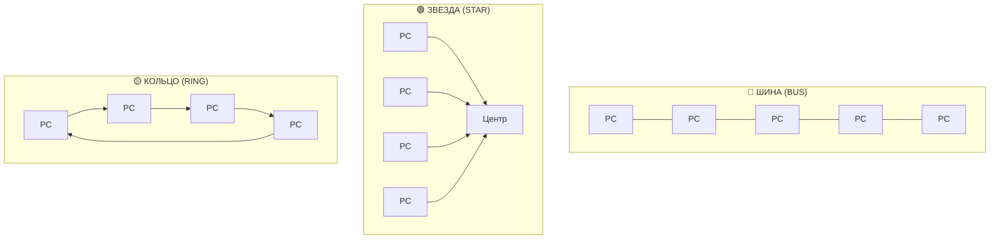

---

### 📖 3. Топология «Шина» (Bus)

#### Как это устроено

В топологии «общая шина» все компьютеры подключены к одному общему кабелю (шине). Кабель — один на всех, и данные, передаваемые одним компьютером, доступны всем остальным.

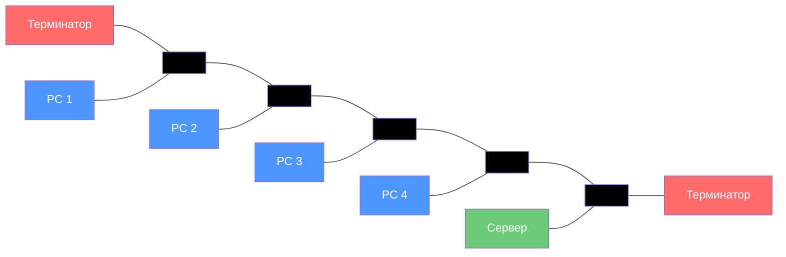

#### Ключевые особенности

1. **Идентичность оборудования** — все компьютеры равноправны, используют одинаковое сетевое оборудование
2. **Равноправие абонентов** — нет главного компьютера, все имеют равный доступ к сети
3. **Полудуплексный режим** — передача возможна в обоих направлениях, но по очереди, а не одновременно
4. **Терминаторы** — специальные согласующие устройства на концах шины

#### Почему нужны терминаторы?

Из-за особенностей распространения электрических сигналов по длинным линиям связи на концах шины необходимо устанавливать **терминаторы** — специальные согласующие устройства.

**Без терминаторов:** сигнал отражается от конца линии и искажается так, что связь по сети становится невозможной.

```
┌─────────────────────────────────────────────────────────────┐
│                    РАСПРОСТРАНЕНИЕ СИГНАЛА                   │
├─────────────────────────────────────────────────────────────┤
│                                                             │
│  Передатчик ────→ Сигнал ────→ Приёмник                    │
│                                                             │
│  Без терминатора:                                           │
│  Передатчик ────→ Сигнал ────→ Конец линии ────→ ОТРАЖЕНИЕ  │
│                                                             │
│  С терминатором:                                            │
│  Передатчик ────→ Сигнал ────→ Терминатор ────→ ПОГЛОЩЕНИЕ  │
│                                                             │
└─────────────────────────────────────────────────────────────┘
```

#### Как передаются данные

Компьютеры в шине могут передавать информацию **только по очереди**, так как линия связи в данном случае единственная.

**Что происходит при одновременной передаче?**

Если несколько компьютеров будут передавать информацию одновременно, она исказится в результате наложения — это называется **конфликтом** или **коллизией**.

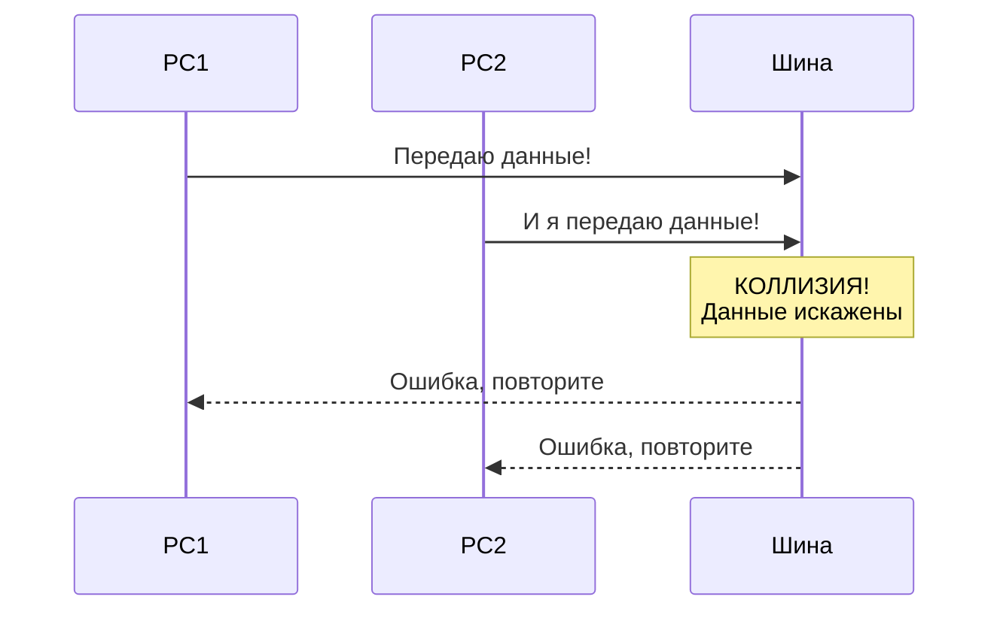

#### Преимущества и недостатки

| ✅ Преимущества | ❌ Недостатки |
|:---|:---|
| Простота конструкции | При разрыве шины сеть выходит из строя |
| Малый расход кабеля | Низкий уровень безопасности |
| Легко подключать рабочие станции | Один канал связи — передача по очереди |
| При выходе из строя РС сеть работает | Возможны конфликты (коллизии) |
| Нет центрального абонента (повышенная надёжность) | Сложно искать неисправности |
| Минимальное количество кабеля | Длина шины ограничена (затухание сигнала) |

#### Проблемы шины

**1. Обрыв кабеля**

```
┌─────────────────────────────────────────────────────────────┐
│                                                             │
│  PC1 ──── PC2 ──── PC3 ────✂──── PC4 ──── PC5              │
│                          ОБРЫВ                              │
│                                                             │
│  Результат: ВСЯ СЕТЬ НЕ РАБОТАЕТ                            │
│  (даже PC1, PC2, PC3 не могут общаться)                    │
│                                                             │
└─────────────────────────────────────────────────────────────┘
```

При разрыве или повреждении кабеля нарушается согласование линии связи и прекращается обмен даже между теми компьютерами, которые остались соединёнными между собой.

**2. Короткое замыкание**

Короткое замыкание в любой точке кабеля шины выводит из строя всю сеть.

**3. Отказ сетевого оборудования**

Отказ сетевого оборудования любого абонента в шине может вывести из строя всю сеть. Отказ довольно трудно локализовать, поскольку все абоненты включены параллельно, и понять, какой из них вышел из строя, невозможно.

**4. Затухание сигнала**

При прохождении по линии связи сети с топологией шина информационные сигналы ослабляются и никак не восстанавливаются, что накладывает жёсткие ограничения на суммарную длину линий связи.

#### Как увеличить длину сети?

Для увеличения длины сети с топологией шина часто используют несколько **сегментов** (частей сети, каждый из которых представляет собой шину), соединённых между собой с помощью специальных усилителей и восстановителей сигналов — **репитеров** или **повторителей**.

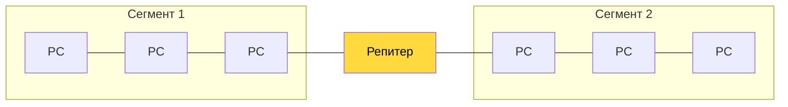

При соединении двух сегментов предельная длина сети возрастает до 2·Lпр, так как каждый из сегментов может быть длиной Lпр.

Однако такое наращивание длины сети не может продолжаться бесконечно. Ограничения на длину связаны с конечной скоростью распространения сигналов по линиям связи.

#### Где применялась шина?

- **Ethernet** (классический, 10BASE5, 10BASE2) — самая популярная сеть с топологией шина
- Благодаря широкому распространению этих сетей стоимость сетевого оборудования не слишком высока

---

### 📖 4. Топология «Звезда» (Star)

#### Как это устроено

**Звезда** — это единственная топология сети с явно выделенным центром, к которому подключаются все остальные абоненты. Обмен информацией идёт исключительно через центральный компьютер.

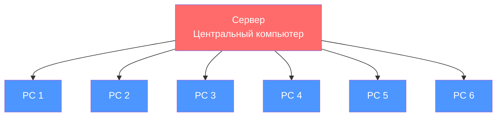

#### Активная и пассивная звезда

| Тип | Центральное устройство | Что делает центр |
|:---|:---|:---|
| **Активная звезда** | Компьютер (сервер) | Обрабатывает данные, управляет обменом |
| **Пассивная звезда** | Хаб (свитч) | Просто передаёт сигналы, не обрабатывает |

**Активная звезда:**

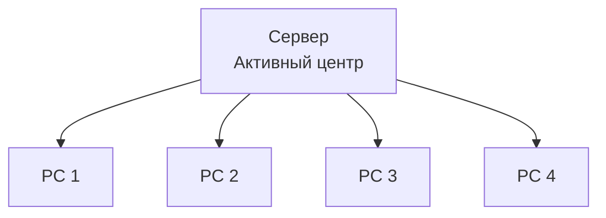

**Пассивная звезда:**

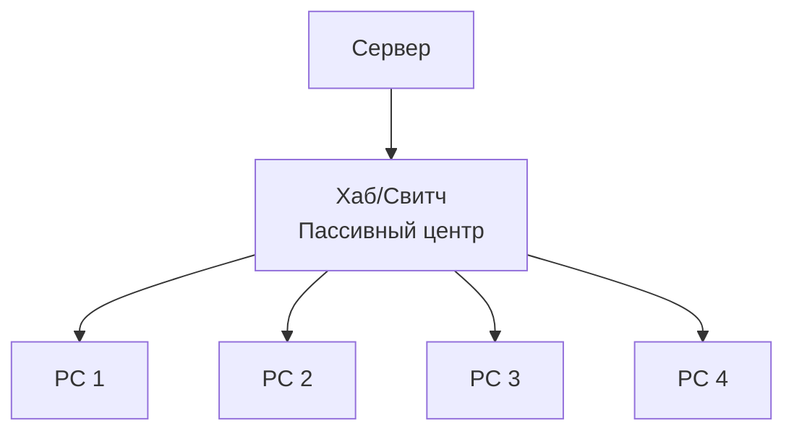

#### Ключевые особенности

1. **Явно выделенный центр** — все абоненты подключаются к центральному устройству
2. **Обмен только через центр** — на центральный компьютер ложится большая нагрузка
3. **Центральный компьютер самый мощный** — обычно он не может заниматься ничем другим, кроме сети
4. **Нет конфликтов** — управление полностью централизовано, коллизии в принципе невозможны
5. **Передача точка-точка** — на каждой линии связи только два абонента: центральный и периферийный

#### Как передаются данные

В звезде на каждой линии связи находятся только два абонента: центральный и один из периферийных. Чаще всего для их соединения используется две линии связи, каждая из которых передаёт информацию в одном направлении.

```
┌─────────────────────────────────────────────────────────────┐
│                    ПЕРЕДАЧА ТОЧКА-ТОЧКА                      │
├─────────────────────────────────────────────────────────────┤
│                                                             │
│  Центр ←────── линия 1 ──────← Периферийный                │
│  Центр ──────→ линия 2 ──────→ Периферийный                │
│                                                             │
│  На каждой линии: один передатчик, один приёмник           │
│  Каждый приёмник всегда получает сигнал одного уровня      │
│                                                             │
└─────────────────────────────────────────────────────────────┘
```

#### Преимущества и недостатки

| ✅ Преимущества | ❌ Недостатки |
|:---|:---|
| Единый центр управления | Если сервер вышел из строя — сеть не работает |
| Конфликты невозможны | Большой расход кабеля |
| Высокий уровень безопасности | Ограничение количества клиентов (8–16) |
| На каждой линии только 2 компьютера | Размер ограничен |
| Обрыв кабеля не влияет на работу сети | |
| Все точки подключения в одном месте (проще ремонт) | |

#### Что происходит при отказах?

| Что отказало | Последствия |
|:---|:---|
| **Периферийный компьютер** | Никак не отражается на работе остальной сети |
| **Центральный компьютер** | Сеть полностью неработоспособна |
| **Кабель периферийного ПК** | Нарушается обмен только с одним компьютером |
| **Центральный кабель** | Вся сеть не работает |

#### Расход кабеля

Общим недостатком для всех топологий типа звезда (как активной, так и пассивной) является значительно больший, чем при других топологиях, расход кабеля.

```
┌─────────────────────────────────────────────────────────────┐
│                    СРАВНЕНИЕ РАСХОДА КАБЕЛЯ                  │
├─────────────────────────────────────────────────────────────┤
│                                                             │
│  ШИНА:     PC1 ── PC2 ── PC3 ── PC4 ── PC5                 │
│            (один кабель на всех)                            │
│                                                             │
│  ЗВЕЗДА:        PC1                                         │
│                  │                                          │
│            PC2 ── ЦЕНТР ── PC3                              │
│                  │                                          │
│                 PC4                                         │
│            (отдельный кабель к каждому ПК)                  │
│                                                             │
└─────────────────────────────────────────────────────────────┘
```

#### Предельная длина

Предельная длина сети с топологией звезда может быть вдвое больше, чем в шине (то есть 2·Lпр), так как каждый из кабелей, соединяющий центр с периферийным абонентом, может иметь длину Lпр.

#### Пассивная звезда: особенности

Пассивная звезда обладает свойствами как звезды, так и общей шины:

| ✅ Преимущества | ❌ Недостатки |
|:---|:---|
| Объём кабеля и выход из строя РС не влияет на работу сети | Нет центрального компьютера (безопасность?) |
| Все точки подключения в одном месте (проще ремонт) | Если хаб вышел из строя — сеть не работает |
| Можно наращивать размер (цепочка хабов) | Большой расход кабеля |

#### Где применяется звезда?

- **Современные локальные сети** — практически все сети в офисах и домах построены по топологии звезда
- **Wi-Fi сети** — точка доступа является центром, устройства подключаются к ней
- **Телефонные сети** — АТС является центром

---

### 📖 5. Топология «Кольцо» (Ring)

#### Как это устроено

**Кольцо** — это топология, в которой каждый компьютер соединён линиями связи с двумя другими: от одного он получает информацию, а другому передаёт.

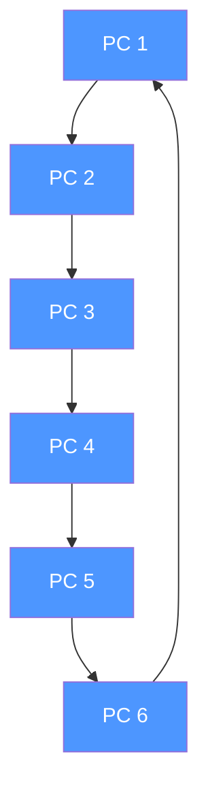

#### Ключевые особенности

1. **Нет явного центра** — все компьютеры могут быть одинаковыми и равноправными
2. **Ретрансляция сигнала** — каждый компьютер восстанавливает и усиливает приходящий к нему сигнал
3. **Роль репитера** — каждый компьютер выступает в роли повторителя
4. **Последовательная передача** — сигнал проходит последовательно через все компьютеры сети

#### Как передаются данные

```
┌─────────────────────────────────────────────────────────────┐
│                    ПЕРЕДАЧА В КОЛЬЦЕ                         │
├─────────────────────────────────────────────────────────────┤
│                                                             │
│         PC1 ────→ PC2 ────→ PC3                             │
│          ↑                    ↓                             │
│         PC6 ←──── PC5 ←──── PC4                             │
│                                                             │
│  Данные идут по кругу, пока не достигнут адресата          │
│  Каждый ПК усиливает сигнал перед передачей дальше         │
│                                                             │
└─────────────────────────────────────────────────────────────┘
```

#### Преимущества и недостатки

| ✅ Преимущества | ❌ Недостатки |
|:---|:---|
| Размер сети до 20 км | При выходе из строя любого ПК сеть не работает |
| Высокая устойчивость к перегрузкам | При разрыве линии сеть не работает |
| Нет конфликтов | Низкая безопасность |
| Нет центрального абонента | Скорость падает при увеличении размеров сети |
| Уверенная работа с большими потоками | Сложно подключать новую РС |

#### Почему кольцо может быть большим?

Если предельная длина кабеля, ограниченная затуханием, составляет Lпр, то суммарная длина кольца может достигать N·Lпр, где N — количество компьютеров в кольце.

**Почему?** Потому что каждый компьютер ретранслирует (восстанавливает, усиливает) приходящий к нему сигнал. Затухание сигнала во всём кольце не имеет никакого значения — важно только затухание между соседними компьютерами кольца.

На практике размеры кольцевых сетей достигают десятков километров. Кольцо в этом отношении существенно превосходит любые другие топологии.

#### Проблемы кольца

**1. Выход из строя компьютера**

Сигнал в кольце проходит последовательно через все компьютеры сети, поэтому выход из строя хотя бы одного из них (или его сетевого оборудования) нарушает работу сети в целом.

**2. Обрыв кабеля**

Обрыв или короткое замыкание в любом из кабелей кольца делает работу всей сети невозможной.

**3. Решение проблемы — двойное кольцо**

Из трёх рассмотренных топологий кольцо наиболее уязвимо к повреждениям кабеля, поэтому в случае топологии кольца обычно предусматривают прокладку двух (или более) параллельных линий связи, одна из которых находится в резерве.

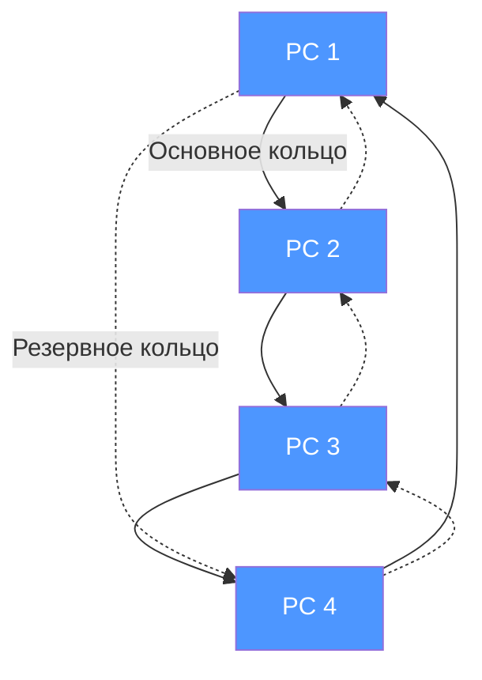

Цель подобного решения — увеличение (в идеале — вдвое) скорости передачи информации по сети. К тому же при повреждении одного из кабелей сеть может работать с другим кабелем (правда, предельная скорость уменьшится).

#### Равноправие в кольце

Компьютеры в кольце **не являются полностью равноправными** (в отличие, например, от шинной топологии). Ведь один из них обязательно получает информацию от компьютера, ведущего передачу в данный момент, раньше, а другие — позже.

#### Подключение новых абонентов

Подключение новых абонентов в кольцо выполняется достаточно просто, хотя и требует обязательной остановки работы всей сети на время подключения. Максимальное количество абонентов в кольце может быть довольно велико (до тысячи и больше).

#### Где применяется кольцо?

- **Token Ring** — классическая сеть с топологией кольцо
- **FDDI** (Fiber Distributed Data Interface) — оптоволоконная сеть с двойным кольцом
- **SONET/SDH** — технологии глобальных сетей

---

### 📖 6. Производные топологии

#### Топология «Дерево» (Tree)

Дерево — это комбинация нескольких звёзд, соединённых между собой. Бывает активное и пассивное дерево.

**Активное дерево:**

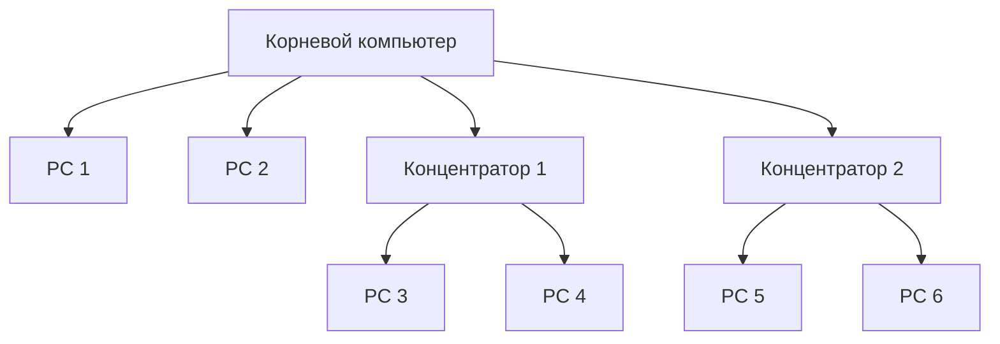

**Пассивное дерево:**

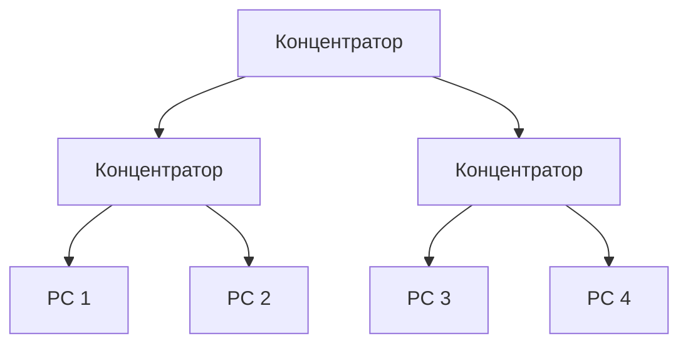

| Тип дерева | Особенности |
|:---|:---|
| **Активное** | В центрах — компьютеры, которые обрабатывают данные |
| **Пассивное** | В центрах — концентраторы (хабы), которые только передают сигналы |

#### Топология «Звезда-шина» (Star-Bus)

Комбинация звезды и шины: несколько звёзд соединены между собой с помощью шины.

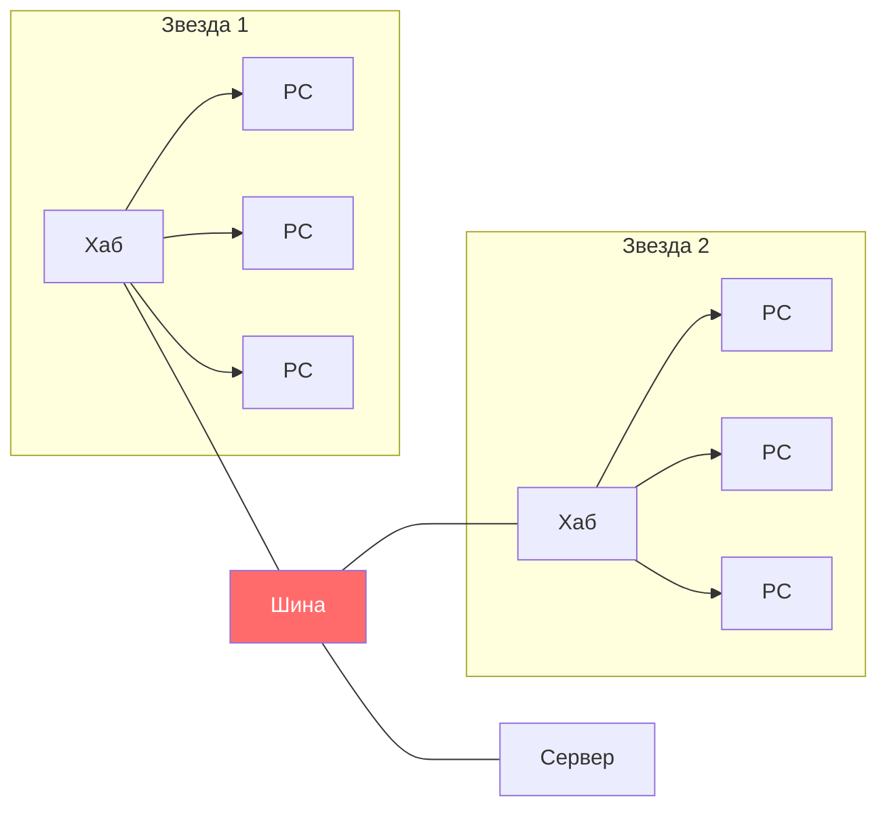

#### Топология «Звезда-кольцо» (Star-Ring)

Комбинация звезды и кольца: несколько звёзд соединены в кольцо.

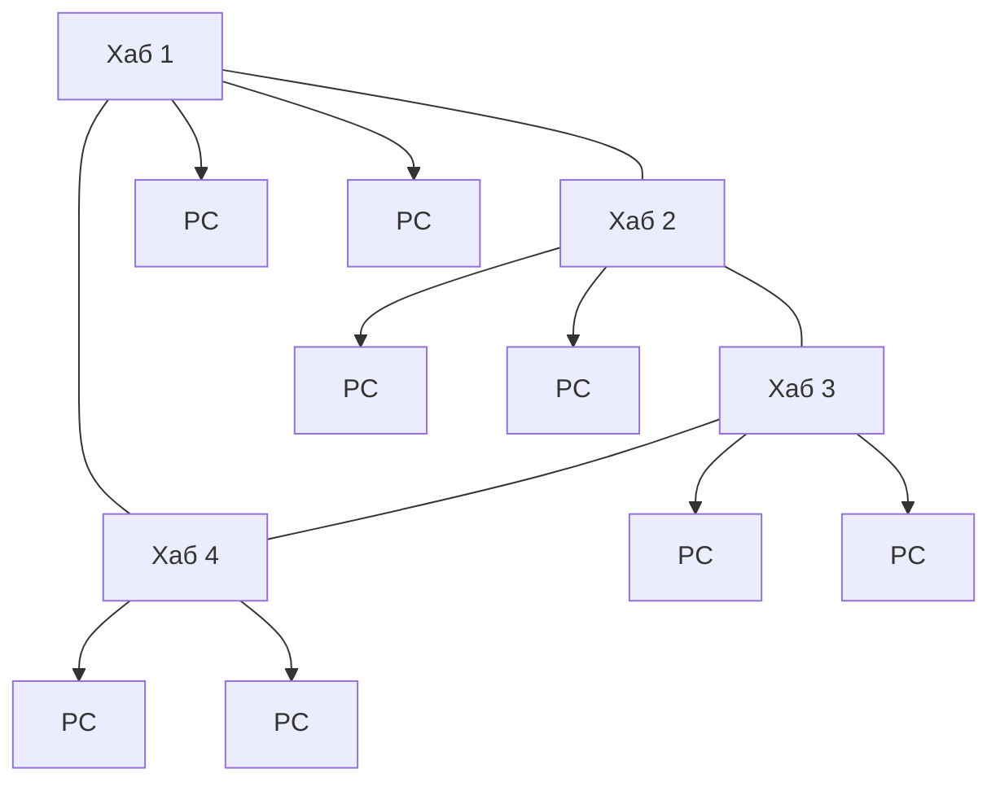

---

### 📖 7. Сеточная топология (Mesh)

#### Полная сеточная топология (Full Mesh)

В полной сеточной топологии каждый компьютер соединён с каждым другим компьютером напрямую.

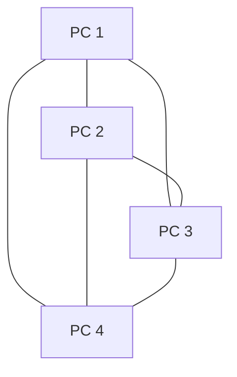

**Формула количества линий:** N × (N − 1) / 2, где N — количество компьютеров.

| Количество ПК | Количество линий |
|:---:|:---:|
| 3 | 3 |
| 4 | 6 |
| 5 | 10 |
| 6 | 15 |
| 10 | 45 |

**Преимущества:**
- Максимальная надёжность: если один кабель порвётся, данные пойдут по другому пути
- Высокая безопасность: данные идут напрямую

**Недостатки:**
- Очень большой расход кабеля
- Сложность прокладки
- Дорого

#### Частичная сеточная топология (Partial Mesh)

Не все компьютеры соединены напрямую, но есть несколько альтернативных путей.

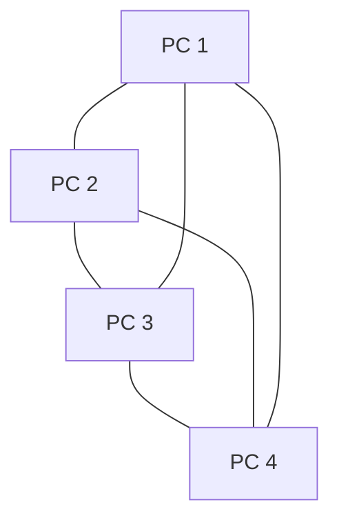

**Где применяется:**
- **Интернет** — глобальная сеть построена по принципу частичной сеточной топологии
- **Ядро сети** — магистральные каналы между городами
- **Военные сети** — требуют максимальной надёжности

---

### 📖 8. Многозначность понятия «топология»

В литературе при упоминании о топологии сети авторы могут подразумевать четыре совершенно разные понятия, относящиеся к различным уровням сетевой архитектуры:

| Тип топологии | Что описывает | Пример |
|:---|:---|:---|
| **Физическая** | Географическая схема расположения компьютеров и прокладки кабелей | Пассивная звезда ничем не отличается от активной |
| **Логическая** | Структура связей, характер распространения сигналов по сети | Наиболее правильное определение топологии |
| **Управления обменом** | Принцип и последовательность передачи права на захват сети | Кто первый начал передачу, тот и «захватил» сеть |
| **Информационная** | Направление потоков информации, передаваемой по сети | От клиента к серверу или между равными |

> **Важно:** Когда говорят о топологии, чаще всего имеют в виду **логическую топологию** — как именно сигналы распространяются по сети.

---

### 📖 9. Сравнительная таблица топологий

| Характеристика | Шина | Звезда | Кольцо | Mesh |
|:---|:---:|:---:|:---:|:---:|
| **Надёжность** | Низкая | Средняя | Средняя | Высокая |
| **Стоимость кабеля** | Низкая | Высокая | Средняя | Очень высокая |
| **Скорость** | Средняя | Высокая | Средняя | Высокая |
| **Простота обслуживания** | Сложно | Легко | Средне | Сложно |
| **Масштабируемость** | Легко | Ограничено | Средне | Сложно |
| **Конфликты** | Возможны | Нет | Нет | Нет |
| **Выход из строя ПК** | Не влияет | Не влияет | Вся сеть | Не влияет |
| **Обрыв кабеля** | Вся сеть | Один ПК | Вся сеть | Не влияет |
| **Центральный узел** | Нет | Есть | Нет | Нет |
| **Применение** | Устарело | Современные ЛВС | Token Ring, FDDI | Интернет, ядро |

#### Что выбрать?

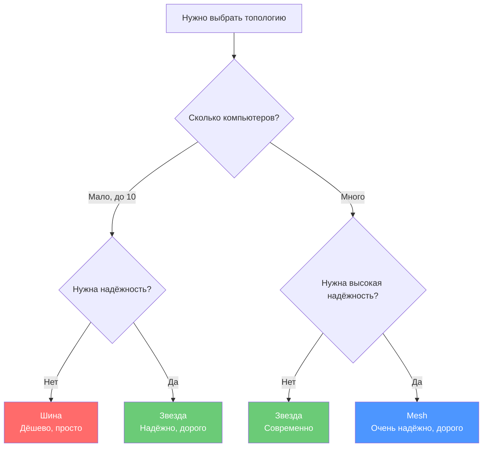

---

### 🖥️ Практическое задание (выполняется на занятии)

**Выполните в тетради или на компьютере:**

#### Задание 1. Определите топологию

Посмотрите на схемы и определите, какая топология изображена:

```
Схема А:
    PC1 ──── PC2 ──── PC3 ──── PC4 ──── PC5

Схема Б:
         PC1
          │
    PC2 ── ЦЕНТР ── PC3
          │
         PC4

Схема В:
    PC1 ────→ PC2
     ↑          ↓
    PC4 ←──── PC3
```

#### Задание 2. Нарисуйте схему

Нарисуйте в тетради:
1. Сеть из 5 компьютеров с топологией «шина»
2. Сеть из 5 компьютеров с топологией «звезда»
3. Сеть из 5 компьютеров с топологией «кольцо»

Подпишите все элементы (компьютеры, кабели, терминаторы, центральное устройство).

#### Задание 3. Анализ ситуации

Представьте, что вы — сетевой инженер. Вам нужно спроектировать сеть для:

| Ситуация | Ваш выбор топологии | Обоснование |
|:---|:---|:---|
| Небольшой офис на 5 компьютеров | ? | ? |
| Школа, 30 компьютеров в одном кабинете | ? | ? |
| Завод, где важна надёжность (если один кабель порвётся, сеть должна работать) | ? | ? |
| Домашняя сеть (ноутбук, телефон, Smart TV) | ? | ? |

#### Задание 4. Обсуждение в группе

Обсудите с соседом по парте:
1. Почему топология «шина» практически не используется в современных сетях?
2. Почему «звезда» стала самой популярной топологией?
3. В каких ситуациях «кольцо» всё ещё имеет смысл?

---

### 📝 Домашнее задание

**Оформите в Microsoft Word (или Google Docs) и загрузите в Google Форму по ссылке от преподавателя.**

**Название файла:** `Фамилия_Имя_Урок02.docx`

#### Часть 1. Ответьте на вопросы (письменно)

1. Дайте определение топологии сети.
2. Назовите три базовые топологии и кратко опишите каждую.
3. Что такое коллизия? В какой топологии она возможна и почему?
4. Зачем нужны терминаторы в топологии «шина»? Что произойдёт, если их убрать?
5. Чем отличается активная звезда от пассивной?
6. Почему в топологии «звезда» невозможны конфликты?
7. Какая топология обеспечивает наибольшую длину сети и почему?
8. Что такое репитер и зачем он нужен?
9. В чём разница между полной и частичной сеточной топологией?
10. Назовите четыре значения понятия «топология».

#### Часть 2. Сравнительная таблица

Заполните таблицу:

| Характеристика | Шина | Звезда | Кольцо |
|:---|:---|:---|:---|
| Надёжность | | | |
| Расход кабеля | | | |
| Возможность конфликтов | | | |
| Выход из строя одного ПК | | | |
| Обрыв кабеля | | | |
| Сложность обслуживания | | | |

#### Часть 3. Схема

Нарисуйте схему **сети колледжа** (или любого компьютерного класса):

- Определите, какая топология используется
- Укажите, где находятся компьютеры, коммутаторы, сервер (если есть)
- Отметьте, как проложены кабели

**Как выполнить:**
- Можно нарисовать от руки и сфотографировать
- Можно нарисовать в любом редакторе (Paint, Word, онлайн-редактор)

**Пример схемы:**

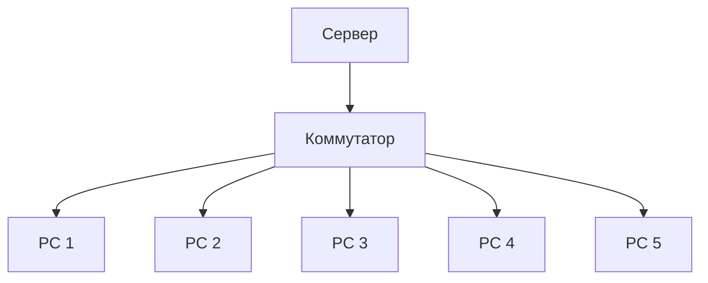

#### Часть 4. Рефлексия (по желанию, для дополнительного балла)

Напишите 3-5 предложений:
- Что нового вы узнали из этого урока?
- Какая топология показалась самой интересной?
- Есть ли вопросы, которые остались непонятными?

---

### 🔗 Ссылки для студентов

- **Google Форма для ДЗ:** [255 группа](https://forms.gle/9cNj9WnYqab3CXfk8) [257 группа](https://forms.gle/XhrGHZW8JB1Jtn9T9)
- **Google Форма для теста:** [255 группа](https://forms.gle/dcsdUh8RG9kWMSpz5) [257 группа](https://forms.gle/YgLq7Z4Zi7Q69Pk36)

---

| **Предыдущее занятие** | | **Следующее занятие** |
|:---:|:---:|:---:|
| [Урок 1. Введение в компьютерные сети](../lesson_01/lecture_01.md) | [Содержание](../README.md) | [Урок 3. Сетевое оборудование и кабели](../lesson_03/lecture_03.md) |

---
**Следующий урок:** Сетевое оборудование и кабели (Коммутаторы, маршрутизаторы, витая пара, оптоволокно)
