# УРОК 3. СЕТЕВОЕ ОБОРУДОВАНИЕ И КАБЕЛИ

| **Предыдущее занятие** | | **Следующее занятие** |
|:---:|:---:|:---:|
| [Урок 2. Классификация сетей по топологии](../lesson_02/lecture_02.md) | [Содержание](../README.md) | [Урок 4. ЛР №1. Обжим сетевого провода](../lesson_04/practice_04.md) |

---

**Преподаватель:** Сафиулин Р.Р.  
**Дисциплина:** ОП.11 Компьютерные сети  
**Семестр:** 1

---

# 📑 Оглавление

1. [🎯 Цели урока](#-цели-урока)
2. [📖 Сетевые адаптеры (NIC)](#-1-сетевые-адаптеры-nic)
3. [📖 Коммутаторы и концентраторы](#-2-коммутаторы-и-концентраторы)
4. [📖 Маршрутизаторы](#-3-маршрутизаторы)
5. [📖 Модемы и точки доступа](#-4-модемы-и-точки-доступа)
6. [📖 Кабели: обзор](#-5-кабели-обзор)
7. [📖 Витая пара — главный кабель современности](#-6-витая-пара--главный-кабель-современности)
8. [📖 Категории витой пары](#-7-категории-витой-пары)
9. [📖 Цвета и распиновка витой пары](#-8-цвета-и-распиновка-витой-пары)
10. [📖 Маркировка кабеля витая пара](#-9-маркировка-кабеля-витая-пара)
11. [📖 Цвет внешней оболочки: на что влияет?](#-10-цвет-внешней-оболочки-на-что-влияет)
12. [📖 Коаксиальный кабель](#-11-коаксиальный-кабель)
13. [📖 Оптоволоконный кабель](#-12-оптоволоконный-кабель)
14. [📖 Сравнительная таблица кабелей](#-13-сравнительная-таблица-кабелей)
15. [🖥️ Практическое задание](#-практическое-задание-выполняется-на-занятии)
16. [📝 Домашнее задание](#-домашнее-задание)
17. [🔗 Ссылки для студентов](#-ссылки-для-студентов)

---

### 🎯 Цели урока

После изучения этого урока вы сможете:

1. Объяснить, что такое сетевой адаптер и какие они бывают
2. Различать коммутатор и концентратор, объяснить, почему коммутатор лучше
3. Объяснить, что такое маршрутизатор и зачем он нужен
4. Назвать три основных типа кабелей и их особенности
5. Объяснить, что такое витая пара, какие бывают категории
6. Назвать скорости передачи для категорий 5e, 6, 6a, 7
7. Объяснить, что такое T568A и T568B, чем отличается прямой кабель от кроссового
8. Читать маркировку на кабеле витая пара и понимать, что означает каждый элемент
9. Объяснить, на что влияет цвет внешней оболочки кабеля
10. Рассказать о коаксиальном кабеле и его типах
11. Объяснить, чем отличается одномодовое оптоволокно от многомодового
12. Выбрать подходящий кабель для конкретной задачи

---

### 📖 1. Сетевые адаптеры (NIC)

**Сетевой адаптер** (Network Interface Card, NIC, сетевая карта) — устройство, которое обеспечивает подключение компьютера к сети и обмен данными с другими устройствами.

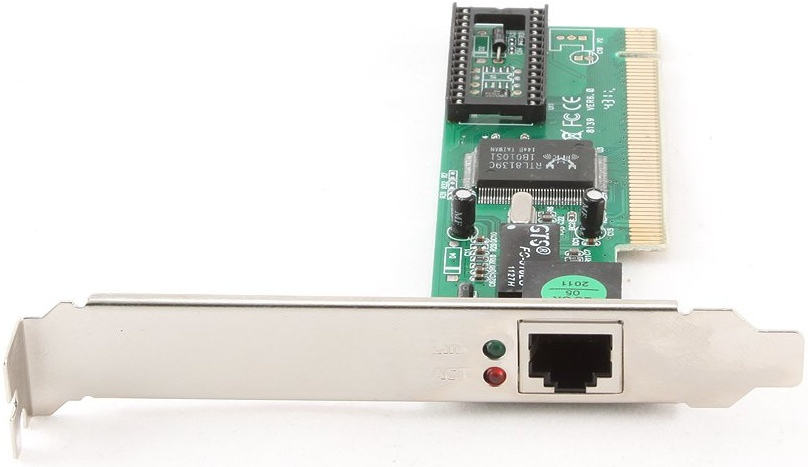

#### Что делает сетевой адаптер?

| Функция | Что происходит |
|:---|:---|
| **Приём и передача данных** | Адаптер отправляет и получает данные по кабелю или по воздуху |
| **Согласование скорости** | Буферизация — временное хранение данных для согласования скоростей |
| **Формирование пакета** | Данные разбиваются на части (пакеты) для передачи |
| **Преобразование** | Параллельно-последовательное преобразование сигналов |
| **Кодирование** | Преобразование данных в сигналы, понятные среде передачи |
| **Проверка ошибок** | Контроль правильности передачи |
| **Установление соединения** | Адаптер «договаривается» с другим адаптером о начале обмена |

#### Классификация сетевых адаптеров

**По среде передачи данных**:

| Тип | Примеры |
|:---|:---|
| **Проводные** | Витая пара, коаксиальный кабель, оптоволокно |
| **Беспроводные** | Wi-Fi, Bluetooth, инфракрасная связь |

**По типу разъёма (для проводных)**:

| Тип | Применение | Скорость |
|:---|:---|:---|
| **RJ-45** | Витая пара, современные сети | 100 Мбит/с — 10 Гбит/с |
| **BNC** | Коаксиальный кабель (устарело) | 10 Мбит/с |
| **SC/LC** | Оптоволокно | 1 Гбит/с — 100 Гбит/с |

**По интерфейсу подключения к материнской плате**:

| Интерфейс | Применение | Статус |
|:---|:---|:---|
| **ISA** | Старые компьютеры (до 1990-х) | Устарел |
| **PCI** | Настольные ПК (1990–2010) | Устаревает |
| **PCI-X** | Серверы | Устаревает |
| **PCI-Express (PCIe)** | Современные ПК и серверы | Актуален |
| **USB** | Внешние адаптеры | Актуален |
| **M.2** | Встроенные в материнскую плату | Актуален |

> **Современная реальность:** В большинстве современных компьютеров сетевой адаптер встроен прямо в материнскую плату (интегрированный). Отдельные карты нужны только для серверов или если встроенный адаптер вышел из строя.

#### Основные характеристики сетевого адаптера

| Характеристика | Что означает |
|:---|:---|
| **Скорость передачи** | 10 / 100 / 1000 Мбит/с / 10 Гбит/с |
| **Тип разъёма** | RJ-45, оптика, коаксиал |
| **Поддерживаемые стандарты** | Ethernet, Fast Ethernet, Gigabit Ethernet |
| **Разрядность** | 8, 16, 32, 64 бита (устаревшее) |
| **Наличие BootROM** | Возможность загрузки ОС по сети |

---

### 📖 2. Коммутаторы и концентраторы

#### Концентратор (Hub)

**Концентратор** — простое устройство, которое соединяет несколько устройств в сеть. Когда данные приходят на один порт, хаб **копирует их на все остальные порты**.

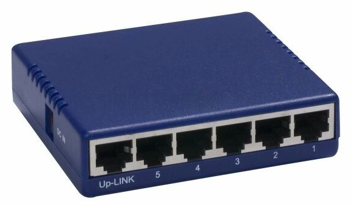


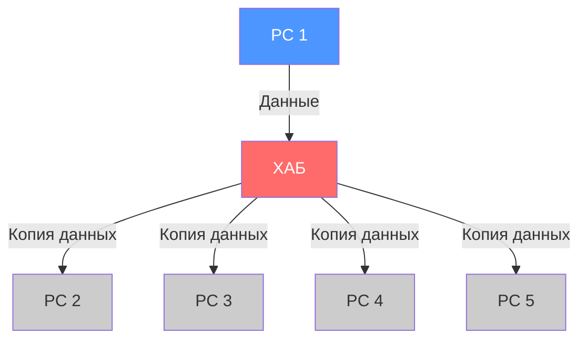

| ✅ Плюсы | ❌ Минусы |
|:---|:---|
| Дёшево | Все получают все данные (низкая безопасность) |
| Просто | Коллизии при одновременной передаче |
| Не требует настройки | Пропускная способность делится между всеми |
| | Устарел, почти не используется |

#### Коммутатор (Switch)

**Коммутатор** — устройство, которое **запоминает, какой компьютер подключён к какому порту** (по MAC-адресу), и передаёт данные **только тому, кому они адресованы**.

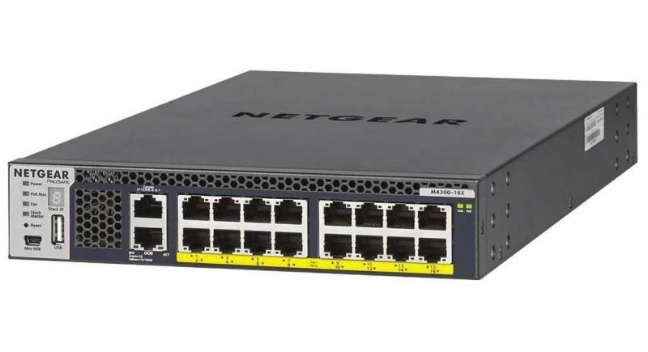

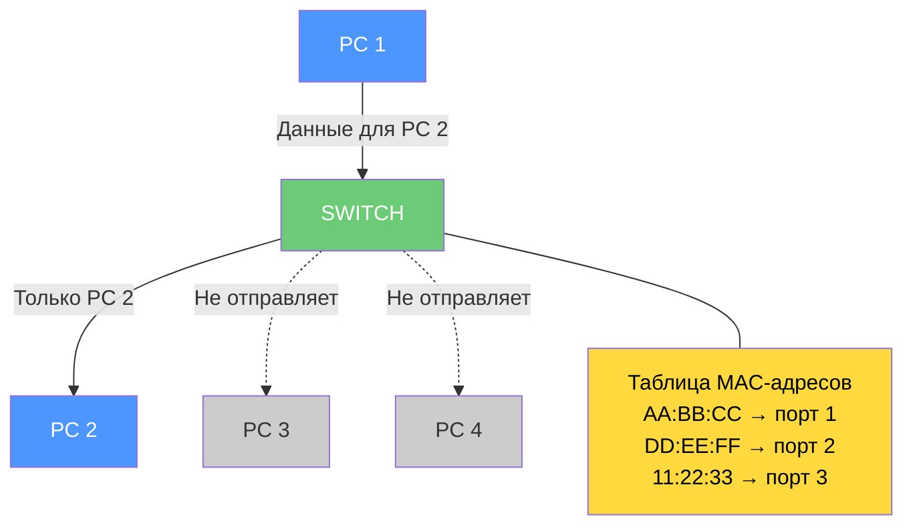

| ✅ Плюсы | ❌ Минусы |
|:---|:---|
| Нет коллизий (в режиме full-duplex) | Дороже концентратора |
| Полная скорость на каждом порту | Требует настройки (для управляемых) |
| Безопасность (данные идут только адресату) | |
| Работает на канальном уровне (L2) | |

#### Коммутатор vs Концентратор: главное отличие

| Характеристика | Концентратор | Коммутатор |
|:---|:---|:---|
| **Передача данных** | Всем портам | Только адресату |
| **Коллизии** | Возможны | Невозможны (full-duplex) |
| **Скорость** | Делится между всеми | Полная на каждом порту |
| **Безопасность** | Низкая | Высокая |
| **Уровень OSI** | Физический (L1) | Канальный (L2) |
| **Стоимость** | Низкая | Средняя |

> **Запомните:** Концентратор — «глупое» устройство. Коммутатор — «умное». В современных сетях концентраторы не используются.

---

### 📖 3. Маршрутизаторы

**Маршрутизатор** (router) — устройство, которое **соединяет разные сети** и **выбирает лучший путь** для пакетов данных.

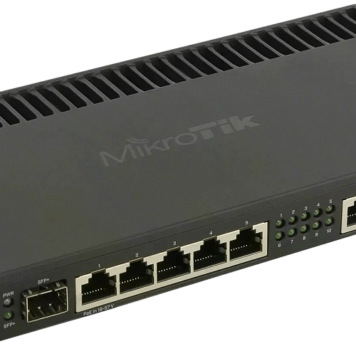

#### Что делает маршрутизатор?

| Функция | Что происходит |
|:---|:---|
| **Соединение сетей** | Например, ваша домашняя сеть ↔ Интернет |
| **Выбор пути** | Определяет, куда отправить пакет, чтобы он дошёл быстрее |
| **Таблица маршрутизации** | Список правил: «пакеты для сети X отправлять через Y» |
| **Фильтрация** | Может блокировать нежелательный трафик (брандмауэр) |
| **DHCP-сервер** | Автоматически выдаёт IP-адреса устройствам в сети |

#### Как работает маршрутизация?

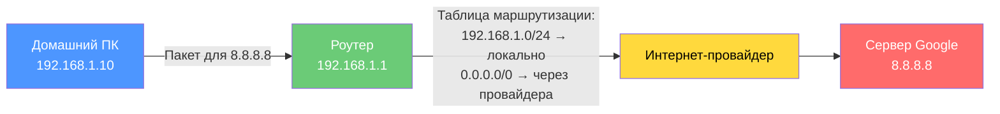

#### Типы маршрутизации

| Тип | Как работает | Когда используется |
|:---|:---|:---|
| **Статическая** | Маршруты задаются вручную администратором | Малые сети, редко меняющиеся |
| **Динамическая** | Маршрутизаторы сами обмениваются информацией | Большие сети, часто меняющиеся |

#### Где применяются маршрутизаторы?

- **Домашний роутер** — соединяет домашнюю сеть с Интернетом
- **Корпоративный маршрутизатор** — соединяет офисные сети
- **Магистральный маршрутизатор** — ядро Интернета

> **Запомните:** Коммутатор соединяет устройства **внутри одной сети**. Маршрутизатор соединяет **разные сети**.

---

### 📖 4. Модемы и точки доступа

#### Модем

**Модем** (модулятор-демодулятор) — устройство, которое преобразует сигналы из одной формы в другую. Например, сигнал из телефонной линии в цифровые данные для компьютера.

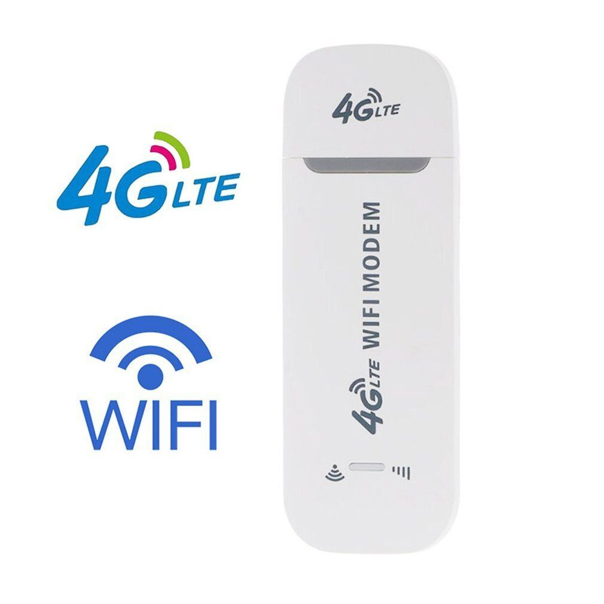

| Тип модема | Что делает |
|:---|:---|
| **DSL-модем** | Преобразует сигнал телефонной линии в Интернет |
| **Кабельный модем** | Преобразует сигнал кабельного ТВ в Интернет |
| **Оптический модем (ONT)** | Преобразует оптический сигнал в электрический |

#### Точка доступа (Access Point)

**Точка доступа** — устройство, которое обеспечивает беспроводное подключение устройств к сети (Wi-Fi).

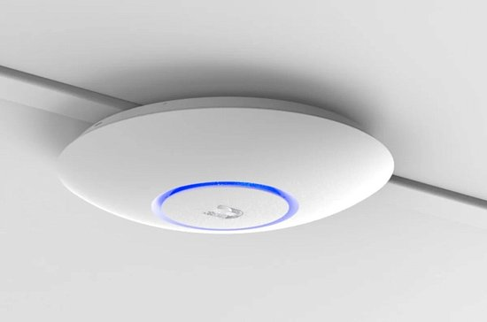

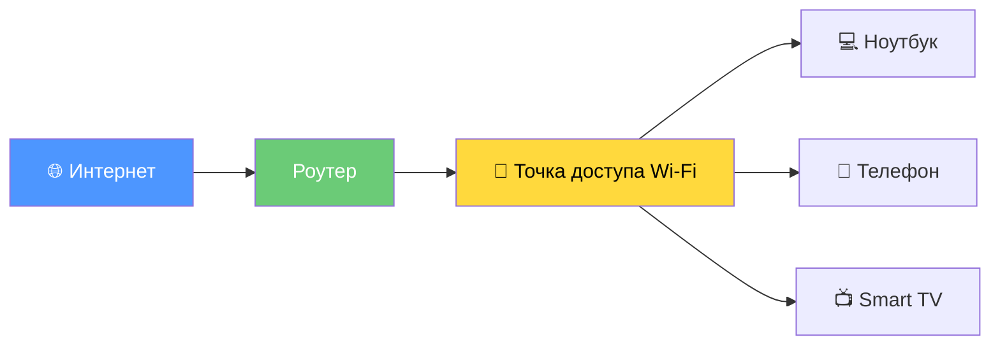

---

### 📖 5. Кабели: обзор

Существует три основных типа кабелей для проводных сетей:

| Тип кабеля | Применение | Скорость | Дальность |
|:---|:---|:---|:---|
| **Витая пара** | Современные ЛВС | 100 Мбит/с — 10 Гбит/с | До 100 м |
| **Коаксиальный** | Старые сети, ТВ | 10 Мбит/с | До 500 м |
| **Оптоволокно** | Магистрали, дата-центры | 1 Гбит/с — 100 Гбит/с | До 100 км |

---

### 📖 6. Витая пара — главный кабель современности

**Витая пара** — это кабель, состоящий из одной или нескольких пар изолированных проводников, **скрученных между собой** для защиты от помех.


#### Почему провода скручены?

Скручивание проводников **уменьшает электромагнитные помехи** от внешних источников и **перекрёстные помехи** между парами. Чем больше витков на единицу длины, тем лучше защита от помех.

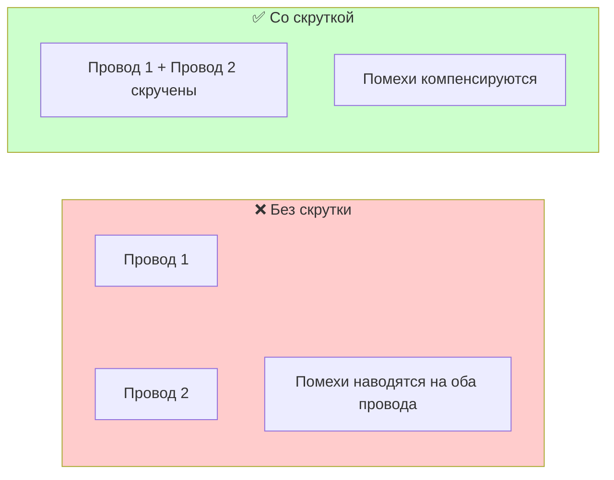

#### Устройство кабеля витая пара (в разрезе)


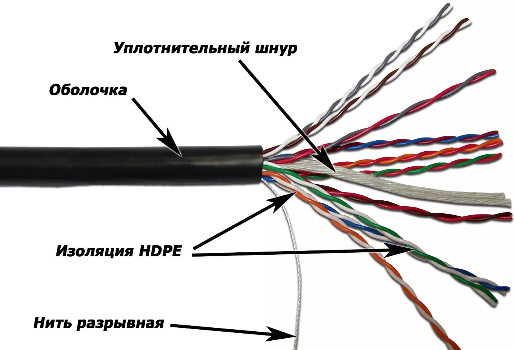

*Рис. 1. Устройство кабеля витая пара UTP (слева) и STP (справа)*


#### Типы витой пары

| Тип | Название | Особенности |
|:---|:---|:---|
| **UTP** | Unshielded Twisted Pair | Неэкранированная — самая распространённая |
| **STP** | Shielded Twisted Pair | Экранированная — защита от помех, дороже, сложнее в монтаже |
| **FTP** | Foiled Twisted Pair | Фольгированный экран |
| **S/FTP** | Screened + Foiled | Двойной экран |

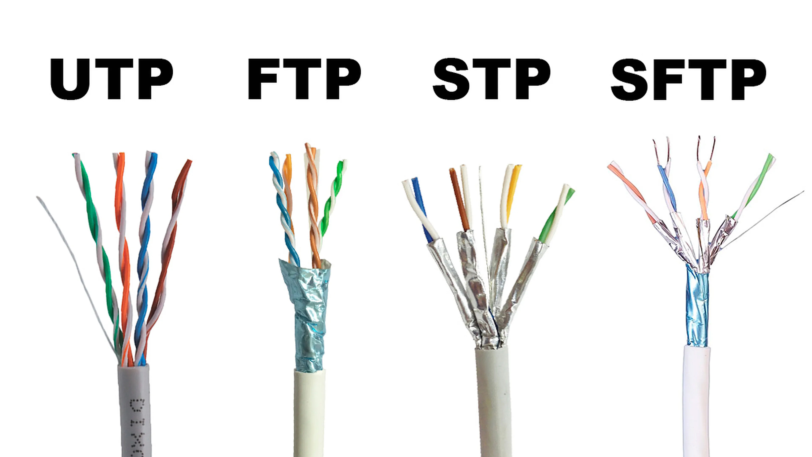

> **Важно:** UTP (неэкранированная) используется в 90% современных сетей благодаря дешёвке и простоте монтажа. Экранированные кабели применяются только там, где есть сильные помехи (заводы, больницы).

#### Разъём RJ-45

Витая пара подключается к устройствам с помощью **8-контактного разъёма RJ-45**.


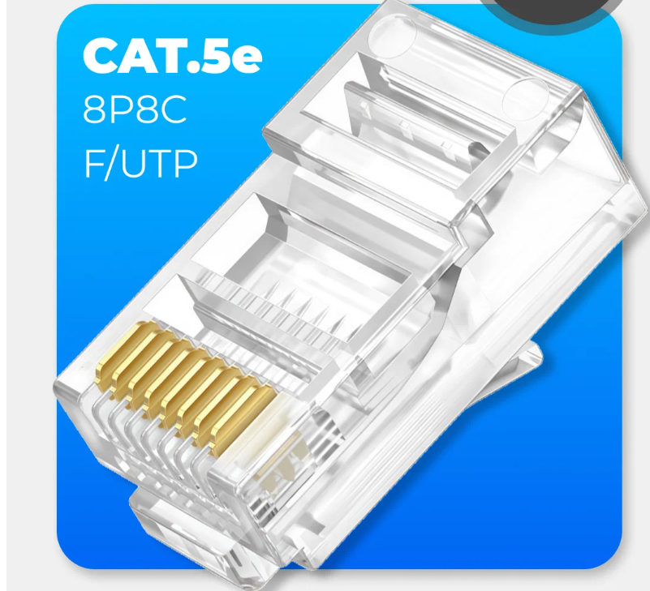

> Пример подписи: *Рис. 2. Разъём RJ-45 (вид спереди с нумерацией контактов 1–8)*


**Нумерация контактов:** слева направо, от 1 до 8 (если держать разъём контактами вверх, от себя).

---

### 📖 7. Категории витой пары

Категории витой пары определяют **максимальную скорость передачи** и **частоту сигнала**.

| Категория | Максимальная скорость | Частота | Применение | Статус |
|:---:|:---:|:---:|:---|:---|
| **Cat 1** | Голос/данные | — | Телефонные линии | Устарел |
| **Cat 2** | 4 Мбит/с | — | Token Ring, ARCNet | Устарел |
| **Cat 3** | 10 Мбит/с | 16 МГц | 10BASE-T, телефония | Устарел |
| **Cat 4** | 16 Мбит/с | 20 МГц | Token Ring | Устарел |
| **Cat 5** | 100 Мбит/с (2 пары) / 1000 Мбит/с (4 пары) | 100 МГц | Fast Ethernet, Gigabit Ethernet | Устаревает |
| **Cat 5e** | 1000 Мбит/с (1 Гбит/с) | 100 МГц | Gigabit Ethernet | **Стандарт** |
| **Cat 6** | 1 Гбит/с (100 м) / 10 Гбит/с (55 м) | 250 МГц | Gigabit, 10G Ethernet | **Стандарт** |
| **Cat 6a** | 10 Гбит/с (100 м) | 500 МГц | 10G Ethernet | **Стандарт** |
| **Cat 7** | 10 Гбит/с | 600 МГц | Дата-центры | Специальный |
| **Cat 7a** | 10 Гбит/с | 1000 МГц | Дата-центры | Специальный |
| **Cat 8** | 25–40 Гбит/с | 2000 МГц | Дата-центры | Новый |

#### Расшифровка категорий

**Cat 5e** (Enhanced — улучшенная):
- Скорость: 1 Гбит/с
- Частота: 100 МГц
- Дальность: 100 м
- **Самая распространённая в домах и офисах**

**Cat 6**:
- Скорость: 1 Гбит/с (100 м) или 10 Гбит/с (55 м)
- Частота: 250 МГц
- Улучшенная защита от помех (внутренние разделители)
- **Рекомендуется для новых сетей**

**Cat 6a** (Augmented — дополненная):
- Скорость: 10 Гбит/с
- Частота: 500 МГц
- Дальность: 100 м (в отличие от Cat 6, где 10G только на 55 м)
- **Для дата-центров и требовательных сетей**

**Cat 7**:
- Скорость: 10 Гбит/с
- Частота: 600 МГц
- Каждый проводник экранирован отдельно
- Специальные разъёмы (GG45, TERA)
- **Для дата-центров**

#### Какую категорию выбрать?

| Ситуация | Рекомендация |
|:---|:---|
| Домашняя сеть | Cat 5e или Cat 6 |
| Офис (до 1 Гбит/с) | Cat 5e или Cat 6 |
| Офис (10 Гбит/с) | Cat 6a |
| Дата-центр | Cat 6a или Cat 7 |
| Больница, завод (помехи) | Cat 6a STP / Cat 7 |

---

### 📖 8. Цвета и распиновка витой пары

#### Цвета проводников

В кабеле витая пара 4 пары, каждая пара имеет свой цвет:

| Пара | Основной цвет | Дополнительный цвет |
|:---:|:---|:---|
| 1 | Белый | Синий |
| 2 | Оранжевый | Белый |
| 3 | Зелёный | Белый |
| 4 | Коричневый | Белый |

#### Стандарты распиновки


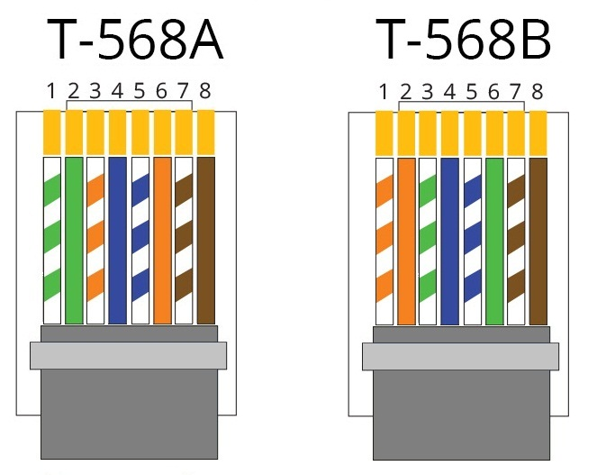

Существует два стандарта: **T568A** и **T568B**.


**T568B (наиболее распространённый):**

| Контакт | Цвет |
|:---:|:---|
| 1 | Бело-оранжевый |
| 2 | Оранжевый |
| 3 | Бело-зелёный |
| 4 | Синий |
| 5 | Бело-синий |
| 6 | Зелёный |
| 7 | Бело-коричневый |
| 8 | Коричневый |

**T568A:**

| Контакт | Цвет |
|:---:|:---|
| 1 | Бело-зелёный |
| 2 | Зелёный |
| 3 | Бело-оранжевый |
| 4 | Синий |
| 5 | Бело-синий |
| 6 | Оранжевый |
| 7 | Бело-коричневый |
| 8 | Коричневый |

#### Прямой и кроссовый кабель

| Тип кабеля | Как обжат | Для чего |
|:---|:---|:---|
| **Прямой** | Одинаково с двух сторон (T568B — T568B) | Подключение ПК к коммутатору/роутеру |
| **Кроссовый** | T568A с одной стороны, T568B с другой | Подключение ПК к ПК, коммутатор к коммутатору (старое оборудование) |

> **Важно:** Современные коммутаторы и сетевые карты поддерживают **Auto-MDI/MDIX** — автоматически определяют тип кабеля, поэтому кроссовый кабель почти не нужен.

---

### 📖 9. Маркировка кабеля витая пара

Маркировка наносится на внешнюю оболочку кабеля **через каждый погонный метр** 
и содержит все ключевые технические характеристики.

#### Пример реальной маркировки

```
NIKOMAX NMC 4200A-GY F/UTP SOLID CABLE 4P CATEGORY 5e Class D 24AWG PVC ISO/IEC 11801
```

Разберём каждую часть:

| Фрагмент | Что означает |
|:---|:---|
| **NIKOMAX** | Производитель кабеля |
| **NMC 4200A-GY** | Артикул / продуктовая линейка |
| **GY** | Цвет внешней оболочки (Grey — серый) |
| **F/UTP** | Тип экранирования: общий экран из фольги, пары не экранированы |
| **SOLID CABLE** | Кабель с одножильными (монолитными) проводниками |
| **4P** | 4 пары (4 pairs) |
| **CATEGORY 5e / Class D** | Категория 5e, класс D (до 100 МГц) |
| **24AWG** | Диаметр проводника: 24 AWG (0,51 мм) |
| **PVC** | Материал оболочки: поливинилхлорид |
| **ISO/IEC 11801** | Соответствие международному стандарту |

#### Ключевые элементы маркировки

**1. Тип экранирования (до и после слэша)**

Маркировка типа «X/YTP» расшифровывается так: **до слэша** — общий экран всего кабеля, **после слэша** — экран каждой пары.

| Обозначение | Расшифровка | Применение |
|:---|:---|:---|
| **U/UTP** | Неэкранированный / пары неэкранированы | Дома, офисы (90% сетей) |
| **F/UTP** | Общий экран из фольги | Офисы с помехами |
| **SF/UTP** | Двойной общий экран (фольга + оплётка) | Промышленность |
| **U/FTP** | Экран каждой пары | Дата-центры |
| **S/FTP** | Оплётка общая + фольга на каждой паре | Cat 7, дата-центры |
| **SF/FTP** | Двойной общий + фольга на каждой паре | Cat 7A, 8 |

**2. Категория (Cat)**

Категория определяет максимальную частоту и скорость передачи (см. таблицу выше).

**3. Диаметр проводника (AWG)**

**AWG** (American Wire Gauge) — американская система измерения. **Чем меньше число — тем толще провод**.

| AWG | Диаметр | Применение |
|:---:|:---|:---|
| **26 AWG** | 0,40 мм | Тонкие патч-корды |
| **24 AWG** | 0,51 мм | **Стандарт для витой пары** |
| **23 AWG** | 0,57 мм | Cat 6, 6a (для 10G) |
| **22 AWG** | 0,64 мм | Специальные применения |

**4. Тип жилы**

| Обозначение | Тип жилы | Гибкость | Применение |
|:---|:---|:---|:---|
| **SOLID** | Одножильная | Жёсткий | Стационарная прокладка (в стенах) |
| **STRANDED / Patch** | Многожильная | Гибкий | Патч-корды (от розетки до ПК) |

**5. Материал оболочки и пожарные характеристики**

Материал оболочки определяет, где можно прокладывать кабель:

| Обозначение | Материал | Цвет | Где прокладывать |
|:---|:---|:---|:---|
| **PVC** | Поливинилхлорид | Серый | Внутри помещений, одиночная прокладка |
| **LSZH / ZH** | Безгалогенный, малодымный | Фиолетовый, оранжевый | Общественные места (ТЦ, кинотеатры) |
| **LSLTx** | Низкотоксичный | Зелёный | Больницы, детсады |
| **FR** | Огнестойкий | Оранжевый, красный | Где нужна огнестойкость |
| **PE** | Полиэтилен | Чёрный | **Наружная прокладка** |

**Индексы пожарной безопасности:**
- **нг(А)** — не распространяет горение при групповой прокладке
- **HF** — без галогенов
- **LSLTx** — низкая токсичность продуктов горения

**6. Длина и метраж**

Маркировка наносится с шагом в 1 метр (или 1 фут) и **считает от конца бухты**. Это позволяет точно отмерить нужную длину без рулетки.

Пример: `305M` в конце маркировки означает, что до конца бухты осталось 305 метров.

---

### 📖 10. Цвет внешней оболочки: на что влияет?

**Технически — ни на что.** Скорость, категория, экранирование и качество кабеля от цвета оболочки не зависят.

**Практически — цвет используется для маркировки и организации:**

| Цвет | Типичное применение |
|:---|:---|
| **Серый** | Стандартный PVC-кабель для внутренней прокладки |
| **Синий** | Основное подключение серверов |
| **Красный** | Системы безопасности (камеры, пожарная сигнализация) |
| **Зелёный** | DMZ-зоны, низкотоксичные кабели (больницы) |
| **Оранжевый** | Хранилища данных, LSZH-кабели, огнестойкие |
| **Жёлтый** | Хранилища данных |
| **Фиолетовый** | LSZH-кабели (малодымные, безгалогенные) |
| **Чёрный** | Наружная прокладка (PE-оболочка) |
| **Белый** | Любое применение (нейтральный) |

**Почему это удобно на практике:**

> Использование кабелей разных цветов напрямую влияет на производительность труда монтажника, на процент ошибок при терминации кабеля, на скорость локализации неисправностей.

Например, в офисе можно использовать:
- **Синий** — для информационных розеток
- **Красный** — для телефонных линий
- **Зелёный** — для камер видеонаблюдения

При этом цвета **не стандартизированы** для медных кабелей — каждая организация выбирает свою схему.

> **Запомните:** Цвет оболочки — это «маркировка для удобства», а не техническая характеристика. Два кабеля одинаковой категории, но разного цвета, будут работать абсолютно одинаково.

---

### 📖 11. Коаксиальный кабель

**Коаксиальный кабель** — кабель с центральным проводником, окружённым изоляцией, экраном и внешней оболочкой.

#### Устройство коаксиального кабеля

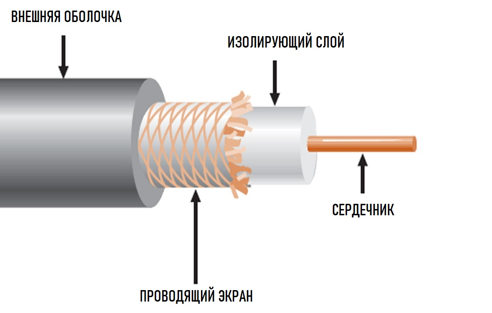

> Пример подписи: *Рис. 3. Устройство коаксиального кабеля: 1 — центральный проводник; 2 — изоляция; 3 — экран; 4 — внешняя оболочка*

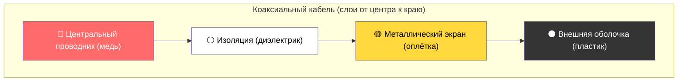

#### Типы коаксиального кабеля

| Тип | Название | Диаметр | Дальность | Применение |
|:---|:---|:---:|:---|:---|
| **RG-58** | «Тонкий Ethernet» (Thinnet) | 0,5 см | 185 м | Старые ЛВС (10BASE2) |
| **RG-8 / RG-11** | «Толстый Ethernet» (Thicknet) | 1 см | 500 м | Старые ЛВС (10BASE5) |
| **RG-6** | ТВ-кабель | — | — | Кабельное ТВ, Интернет |
| **RG-59** | ТВ-кабель | — | — | Кабельное ТВ |

#### Где применялся коаксиальный кабель?

- **Ранние Ethernet-сети** (10BASE2, 10BASE5) — 1980–1990-е
- **Кабельное телевидение** — до сих пор
- **Кабельный Интернет** — до сих пор
- **Системы видеонаблюдения** — до сих пор

#### Почему коаксиал устарел для ЛВС?

| ✅ Плюсы | ❌ Минусы |
|:---|:---|
| Помехоустойчивость | Толстый и неудобный |
| Большая дальность | Дороже витой пары |
| | Сложный монтаж |
| | Топология «шина» — при обрыве вся сеть падает |

---

### 📖 12. Оптоволоконный кабель

**Оптоволоконный кабель** (fiber optic) — кабель, который передаёт **световые импульсы**, а не электрические сигналы.

#### Устройство оптоволокна

> 📷 **МЕСТО ДЛЯ ВАШЕЙ КАРТИНКИ:** Вставьте сюда фото оптоволоконного кабеля в разрезе
>
> Пример подписи: *Рис. 4. Устройство оптоволоконного кабеля: 1 — сердцевина; 2 — отражающая оболочка; 3 — защитное покрытие; 4 — внешняя оболочка*

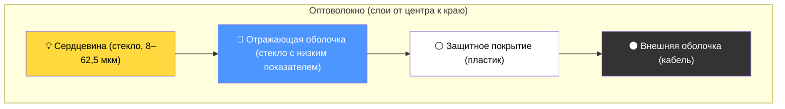

#### Типы оптоволокна

| Тип | Диаметр сердцевины | Дальность | Применение |
|:---|:---:|:---|:---|
| **Многомодовое (MM)** | 50–62,5 мкм | До 2 км | Локальные сети, дата-центры |
| **Одномодовое (SM)** | 3–10 мкм | До 100 км | Магистрали, городские сети |

#### Многомодовое волокно


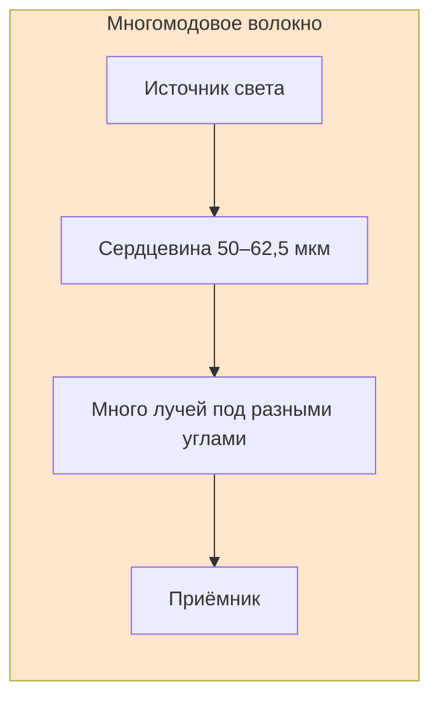

- **Диаметр сердцевины:** 50 или 62,5 мкм
- **Источник света:** светодиод (LED) или лазер
- **Дальность:** до 2 км
- **Применение:** внутри зданий, между зданиями в кампусе
- **Классы:** OM1, OM2, OM3, OM4

#### Одномодовое волокно

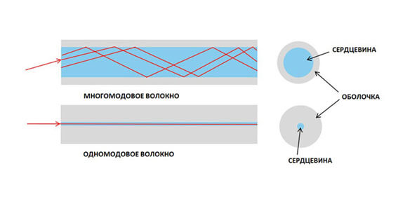

Рис. 6. Схемы распространения света

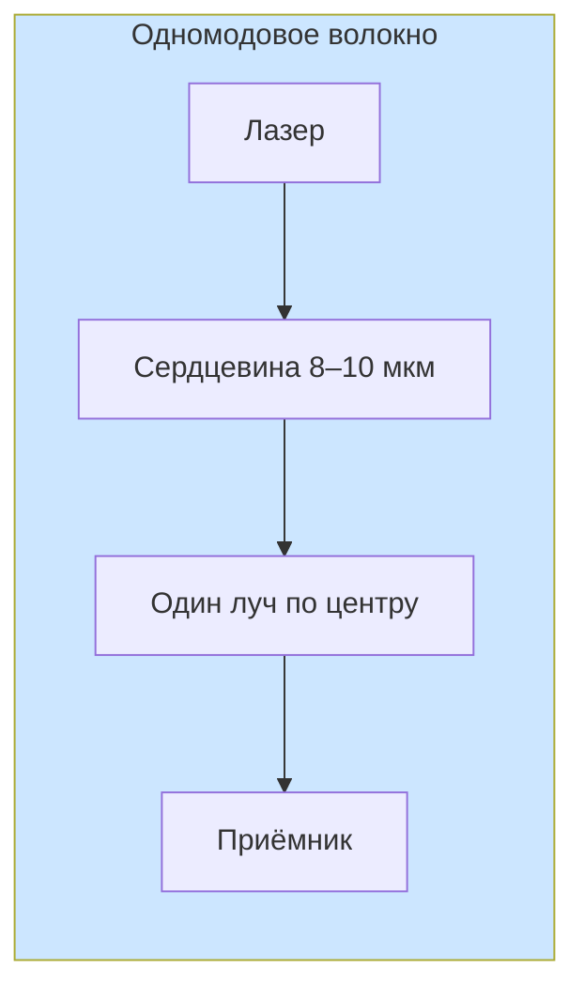

- **Диаметр сердцевины:** 8–10 мкм
- **Источник света:** лазер
- **Дальность:** до 100 км и более
- **Применение:** магистрали, между городами
- **Классы:** OS1, OS2

#### Преимущества и недостатки оптоволокна

| ✅ Преимущества | ❌ Недостатки |
|:---|:---|
| Огромная скорость (до 100 Гбит/с) | Дорого |
| Огромная дальность (до 100 км) | Сложный монтаж |
| Полная защита от электромагнитных помех | Хрупкое (стекло) |
| Нельзя подслушать (без повреждения) | Нужны специалисты |
| Малый вес | |

#### Где применяется оптоволокно?

- **Магистральные каналы** между городами и странами
- **Интернет-провайдеры** — от станции до дома (FTTB, FTTH)
- **Дата-центры** — соединение серверов
- **Подводные кабели** — между континентами

---

### 📖 13. Сравнительная таблица кабелей

| Характеристика | Витая пара (Cat 6a) | Коаксиальный | Оптоволокно |
|:---|:---:|:---:|:---:|
| **Скорость** | 10 Гбит/с | 10 Мбит/с | 100 Гбит/с |
| **Дальность** | 100 м | 185–500 м | До 100 км |
| **Цена** | Низкая | Средняя | Высокая |
| **Монтаж** | Простой | Средний | Сложный |
| **Помехоустойчивость** | Средняя | Хорошая | Идеальная |
| **Применение** | ЛВС, офисы, дома | ТВ, старые сети | Магистрали, дата-центры |

---

### 🖥️ Практическое задание (выполняется на занятии)

**Выполните в тетради или на компьютере:**

#### Задание 1. Определите тип кабеля

Посмотрите на изображения (или реальные образцы) и определите:

| Образец | Тип кабеля | Категория (если витая пара) | Применение |
|:---|:---|:---|:---|
| 1 | ? | ? | ? |
| 2 | ? | ? | ? |
| 3 | ? | ? | ? |

#### Задание 2. Расшифруйте маркировку

Найдите в аудитории (или на фото) кусок кабеля витая пара с маркировкой и расшифруйте её по таблице из раздела 9.

**Пример для разбора:**

```
NIKOMAX NMC 4200A-GY F/UTP SOLID CABLE 4P CATEGORY 5e Class D 24AWG PVC ISO/IEC 11801
```

Ответьте на вопросы:
1. Кто производитель?
2. Какая категория?
3. Экранированный или нет?
4. Можно ли прокладывать на улице?
5. Какой диаметр проводника?

#### Задание 3. Нарисуйте схему

Нарисуйте в тетради:
1. Устройство коаксиального кабеля (подпишите все слои)
2. Устройство оптоволоконного кабеля (подпишите все слои)
3. Разъём RJ-45 с цветами проводников по стандарту T568B

#### Задание 4. Анализ ситуации

Представьте, что вы — сетевой инженер. Вам нужно выбрать оборудование для:

| Ситуация | Ваш выбор | Обоснование |
|:---|:---|:---|
| Домашняя сеть (3 компьютера, интернет 1 Гбит/с) | ? | ? |
| Офис (20 компьютеров, 1 Гбит/с) | ? | ? |
| Соединение двух зданий (расстояние 500 м) | ? | ? |
| Дата-центр (серверы, 10 Гбит/с) | ? | ? |

#### Задание 5. Цвета кабелей

Ответьте на вопросы:
1. Если два кабеля одинаковой категории, но разного цвета — они будут работать одинаково? Почему?
2. Какой цвет кабеля выбрать для:
    - Информационных розеток в офисе?
    - Камер видеонаблюдения?
    - Наружной прокладки?

#### Задание 6. Обсуждение в группе

Обсудите с соседом по парте:
1. Почему концентраторы практически вышли из употребления?
2. Почему витая пара стала самым популярным кабелем?
3. В каких ситуациях без оптоволокна не обойтись?

---

### 📝 Домашнее задание

**Оформите в Microsoft Word (или Google Docs) и загрузите в Google Форму по ссылке от преподавателя.**

**Название файла:** `Фамилия_Имя_Урок03.docx`

#### Часть 1. Ответьте на вопросы (письменно)

1. Что такое сетевой адаптер? Какие функции он выполняет?
2. Чем отличается коммутатор от концентратора? Назовите минимум 3 отличия.
3. Что такое маршрутизатор? Для чего он нужен?
4. Назовите три основных типа кабелей.
5. Что такое витая пара? Почему провода скручены?
6. Какие категории витой пары вы знаете? Назовите скорость для Cat 5e, Cat 6, Cat 6a.
7. Чем отличается прямой кабель от кроссового?
8. Что такое T568B? Назовите цвета проводников по порядку.
9. Расшифруйте маркировку: `F/UTP SOLID 4P CATEGORY 6 23AWG LSZH`
10. На что влияет цвет внешней оболочки кабеля? Приведите 3 примера использования цвета для маркировки.
11. Какие типы коаксиального кабеля вы знаете?
12. Чем отличается одномодовое оптоволокно от многомодового?

#### Часть 2. Сравнительная таблица

Заполните таблицу:

| Характеристика | Витая пара Cat 6a | Коаксиальный (RG-6) | Оптоволокно (одномод) |
|:---|:---|:---|:---|
| Скорость | | | |
| Дальность | | | |
| Цена | | | |
| Помехоустойчивость | | | |
| Применение | | | |

#### Часть 3. Расшифровка маркировки

Найдите дома или в колледже кабель витая пара. Сфотографируйте маркировку и расшифруйте её:

| Элемент маркировки | Значение |
|:---|:---|
| Производитель | |
| Категория | |
| Экранирование | |
| Тип жилы | |
| Диаметр (AWG) | |
| Материал оболочки | |
| Цвет | |

#### Часть 4. Схема

Нарисуйте схему **сети вашего дома** с указанием:

- Какие устройства подключены
- Какой кабель используется для каждого соединения (витая пара, Wi-Fi, оптоволокно)
- Где находится роутер, модем (если есть)

**Как выполнить:**
- Можно нарисовать от руки и сфотографировать
- Можно нарисовать в любом редакторе (Paint, Word, онлайн-редактор)

**Пример схемы:**

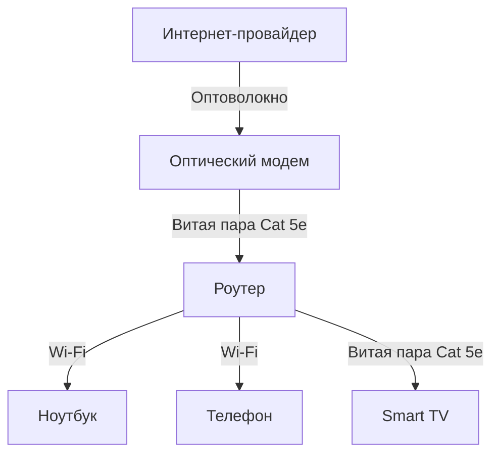

#### Часть 5. Рефлексия (по желанию, для дополнительного балла)

Напишите 3-5 предложений:
- Что нового вы узнали из этого урока?
- Какой кабель показался самым интересным?
- Есть ли вопросы, которые остались непонятными?

---

### 🔗 Ссылки для студентов

- **Google Форма для ДЗ:** [255 группа](https://forms.gle/9cNj9WnYqab3CXfk8) [257 группа](https://forms.gle/XhrGHZW8JB1Jtn9T9)
- **Google Форма для теста:** [255 группа](https://forms.gle/2X2yR1xA6RVN4MAT9) [257 группа](https://forms.gle/PbcCbpaz7L7T8jte7)

---

| **Предыдущее занятие** | | **Следующее занятие** |
|:---:|:---:|:---:|
| [Урок 2. Классификация сетей по топологии](../lesson_02/lecture_02.md) | [Содержание](../README.md) | [Урок 4. ЛР №1. Обжим сетевого провода](../lesson_04/practice_04.md) |

---
**Следующий урок:** ЛР №1. Обжим сетевого провода (Практическое занятие — обжим витой пары, проверка кабеля)
