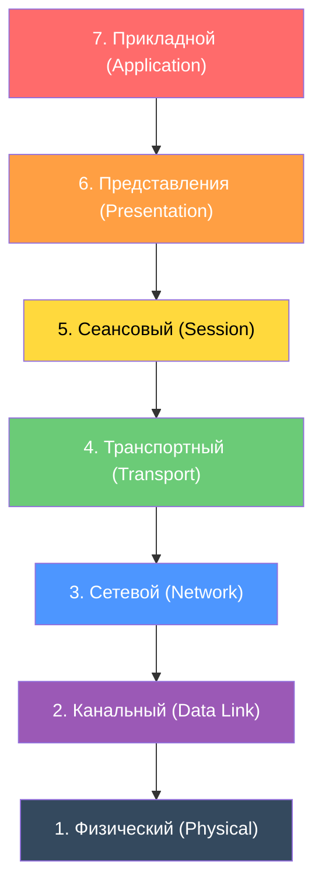
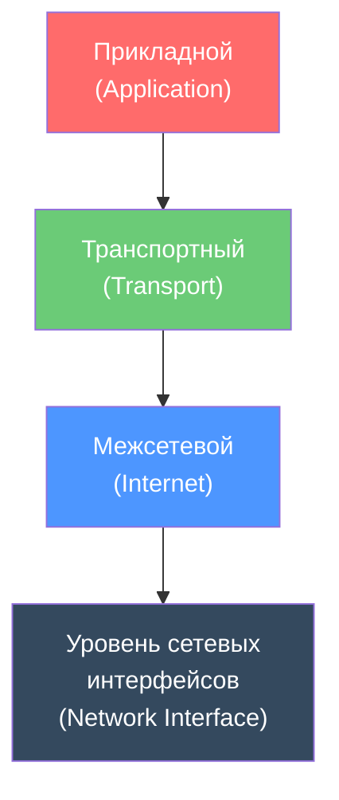
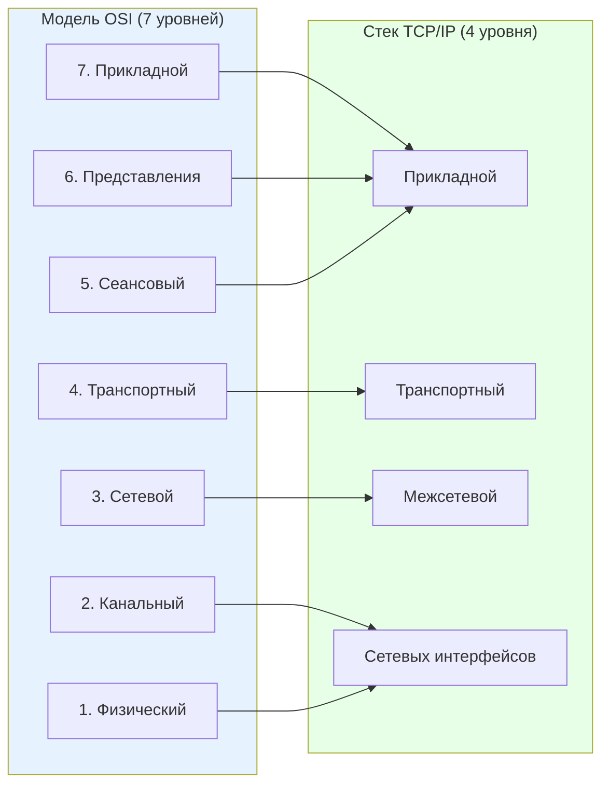
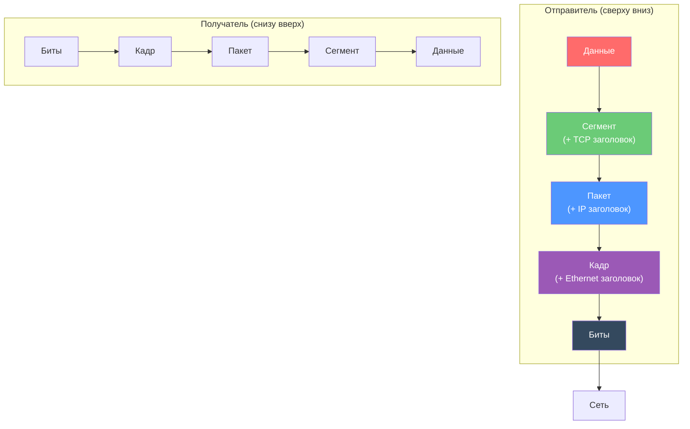
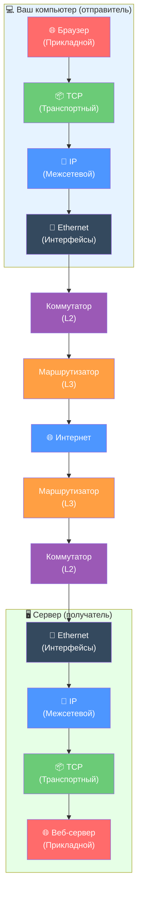

# УРОК 4. МОДЕЛЬ OSI И СТЕК TCP/IP

| **Предыдущее занятие** | | **Следующее занятие** |
|:---:|:---:|:---:|
| [Урок 3. Сетевое оборудование и кабели](../lesson_03/lecture_03.md) | [Содержание](../README.md) | [Урок 5. IP-адресация. Классы и маски](../lesson_05/lecture_05.md) |

---

**Преподаватель:** Сафиулин Р.Р.  
**Дисциплина:** ОП.11 Компьютерные сети  
**Семестр:** 1

---

# 📑 Оглавление

1. [🎯 Цели урока](#-цели-урока)
2. [📖 Зачем нужны модели сетевого взаимодействия?](#-1-зачем-нужны-модели-сетевого-взаимодействия)
3. [📖 Модель OSI: семь уровней](#-2-модель-osi-семь-уровней)
4. [📖 Подробный разбор уровней OSI](#-3-подробный-разбор-уровней-osi)
5. [📖 Стек TCP/IP: четыре уровня](#-4-стек-tcpip-четыре-уровня)
6. [📖 Сравнение OSI и TCP/IP](#-5-сравнение-osi-и-tcpip)
7. [📖 Инкапсуляция и декапсуляция](#-6-инкапсуляция-и-декапсуляция)
8. [📖 Основные протоколы стека TCP/IP](#-7-основные-протоколы-стека-tcpip)
9. [📖 Как данные путешествуют по сети](#-8-как-данные-путешествуют-по-сети)
10. [🖥️ Практическое задание](#-практическое-задание-выполняется-на-занятии)
11. [📝 Домашнее задание](#-домашнее-задание)
12. [🔗 Ссылки для студентов](#-ссылки-для-студентов)

---

### 🎯 Цели урока

После изучения этого урока вы сможете:

1. Объяснить, зачем нужны модели сетевого взаимодействия
2. Назвать все семь уровней модели OSI и объяснить, за что отвечает каждый
3. Назвать четыре уровня стека TCP/IP
4. Сравнить модель OSI и стек TCP/IP, объяснить их сходства и различия
5. Объяснить, что такое инкапсуляция и декапсуляция данных
6. Назвать основные протоколы каждого уровня TCP/IP
7. Объяснить разницу между TCP и UDP
8. Описать, как данные путешествуют от отправителя к получателю
9. Понять, на каком уровне работают коммутаторы и маршрутизаторы

---

### 📖 1. Зачем нужны модели сетевого взаимодействия?

Когда два устройства общаются по сети, происходит множество сложных процессов: данные разбиваются на части, упаковываются в пакеты, адресуются, передаются по кабелю или по воздуху, проверяются на ошибки, собираются обратно. Если бы всё это происходило «одним куском», разобраться в проблеме при сбое было бы невозможно.

**Модель сетевого взаимодействия** — это способ **разбить сложный процесс передачи данных на простые уровни**, каждый из которых решает свою задачу.

> **Простыми словами:** Представьте, что вы отправляете посылку. Вы кладёте вещь в коробку, пишете адрес, приходите на почту, почтальон везёт её, курьер доставляет. Каждый этап — это «уровень». Если посылка потерялась, вы знаете, на каком этапе искать проблему.

#### Зачем разбивать на уровни?

| Причина | Что это даёт |
|:---|:---|
| **Упрощение** | Сложную задачу разбиваем на простые части |
| **Стандартизация** | Разные производители делают оборудование, совместимое друг с другом |
| **Независимость** | Изменение на одном уровне не ломает другие |
| **Диагностика** | Легче найти, на каком уровне произошла ошибка |
| **Гибкость** | Можно заменить один протокол на другой, не переделывая всё |

---

### 📖 2. Модель OSI: семь уровней

**OSI** (Open Systems Interconnection — взаимодействие открытых систем) — это **эталонная модель**, разработанная Международной организацией по стандартизации (ISO) в 1984 году. Она описывает, как должны взаимодействовать сетевые устройства, и делит весь процесс на **7 уровней**.

#### Семь уровней модели OSI (сверху вниз)



#### Запоминалка для уровней OSI

Сверху вниз (от 7 к 1): **«Прикладной — Представления — Сеансовый — Транспортный — Сетевой — Канальный — Физический»**

Снизу вверх (от 1 к 7): **«Физический — Канальный — Сетевой — Транспортный — Сеансовый — Представления — Прикладной»**

---

### 📖 3. Подробный разбор уровней OSI

#### Уровень 1. Физический (Physical Layer)

**Что делает:** Передаёт **биты** (0 и 1) по физической среде — кабелю, оптоволокну, радиоволнам.

| Аспект | Описание |
|:---|:---|
| **Единица данных** | Бит (0 или 1) |
| **Что определяет** | Напряжение, ток, скорость передачи, тип разъёма, кодирование сигнала |
| **Устройства** | Кабели, разъёмы, повторители, концентраторы (хабы) |
| **Примеры** | Витая пара, оптоволокно, Wi-Fi сигнал |

> **Простыми словами:** Это «дорога», по которой едут данные. Физический уровень не думает о том, что именно передаётся — он просто гонит сигналы.

---

#### Уровень 2. Канальный (Data Link Layer)

**Что делает:** Организует передачу данных **между двумя соседними устройствами** в одной сети. Формирует **кадры** (frames), проверяет ошибки, управляет доступом к среде.

| Аспект | Описание |
|:---|:---|
| **Единица данных** | Кадр (frame) |
| **Что определяет** | MAC-адреса, доступ к среде, обнаружение ошибок |
| **Устройства** | Коммутаторы (switch), сетевые адаптеры |
| **Примеры** | Ethernet, Wi-Fi (802.11), PPP |

**MAC-адрес** — уникальный физический адрес устройства, «зашитый» в сетевую карту. Формат: `AA:BB:CC:DD:EE:FF`.

> **Простыми словами:** Канальный уровень — это «почтальон в пределах одного дома». Он знает, какой квартире (MAC-адресу) отдать письмо (кадр).

---

#### Уровень 3. Сетевой (Network Layer)

**Что делает:** Обеспечивает передачу данных **между разными сетями** через маршрутизаторы. Определяет **IP-адреса** и **маршрутизацию**.

| Аспект | Описание |
|:---|:---|
| **Единица данных** | Пакет (packet) |
| **Что определяет** | IP-адреса, маршрутизация, фрагментация |
| **Устройства** | Маршрутизаторы (router) |
| **Примеры** | IP, ICMP, RIP, OSPF |

**IP-адрес** — логический адрес устройства в сети. Формат: `192.168.1.1`.

> **Простыми словами:** Сетевой уровень — это «межгородняя почта». Он знает, в каком городе (сети) находится адресат, и выбирает маршрут.

---

#### Уровень 4. Транспортный (Transport Layer)

**Что делает:** Обеспечивает **надёжную передачу данных** между приложениями на разных устройствах. Разбивает данные на сегменты, нумерует их, проверяет доставку.

| Аспект | Описание |
|:---|:---|
| **Единица данных** | Сегмент (TCP) / Датаграмма (UDP) |
| **Что определяет** | Порты, надёжность, порядок доставки |
| **Устройства** | (Программный уровень — работает на хостах) |
| **Примеры** | TCP, UDP |

**Порт** — номер, определяющий, какому приложению предназначены данные. Например, веб-сервер обычно слушает порт 80 (HTTP) или 443 (HTTPS).

> **Простыми словами:** Транспортный уровень — это «сортировочный центр». Он следит, чтобы все части посылки дошли, и чтобы их получил нужный получатель (приложение).

---

#### Уровень 5. Сеансовый (Session Layer)

**Что делает:** Управляет **сеансами связи** между приложениями — устанавливает, поддерживает и завершает соединения.

| Аспект | Описание |
|:---|:---|
| **Что определяет** | Установка, поддержание, завершение сеанса |
| **Примеры** | Управление диалогом между браузером и сервером |

> **Простыми словами:** Сеансовый уровень — это «телефонный разговор». Он следит за тем, чтобы соединение было установлено, и корректно завершено.

---

#### Уровень 6. Представления (Presentation Layer)

**Что делает:** Преобразует данные в **формат, понятный приложению**. Отвечает за **кодирование, сжатие, шифрование**.

| Аспект | Описание |
|:---|:---|
| **Что определяет** | Форматы данных (JPEG, MP3, MPEG), шифрование (SSL/TLS), сжатие |
| **Примеры** | Преобразование текста в ASCII, сжатие видео |

> **Простыми словами:** Уровень представления — это «переводчик». Он переводит данные с «языка сети» на «язык приложения».

---

#### Уровень 7. Прикладной (Application Layer)

**Что делает:** Обеспечивает **взаимодействие с пользователем** и приложениями. Именно здесь работают браузеры, почтовые клиенты, мессенджеры.

| Аспект | Описание |
|:---|:---|
| **Что определяет** | Как приложение получает доступ к сети |
| **Примеры** | HTTP, FTP, SMTP, DNS, Telnet |

> **Простыми словами:** Прикладной уровень — это «окно», через которое пользователь видит сеть. Браузер, почта, игры — всё это работает на прикладном уровне.

---

### 📖 4. Стек TCP/IP: четыре уровня

**Стек TCP/IP** — это **практическая модель**, которая реально используется в Интернете. Она была разработана раньше OSI и оказалась проще и эффективнее. TCP/IP делит весь процесс на **4 уровня**.

#### Четыре уровня TCP/IP (сверху вниз)



#### Описание уровней TCP/IP

| Уровень | Что делает | Протоколы |
|:---|:---|:---|
| **Прикладной** | Взаимодействие с приложениями и пользователем | HTTP, FTP, SMTP, DNS, Telnet |
| **Транспортный** | Надёжная или быстрая доставка данных между приложениями | TCP, UDP |
| **Межсетевой** | Адресация и маршрутизация пакетов между сетями | IP, ICMP, RIP, OSPF |
| **Уровень сетевых интерфейсов** | Доступ к физической среде передачи | Ethernet, Wi-Fi, PPP |

> **Важно:** Уровень сетевых интерфейсов TCP/IP **не регламентируется** — он использует любые существующие технологии (Ethernet, Wi-Fi, оптоволокно).

---

### 📖 5. Сравнение OSI и TCP/IP

#### Схема соответствия уровней



#### Таблица соответствия

| Модель OSI | Стек TCP/IP | Что делает |
|:---|:---|:---|
| 7. Прикладной | **Прикладной** | Работа с приложениями |
| 6. Представления | **Прикладной** | Кодирование, шифрование |
| 5. Сеансовый | **Прикладной** | Управление сеансами |
| 4. Транспортный | **Транспортный** | Надёжность, порты |
| 3. Сетевой | **Межсетевой** | IP-адресация, маршрутизация |
| 2. Канальный | **Сетевых интерфейсов** | Доступ к среде, MAC |
| 1. Физический | **Сетевых интерфейсов** | Сигналы, кабели |

#### Ключевые различия

| Аспект | OSI | TCP/IP |
|:---|:---|:---|
| **Количество уровней** | 7 | 4 |
| **Когда создана** | 1984 (после TCP/IP) | 1970-е (раньше OSI) |
| **Назначение** | Эталонная (теоретическая) | Практическая (для Интернета) |
| **Использование** | Для обучения и понимания | Реально работает в Интернете |
| **Границы уровней** | Строгие | Гибкие |

> **Запомните:** OSI — это «чертёж», TCP/IP — это «готовое здание». OSI помогает понять, как всё должно работать, TCP/IP реально работает.

---

### 📖 6. Инкапсуляция и декапсуляция

#### Что такое инкапсуляция?

**Инкапсуляция** — это процесс **добавления служебной информации** к данным при прохождении вниз по уровням модели.

Представьте, что вы отправляете письмо:
1. Пишете текст (данные)
2. Кладёте в конверт (добавляете заголовок)
3. Пишете адрес (ещё заголовок)
4. Отдаёте на почту (ещё служебная информация)

#### Как это работает



#### PDU (Protocol Data Unit)

**PDU** — это общее название фрагмента данных на каждом уровне модели.

| Уровень | PDU | Что добавляется |
|:---|:---|:---|
| **Прикладной** | Данные | — |
| **Транспортный** | Сегмент (TCP) / Датаграмма (UDP) | Порты, номера последовательности |
| **Межсетевой** | Пакет | IP-адреса источника и назначения |
| **Сетевых интерфейсов** | Кадр | MAC-адреса, контрольная сумма |

> **Запомните:** Инкапсуляция — это «упаковка» данных с добавлением заголовков. Декапсуляция — это «распаковка» на принимающей стороне.

---

### 📖 7. Основные протоколы стека TCP/IP

#### Транспортный уровень: TCP vs UDP

| Характеристика | TCP | UDP |
|:---|:---|:---|
| **Соединение** | Устанавливается (connection-oriented) | Не устанавливается (connectionless) |
| **Надёжность** | Гарантированная доставка | Доставка «по возможности» |
| **Порядок** | Данные приходят в правильном порядке | Порядок не гарантируется |
| **Повторная передача** | Да, при потере | Нет |
| **Скорость** | Медленнее (из-за проверок) | Быстрее |
| **Использование** | Веб, почта, файлы | Видео, игры, DNS |

**TCP (Transmission Control Protocol)** — надёжный протокол с установлением соединения. Он нумерует пакеты, подтверждает их приём, повторяет потерянные, устраняет дубликаты и доставляет данные в правильном порядке.

**UDP (User Datagram Protocol)** — простой протокол без установления соединения. Он просто отправляет данные и не проверяет, дошли ли они. Используется там, где скорость важнее надёжности.

> **Аналогия:** TCP — это «заказное письмо с уведомлением». UDP — это «открытка без уведомления».

#### Прикладной уровень: основные протоколы

| Протокол | Что делает | Транспорт |
|:---|:---|:---|
| **HTTP/HTTPS** | Передача веб-страниц | TCP |
| **FTP** | Передача файлов | TCP |
| **SMTP** | Отправка почты | TCP |
| **DNS** | Преобразование имён в IP-адреса | UDP (обычно) |
| **Telnet** | Удалённое управление | TCP |
| **SNMP** | Управление сетью | UDP |

#### Межсетевой уровень: основные протоколы

| Протокол | Что делает |
|:---|:---|
| **IP** | Адресация и маршрутизация пакетов |
| **ICMP** | Сообщения об ошибках (например, «узел недоступен») |
| **RIP** | Маршрутизация (устаревший) |
| **OSPF** | Маршрутизация (современный) |

---

### 📖 8. Как данные путешествуют по сети

#### Полный путь данных: от браузера до сервера



#### Что происходит на каждом этапе

| Этап | Что происходит | Уровень |
|:---|:---|:---|
| **1** | Браузер формирует HTTP-запрос | Прикладной |
| **2** | TCP разбивает данные на сегменты, добавляет порты | Транспортный |
| **3** | IP добавляет IP-адреса источника и назначения | Межсетевой |
| **4** | Ethernet добавляет MAC-адреса, формирует кадр | Канальный |
| **5** | Физический уровень передаёт биты по кабелю | Физический |
| **6** | Коммутатор читает MAC-адрес и передаёт дальше | Канальный (L2) |
| **7** | Маршрутизатор читает IP-адрес и выбирает маршрут | Сетевой (L3) |
| **8** | На сервере происходит декапсуляция | Все уровни |

---

### 🖥️ Практическое задание (выполняется на занятии)

#### Задание 1. Определите уровень OSI

Для каждой ситуации определите, на каком уровне модели OSI это происходит:

| Ситуация | Уровень OSI |
|:---|:---|
| Передача битов по кабелю | ? |
| Коммутатор читает MAC-адрес | ? |
| Маршрутизатор выбирает маршрут по IP-адресу | ? |
| Браузер отправляет HTTP-запрос | ? |
| TCP нумерует пакеты и проверяет доставку | ? |
| Шифрование данных (SSL/TLS) | ? |

#### Задание 2. Сравните OSI и TCP/IP

Заполните таблицу:

| Уровень OSI | Соответствующий уровень TCP/IP | Что делает |
|:---|:---|:---|
| 7. Прикладной | | |
| 6. Представления | | |
| 5. Сеансовый | | |
| 4. Транспортный | | |
| 3. Сетевой | | |
| 2. Канальный | | |
| 1. Физический | | |

#### Задание 3. TCP или UDP?

Для каждого приложения определите, какой транспортный протокол (TCP или UDP) используется:

| Приложение | TCP или UDP? | Почему? |
|:---|:---|:---|
| Просмотр веб-сайта | ? | ? |
| Видеозвонок в Zoom | ? | ? |
| Отправка электронной почты | ? | ? |
| Онлайн-игра | ? | ? |
| Скачивание файла | ? | ? |

#### Задание 4. Нарисуйте схему

Нарисуйте схему **инкапсуляции** данных при отправке сообщения в мессенджере. Покажите, какие заголовки добавляются на каждом уровне.

**Пример:**

```
Данные: "Привет!"
         ↓
Прикладной: Данные
         ↓
Транспортный: [TCP заголовок] + Данные
         ↓
Межсетевой: [IP заголовок] + [TCP заголовок] + Данные
         ↓
Канальный: [Ethernet заголовок] + [IP заголовок] + [TCP заголовок] + Данные + [FCS]
```

#### Задание 5. Обсуждение в группе

Обсудите с соседом по парте:

1. Почему модель OSI не используется в реальных сетях, а TCP/IP используется?
2. Почему TCP/IP имеет меньше уровней, чем OSI?
3. На каком уровне работает ваш домашний роутер?

---

### 📝 Домашнее задание

**Оформите в Microsoft Word (или Google Docs) и загрузите в Google Форму по ссылке от преподавателя.**

**Название файла:** `Фамилия_Имя_Урок04.docx`

#### Часть 1. Ответьте на вопросы (письменно)

1. Зачем нужны модели сетевого взаимодействия?
2. Назовите все семь уровней модели OSI (сверху вниз).
3. Что такое PDU? Назовите PDU для каждого уровня TCP/IP.
4. На каком уровне OSI работает коммутатор? Маршрутизатор?
5. Чем отличается модель OSI от стека TCP/IP? Назовите минимум 3 отличия.
6. Что такое инкапсуляция? Как она работает?
7. Чем отличается TCP от UDP? Назовите минимум 4 отличия.
8. Какие протоколы работают на прикладном уровне TCP/IP? Назовите 4 примера.
9. Какие устройства работают на канальном уровне? На сетевом уровне?
10. Почему TCP/IP стал стандартом для Интернета, а OSI — нет?

#### Часть 2. Сравнительная таблица

Заполните таблицу:

| Уровень TCP/IP | Протоколы | Устройства | Что делает |
|:---|:---|:---|:---|
| Прикладной | | | |
| Транспортный | | | |
| Межсетевой | | | |
| Сетевых интерфейсов | | | |

#### Часть 3. Практическая задача

**Задача:** Вы открываете в браузере сайт `www.example.com`.

Опишите **пошагово**, что происходит на каждом уровне модели TCP/IP:
1. Что делает браузер?
2. Как данные упаковываются?
3. Как они передаются по сети?
4. Что происходит на сервере?

#### Часть 4. Рефлексия (по желанию, для дополнительного балла)

Напишите 3-5 предложений:
- Что нового вы узнали из этого урока?
- Какой уровень показался самым сложным?
- Есть ли вопросы, которые остались непонятными?

---

### 🔗 Ссылки для студентов

- **Google Форма для ДЗ:** [255 группа](https://forms.gle/9cNj9WnYqab3CXfk8) [257 группа](https://forms.gle/XhrGHZW8JB1Jtn9T9)
- **Google Форма для теста:** [255 группа](https://forms.gle/dcsdUh8RG9kWMSpz5) [257 группа](https://forms.gle/YgLq7Z4Zi7Q69Pk36)

---

| **Предыдущее занятие** | | **Следующее занятие** |
|:---:|:---:|:---:|
| [Урок 3. Сетевое оборудование и кабели](../lesson_03/lecture_03.md) | [Содержание](../README.md) | [Урок 5. IP-адресация. Классы и маски](../lesson_05/lecture_05.md) |

---
**Следующий урок:** IP-адресация. Классы и маски (IPv4, классы A/B/C, маски подсети, основы расчёта)
